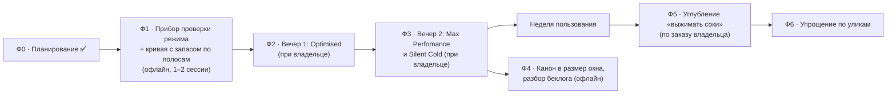

# KAGO — МАСТЕР-ПЛАН

<!-- KAIF:PRAYER:BEGIN — ОДИН ИСТОЧНИК: PHILOSOPHY.md. Правится там, раскладывается `node tools/prayer.mjs --apply` -->
## 🙏 МОЛИТВА ПЕРЕД РАБОТОЙ

> **Слово владельца, 2026-08-24:** *«давай поднимем принципы из ФИЛОСОФИИ на уровень молитвы перед
> началом любой работы… с просьбой тебя молитву озвучить перед каждой работой»*.
> **Каденция уточнена владельцем 2026-08-28 (интервью 017, Q2 = B).**
>
> 🔴 **АГЕНТ: ПРОИЗНЕСИ ЕЁ В ЧАТЕ ЦЕЛИКОМ ОДИН РАЗ НА СЕССИЮ — при входе (`/resume`, вход в
> цикл), дословно, пунктов не пропуская. ПЕРЕД КАЖДОЙ СЛЕДУЮЩЕЙ ЗАДАЧЕЙ — ОДНА СТРОКА: ТРИ
> принципа из шестнадцати, самых важных для этой задачи, своим выбором.** Это не украшение:
> каждый пункт оплачен провалом; полный текст раз в сессию переносит его в решения дня, а выбор
> трёх под задачу — применение, а не декламация. Разбор каждого принципа — `PHILOSOPHY.md`.

1. **ПРОСТОТА ВЫШЕ ВСЕГО.** Если долго — значит я усложнил, а не задача трудна. Застрял — заново
   понять задачу, а не громоздить.
2. **ОККАМ.** Не умножаю сущностей. Из двух решений беру то, где меньше движущихся частей.
3. **ПАРЕТО.** Ищу те 20 %, что дают 80 % пользы. «Сделано и работает» лучше «идеально и поздно».
4. **КОД ПРЕЖДЕ КОГНИЦИИ.** Что может сделать скрипт — делает скрипт. Модели остаётся суждение.
5. **НАБЛЮДЕНИЕ ВМЕСТО ДОГАДКИ.** Не помню — смотрю. Прогон, замер, источник вместо «должно работать».
6. **ТРИ ДВЕРИ.** Пробел закрываю источником или вопросом владельцу. Выдумать — запрещено.
7. **ЛОШАДИ, А НЕ ЗЕБРЫ.** Сперва проверяю самое простое и частое объяснение.
8. **МЁРФИ.** Называю риски вслух и раскладываю по ярусам. Названный риск наполовину управляем.
9. **ЛУЧШИЕ ПРАКТИКИ.** Почти всё решено до меня. Ищу проверенный путь, прежде чем изобретать.
10. **DRY.** Один факт живёт в одном месте. Пару лучше УБРАТЬ, чем за ней следить.
11. **УЧУСЬ ОДИН РАЗ.** Сверяюсь с опытом до работы, дописываю урок после. Дважды в один тупик не хожу.
12. **ЭЙЗЕНХАУЭР.** Важное и срочное — сейчас; важное и не срочное — в план; прочее — вниз.
13. **БРИТВА ХЭНЛОНА.** Не злой умысел, а недосмотр. Отлаживаю состояние мира, а не мотивы.
14. **КВАДРАТ ДЕКАРТА.** На трудной развилке отвечаю на четыре вопроса, а не на два.
15. **ВТОРОЙ ПОРЯДОК.** Думаю на три-пять ходов вперёд, а не о выигрыше прямо сейчас.
16. **КАРМА.** Оставляю репозиторий лучше, чем взял. Не срезаю углы за счёт владельца и следующей сессии.

> ⚖️ **И ОДНА ГРАНИЦА, ЧТОБЫ МОЛИТВА НЕ СТАЛА ОРУЖИЕМ ПРОТИВ ВЛАДЕЛЬЦА:** Оккам и Парето действуют
> ВНУТРИ машинерии. На том, что владелец видит и слышит, агент не экономит — там судит его глаз, а
> не мой счёт сущностей.
<!-- KAIF:PRAYER:END -->

> Дорожная карта: как мы попадаем из **текущего состояния** в видение. Верхний уровень — фазы и
> вехи; задачи на день живут в `plans/`. Выводится из `ЗАКАЗ.md` — оперативного слоя над дословным
> архивом `GOAL.md` — и обновляется навыком `/revision`. Живой справочник, тегом `DONE` не помечается.
>
> **Редакция 2026-09-25 — РАЗВОРОТ ПО АУДИТУ 4** (ответ владельца на `interviews/interview_030`:
> вариант A + сохранить углубление; мандат «разворачивай весь проект»). Прежняя редакция дословно —
> `PROJECT_HISTORY.md` → «МАСТЕР-ПЛАН ДО РАЗВОРОТА». Разбор — `reports/KAIF_AUDIT/2026-09-25_audit_04_change_the_method.md`,
> `researches/39`.

---

## Видение (одной строкой)

Четыре режима видеокарты на ярлыках — 🚀 Max Perfomance · ⚖️ Optimised · ❄️ Silent Cold · 🔄 Stock
Default — на кривой V/F, построенной **моделью этого кристалла** и **проверенной целиком**, всегда
возвращаемые к заводскому состоянию; и **путь углубления**, по которому владелец дальше «выжимает
соки» шаг за шагом.

## Метрика приёмки

`режимов проверено Y/4 · запас по полосам · выгода против стока (FPS · Вт · °C · обороты)` —
печатает `npm run curve -- --progress` (строится в Ф1 эпика 101). Определение «проверен» — `ЗАКАЗ.md`
§2: проверка целого режима смесью нагрузок + неделя обычного пользования без сбоя.
**На 25.09: проверено целиком 0 из 4.** `Optimised` с 14.09 стоит на эксперименте №1 (кривая,
выведенная из краёв): замерен под игрой — те же кадры, 250 Вт, на 1–4 °C холоднее, 0 сбоев, — но
проверку смесью нагрузок не проходил. Справочная строка прежнего критерия: краёв 5/389.

## Ведущие принципы

- **Ноль сторонних GUI в зависимостях** (`GOAL.md`, 2026-08-09). Свой код на Node.js: `nvidia-smi` и
  собственный мост к NVAPI.
- **Заводское состояние — по умолчанию.** Режим живёт в энергозависимой памяти карты; откат не
  требует действий владельца.
- **Оптимум ищется на ЭТОМ экземпляре**; числа из PDF и чужие проценты — справка (2026-08-10).
  Формула владельца: *«снижаем потребление насколько можем до тех пор, пока не платим больше, чем N»*.
- **Метод — отраслевой и исходный метод владельца (10.08):** кривая по модели кремния, проверка
  ЦЕЛОГО режима, храповик по полосе сбоя. Край отдельной частоты ищется только зондом — для
  уточнения модели при углублении.
- **Машина владельца — аккуратно.** Работа, приближающая к краю, — только при нём у машины
  (интервью 017, Q4); без него — только повторная проверка принятого.
- **Профиль привязан к драйверу и VBIOS**: сменился драйвер — режим перепроверяется.
- **«Потери нет» произносится только после замера разброса прибора** (2026-08-10).

## Где мы (2026-09-25)

| есть и работает | чего нет |
|---|---|
| оболочка у владельца: 4 ярлыка, трей с меню, автозапуск, откат (с 14.08) | прибора проверки целого режима |
| свой мост к NVAPI и применитель с чтением после записи и откатом | кривой с запасом по полосам |
| журнал упреждающей записи (пережил 19 смертей машины) | трёх режимов из четырёх |
| построитель кривой по тренду краёв и редактор кривой для владельца | метрики нового критерия |
| модель кремния: 14 краёв на прямой, разброс 4,9 мВ | канона в размер окна модели (ядро 809 КБ) |
| игровой стенд Q2RTX с измеренным разбросом прибора, тепловое плато | |

## Дорожная карта — эпик 101 «разворот»

Мета-план: `plans/101_EPIC_turnaround_silicon_model_and_whole_mode_validation.md`.

| фаза | цель | ворота | план | состояние |
|---|---|---|---|---|
| **Ф0** | аудит, разведка, `ЗАКАЗ`, этот план, эпик, `STATUS` заново | коммит; `ЗАКАЗ` утверждён владельцем 25.09 | эпик 101 | ✅ 2026-09-25 |
| **Ф1** | одна команда проверяет режим и выносит вердикт с таблицей выгоды; кривая «тренд + запас по полосам» | самопроверки краснеют на мутациях · сухой прогон без записи · дым 60 с на стоке | `plans/102` | 🔲 следующая |
| **Ф2** | `Optimised` принят спуском запаса | режим принят · таблица · ≤ 2 перезагрузок | пишется на закрытии Ф1 | 🔲 |
| **Ф3** | `Max Perfomance` и `Silent Cold` приняты; 4 ярлыка | 4/4 проверено | на закрытии Ф2 | 🔲 |
| **Ф4** | ядро канона ≤ 300 КБ; беклог замороженной машинерии помечен | бюджеты KAIF для STATUS и MASTER_PLAN зелёные | на закрытии Ф3 | 🔲 |
| **Ф5** | углубление: шаг запаса по полосе — одна команда, откат — одно действие; зонд края формой режима | живой шаг принят или откачен | по заказу владельца | 🔲 |
| **Ф6** | убрать доказанно неиспользуемое; применитель ~500 строк | улика «не нужно» у каждого пункта | по уликам | 🔲 |

**Оценка пути до приёмки:** 1–2 офлайн-сессии + 2 вечера при владельце + неделя пользования. Это
арифметика от названных входов (`researches/39`), не обещание; главный риск — редкая
нестабильность, которую ловит неделя пользования и храповик по полосе.

## Четыре режима

Определения — `ЗАКАЗ.md` §1 (один дом факта). Что измерено по каждому к 25.09:

| режим | что есть | чего не хватает |
|---|---|---|
| 🚀 Max Perfomance | черновик профиля; кривая +180 при 300 Вт держала ~2940 МГц под игрой (факт 27) | кривая по модели · проверка при 300 Вт |
| ⚖️ Optimised | эксперимент №1 в пользовании с 14.09: FPS как на прежней кривой, 250 Вт, 68–69 °C, обороты 53–58 % | проверка смесью · спуск запаса |
| ❄️ Silent Cold | T(40 %) = 59 °C на стоковой кривой при потолке 2100 МГц | потолок поверх модельной кривой: обороты на плато не более 50 %, желательно 40…50 % |
| 🔄 Stock Default | работает (`npm run profile -- --reset`, ярлык) | — |

## История фаз до разворота — одной таблицей

| что | итог | где |
|---|---|---|
| Фаза 0 — развёртывание KAIF | ✅ 2026-08-09 | `PROJECT_HISTORY.md` |
| Фаза 1 — стенд и базовая линия | ✅ 2026-08-10 | `plans/02_DONE` |
| Фаза 2 — Silent Cold на `nvidia-smi` | ⏸ перекрыта: результаты стали калибровкой | `plans/03` |
| Фаза 3 — ярлыки, трей, автозапуск | ✅ 2026-08-14, принята владельцем | `plans/06_DONE` |
| Фаза 4 — свой мост к NVAPI | ✅ 2026-08-10 | `plans/04_DONE` |
| Фаза 5 — поиск Vmin по одной точке | 🔴 метод отменён 2026-08-15 → эпик 02 | `plans/05` |
| Эпик 02 — поиск края по всему диапазону | фазы 1–2 ✅; живой поиск дал 5 краёв из 389 → **метод заменён эпиком 101** | `plans/13` |
| Эпик 03 · 67 — виртуальная карта, генератор, полигон | ✅ построены; **заморожены эпиком 101** | `plans/16`, `plans/67_DONE` |
| Эпики 42 · 51 · 59 · 73 · 76 · 95 · 98 (ф. 2–3) | **заморожены эпиком 101** | мета-план 101, раздел «Что эпик замораживает» |
| Эпик 26 — визуализатор кривой | фазы 1–2 ✅; редактор кривой 14.09 | `plans/26` |
| Фаза 6 — четыре режима и приёмка | переопределена → Ф1–Ф3 эпика 101 | эпик 101 |

## Журнал решений

| Отметка | Решение | Почему |
|---|---|---|
| 2026-08-09 21:24 +03:00 | Потолок `nvidia-smi -pl` на этой карте — 250 Вт из 300, то есть −50 Вт максимум | Замер на живой карте. Цели PDF (−60…−120 Вт) одним power limit недостижимы — отсюда необходимость правки кривой |
| 2026-08-09 21:28 +03:00 | Лестница: фаза на `nvidia-smi`, затем свой мост к NVAPI. Владелец, чат | Держит ноль сторонних зависимостей из `GOAL.md` и даёт рабочий результат до дорогой части |
| 2026-08-09 21:28 +03:00 | Лицензия MIT. Владелец, чат | Единообразие с KAIF |
| 2026-08-09 21:30 +03:00 | `profile-manager.mjs` — интерфейс со сменными бэкендами, а не прямой вызов инструмента. Агент | PDF жёстко зашивает туда MSI Afterburner; `GOAL.md` это запрещает, а бэкендов будет минимум два |
| 2026-08-09 21:40 +03:00 | Оракул стабильности трёхзначный, с запасом над порогом. Агент, по вопросу владельца | Крах — не единственный отказ: больше половины программ сначала портят данные молча (`researches/02`) |
| 2026-08-09 21:40 +03:00 | Портрет голоса владельца подключается **ссылкой**, копия в публичный репозиторий не едет. Агент | `krinik-stylometry` приватен и содержит цитаты личных корпусов; правило владельца №39 — проекты ссылаются, копий не держат |
| 2026-08-09 22:35 +03:00 | Полное приватное ядро портрета затянуто в проект и поставлено под `.gitignore`. Владелец, чат: «можем сюда затянуть стилометрическое ядро но поставить его под гитигнор» | Агент работает с самой полной версией, публика не получает ничего. Отменяет предыдущую строку в части «только ссылка» |
| 2026-08-09 22:4x +03:00 | `nvidia-smi -pl` **пишет** на этой карте — проверено наблюдением с согласия владельца: 300 → 290 Вт, чтение 290, возврат 300 | Бэкенд пути A перестал быть предположением. Попутно: сообщение утилиты о прежнем значении врёт — в поле «from» печатается default, а не то, что стояло; состояние только перечитывать |
| 2026-08-09 22:50 +03:00 | **Три ярлыка, трей без кнопок.** Сброс к заводским — отдельный третий ярлык, тоже с записью в автозагрузку. Владелец, чат | Снимает необходимость ловить гибель процесса. У явного ярлыка нет режима отказа, у сторожа он есть — сброс GPU там, где ничего не сломалось. Отменяет строку `GOAL.md` про сброс при убийстве иконки |
| 2026-08-09 22:30 +03:00 | **KAGO пишет свои нагрузки, а не покупает чужие.** Агент, `researches/03` | Автоматизация у UNIGINE, 3DMark и OCCT продаётся только в платных редакциях, а бесплатный FurMark даёт ровную полку — не ту форму нагрузки, которая валит андервольт. Проверено обратное: своё CUDA-ядро собирается на этой машине и трижды подряд даёт `fd7d452ce569c9d7` — оракул SDC строится своими руками |
| 2026-08-09 22:30 +03:00 | **HWiNFO64 убран из архитектуры.** Агент, `researches/03` §3.5 | Это стороннее GUI-приложение (запрет из `GOAL.md`), а датчик, ради которого он там стоял, на RTX 50 отключён на уровне драйвера — эта карта возвращает `temperature.memory = N/A`. Телеметрия — один `nvidia-smi`, и он богаче, чем предполагалось: даёт запас до предела и причины троттлинга |
| 2026-08-09 22:30 +03:00 | **Фаза 5 формально зависит от фазы 4.** Агент, `researches/03` §2 | У `nvidia-smi` вообще нет поля напряжения — до собственного моста к NVAPI поиску Vmin нечем наблюдать свою же управляющую переменную. Подтверждает уже принятый порядок фаз, но теперь это доказательство, а не интуиция |
| 2026-08-09 22:41 +03:00 | **Фаза 3 (ярлыки и трей) идёт раньше фазы 4 (мост к NVAPI).** Агент, `plans/01_EPIC` §3 | После фазы 3 у владельца на руках законченный полезный продукт — профиль на ярлыке, переживающий перезагрузку. Это парето-срез эпика; всё, что дальше, покупает второй профиль |
| 2026-08-10 00:52 +03:00 | **Вердиктов четыре, а не три: добавлен UNKNOWN.** Агент, `plans/02` §3.6 | Сравнение, которого не было (просроченный штамп, другие аргументы, непрочитанный провайдер), не имеет вердикта. Загнать его в PASS или SDC — выдумать результат |
| 2026-08-10 00:52 +03:00 | **Эталон действителен только для аргументов, с которыми снят.** Агент, найдено настоящим прогоном | Прогон с другими аргументами дал ЛОЖНЫЙ SDC 58 из 58. Ложный SDC хуже пропущенного: развёртка объявила бы здоровую карту нестабильной в каждой точке |
| 2026-08-10 00:58 +03:00 | **Сетка ЧАСТОТ измерена (7/8 МГц, 389 точек, 180–3090), сетка НАПРЯЖЕНИЙ — нет.** Агент, `plans/02` §3.8 | Их легко перепутать. Все четыре полные ступени памяти дают одинаковую лестницу, значит фаза 5 разворачивает частоту один раз. Напряжение остаётся долгом фазы 4 |
| 2026-08-10 09:4x +03:00 | **Числа из PDF сняты с роли целей приёмки; слово владельца в чате старше PDF.** Владелец, чат | 97 % — чужая мерка: величина плавает от экземпляра к экземпляру, а на части карт существенное снижение потребления не стоит производительности вовсе. Проект уже дважды поймал ту же ошибку доверия к PDF (пол мощности 250 Вт; отсутствующий датчик горячей точки) |
| 2026-08-10 09:5x +03:00 | **Профиль = одно значение N: максимизируем снижение потребления при цене ≤ N.** Владелец, чат, дословно | Даёт поиску проверяемую форму вместо погони за процентом и убирает допущение о неизбежном размене. N назначает владелец, и вопрос задаётся с кривой на руках — иначе это просьба гадать |
| 2026-08-10 09:5x +03:00 | **«Потери нет» произносится только после замера разброса прибора.** Агент, следствие из слова владельца | Утверждение о РАЗНИЦЕ незаконно, если собственный разброс инструмента шире отрицаемого эффекта: ноль процентов на приборе с разбросом три процента — не находка, а тупой прибор |
| 2026-08-10 18:5x +03:00 | **ЧЕТЫРЕ РЕЖИМА вместо двух профилей: Max Perfomance · Optimised · Silent Cold · Stock Default.** Владелец, чат, дословно в `GOAL.md` | У режимов РАЗНЫЕ критерии оптимальности, и прежний «Max Optimal» смешивал два из них в одном. Механизм при этом один — подъём всей кривой с потолком в разном месте, — так что расщепление ничего не удорожает: оно называет то, что уже умеет код. Ярлыков становится четыре |
| 2026-08-10 18:5x +03:00 | **Прибор ЦЕНЫ — выданная частота, а не оп/с.** Владелец вопросом, агент замером | Оп/с не индустриальная мера производительности, и между прогонами она разъезжается на 4,3 % при совпавших ваттах. Оп/с остаётся детектором clock stretching — своей настоящей работой |
| 2026-08-10 19:1x +03:00 | **Критерий Optimised назван до конца: FPS ≥ 95 % от Max Perfomance, а покупаем СИЛЬНОЕ снижение ватт, температуры и шума, с потолком, выше которого карта не идёт.** Владелец, чат, дословно | Прежняя формулировка («оптимум производительность↔холод», потолок частоты на стоковой) не говорила, что оптимизируется, а что ограничивается. Теперь ограничение — FPS, цель — ватты/градусы/шум, точка отсчёта — Max Perfomance, а не сток. Следствие: в механизм режима входит **потолок мощности** (`-pl`), которого там не было, и у него измеренная граница 250 Вт |
| 2026-08-10 18:5x +03:00 | **Игровая нагрузка (Q2RTX) входит в стенд; область прежних проверок признана узкой.** Агент, замер | Она берёт 300 Вт и 77 °C против 137 Вт у вычислительных нагрузок при той же заявленной загрузке. Значит все PASS получены при половинном конверте карты, а `utilization.gpu` — плохой прибор нагрузки |
| 2026-08-15 15:3x +03:00 | **ЭПИК 02: поиск края переписывается по алгоритму владельца — вся кривая, пин частоты, спуск по сетке напряжений.** Владелец, `ideas/03` | Прежний поиск держал область под тестом ПОТОЛКОМ кривой, а потолок ниже `верх − 1000` = 2157 МГц удержать нечем — **нижняя половина диапазона была физически недостижима**. Пин частоты (шаг 7 владельца) держит любую ступень лестницы и снимает ограничение. Плюс результат наконец получает место: документ кривой со статусом и датой у каждой точки |
| 2026-08-15 15:3x +03:00 | **Развёртка идёт по 74 ТОЧКАМ кривой, а отчитывается по частотам.** Агент, арифметика на живой карте | 389 частот лестницы обслуживаются 75 различными точками — 5,19 частоты на точку. Обход всех 389 даёт ТУ ЖЕ таблицу впятеро дороже: 67 часов против 13. Плюс затравка спуска ответом соседней частоты (Vmin не убывает с частотой — физика setup-нарушений) — **1,5 часа**. Ни одна отчитанная ступень при этом не пропущена: монотонность выбирает НАЧАЛО спуска, а не заменяет прожиг |
| 2026-08-15 15:3x +03:00 | **У точки появляется третий вердикт — «предел рычага».** Агент, замер | В 1700–2400 МГц аппаратные ±1000 МГц кончаются раньше кремния: доступно 45–125 мВ против 245–350 на краях диапазона. Спуск там останавливает НАШ рычаг, а не карта, и назвать это краем значило бы выдать ложный `[TESTED]` |
| 2026-08-24 20:0x +03:00 | **ЗДАНИЕ ВАЖНЕЕ ЛЕСОВ: сторож подсказывает и логирует, а не роняет прогон.** Владелец, чат | Его число: 0 закрытых частот два вечера подряд — одна аномалия на одной ступени выбрасывала полосу вместе с оплаченными прожигами. Разведены два вопроса, которые движок путал: «писать ли неподтверждённое в документ» (ответ не менялся — нет) и «терять ли остаток полосы» (теперь нет). Барьерами остались три машинных признака: два зависания подряд, грязный откат, непрочитанная таблица |
| 2026-08-24 23:0x +03:00 | **ГИБКИЙ ТЮНИНГ вместо строгого прохода сверху вниз.** Владелец, чат, дословно в `ideas/12` | Карта не слушается заказа, а таблица V/F едет под нами на 15–30 МГц на горячей карте. Значит единица работы — не «частота, доведённая до края», а ОДИН ПРОЖИГ, что-то доказавший; к краю двигается пересечение трёх источников — намерение, выданное картой, точно прожжённое. Прогон 2026-08-24: 16 прожигов выдержано, 4 строки в документе — вот цена прежней единицы работы |
| 2026-09-25 00:0x +03:00 | **Аудит 4: три прошлых аудита переставляли работы ВНУТРИ метода «край каждой частоты через отказ машины»; метод арифметически не доходит до приёмки.** Агент, `reports/KAIF_AUDIT/2026-09-25_audit_04_change_the_method.md` | 5,4 ч реального прожига за ~100 сессий; край = перезагрузка, рабочей полосе их нужно ~60; 14 краёв ложатся на прямую с разбросом 4,9 мВ |
| 2026-09-25 00:2x +03:00 | **Конец работы — четыре режима, проверенных целиком, вместо «края для всех 389 частот»; углубление сохраняется как постоянная возможность.** Владелец, интервью 030, вариант A + дополнение, дословно в `GOAL.md` → «🔄 РАЗВОРОТ ПРОЕКТА ПО АУДИТУ 4» | *«Мне симпатичен вариант А, но я хотел бы иметь возможность далее продовать находить более глубокие точки андервольтинга… Сохранить такую возможность»* |
| 2026-09-25 00:2x +03:00 | **Разворот проекта — эпик 101: модель кремния + проверка целого режима + углубление по полосам; машинерия защиты заморожена, мораторий — до 4/4 проверенных режимов.** Агент по мандату владельца («разворачивай весь проект туда, куда ты видишь по твоему аудиту») | Отраслевой метод и исходный метод владельца 10.08; доказанная смерть 08.09 пришла на простое после записи, а не под нагрузкой (`researches/36`; три другие — по форме журнала) — проверка обязана включать простой и переходы |

---

> **Поддержание:** держать в согласии с реальностью. Когда `ЗАКАЗ.md` или состояние проекта заметно
> меняются — `/revision`. Детальные планы — в `plans/`.
