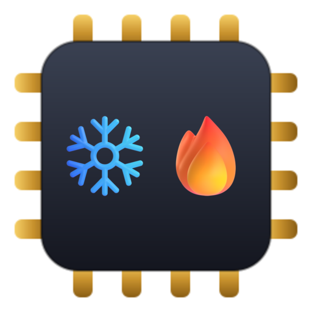
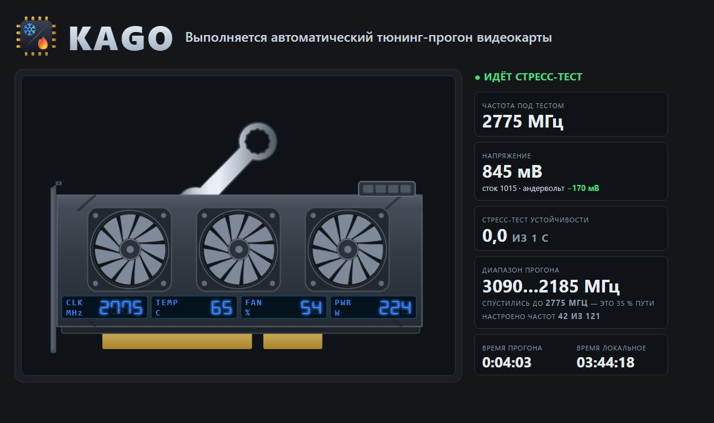

<a id="english"></a>

<p align="center">
  
</p>

# KAGO — Krinik Automated GPU Orchestrator

<h3 align="center">Made by a gamer, for gamers. ❤️</h3>

<h3 align="center">An automated GPU optimisation tool.</h3>

<p align="center">
  Gets the most out of your graphics card — extending its life and bringing quiet to the room.<br>
  Raises performance, lowers heat output.
</p>

<p align="center">
  <a href="#english"></a>
  &nbsp;
  <a href="#russian"></a>
</p>

[](LICENSE)
[](STATUS.md)
[](#5-requirements)
[](#5-requirements)
[](https://github.com/MikalaiKryvusha/KAIF)

<p align="center"><strong>Version 0.9 — Furnace</strong> · 2026-08-22</p>

<p align="center">
  <a href="#1-general">General</a> · <a href="#2-where-the-project-actually-is">Status</a> · <a href="#3-the-method">The method</a> · <a href="#4-the-four-modes">Modes</a> · <a href="#5-requirements">Requirements</a> · <a href="#6-built-with-kaif">KAIF</a>
</p>

**KAGO is a Node.js orchestrator that undervolts an NVIDIA GPU on Windows — automatically, with a measured safety margin, and without installing a single third-party GUI.**

<p align="center">
  
</p>

<p align="center">
  <sub><b>The run dashboard.</b> The card carries its own readouts; the column reports the search.
  The animation is driven by the run's pulse rather than by a timer of its own — when the machine
  freezes, the picture freezes with it, and the rung on screen is the rung that killed it.<br>
  Shot taken during a rehearsal on the virtual card (the bench), not on live silicon.</sub>
</p>

---

<a id="1-general"></a>

## 1. General

1. Undervolting trades voltage for heat and noise. Every graphics card ships with a **voltage
   guardband** — a margin the vendor adds so the worst chip in the batch survives the worst
   conditions. Your chip is not the worst one, and your room is not the worst room. Part of that
   margin is yours to take back.
2. Taking it back by hand means hours in a curve editor, one point at a time, with a stress test
   between every change. KAGO does that loop instead of you and writes down what it found.
3. **No third-party GUI is required, and none will be added.** The card is driven through the
   driver's own command-line interface first, and through an in-house NVAPI bridge after that. MSI
   Afterburner is not a dependency of this project.
4. Four modes ship — 🚀 Max Perfomance, ⚖️ Optimised, ❄️ Silent Cold, 🔄 Stock Default — each with
   its own definition of optimal. Each is a desktop shortcut, and a tray icon shows which one is
   live.
5. **Factory state is the default.** Profiles live in the GPU's volatile memory. Crash the machine
   or simply reboot — the card comes back stock, and you do nothing.

### 1.1. Why this exists as a project rather than a forum post

Silicon differs from chip to chip. Between five identical cards of one model, the lowest safe
voltage varies by as much as 70 mV — so a profile copied from someone else's card is not a
shortcut, it is a guess with your hardware as the stake. KAGO ships **the method**, never someone
else's numbers.

---

<a id="2-where-the-project-actually-is"></a>

## 2. Where the project actually is

Four phases of six are closed, and the card has been measured. The research base, the architecture,
**the test bench** and **KAGO's own bridge to the driver** are done; the card runs undervolted and comes
back on command. **The owner-facing shell is on the desktop too:** four shortcuts apply through
pre-registered elevated tasks, the last verified apply is remembered and re-applied at logon through
the same gates, a passive tray icon shows the live mode (kill it — nothing happens to the card),
and the three working modes refuse honestly until phase 6 qualifies their numbers —
an unproven undervolt cannot be applied by a double-click. The search engine exists, judges a
candidate by three different load shapes at once and takes the worst verdict — and **it has now found
this card's edge on live silicon**: at the top of the range the card survives 870 mV and hangs the
machine at 865, reproduced on two adjacent frequencies in independent sittings. A hang is a planned
path here, not an accident: the intent is written and `fsync`-ed before the first byte reaches the
card, so the rung that killed the machine names itself on the next launch.

**The undervolt is measured, not claimed.** With the whole voltage/frequency curve raised and nothing
offered above the clock the card already delivered, it draws **7.71 W (5.6 %) less and runs 5 °C cooler at
exactly the stock clock** — and no clock lock is used, so the card still boosts and still drops to idle
speeds. One number from one pair of runs; two independent series are what will make it a result.

The bench samples the card, loads it with KAGO's own CUDA workloads, watches the Windows event log,
and returns a three-way verdict — PASS, SDC or CRASH — by comparing a run against a golden reference
captured at stock. SDC is the one that matters: more than half of undervolting failures corrupt data
before anything crashes, so "it did not fall over" is not a passing run. One command runs the whole
phase-1 acceptance:

```bash
npm run phase1:accept
```

**KAGO writes to the card, and the way back is executed rather than promised.** One module owns every
write; a profile is applied, re-read until two consecutive samples agree, and rolled back — the round
trip has run on the live card. The card also has its own bridge now: KAGO talks to the NVIDIA driver
API directly from Node, with no third-party GUI and no compiled binary, and reads the 128-point
voltage/frequency curve.

The measurement it produced first is the one that licenses every other number: the meter's **own**
run-to-run spread, taken over ten stock runs in two independent series — **1.28 W (0.65 %)** on power.
A difference thinner than that is not an effect, and the tool prints that sentence beside every delta it
computes. The throughput half of that figure did not survive: measured across separate runs, the same
stock workload varies **4.3 %**, so performance is judged on the delivered clock, which is exact.

**And the load matters more than the meter.** A real path-traced game load drives this card to **300 W,
99 % and 77 °C**. KAGO's original compute workload reached 137 W at the same reported utilization — half
the envelope — and read *nothing* from VRAM, so memory faults were invisible to it by construction. That
was the project's largest measured debt, and v0.9 pays it: the burn now holds the card at **305 W median
with the driver reporting `sw_power_cap`**, moving **~5 TB through VRAM in ten seconds**, at 75 °C. The
optimum turned out to be a *blend* — too little arithmetic and the cores stall on memory (207 W with more
traffic than the winner), too much and the memory pipe drains (229 W). Every unit it loads folds its
result into the same checksum, so a fault anywhere still moves the oracle's number.

```bash
npm run gpu:info
```

```
GPU            NVIDIA GeForce RTX 5070 Ti
Driver / VBIOS 610.88 / 98.03.58.40.8b
Power limit    300.00 W (default 300.00 W)
Power range    250.00 … 300.00 W  → only 50 W of headroom
Graphics clock 1050 MHz (max 3090 MHz)
Temperature    52 °C   Perf state P5
Memory clocks  405, 810, 7001, 13801, 14001 MHz
Clock ladder   1651 points total, 389 per full rung, 180 … 3090 MHz  (the edge search's space)
               identical on all 4 full memory rungs — sweep the graphics clock once
Ladder step    7 MHz ×194, 8 MHz ×194 — measured on the 810 MHz memory rung.
               This is the CLOCK grid. The VOLTAGE grid is 127 rungs, 450 … 1240 mV,
               spaced 5 mV in 94 places and 10 mV in 32 — NOT uniform, read off the live curve.
```

That headroom line is the finding that shaped everything else. The driver will only move
the power ceiling from 300 W down to 250 W — 50 W. The targets this project was built for need two
to three times that, so power limiting alone was never going to be enough, and curve editing became
mandatory. The full reasoning is in [`researches/01`](researches/01_gpu_control_paths.md); the
roadmap is in [`MASTER_PLAN.md`](MASTER_PLAN.md); the current state is
[`STATUS.md`](STATUS.md).

---

<a id="3-the-method"></a>

## 3. The method

The naive recipe — *drop the voltage until it crashes, then step back one* — is what most guides
teach, and it has two holes that measurements close.

**Hole one: a crash is not the first failure.** In a study of 57 programs across four GPU
generations, more than half failed **silently** before they ever crashed: the card kept drawing
frames and returning answers, and the answers were wrong. A test that only watches for crashes
walks straight through the corruption zone without noticing.

**Hole two: the edge is a cliff, not a slope.** For one program, the error rate went from 3 % to
90 % across two percent of voltage. Stopping at the last setting that passed leaves you standing on
that cliff, where a warm afternoon or a heavier game is enough to push you off.

So KAGO does it differently:

| Step | What happens |
|---|---|
| **Golden reference** | The workload set runs at stock, and its outputs are stored. Everything later is compared against them — not against "looks fine". |
| **Three-way verdict** | Each trial ends as **PASS**, **SDC** (output changed, nothing crashed), or **CRASH** (driver TDR, WHEA, application death, BSOD). The middle column is the one that matters. |
| **Bracket the edge** | Coarse descent to first failure, then a binary search to locate it at grid resolution. The search never dwells at a failing point. |
| **Add the guardband** | The shipped voltage sits **at least four curve steps, and never less than 25 mV**, above the measured failure point. |
| **Diverse workloads** | Branchy code and arithmetic-dense code fail differently, and the lowest safe voltage varies by ~100 mV between programs. A point's threshold is the **worst** result across the whole set, never the first one found. |
| **Transients, not just load** | Supply noise matters more than temperature here, so the hard test is rapid load changes — not a flat 100 % burn. |
| **A burn that reaches the power limit** | The trial load holds the card **at its 300 W ceiling** and moves **terabytes through VRAM** — measured 305 W median, the driver reporting `sw_power_cap`, against 233 W and *zero* memory traffic for the earlier load. A voltage proved under a third of the electrical stress a game applies is proved against the wrong load. |
| **Burned at the frequency being tuned** | A burn that reaches the power limit also clamps the clock, so the tool **measures which frequency the card actually ran at** and re-burns the rung with a weaker load until the card sits where it is being tuned. A verdict recorded against a frequency the burn never ran at is worse than no verdict. |
| **Bind to the driver** | Every profile records the driver and VBIOS it was proved against. A driver update invalidates it until re-validated. |

The measurements behind each of these are cited in
[`researches/02`](researches/02_vmin_guardband_methodology.md).

---

<a id="4-the-four-modes"></a>

## 4. The four modes

The owner split the original two profiles into four modes, each with its own objective. One
mechanism serves them all — the whole voltage/frequency curve is raised, and only the placement of
the clock ceiling differs — and none of them locks the clock: the card still boosts and still drops
to idle speeds.

| | Objective | Noise ceiling | Price |
|---|---|---|---|
| 🚀 **Max Perfomance** | everything into speed; temperature is not a goal | none | — |
| ⚖️ **Optimised** | a strong cut in watts, heat and noise | fans ≤ 60 % | FPS within 5 % of Max Perfomance |
| ❄️ **Silent Cold** | maximum cold | fans ≤ 40 % | up to 10 % of stock performance |
| 🔄 **Stock Default** | factory state, always one click away | factory curve | — |

The prices are the owner's budgets, not inherited promises: the numbers this table will finally
carry are measured on this die, and they are reported next to the meter's own run-to-run spread,
because "no loss" measured with a blunt instrument is not a finding.

The **fourth shortcut resets the card to factory settings**, and all four write the remembered
state that is re-applied at logon — whichever you clicked last is what you come back to. The
passive tray icon shows which mode is live and nothing else — no menu, no buttons, and killing it
changes nothing on the card. The shortcuts and the tray wear one icon set, picked by the owner
from a rendered comparison: Microsoft's Fluent Emoji 3D (MIT), shipped in `assets/icons/`.

The shortcuts already sit on the desktop, and the shell around them is proven: every click ends in
a verified state — applied and re-read to agreement, or refused with nothing written. **The three
working modes ship as refusing drafts**: their measured candidate numbers (Optimised: −50 W, −9 °C
and fans at 69 → 50 % for −1.24 % of frames; Silent Cold read straight off a thermal ladder at a
2100 MHz ceiling — 59 °C at 40 % fans) stay documentation until phase 6 qualifies them, and until
then a double-click refuses out loud rather than apply an unproven undervolt. Beyond the shell,
what has been proven on this hardware: the driver gives writes back (power limit and clock lock,
each re-read to stability and rolled back); the card's power↔performance curve is measured across
ten points; the meter's own spread is 1.28 W; and KAGO's own NVAPI bridge reads the 128-point
voltage/frequency curve, whose voltage grid turned out to be 5 mV rather than the 6.25 mV folklore
assumes.

---

<a id="5-requirements"></a>

## 5. Requirements

- Windows 11
- Node.js ≥ 18
- An NVIDIA GPU with a current driver. Developed against a GeForce RTX 5070 Ti; the method is
  general, the numbers are not.
- Administrator rights — the driver refuses clock and power writes without them.

> **Undervolting changes how your hardware is powered.** Done carelessly it costs you a frozen
> screen, a failed benchmark run, or corrupted output you do not notice for months. KAGO is built to
> make that unlikely and always reversible, and it is still your card. MIT means no warranty, and
> that clause is not decoration.

---

<a id="6-built-with-kaif"></a>

## 6. Built with KAIF

The project runs under [KAIF 2.2](https://github.com/MikalaiKryvusha/KAIF) — the author's framework
for AI agents: external memory, bounded autonomy, and the discipline that keeps a claim of "it
works" attached to an observation. `AGENT_GUIDE.md`, `STATUS.md` and the two project maps are how a
fresh session picks this project up from nothing.

## License

MIT © 2026 Mikalai Kryvusha (**KOT KRINIK**). See [LICENSE](LICENSE).

---
---

<a id="russian"></a>

<p align="center">
  
</p>

# KAGO — Криника Автоматизированный ГПУ Оркестратор

<h3 align="center">Сделано геймером для геймеров. ❤️</h3>

<h3 align="center">Автоматизированный инструмент оптимизации GPU.</h3>

<p align="center">
  Выжимает максимум из вашей видеокарты — продлевая ей жизнь, даруя тишину в комнате.<br>
  Повышает производительность, снижает тепловыделение.
</p>

<p align="center">
  <a href="#english"></a>
  &nbsp;
  <a href="#russian"></a>
</p>

[](LICENSE)
[](STATUS.md)
[](#5-что-нужно)
[](#5-что-нужно)
[](https://github.com/MikalaiKryvusha/KAIF)

<p align="center"><strong>Версия 0.9 — Furnace</strong> · 2026-08-22</p>

<p align="center">
  <a href="#1-общие-сведения">Общие сведения</a> · <a href="#2-где-проект-находится-на-самом-деле">Состояние</a> · <a href="#3-методика">Методика</a> · <a href="#4-четыре-режима">Режимы</a> · <a href="#5-что-нужно">Что нужно</a> · <a href="#6-собран-на-kaif">KAIF</a>
</p>

**KAGO — оркестратор на Node.js, который сам подбирает андервольтинг для видеокарты NVIDIA под Windows: с измеренным запасом надёжности и без единого стороннего GUI в зависимостях.**

<p align="center">
  
</p>

<p align="center">
  <sub><b>Дашборд прогона.</b> Показания карты живут на самой карте, справа — ход поиска края.
  Анимацию двигает ПУЛЬС прогона, а не собственный таймер: когда машина зависает, картинка замирает
  вместе с ней, и та ступень, что на экране, и есть точка отказа.<br>
  Снимок сделан на репетиции по виртуальной карте, а не на живом кремнии.</sub>
</p>

---

<a id="1-общие-сведения"></a>

## 1. Общие сведения

1. Андервольтинг меняет напряжение на тепло и тишину. Каждая карта уезжает с завода с **запасом по
   напряжению** — производитель закладывает его так, чтобы худший чип в партии выжил в худших
   условиях. Ваш чип не худший, и комната у вас не худшая. Часть этого запаса можно забрать себе.
2. Забирать руками — это часы в редакторе кривой, по одной частоте, со стресс-тестом после каждой
   правки. KAGO проходит этот цикл вместо вас и записывает, что нашёл.
3. **Сторонний GUI не нужен, и его тут не появится.** Картой управляет сначала штатная утилита
   драйвера, а затем собственный мост к NVAPI. MSI Afterburner в зависимостях проекта нет.
4. Режима четыре — 🚀 Max Perfomance, ⚖️ Optimised, ❄️ Silent Cold и 🔄 Stock Default, — и у каждого
   свой критерий оптимальности. Каждый лежит ярлыком на рабочем столе, а иконка в трее показывает,
   какой сейчас включён.
5. **Заводское состояние — состояние по умолчанию.** Профиль живёт в энергозависимой памяти GPU.
   Упала система, просто перезагрузились — карта вернулась стоковой, и делать для этого ничего
   не надо.

### 1.1. Почему это проект, а не пост на форуме

Кремний у каждого чипа свой. У пяти одинаковых карт одной модели самое низкое безопасное напряжение
расходится на 70 мВ — поэтому чужой профиль не короткий путь, а догадка, ставка в которой ваше
железо. KAGO отдаёт **методику**, а не чужие числа.

---

<a id="2-где-проект-находится-на-самом-деле"></a>

## 2. Где проект находится на самом деле

Закрыты четыре фазы из шести, и карта измерена. Разведка, архитектура, **испытательный стенд** и
**собственный мост KAGO к драйверу** готовы; карта работает с пониженным напряжением и возвращается по
команде. **Оболочка для владельца тоже стоит:** четыре ярлыка применяют режим через заранее
зарегистрированные повышенные задачи, последнее проверенное применение запоминается и
восстанавливается при входе в систему через те же ворота, пассивная иконка в трее показывает
активный режим (убьёте её — с картой не случится ничего), а три рабочих режима честно отказывают,
пока фаза 6 не примет их числа, — недоказанный андервольт двойным кликом не применяется. Движок
поиска написан, судит кандидата сразу тремя разными формами нагрузки и берёт худший вердикт — и
**край этой карты он уже нашёл на живом кремнии**: наверху диапазона карта выдерживает 870 мВ и вешает
машину на 865, воспроизведено на двух соседних частотах в независимых заходах. Зависание здесь —
штатный путь, а не авария: намерение записывается и `fsync`-ится до первого байта в карту, поэтому
ступень, убившая машину, называет себя сама на следующем запуске.

**Андервольт измерен, а не заявлен.** Когда вся кривая «напряжение — частота» поднята, а выше той частоты,
которую карта и так выдавала, не предлагается ничего, она берёт **на 7,71 Вт (5,6 %) меньше и работает на
5 °C холоднее при ровно стоковой частоте** — и никакой фиксации частоты при этом не применяется, так что
карта по-прежнему разгоняется и по-прежнему сбрасывается на простое. Это одно число из одной пары
прогонов; результатом его сделают две независимые серии.

Стенд снимает телеметрию, грузит карту своими ядрами на CUDA, читает журнал Windows и выносит
вердикт из трёх — PASS, SDC или CRASH, — сверяя прогон с эталоном, снятым на заводских настройках.
Важен средний: больше половины отказов от андервольта портят данные раньше, чем что-нибудь упадёт,
поэтому «не свалилось» — это не пройденный прогон. Вся приёмка первой фазы идёт одной командой:

```bash
npm run phase1:accept
```

**KAGO пишет в карту, и обратная дорога не обещана, а пройдена.** Записывает один-единственный
модуль; профиль применяется, перечитывается до совпадения двух проб подряд и откатывается — круговой
рейс прогнан на живой карте. И у карты теперь есть свой мост: KAGO разговаривает с драйвером NVIDIA
напрямую из Node, без стороннего GUI и без единого скомпилированного бинарника, и читает кривую
«напряжение — частота» из 128 точек.

Первым же замером он выдал число, которое даёт право на все остальные: **собственный разброс прибора**
между прогонами — десять стоковых прогонов двумя независимыми сериями, **1,28 Вт (0,65 %)** по мощности.
Разница тоньше этой — не эффект, и инструмент печатает эту фразу рядом с каждой дельтой, которую считает.
А вот половина этой цифры про производительность не выжила: между отдельными прогонами одна и та же
стоковая нагрузка расходится на **4,3 %**, поэтому производительность судится по выданной частоте — она
точна.

**И нагрузка важнее прибора.** Настоящая игровая нагрузка с путевой трассировкой загоняет эту карту в
**300 Вт, 99 % и 77 °C**. Прежняя вычислительная нагрузка KAGO давала 137 Вт при той же заявленной
загрузке — половина конверта — и **не читала из видеопамяти ни байта**, то есть отказы памяти были ей
невидимы по построению. Это был самый крупный измеренный долг проекта, и версия 0.9 его закрывает:
прожиг держит карту на **305 Вт медианы при `sw_power_cap` от драйвера**, прогоняя **около 5 ТБ через
видеопамять за десять секунд**, при 75 °C. Оптимум оказался *смесью*: мало арифметики — ядра стоят в
ожидании памяти (207 Вт при трафике БОЛЬШЕМ, чем у победителя), много — сохнет конвейер памяти
(229 Вт). Каждый нагруженный блок складывает результат в ту же контрольную сумму, поэтому отказ любого
из них по-прежнему двигает число оракула.

```bash
npm run gpu:info
```

```
GPU            NVIDIA GeForce RTX 5070 Ti
Driver / VBIOS 610.88 / 98.03.58.40.8b
Power limit    300.00 W (default 300.00 W)
Power range    250.00 … 300.00 W  → only 50 W of headroom
Graphics clock 1050 MHz (max 3090 MHz)
Temperature    52 °C   Perf state P5
Memory clocks  405, 810, 7001, 13801, 14001 MHz
Clock ladder   1651 points total, 389 per full rung, 180 … 3090 MHz  (the edge search's space)
               identical on all 4 full memory rungs — sweep the graphics clock once
Ladder step    7 MHz ×194, 8 MHz ×194 — measured on the 810 MHz memory rung.
               This is the CLOCK grid. The VOLTAGE grid is 127 rungs, 450 … 1240 mV,
               spaced 5 mV in 94 places and 10 mV in 32 — NOT uniform, read off the live curve.
```

Строка про запас и определила всё остальное. Потолок мощности драйвер двигает только с
300 Вт до 250 Вт — на 50 Вт. Цели, ради которых проект затевался, требуют в два-три раза больше,
так что одним потолком мощности их было не взять никогда, и правка кривой стала обязательной. Весь
разбор — в [`researches/01`](researches/01_gpu_control_paths.md), дорожная карта — в
[`MASTER_PLAN.md`](MASTER_PLAN.md), текущее состояние — в [`STATUS.md`](STATUS.md).

---

<a id="3-методика"></a>

## 3. Методика

Наивный рецепт — «снижай напряжение, пока не упадёт, потом шаг назад» — ему учит большинство
руководств, и в нём две дыры, которые закрываются измерениями.

**Дыра первая: крах — не первый отказ.** В исследовании 57 программ на четырёх поколениях карт
больше половины отказывали **молча**, ещё до всякого краха: карта продолжала рисовать кадры и
возвращать ответы, и ответы были неверные. Тест, который следит только за крахом, проходит зону
порчи данных насквозь и не замечает её.

**Дыра вторая: у края обрыв, а не склон.** У одной программы вероятность ошибки выросла с 3 % до
90 % на двух процентах напряжения. Остановиться на последней прошедшей настройке — это встать
ровно на обрыв, с которого хватит тёплого дня или игры потяжелее.

Поэтому KAGO делает иначе:

| Шаг | Что происходит |
|---|---|
| **Золотой эталон** | Набор нагрузок прогоняется на стоке, выходы сохраняются. Всё дальнейшее сравнивается с ними, а не с «вроде нормально». |
| **Трёхзначный вердикт** | Каждая проба заканчивается как **PASS**, **SDC** (выход изменился, ничего не упало) или **CRASH** (сброс драйвера, WHEA, гибель приложения, BSOD). Средняя графа и есть главная. |
| **Взять край в вилку** | Грубый спуск до первого сбоя, затем бинарный поиск края по сетке. На сбойном напряжении поиск не задерживается. |
| **Добавить запас** | Отгружаемое напряжение стоит **минимум на четыре шага сетки и не ближе 25 мВ** над измеренным порогом сбоя. |
| **Разные нагрузки** | Ветвистый код и счётный отказывают по-разному, а самое низкое безопасное напряжение гуляет между программами на ~100 мВ. Порог ЧАСТОТЫ — **худший** результат по всему набору, а не первый найденный. |
| **Переходы, а не просто нагрузка** | Шум питания тут значит больше температуры, поэтому тяжёлый тест — это быстрая смена нагрузки, а не ровные 100 %. |
| **Прожиг, упирающийся в предел мощности** | Испытательная нагрузка держит карту **на её потолке в 300 Вт** и гоняет **терабайты через видеопамять** — замерено 305 Вт медианы при `sw_power_cap` от драйвера, против 233 Вт и *нулевого* трафика памяти у прежней. Напряжение, доказанное при трети той электрической нагрузки, что даёт игра, доказано не тем. |
| **Прожиг идёт на настраиваемой частоте** | Прожиг, дошедший до предела мощности, зажимает и частоту — поэтому инструмент **измеряет, на какой частоте карта реально шла**, и переигрывает ступень ослабленной нагрузкой, пока карта не сядет туда, что настраивается. Вердикт о частоте, на которой прожиг не шёл, хуже, чем отсутствие вердикта. |
| **Привязка к драйверу** | Профиль записывает драйвер и VBIOS, на которых был доказан. Обновление драйвера делает его недействительным до перепроверки. |

Измерения под каждым пунктом названы в
[`researches/02`](researches/02_vmin_guardband_methodology.md).

---

<a id="4-четыре-режима"></a>

## 4. Четыре режима

Владелец расщепил прежние два профиля на четыре режима, у каждого — свой критерий оптимальности.
Механизм при этом один: поднимается вся кривая «напряжение — частота», а различает режимы только
место потолка частоты. И ни один из них не фиксирует частоту — карта по-прежнему разгоняется и
по-прежнему сбрасывается на простое.

| | Цель | Потолок шума | Цена |
|---|---|---|---|
| 🚀 **Max Perfomance** | всё в скорость; температура не цель вовсе | нет | — |
| ⚖️ **Optimised** | сильно меньше ватт, градусов и шума | вентиляторы ≤ 60 % | FPS не ниже 95 % от Max Perfomance |
| ❄️ **Silent Cold** | максимум холода | вентиляторы ≤ 40 % | до 10 % производительности |
| 🔄 **Stock Default** | заводское состояние, всегда в одном клике | заводская кривая | — |

Цены в таблице — бюджеты владельца, а не унаследованные обещания: числа, которые она в итоге понесёт,
измеряются на этом кристалле и приводятся рядом с собственным разбросом прибора, потому что «потери
нет», снятое тупым инструментом, находкой не является.

**Четвёртый ярлык возвращает карту к заводским настройкам**, и все четыре записывают запомненное
состояние, которое восстанавливается при входе в систему, — куда кликнули последним, туда и
вернётесь. Пассивная иконка в трее показывает активный режим и больше ничего — ни меню, ни кнопок,
а её гибель карту не трогает. Ярлыки и трей носят один набор иконок, выбранный владельцем по
отрендеренному сравнению: Fluent Emoji 3D от Microsoft (MIT), едет в репозитории в `assets/icons/`.

Ярлыки уже лежат на рабочем столе, и оболочка вокруг них доказана: каждый клик заканчивается
проверенным состоянием — применено и перечитано до совпадения, либо отказано, не записав ничего.
**Три рабочих режима отгружены честными черновиками**: их измеренные кандидатские числа (Optimised —
−50 Вт, −9 °C и вентиляторы 69 → 50 % ценой −1,24 % кадров; Silent Cold прочитан прямо с тепловой
лестницы на потолке 2100 МГц — 59 °C при 40 % оборотов) остаются документацией до приёмки фазы 6, а
до неё двойной клик отказывает вслух, вместо того чтобы применить недоказанный андервольт. Что на
этом железе доказано помимо оболочки: драйвер отдаёт записи назад (потолок мощности и фиксация
частоты, каждая перечитана до устойчивости и откачена); кривая мощность↔производительность снята по
десяти точкам; собственный разброс прибора — 1,28 Вт; а свой мост к NVAPI читает кривую из 128
точек, и шаг её сетки оказался **5 мВ**, а не 6,25 мВ, как гласит фольклор.

---

<a id="5-что-нужно"></a>

## 5. Что нужно

- Windows 11
- Node.js ≥ 18
- Видеокарта NVIDIA со свежим драйвером. Разрабатывается на GeForce RTX 5070 Ti: методика общая,
  числа — нет.
- Права администратора: без них драйвер не примет запись частот и мощности.

> **Андервольтинг меняет то, как питается ваше железо.** Сделанный небрежно, он стоит замёрзшего
> экрана, сорванного прогона или испорченных данных, которых вы полгода не заметите. KAGO построен
> так, чтобы это было маловероятно и всегда обратимо, — и карта всё равно ваша. MIT означает
> отсутствие гарантий, и это не украшение текста.

---

<a id="6-собран-на-kaif"></a>

## 6. Собран на KAIF

Проект живёт под [KAIF 2.2](https://github.com/MikalaiKryvusha/KAIF) — авторским фреймворком для
ИИ-агентов: внешняя память, ограниченная автономия и дисциплина, которая держит заявление «работает»
привязанным к наблюдению. `AGENT_GUIDE.md`, `STATUS.md` и две карты проекта — то, чем свежая сессия
поднимает проект с нуля.

## Лицензия

MIT © 2026 Николай Кривуша (**КОТ КРИНИК**). См. [LICENSE](LICENSE).
