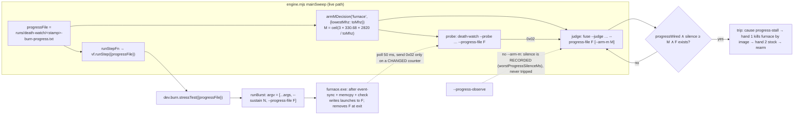

# Bug 101 — the rescue hand reads OUR OWN next rung's offset and calls it «the driver rewrites our writes»; the band then burns five rungs with the fuse gone

**Status:** 🟡 PARTIAL — **Finding 3 WIRED 2026-09-04 15:2x (session 82, offline, with a plan amendment — see «Fix plan, step 1 — AMENDED» below):** input 2 rides the live sweep on all three riders (burn `--progress-file` outside `args` · probe relay · judge `--arm-m` + file), built from ONE function shared with the twin (`fuse.progressRiderArgs` → `engine.liveFuseRiders` / `twin.riders`); the threshold now follows the band's LOWEST clock (`fuse.PROGRESS_TICK_REF_MHZ`: 2692 → 1040 ms, 900 → 3109 ms, ≥ 2820 → 993 unchanged) because the archive shows the launch tick inverse to the clock and the furnace max was taken at 2820 MHz; `--progress-observe` = the file wired, no trip. Proof: `fuse` 77 → **82**, `stress-tester` 68 → **70**, `vf-step` +3, `engine` 471 → **476**; four mutations (scale · argv spread · set-path forward · probe flag) red on exactly their blocks, restored byte-for-byte; `twin --rehearse-death progress-stall` — three trips, every one with cause `progress-stall`, both hands, band goes on; **the rehearsal itself exits 1 on two checks that predate Ш5 (expect one trip and a stopped band) — `bugs/104`, found by the closing judge; an earlier «7/7» here was my filtered grep hiding a 🔴 line**. **Live witness pending** (gate 6a): before Monday's run, `npm run workloads:build` must re-prove `distinct=1` for a burn launched WITH the flag; the first-run mode (armed vs observe) is the owner's — `interviews/026` Q3. **Finding 2 FIXED 2026-09-04 12:0x (session 81, offline, on the double):** `sweepFrequency` now asks `stopWhen` before EVERY rung (`engine.mjs`, the top of `for (const rung of rungs)`), threaded from `sweepRange` as the same hook; a stop mid-descent closes the frequency `cut-short` on the last PASS (or halts it unwritten when nothing passed) and the band-level hook stops the band before the next frequency — one decision, two ask points. Proof: two blocks in `engine --selftest` (469 → **471**, «прожигов ровно 2» · «cut-short + fuse-rescue»); mutation «снять опрос в цикле ступеней» → `получено 6, ждали 2`, red on exactly its block; the four older fuse blocks (трип · названа своим именем · Ш5 ×2) stay green. **Live witness pending** (gate 6a): the next attended run must show a judge exit followed by ZERO further rungs. Finding 1 remains open — analysis only (offline session; the owner's word 04.09 11:0x: *«после перезагрузки до понедельника работает только на виртуалке, без прогонов на реальной видеокарте»*) · **Filed:** 2026-09-04 12:0x (session 81) · **Found:** by reading three journals of the full pass 04.09 10:50 — `runs/sweep/journal.jsonl`, `runs/death-watch/2026-09-04T07-50-16-246Z-fuse.jsonl`, the Windows `System` log — against `runs/sweep-session80-polnyj-prohod.log` · **Severity: HIGH** — two of the three findings are engine defects on the live path; the third is a guard proved on the double and never mounted on the rocket (gate 6a).

⚠️ **ZERO GPU WRITES in this session.** The card is at factory after the owner's reboot (`runs/shell/boot-apply.jsonl` 11:13:14: `factory-by-physics`, power limit 300 W, remembered `factory`).

---

## Symptom (what the owner saw, and what the machine recorded)

The full pass `--sweep --from 2887 --to 900 --max-depth 245 --dashboard` started 10:50:09. At ~11:0x the owner reported a broken mouse cursor and a broken desktop wallpaper, and restarted the machine himself at 11:11:53 (`User32` 1074 — a clean restart, **no** `Kernel-Power` 41, no BSOD). The run had already ended ON ITS OWN at 10:57:44 with `ОСТАНОВЛЕНО (fuse-rescue): … АПВ НЕУСПЕШНО`, 447.9 s after start, 6 of 266 frequencies closed.

## Timeline — three journals, one clock (+03:00)

| time | journal | what |
|---|---|---|
| 10:50:33 | sweep seq 844 | 2835 MHz ← 890 mV; `furnace` exits code 1 |
| 10:50:38.7 | fuse trip **#1** | beat-silence 60.9 ms → kill-burn (furnace killed) → stock verified → **rearm** |
| 10:50:39 | Windows | `nvlddmkm` **153** — first of the day, coincides with trip #1 |
| 10:50:42 → 10:53:26 | seq 845…854 | 2737 MHz descends 890 → 825 mV, ten PASS in a row (seq 845 carries `writeFailureClass: C3` — «offers 15 MHz above the cap», the `bugs/92` **case 1** form; harmless, PASS) |
| 10:53:26 | seq 855 intent | 2737 MHz ← 820 mV |
| **10:53:34 → 10:55:59** | Windows | **20 × `nvlddmkm` 153 at a 7 s cadence** (+ one id 14 at 10:54:18) — the whole time the kernel of seq 855 was hung |
| 10:56:11 | seq 855 verdict | `CRASH / unknown` — «нагрузка не завершилась за 60000 мс — зависшее ядро»; the rung lasted **165 s** |
| 10:56:01 → 10:56:21 | fuse trips **#2…#6** | five beat-silences of 61…64 ms within 20 s; hand 1 finds NO burn to kill in four of five; each rescue verifies stock and **rearms** (2.3…9.1 s each); the judge's own tick rate collapses from ~410 to **4 ticks/s** at 10:56:11 — the machine is stuttering, and the judge re-arms into it |
| 10:56:12 | seq 856 intent | 2700 MHz ← 895 mV (seed), written while trip #4 fires 60 ms after rearm #3 |
| 10:56:23 | seq 856 verdict | `ЗАВИС`, decided by the fuse; red block **C1** «table did not settle in 6 probes, 1 of 127 agree — want 345000, got 0» = hand 2 of trips #4…#6 zeroing the curve under the rung's write; `offeredAfterMhz` 3187 |
| 10:56:21.4 | fuse trip **#7** intent | 61.8 ms silence, 60 ms after rearm #6 |
| 10:56:22.4 | fuse hand 2 | `stock-voltage` written (pid 51020) |
| **10:56:23** | **seq 857 intent** | **2700 MHz ← 970 mV, `deltaMhz: 75`** — the engine starts the next rung |
| 10:56:26.5 | fuse hand 2 | `stock-voltage-verified` **ok=false**: «C3 — драйвер правит результат: 126 записей … `want 0, got 75000`» |
| 10:56:26.7 | fuse | **`rearm-refused`** → judge exits code 2 |
| 10:56:23 → 10:57:44 | seq 857…861 | **five rungs of 2700 MHz burn and PASS with no fuse on post** (970 → 890 mV) |
| 10:57:44 | sweep | 2692 MHz closed `edge-found` 895 mV; **then** «ПОЛОСА ОСТАНОВЛЕНА … ПЕРЕД 2685 МГц: АПВ НЕУСПЕШНО» |
| 11:11:53 | Windows | owner restarts the machine (`User32` 1074) |

## Finding 1 — the «C3 in the rescue hand» is OUR write, both times (refutes `bugs/92` case 2)

Hand 2 of a rescue writes stock, then RE-READS the curve and demands zero offsets. The refusal detail names what it found: **`got 75000`** on 126 points on 04.09 — and **`got 113000`** on 127 points on 31.08 (`runs/death-watch/2026-08-31T14-03-05-531Z-fuse.jsonl:29`). Those are not the driver's numbers; they are the engine's:

| case | hand 2 wrote stock | hand 2 verified (failed) | engine intent IN that window | its `deltaMhz` | what hand 2 «found» |
|---|---|---|---|---|---|
| 31.08 | 17:04:38.240 | 17:04:42.057 | seq **833** at 17:04:38, 2115 MHz ← 815 mV | **113** | 113000 µ-units on 127 points |
| 04.09 | 10:56:22.372 | 10:56:26.530 | seq **857** at 10:56:23, 2700 MHz ← 970 mV | **75** | 75000 on 126 points |

Both are exact matches. **The rescue hand's read-back raced the sweep's write of the next rung**, saw the rung's raise, and the verifier — which cannot tell «the driver rewrote my zeros» from «somebody else wrote after me» — labelled it C3 and refused to rearm. The «rare C3 became frequent» conclusion of `bugs/92` is therefore **half refuted**: case 2 of that ticket and today's refusal are the same race, not the driver. Case 1 (the curve offering 15 MHz above the cap after a settled write — seq 702, 31.08 seq ~, today seq 845) is a different, still-open observation and stays with `bugs/92`.

Why the race exists (read in code, not guessed): the sweep asks «is the fuse on post?» by comparing `fuseMod.tripCount(lines) <= fuseMod.rearmCount(lines)` (`engine.mjs` ~11359, the `stopWhen` of `plans/81` Ш5). On a stuttering machine a new trip follows a rearm by **60 ms** (the deadman threshold itself), so the count says «on post» during the 60 ms between rearm #N and intent #N+1, the sweep proceeds to write, and trip #N+1's hand 2 runs its verification over the freshly written vector.

**The recon for this fork already exists — do not re-research it.** `researches/31` (session 72, for `bugs/88`: hand 2 zeroing the curve under a LIVE rung's burn) answered the same class from three fields: **fencing tokens** (never trust a process to know its own lock is gone — the resource validates), the Linux **seqlock** (validate across the critical section, discard on change), and ISO 13850 **e-stop latch** (reset ≠ restart). Finding 1 is the second face of that class: there hand 2 raced the rung's BURN, here it races the NEXT rung's WRITE. The prescribed form follows from the recon: hand 2's read-back is a seqlock-style validation — it must read the journal's intent counter before and after its write, and a counter that moved (a new `intent` line) means «a write of ours landed in my window» → report the race, never C3; and the sweep must not open a new intent while `tripCount > rearmCount` (the fencing token is the trip count). The e-stop half already holds: a rescue closes the frequency as an edge (`interviews/023`).

## Finding 2 — `stopWhen` is consulted once per FREQUENCY, so the band burned five rungs after the fuse left

`stopWhen` is evaluated at `engine.mjs:3841` (`const externalStop = stopWhen ? await stopWhen() : null;`) — in `sweepRange`, before each frequency, not before each rung. The judge exited with code 2 at 10:56:26.7; rungs seq 857…861 (10:56:23 → 10:57:44, 970 → 890 mV at 2700 MHz, each a 10 s furnace burn) ran with **no deadman armed**, and the stop arrived only «ПЕРЕД 2685 МГц». Phase 5 of epic 51 (`plans/58`) forbids a burn without an armed fuse; the sweep honoured the rule at the frequency boundary and not at the rung boundary. **P81-AC4 («ступеней после спасения без взведённого судьи») was violated by five on the live path** — the very criterion the count was built to serve.

This is the second half of why the owner's desktop was already broken while the run reported PASS after PASS: nothing was watching.

## Finding 3 — the fuse's input 2 (progress) is not wired on the sweep path; a hung kernel ran 165 s unseen

Seq 855 (2737 MHz / 820 mV) hung the GPU kernel: the furnace never returned, the driver complained 20 times at 7 s intervals, and the rung ended only by the burst timeout (`BURST_TIMEOUT_FLOOR_MS` 60 000) — 165 s from intent to verdict. The fuse saw nothing: throughout `runs/death-watch/…-fuse-alive.jsonl` **`worstProgressSilenceMs` is `null` on every line** (0 non-null of 167 lines in the window; 0 in the whole file), i.e. input 2 was never armed. `grep -n progress-file automation-engine/engine.mjs` → no match: the sweep does not pass `--progress-file` to the burn, and the fuse's `burnInFlight()` degrades to `true` when `progressFile === null`. R4c (`PROJECT_ARCHITECTURE_INTERNAL_MAP.md`) records input 2 as «проведено 2026-08-29, выигрыш 60 000 → ≈1000 мс» — proved on the double and by blocks; **on the live sweep it is not mounted** (gate 6a, the class the owner named 30.08: *«забыл поставить двигатель на ракету»*). The beat (input 1) stayed healthy during the hang (5…41 ms) because the OS was alive — only the GPU was not; that is exactly the failure input 2 exists for (R4c: «GPU не двигает работу, ОС жива»).

## Observation 4 — the judge re-arms into a machine that is still stuttering (named, not diagnosed)

Trips #2…#7 came 60 ms after each rearm; rearm's only criterion is «stock confirmed by reading». The judge's own tick rate was 4/s during that minute (vs ~410/s normal). Re-arming while the beat is still silent produces a trip storm (6 trips in 21 s) whose only effect is to zero the curve under whatever the sweep is doing — Finding 1's race is the direct consequence. Whether a rearm should also demand N healthy beats is a design fork (an agent-chosen number is what the owner rejected in `bugs/73`) — **recon before deciding (M4), not a patch.** ✅ **Recon taken the same session — `researches/33`:** the industry's answer is a HALF-OPEN state (Resilience4j `permittedNumberOfCallsInHalfOpenState`, Polly's single probe, the PLC watchdog «feed is proof of health, not of life»); the fork for the owner is written there (§4) with the project's own numbers and no threshold chosen by the agent; the window length is a measurement over every fuse-alive file, still to be taken.

## What is NOT concluded

- Whether the `nvlddmkm` 153 storm (10:53:34…10:55:59) was CAUSED by the 820 mV rung or by the rescue storm: 153 has no registered text on this machine (`researches/30` §129). The 7 s cadence during a hung kernel is consistent with TDR-style recovery attempts, and that is a hypothesis, not a reading.
- Whether the display corruption (cursor, wallpaper) came from the kernel hang, from the driver resets, or from six curve zero/raise cycles in 21 s — the owner saw it at ~11:0x, after the run had ended.

## Fix plan — ORDER MATTERS, and none of it runs on the live card before Monday 08.09

1. **Finding 3 first** (mount input 2 on the sweep path): the address is `engine.mjs:11234` — the live probe is spawned as `[watchScript, '--probe', '--port', m[1], '--seconds', '36000', '--tick', '2']` with no `--progress-file`, while the twin path passes `twin.riders.probeArgs` (which is why the double proves it and the card never sees it). Pass `--progress-file` there AND to the burn (`runBurst` args in `stress-tester.mjs`). **Recon done 12:0x, the wiring is three lines and one re-proof — executable plan for Monday:**
   - **the burn:** `runBurst({ …, progressFile })` appends `'--progress-file', progressFile` to `argv` exactly where `--sustain` is appended (`stress-tester.mjs` `runBurst`, `argv = […args, '--sustain', N]`) — i.e. OUTSIDE the golden's `args` stamp, by the same licence `sustainSeconds` has (its docblock: «deliberately NOT part of `args`»); the built `workloads/furnace.exe` (2026-08-31) already carries the flag (`Buffer.includes('--progress-file')` = true; `furnace.cu:264`, the touch at :357, `remove` at :381 — still `[NOT-TESTED]` in the source);
   - **the judge:** live `judgeArgs` gain `'--arm-m', String(armMDecision('furnace').armMMs), '--progress-file', progressFile` — the twin's shape at `twin-assembly.mjs:374`; the judge uses the path only as the «burn in flight» gate (`fuse.burnInFlight`), the beats come from the probe;
   - **the probe:** `engine.mjs:11234` gains `'--progress-file', progressFile` — the twin's shape at `twin-assembly.mjs:380`; the relay sends `0x02` only on a CHANGED counter (`death-watch.startProgressRelay`);
   - **the path:** one file per run under `runs/death-watch/<stamp>-burn-progress.txt`, next to the fuse protocol;
   - **the re-proof, before any live run:** `npm run workloads:build` must re-prove `distinct=1` for a burn launched WITH the flag (the file write is host-side, after `cudaEventSynchronize`, so the checksum cannot move — but «cannot» is R12's word for «measure it»); then the double: `--rehearse-death progress-stall` on the assembled live-shaped riders; then a block that reddens when the sweep spawns `furnace` without the flag while `armMDecision('furnace').armed` is true.
   **Why it matters in numbers:** on 04.09 the hung kernel cost 165 s of a stuttering machine; with input 2 armed at M = 993 ms the rung would have ended in ≈1 s (R4c). prove on the double with `--rehearse-death progress-stall`, then a block in `engine --selftest` that reddens when the sweep spawns a furnace without the flag. Without it a hung kernel costs 60 s of a stuttering machine before anyone acts.
2. **Finding 2** (per-rung stop): call `stopWhen` before every rung, not every frequency; a block that runs a scripted sweep with a judge that «exits» mid-frequency and asserts the next rung never starts (P81-AC4 as a test, not a sentence).
3. **Finding 1** (the race): make the rescue hand and the rung's write mutually exclusive — the sweep must not write while a trip is in flight (`tripCount > rearmCount`, checked immediately before the atom's write, not only at boundaries), and hand 2's verifier must distinguish «a foreign write landed after mine» (the offsets match the journal's open intent) from «the driver rewrote me» — the first is a race to report, the second is C3. Then re-count `bugs/92` B92-AC1 with the race cases excluded.
4. Observation 4 → `researches/` recon (how deadman watchdogs decide re-arm: hysteresis, N healthy heartbeats) before any number enters `fuse.mjs`.

## Fix plan, step 1 — AMENDED 2026-09-04 15:0x (session 82, offline) BEFORE the wiring: M must follow the band's lowest clock

The archive answered a question the plan never asked. `PROGRESS_TICK_MAX_MS.furnace` = 330.68 ms is the
maximum of `runs/power/grid59-furnace-ramp-3s.json`, taken at a loaded clock of **2820 MHz** (median of
`clocks.gr`, n = 6, ramp from 1590); all seven archived furnace runs sit at 2805…2872 MHz under load. **The launch
period is inverse to the clock, and that is MEASURED, not assumed** — on `branchy` over 29 archived runs:
25.9 ms at 2797 MHz → 81.9 ms at 900 MHz (×3.16 for a clock ratio of 3.11; `PROGRESS_TICK_MAX_MS.branchy`
= 81.89 IS the 900 MHz value). A full-range band (`--to 900`) therefore puts a healthy furnace launch at
≈ 947…1036 ms (median…max, by the direct ratio 2820/900) — **the slowest launches above M = 993 ms**. Armed as the plan was written, input 2 would trip on HEALTHY rungs
below ≈ 950 MHz, and a trip closes the frequency as an edge (`interviews/023`): a per-operating-point
threshold turning into a false-alarm generator whose alarm is RECORDED as evidence — EXP-0038's class,
and EXP-0036's rule («old real data proves the THRESHOLDS») is what caught it, one `node -e` over the
archive before a single line of wiring.

| workload | archived max tick | loaded clock at that max (file) | M at ≥ 2820 MHz | M for a band down to 2692 | M for a band down to 900 |
|---|---|---|---|---|---|
| furnace | 330.68 ms | 2820 MHz (`grid59-furnace-ramp-3s`) | 993 ms (as today) | 1040 ms | 3109 ms |
| branchy | 81.89 ms | 900 MHz (`cold_900`) | 246 ms (as today) | 246 ms | 246 ms |
| sdc_fma | 0.80 ms | 2835 MHz (`uv_0`) | refused (as today) | refused | refused |

> **@fork** — *arming input 2 on the live sweep; nonzero cost both ways (a false trip writes an edge,
> a missing trip costs 60 s of a hung machine).* Variants, listed before deciding (M4):
> **A. constant M = 993** (the plan as written) — refuted by the archive above.
> **B. M derived from the band's LOWEST clock** — one judge, one M for the whole band:
> `M = k × tick_max × ref_mhz / to_mhz`, ratio never below 1. Detection at the top of a full-range band
> is 3.1 s instead of 1 s — still 20× under the 60 s it replaces. **Chosen.**
> **C. per-frequency re-arm** (a datagram carrying M every rung) — the right long-term shape once a live
> run has MEASURED the furnace tick at every frequency; more moving parts than today's evidence buys.
> **D. observe-only first run** (`--progress-file` everywhere, no `--arm-m`) — measures the tick per
> second at zero trip risk, at the price of one more run where a hang costs 60 s. Kept as the flag
> `--progress-observe`, NOT as the default: a protection that holds only when somebody types it is not
> mounted (EXP-0078, gate 6a — the very class of this finding).
> **What stays a hypothesis:** the 1/f scaling is measured on `branchy` and EXTRAPOLATED to `furnace`.
> A kernel with a memory-bound half slows LESS than 1/f when only the core clock drops, so 1/f is the
> conservative side (M larger than needed, never smaller). The first live run's alive protocol
> (`worstProgressSilenceMs` per second) measures the furnace tick at every frequency it visits — reading
> it is the FIRST thing to do after Monday's run, and `interviews/026` Q3 hands the owner the veto
> before it. Reference clocks live in code as `PROGRESS_TICK_REF_MHZ`, one per workload, each with its
> archive file.

**Wiring as built (session 82), each seam with its block and its mutation address:**

| seam | change | block | mutation that must redden it |
|---|---|---|---|
| `fuse.mjs` | `PROGRESS_TICK_REF_MHZ`; `deriveArmMMs`/`armMDecision` take `{ lowestMhz }`; `progressRiderArgs` — the ONE place that knows how input 2 rides on judge and probe | M(furnace, 900) = 3109 · M(furnace, 2820+) = 993 unchanged · ratio never < 1 · helper shapes | drop the clamp → M(branchy, 2692) < floor |
| `stress-tester.mjs` | `runBurst({ progressFile })` appends `--progress-file F` OUTSIDE `args` (the `--sustain` licence); `stressTest` forwards it | argv with / without the flag | delete the append |
| `vf-step.mjs` | `runStep({ progressFile })` forwards to `dev.burn.stressTest` on both paths (set / single shape) | fake device captures the option | drop the forward |
| `twin-assembly.mjs` | rider args built by `progressRiderArgs` — twin args BYTE-IDENTICAL (E67-AC5) | existing twin blocks stay green; polygon | — |
| `engine.mjs` | live judge/probe args via `liveFuseRiders(...)` (pure, exported); `progressFile` next to the fuse protocol; `--progress-observe`; start-up line names M and the band's bottom | armed shape carries `--arm-m M` + `--progress-file` on both riders; observe shape carries the file and no `--arm-m`; `runStepFn` forwards | drop `--progress-file` from the probe |

## Decisions made without the owner

- I did **not** touch the card, the fuse, the engine, or the journal; the run's harvest (`curves/measured.json`: 2692 → 895 mV edge-found; 2730 ← 835 · 2685 ← 935 harvest rows; ratchet 2842/2865/2880/2887 → 910 mV) is committed AS THE ENGINE WROTE IT — every row there came from a PASS with the oracle, including the five rungs of Finding 2. Whether rows proven with no fuse armed count as proof is the owner's call; I flag them here rather than delete measured facts: seq 857…861 fed row **2692 MHz (895 mV)** and harvest **2685 MHz (935 mV)**.
- `bugs/92` is not closed: only its case 2 is reassigned to this race; case 1 stands.

## Links

`bugs/92` (case 2 refuted here) · `bugs/50` (C3 case 1 origin) · `bugs/91` (the 31.08 kill-burn 6693 ms — same rescue storm) · `plans/81` Ш5 (the АПВ wait) · `plans/58` (phase 5: no burn without a fuse) · `plans/66` (input 2) · `researches/30` (`nvlddmkm` archive) · `runs/sweep-session80-polnyj-prohod.log` · `runs/logs/polnyj-prohod/2026-09-04T10-50-09+03-00.log` · `runs/death-watch/2026-09-04T07-50-16-246Z-fuse*.jsonl` · EXP-0233
