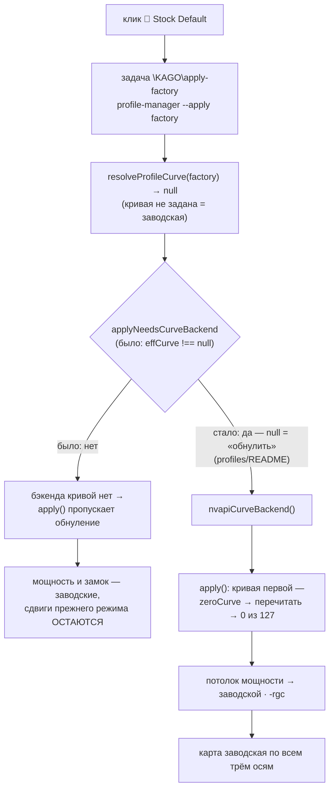

# Bug 140 — 🔄 Stock Default resets the power limit and the clock lock, but NOT the V/F curve offsets

**Status:** ✅ DONE 2026-09-25 18:57 +03:00 — live witness on the owner's real path passed (step 3): offsets 9 → 0 of
128 by the owner's double-click on 🔄 Stock Default; code fixed 08:43 (session 103: `applyNeedsCurveBackend`, guard
block + mutation MB140). The ORIGINAL defect was never observed on the card — only the fix was (see closing section)
**Severity:** S1 — the owner's machine: a click on «Stock Default» after a tuned mode would leave the undervolt
offsets on the card while the shell reports the factory mode
**Version/build:** HEAD 2026-09-25 (`c20980a`) · **When/context:** session 102, 02:1x +03:00, while checking offline
how the mode check's stock smoke (Ш8) will apply `profiles/factory.json`

## Symptom (expected by the code, not yet observed)

✏️ *Corrected 02:1x after an independent skeptic pass: the first edition said «and the tray's Exit» — the tray HAS
no Exit item (`automation-engine/tray.ps1:8` «no menu, no buttons, no click actions»; `lib/tray-autostart.mjs:205`
«the Exit item of `plans/10` §4.5 is not built yet»); and the early return is at `profile-manager.mjs:700`, not
:685. The skeptic CONFIRMED the chain for the shortcut and found no other path that zeroes the curve.*

The Stock Default shortcut runs the scheduled task `\KAGO\apply-factory`, whose action is
`profile-manager.mjs --apply factory` (`automation-engine/setup-desktop.mjs:277`). That path zeroes the power limit
and releases the clock lock but — by the chain below — never zeroes the per-point V/F frequency offsets written by a
previous mode. The card would stay undervolted under a «Stock Default» indicator until a reboot (volatility) or
`npm run profile -- --reset` (`resetToFactory` zeroes the curve with its own backend).

## Repro (deterministic, offline)

1. `node --input-type=module -e "const pm=await import('./automation-engine/lib/profile-manager.mjs'); const fs=await import('node:fs'); console.log(await pm.resolveProfileCurve(JSON.parse(fs.readFileSync('profiles/factory.json','utf8'))))"` → **`null`** (observed 02:1x and re-run 02:26 with this exact command; the first edition's command mixed `require` with top-level await and did not run — caught by the second judge; early return at `profile-manager.mjs:700`: `curveRaiseAndCapMhz`, `curveRef`, `curveSnapshot` all null).
   ✅ The INSTALLED task was read ≈08:47 on 25.09 (session 103, read-only, Task Scheduler — no card): it runs the repo's
   `profile-manager.mjs --apply factory` through the hidden runner, RunLevel HighestAvailable (details in step 3 below).
2. *Before c521b3a:* CLI `--apply` (`profile-manager.mjs:3468-3473` then): `needsCurve = effCurve !== null` → **false** → `curveBackend = null`.
3. *Before c521b3a:* `apply()` (`:1176` then): the step «кривая V/F: возврат к заводской (все смещения 0)» exists only under
   `else if (curveBackend && profile.settings.curveRaiseAndCapMhz === null)` → **skipped** without a backend.
   The comment above it says this step «is what makes `factory.json` a reset of ALL state» — the CLI never feeds it.

## Forensics

- `runs/` holds no record of the step «возврат к заводской (все смещения 0)» ever running (`grep -rl` → 0 files).
- Earlier proofs of the factory path checked the power limit only (`setup-desktop.mjs:20`: «apply-factory FROM that
  non-factory state → 300.00 W twice»); P3-AC4 (14.08) predates the curve.
- Since 18.09 the risk is dormant: `Optimised` is refused at every logon (driver 616.92, `bugs`-free line in STATUS),
  so no tuned curve reaches the card through the shell.

- Same gap, harmless in practice (skeptic, 02:1x): boot restore of a remembered FACTORY state calls
  `resetToFactory(b, { timing })` without a curve backend (`profile-manager.mjs:1612`) and logs «кривая V/F НЕ
  трогалась» (`:1434`) — after a reboot the curve is factory anyway (volatile), so nothing is left behind.
- Related stale text, not this bug: `engine.mjs:11374` prints advice about a tray Exit item that is not built;
  STATUS «Решено владельцем» records the owner's 23.08 DECISION for Exit, not a built feature.

TWINS: searched printed advice (`console.log|error` with «Stock Default» / `apply-factory`) and the docs that call the
shortcut a full reset — fixed: `engine.mjs:11374` (`0bb9d2b`), `profile-manager.mjs:3494`, `MASTER_PLAN.md` row,
`profiles/README.md`, `README.md` (both languages) — session 102, after the second judge pass.

TWINS (session 103, of the CODE construct «`apply()` of a null-curve profile without a curve backend»): searched
`apply(` / `resetToFactory(` callers — found 4 other sites: `bootApply` factory branch (`resetToFactory` without a
backend, `:1612`-area — harmless: it runs at logon after a reboot, when the curve is factory by volatility, and a
remembered FACTORY state now means the last click zeroed the curve) · `roundTrip` (its CLI passes no backend, so a
curve profile is REFUSED before any write — nothing to zero) · `ladder-descent` (measurement pins, never writes a
curve) · `mode-validate` seam (always opens a backend since `3e5c10e`). None changed; the fix is the CLI's decision.

## Fix plan (card day, with the owner present — it changes what his shortcut does)

1. ✅ `--apply`: open a curve backend also when the profile's curve means «factory» (`curveRaiseAndCapMhz === null` and
   no ref/snapshot), so `apply()` runs its zero-and-read-back step. Smallest form: `needsCurve = effCurve !== null ||
   isFactoryCurve(profile)`.
   **Done 2026-09-25 08:43 (session 103)** as the exported pure `applyNeedsCurveBackend(profile, effCurve)` =
   `effCurve !== null || settings.curveRaiseAndCapMhz === null` — the format's own rule (`profiles/README.md`: `null` =
   «обнулить все смещения кривой»), so it holds for every null-curve profile, not a factory special case. The CLI
   prints the zeroing as a planned step before the write.
2. ✅ Guard (born with the fix): a `profile --selftest` block — the CLI's backend decision for `factory.json` is TRUE;
   mutation «needsCurve = effCurve !== null» reddens it.
   **Done:** block «ЗАВОДСКОЙ ПРОФИЛЬ ПОЛУЧАЕТ БЭКЕНД КРИВОЙ У --apply, И СДВИГИ ПРЕЖНЕГО РЕЖИМА ОБНУЛЯЮТСЯ (bugs/140)»
   reads the REAL `profiles/factory.json`, feeds the decision into `apply()` over a fake card carrying 67 offsets and
   demands 0 non-zero after, the zeroing step named in the report, and a control row (a raising profile still gets the
   backend). Suite 88 → **89/89**. Mutation MB140 (`return effCurve !== null;`) → **exactly this block red, 1 of 89**;
   restored → 0 red.
   ✏️ *Scope of the guard, corrected after the independent judge (25.09, session 103 closure):* the block holds the RULE
   (the decision function), NOT the CLI's wiring — the planned mutation of THIS step, `needsCurve = effCurve !== null`
   written at the CLI line itself (`profile-manager.mjs` `--apply` branch), stays **89/89 green** (judge's run). The
   commit c521b3a's wording «проводит решение команды в `apply()`» is wider than that: it walks the decision
   FUNCTION into `apply()`. The wiring — the line the shortcut actually runs — is held only by the live witness (step 3).
3. ✅ Live witness (2026-09-25 18:56–18:57, session 104, the owner at the machine): apply a tuned candidate → click
   🔄 Stock Default → `node tools/probe-offer.mjs` → non-zero offsets **0** of 128 (+ `npm run profile -- --state`).
   **Observed, in order:** 18:56:24 before — `сдвигов ненулевых: 0 из 128`, 300 W, driver 616.92 · 18:56:30
   `npm run profile -- --apply witness-140.local` exit 0 (power untouched, «ЗАПОМНЕНО … witness-140.local») · 18:56:41
   control — `сдвигов ненулевых: 9 из 128 · поднятых нами: 0` (1190…1240 mV, −7…−82 MHz, every offer ≤ 3090) · the owner
   double-clicked 🔄 Stock Default («сделал») · 18:57:25 after — `сдвигов ненулевых: 0 из 128`, top offer back to the
   factory 3172 MHz, 300 W, `runs/shell/remembered-state.json` → `"profile": "factory"`, `writtenAt 18:57:11` (written by
   the shortcut's task — the click reached the repo code). The Murphy risk below (curve backend failing inside the
   task) did NOT fire. The table has 128 entries on this read, not 127 as the plan line said.
   **Run sheet for the card evening 2026-09-25 ~19:00 (owner at the machine), prepared offline:**
   - the installed task, read ≈08:47 from Task Scheduler (read-only): `\KAGO\apply-factory` → `wscript … run-hidden.js
     node.exe D:\work\ai_sandbox\KAGO\automation-engine\lib\profile-manager.mjs --apply factory`, RunLevel
     HighestAvailable — it runs the REPO file, so the fix reaches the shortcut without re-installing anything;
   - the tuned state is `profiles/witness-140.local.json` (gitignored): `deltaMhz 0 · capMhz 3090`, stamp 616.92 —
     ZERO raised points, only the factory table's points offering above 3090 get NEGATIVE offsets (more voltage for
     the same frequency). Predicted on the stored reference: 6 points, −7…−45 MHz; R12 no new inversion, R13 nothing
     raised. Format and stamp checked offline against a 616.92 card shape: 0 refusals;
   1. `node tools/probe-offer.mjs` → non-zero **0** (factory since boot) · `npm run profile -- --state` → 300 W;
   2. `npm run profile -- --apply witness-140.local` → the curve step reads back; power untouched;
   3. `node tools/probe-offer.mjs` → non-zero **N > 0** — the control: the state the shortcut must clear;
   4. the owner double-clicks 🔄 Stock Default on the desktop (the real path);
   5. `node tools/probe-offer.mjs` → non-zero **0** · `npm run profile -- --state` → 300 W · remembered state = factory.
   Rollback at any step: `npm run profile -- --reset`, or a reboot. Step 5 showing N > 0 = the fix did not reach the
   task → stop, read why (the task's console is hidden: re-run the same command line from an elevated shell).
   ✏️ *Corrected 08:4x (session 103): this line named `npm run profile -- --state` as the offset reader — it prints power,
   clock, driver and VBIOS only (`printState`) and never reads the curve; `probe-offer` reads the offset vector
   (`сдвигов ненулевых: N из M`).* If the curve backend cannot open inside the scheduled task, the click must still reset power and
   clocks and SAY the curve was not reset (never a silent partial reset).
   *Risk named before the click (Murphy, tier b):* with the fix, a curve backend that fails inside the task makes the
   whole click fail (the curve step runs FIRST, nothing else is written) — where the old code at least reset the
   power. Evidence against the risk, read ≈08:40: the elevated logon task (`\KAGO\boot-apply`, the same hidden runner)
   applied `Optimised` — a snapshot curve, i.e. through NVAPI — once, 2026-09-15 08:49:21 (`runs/shell/boot-apply.jsonl`:
   `applied … 250 Вт / 2535 МГц`); the next logons (18.09, 19.09) were refused by the stamp. One observation, and it is
   of the logon task, not of `\KAGO\apply-factory` itself. Contingency if the witness shows the failure: make the
   factory zeroing a named non-fatal step, as step 3 says.

## Decisions made without the owner

- `[AI]` Not fixed tonight: the fix changes the owner's shortcut on the machine he lives on and needs a live witness;
  filed and put first in the card-day order (`plans/102` Ш8).
- `[AI]` (session 103, 25.09 08:43) **Fixed in code BEFORE the live witness**, and since the task runs the repo file the
  fix is live in the owner's shortcut from that commit. Why acceptable: the card stays on factory until the evening
  (the owner's answer A to `interviews/interview_031`), so a Stock Default click has nothing to zero today; the named
  risk (a curve backend failing inside the task now fails the whole click, where the old code still reset the power)
  is checked by the witness tonight, with `npm run profile -- --reset` as the fallback. Step 3's «must still reset
  power» contingency is NOT built — it is built if the witness shows the failure.
- `[AI]` The rule is the format's, so it reaches every `null`-curve profile, not only `factory.json`: `--apply` of
  `test-pl250`, `bound-proof.local` and `roundtrip-probe.local` now also opens NVAPI and zeroes the curve (their files
  say `curveRaiseAndCapMhz: null` = «обнулить», `profiles/README.md`). No block covers those three (judge's note).

- `[AI]` (session 104, 25.09 18:5x) Closed on ONE live witness of the shortcut path. The «must still reset power when
  the curve backend fails» contingency stays unbuilt — the failure it answers did not occur.

## ✅ STATUS: DONE (2026-09-25 18:57 +03:00)

Hygiene: `profile --selftest` block «factory apply backend=true» + mutation MB140 (session 103, 89/89; the block holds
the decision RULE, not the CLI wiring — judge 25.09).
Functional run: the owner's real path — the desktop shortcut 🔄 Stock Default → `\KAGO\apply-factory` → repo
`profile-manager.mjs --apply factory` — walked on the live card with a NON-zero control state (9 of 128 offsets),
result read by `node tools/probe-offer.mjs`: 0 of 128 · power 300 W · remembered state `factory` (step 3 above).
REAL WORLD: accumulated — the owner's installed scheduled task and desktop shortcut from 14.08, untouched; data and
machine — his card on driver 616.92; path — his double-click. Verified on the real world.
Not observed, named: the ORIGINAL defect (a click that leaves offsets) was proved by code reading and a skeptic, never
seen on the card; the tray's Exit item is still not built (`plans/10`).

## Links

`plans/102` Ш8 (card-day order) · `plans/100` (the shortcut is silent when it refuses) · `bugs/139` · R9a (the total
undo covers every kind of state — `resetToFactory` does; the Stock Default path does not)
