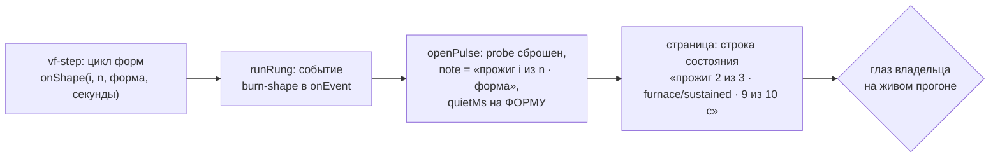

# Bug 52 — окно наблюдения показывает ОДИН прожиг из трёх, и оператор видит 26 секунд «неизвестно чего»

**Статус:** ✅ **ЗАКРЫТ 2026-08-30 14:1x (сессия 67) — ПРЕМИСА УСТАРЕЛА, снята замером, а не починкой.**
Трёх прожигов на ступени больше нет: с `plans/50` прожиг стал ОДНОЙ формой, и ступень с 36 с ужалась
до 15 с. Окно, показывающее один прожиг, сегодня показывает ПРАВДУ. Разбор с числами — в конце.
Прежняя строка: 🔴 ОТКРЫТ — найден ВЛАДЕЛЬЦЕМ на живом прогоне 2026-08-24 22:0x.
**Версия:** `main` @ `5b3456e` · **Где:** окно наблюдения (`dashboard`), лента состояния ступени

## Симптом — словами владельца

> *«26 секунд было в состоянии СТРЕСС ТЕСТ 10 из 10 С. То есть, прожиг 10 секунд — и дальше до
> следующего прожига стенд чем-то занимается 26 секунд!!!!!»*
>
> *«не понимаю, что стенд делает 26 секунд между прожигами»*

## Что происходит на самом деле — ЗАМЕРЕНО телеметрией, не выведено

Одна ступень длится **36 секунд**, и внутри неё **ТРИ прожига**, а не один. Разбор по пробам
`runs/dashboard/telemetry.jsonl` (посекундно, `utilization.gpu` и `power.draw.instant`):

| отрезок | длительность | максимум ватт | что это |
|---|---|---|---|
| прожиг | 5 с | 218 Вт | форма 1 — `furnace/transient` |
| простой | 6 с | 49 Вт | — |
| прожиг | 9 с | 223 Вт | форма 2 — `furnace/sustained` |
| простой | 1 с | 49 Вт | — |
| прожиг | 10 с | 119 Вт | форма 3 — `branchy/sustained` |
| простой | 5 с | 52 Вт | — |

Пауз МЕЖДУ ступенями нет вовсе: замер по журналу даёт **0,0 с** от вердикта до следующего намерения.
Всё «неизвестно что» лежит ВНУТРИ ступени.

**Ступень судится НАБОРОМ из трёх форм, и худшая решает** — это правило проекта (`GOAL.md`, вердикт
набором). Окно наблюдения показывает прогресс ОДНОЙ формы и про две остальные молчит, поэтому
владелец видит «10 секунд работы и 26 секунд простоя» там, где карта работает 24 секунды из 36.

## Почему это дефект прибора, а не движка

Движок делает ровно то, что должен. **Врёт ИНСТРУМЕНТ** — и врёт в самом дорогом месте: владелец
принимает по нему решения о своей карте. Это тот же класс, что `bugs/46` (строка ступени не вела
шагом) и находка A `plans/28` (симптом печатался как вывод): прибор, который показывает часть
правды, хуже прибора, который молчит, потому что ему верят.

## Лечение (не начато)

Лента ступени обязана показывать **«прожиг 2 из 3 · furnace/sustained · 9 из 10 с»**, а не один
безымянный «СТРЕСС ТЕСТ». Форма уже известна движку — она едет в вердикт полем `decidedBy`.

Связано с `bugs/53` (28 % простоя): исправив показ, оператор увидит и настоящий простой — 12 секунд
на ступень, — который сегодня неотличим от двух невидимых прожигов.

## 📋 ОПЕРПЛАН ПОЧИНКИ (написан сессией 61; исполняет следующая офлайн-сессия, ~полвечера)

**Вектор цели (Achieve).** Боль: владелец видит «10 секунд работы и 26 неизвестно чего» там, где
карта работает 24 из 36 — прибор врёт умолчанием. Куда хотим: лента ступени называет каждый
прожиг — «прожиг 2 из 3 · furnace/sustained · 9 из 10 с».

**Критерии приёмки:**
- **AC1.** На каждой форме набора пульс получает событие с номером, счётом, именем формы и её
  длительностью; страница показывает это в состоянии ступени (Scale: событий на ступень · Meter:
  блок самопроверки со скриптованным набором из 3 форм · Target: 3 из 3, имена дословно).
- **AC2.** Секунды пробы перезапускаются НА КАЖДОЙ форме (сейчас один счётчик на ступень) — окно
  не показывает «10 из 10» во время второй формы.
- **AC3.** Бюджет молчания объявляется на форму, а не на весь набор — «ЗАМЕРЛО» не загорается
  между формами (класс `bugs/30`, не регрессировать: мутация «снять переобъявление» красит блок).
- **AC4.** Прибор непредвзят (слово владельца из `bugs/65`): имя формы едет ДАННЫМИ из движка
  (`decidedBy`-словарь уже существует), страница ничего не знает о наборе форм проекта.

**Шаги (швы сверены по коду сессией 61):**
1. `vf-step.runStep`: необязательный `onShape({index, count, shape, workload, seconds})` в цикле
   форм (формы уже итерируются там; имя в форме `decidedBy` — `furnace/sustained`).
2. `engine.runRung`: прокинуть `onShape` из своего `onEvent` событием
   `{kind: 'burn-shape', ...}` (движок — композитор, R16a; путь тот же, что у `atom-red`).
3. `run-dashboard.openPulse`: case `burn-shape` — `probe = {elapsed: 0, totalSeconds: seconds}`,
   строка формы в `run.note`/отдельное поле, `quietMs` переобъявить на форму (AC3).
4. Страница: показать поле формы рядом с «стресс-тест N из M с» (правка `_wiring.js` →
   пересборка; сам макет не трогается — поле едет в существующую строку состояния).
5. Блоки: dashboard --selftest (случай burn-shape) + engine --selftest (проброс события) +
   мутации: снять onShape → AC1 красный; не переобъявить quietMs → AC3 красный.

**Риски:** (а) события из заблокированного прожига не уедут — onShape зовётся МЕЖДУ формами
(перед стартом каждой), это не тик изнутри; секунды внутри формы уже считает сервер ·
(б) двойник: формы идут через боевой `runBurst` — событие приедет и там, окно двойника получит
ленту даром · (в) вкусовая половина (как это выглядит) — судит глаз владельца на живом прогоне,
приёмка за ним.

## Решения, принятые без владельца

- Не начато в сессии 61: до границы цикла оставалось меньше цены починки, а полусделанный прибор
  на витрине — класс `bugs/65`. Оперплан со швами написан вместо кода.

## Ссылки

`plans/42` фаза 1 (намерение и выданное рядом в окне — там же чинится и это) · `bugs/53` ·
`runs/dashboard/telemetry.jsonl` прогона 21:5x

## Разведка шва, сессия 65 (2026-08-30 00:0x) — код НЕ начат, и вот что найдено

**Шов шага 1 существует наполовину, и это меняет цену.** `judgeCandidate` (`stress-tester.mjs`)
УЖЕ зовёт `onShape(entry)` на каждой форме, и `vf-step` уже его передаёт — но только чтобы бить
сторожа (`watchdog.beat()`). Беда в МОМЕНТЕ: хук зовётся ПОСЛЕ прогона формы, а ленте нужен
вызов ПЕРЕД стартом каждой («идёт прожиг 2 из 3»). Значит работа шага 1 — не «завести хук», а
**добавить второй, ранний**: `onShapeStart({index, count, id, workload, shape})` перед
`runShapeFn(s)`; секунды знает вызывающий (`seconds`/`sustain` в `vf-step`), а не судья набора.

**Почему не начато сессией 65:** предмет трогает БОЕВОЙ путь движка (`judgeCandidate` судит
живую карту), а до границы автономного окна оставалось меньше его цены. Полупроведённое событие
в приборе, по которому владелец принимает решения о своей карте, — ровно класс `bugs/65`.
Разведка шва записана вместо кода: следующей сессии не придётся выводить это заново.

---

## ✅ ПЕРЕИЗМЕРЕНО 2026-08-30 14:1x (сессия 67) — ПРЕМИСА МЕРТВА, ТИКЕТ ЗАКРЫТ

Эстафета велела **переизмерить, а не чинить**. Замер по боевому журналу (записей в карту ноль):
длительность ступени = от намерения до вердикта, форма = поле `decidedBy`.

| день | ступеней | медиана ступени | какие формы решали |
|---|---|---|---|
| 2026-08-23 | 44 | **36,0 с** | `branchy/sustained` ×44 |
| **2026-08-24** ← тикет заведён в этот день | 31 | **36,0 с** | `branchy/sustained` ×31 |
| 2026-08-25 | 54 | **36,0 с** | `branchy/sustained` ×54 |
| **2026-08-26** ← после `plans/50` | 17 | **14,0 с** | `furnace/sustained@0` ×17 |
| 2026-08-28 | 4 | **15,0 с** | `furnace/sustained@0` ×4 |

**После 26.08: 21 ступень, медиана 15,0 с, РАЗНЫХ решавших форм — ОДНА.**

**Арифметика закрывает вопрос без спора.** Жалоба владельца — «прожиг 10 секунд, и дальше 26 секунд
неизвестно чего» — была верна при ступени 36 с: три прожига 5 + 9 + 10 с, из которых окно называло
один. Сегодня ступень длится 15 с, и три прожига по 24 с суммарной нагрузки в неё физически не
помещаются. **Прожиг один, и окно, показывающее один прожиг, показывает правду.** Дефект «прибор
врёт умолчанием» перестал существовать вместе с набором из трёх форм (`plans/50`, `bugs/59`:
нагрузки на ступень 25 → 10 с).

**Что остаётся и куда уходит.** Из 15 с ступени прожиг занимает ~10 с; оставшиеся ~5 с — это
голова и хвост машинерии, и они уже ЗАМЕРЕНЫ и объяснены в `bugs/53`: 3 с голова (запись кривой,
взвод сторожа, штампы эталонов) и 3 с хвост (откат, разоружение), зазора между ступенями 0,0 с.
Отдельного дефекта здесь нет — есть известная цена машинерии, у которой свой тикет.

**Оперплан выше НЕ исполняется** и остаётся в документе как история: его AC1–AC3 написаны про
набор из трёх форм, которого больше нет. Уцелевшая от него польза — назвать в окне ИМЯ формы и её
секунды («прожиг · furnace/sustained · 9 из 10 с») — это улучшение прибора, а не починка дефекта;
под мораторий интервью 017 Q1 оно попадает как новый контур машинерии и вечерний прогон не
разблокирует. Заведено строкой в эстафету, а не работой.

### Решения, принятые без владельца

- **Закрыто переизмерением, хотя нашёл дефект ОН.** Его наблюдение было верным и остаётся верным
  про 24 августа; изменился предмет, а не его правота. Если вечером он увидит в окне те же «26
  секунд неизвестно чего» — тикет открывается обратно одной строкой, и замер выше станет уликой
  того, что причина ДРУГАЯ.
- **Разведка шва сессии 65 сохранена целиком.** Она не пропала: ранний `onShapeStart` понадобится
  ровно тогда, когда окно будут учить называть форму.
