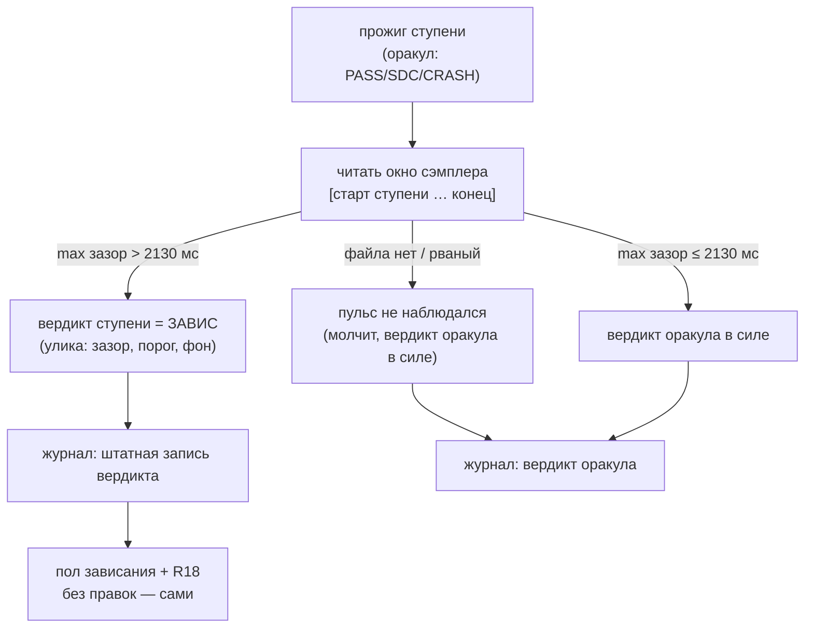

# Bug 61 — пульс УВИДЕЛ край, а права сказать об этом у него нет: спуск пошёл ниже и убил машину

**Статус:** ✅ DONE 2026-08-29 09:5x (сессия 61) — все пять шагов плана исполнены и доказаны
мутациями; проводка живёт в `runRung` (движок), порог 2130 мс выведен правилом из полного архива,
фикстуры обоих смертельных прогонов закоммичены. Найден ВЛАДЕЛЬЦЕМ 2026-08-26 20:39, ГЛАЗАМИ.
**Версия:** `main` @ `d0782d1` · **Где:** `engine.mjs` (вердикт ступени), `stress-tester.decideVerdict`
**Цена дефекта:** одна смерть машины владельца, которой можно было избежать.

---

## Слово владельца

> *«есть подозрение, что это зависание можно было предсказать и избежать — я глазами на мониторе на
> 840 видел сильный лаг, на 835 можно было не спускаться — и избежать смерти машины»*

И, увидев объяснение проекта, он отверг само его основание:

> *«"ВЕРДИКТА ЭТО ПОКА НЕ ДАЁТ И ПРОГОН НЕ ОСТАНАВЛИВАЕТ" — ложь и пиздеж. Это даёт вердикт о том,
> что край найден»*

**Он прав, и разбор ниже показывает, в чём именно.**

## Симптом — замерено, а не восстановлено по памяти

Живой прогон 2026-08-26 20:38…20:39, частота 2775 МГц, спуск по напряжению.

| ступень | сверх обещания | максимум интервала | вердикт оракула | что было дальше |
|---|---|---|---|---|
| 860 мВ | 0,05 с | 1011 мс | PASS | спуск |
| 850 мВ | 0,07 с | 1026 мс | PASS | спуск |
| 845 мВ | 0,03 с | 1008 мс | PASS | спуск |
| **840 мВ** | **2,10 с** | **3042 мс** | **PASS** | 🔴 **спуск ПРОДОЛЖЕН** |
| 835 мВ | 1,95 с | 2830 мс | — | 🔴 **смерть машины** |

**На 840 мВ сэмплер телеметрии — ОТДЕЛЬНЫЙ процесс, прожигом не заблокированный — не получал такт
3,04 секунды.** Владелец видел этот же ступор на экране. Оракул сказал PASS.

## Причина — механизма нет в вердикте ВООБЩЕ. Сверено по коду

Не «сработал плохо», не «порог не подошёл» — **пульс во время прогона не спрашивается ни разу**:

- `engine.mjs` не импортирует ни `pulseIntervals`, ни `readPulseFile`. Единственное упоминание
  пульса — строка, которая ПЕРЕКЛАДЫВАЕТ файл прошлого прогона в архив перед стартом.
- `decideVerdict({ bursts, golden, stamp, faults })` — в подписи нет входа для пульса.
- Пульс читают ровно два файла: сам сэмплер (`hardware-mon.mjs`) и `tools/pulse-report.mjs` —
  отчёт, который человек запускает ПОСЛЕ прогона, по архиву.

Сэмплер во время прогона просто пишет в файл. **Пока прогон идёт, этот файл не читает никто.**

Три наблюдения R4, на которых стоит вердикт — сумма против эталона, журнал событий Windows, работа
в секунду — **смотрят на НАШУ работу**. Умирала система.

## 🔴 КОРЕНЬ — ПОДМЕНА В ОБОСНОВАНИИ, И ЕЁ НАЗВАЛ ВЛАДЕЛЕЦ

Внутренняя карта проекта (`R4a-pulse`) объявляет: *«ВЕРДИКТА ЭТО ПОКА НЕ ДАЁТ И ПРОГОН НЕ
ОСТАНАВЛИВАЕТ: порог нельзя вывести из n = 1»* (`ideas/10` §5.1).

**В одном предложении склеены две РАЗНЫЕ задачи, и «n = 1» относится только к первой:**

| задача | нужна ли статистика |
|---|---|
| выбрать ТОЧНЫЙ порог (0,5 с? 1,5 с?) | **да** — из одной точки не выводится |
| признать, что трёхсекундный ступор системы ЕСТЬ отказ | **нет** — это наблюдение, а не оценка |

Второе не требует ни одной дополнительной точки. Сэмплер — отдельный процесс; три секунды без такта
означают, что **встала система**, а `ЗАВИС` в этом проекте — вердикт ПЕРВОГО класса наравне с `SDC`
и `CRASH`, по слову самого владельца (`GOAL.md` → «⚠️ ЗАВИСАНИЕ — ОСОЗНАННЫЙ РИСК»). И его же
определение края: *«напряжение, при котором карта на данной частоте вот-вот начинает уже сбоить,
или сбоит и зависает комп»*. **Трёхсекундный ступор — это ровно «вот-вот начинает».**

Осторожность в первой задаче была использована как основание ничего не делать во второй. Это и есть
дефект; цена — смерть машины 2026-08-26 20:39.

## Второй корень, помельче: осторожность была ВЕРНОЙ, но её условие уже выполнено

Опасение `bugs/27` («тревога, врущая по расписанию, отменяет сама себя») законно. Но данных, чтобы
его снять, теперь хватает — и запас чудовищный:

| | максимум интервала |
|---|---|
| **фон**: все безопасные ступени трёх прогонов | **1008…1053 мс** |
| предвестник 2026-08-23 (2797 МГц) | **4490 мс** |
| предвестник 2026-08-26 (2775 МГц) | **3042 мс** |

Между фоном и предвестником — **почти троекратный зазор без единого промежуточного случая.** Порог
где угодно в 1,5…2,5 с не может дать ложного срабатывания на имеющихся данных, потому что там
попросту нет точек.

Ворота, названные проектом заранее — «≥ 3 архивных прогона, из них ≥ 1 без смерти машины» —
**ЗАКРЫТЫ 2026-08-26**: три прогона в `runs/telemetry/`, и прогон 20:30 прошёл без смерти машины.

## Граница, которую замер провёл честно

Пульс слеп к **мгновенной** смерти: прогон 2026-08-26 20:18 (2790 МГц / 840 мВ) убил машину при
пульсе 0,03 с — сэмплер исчез вместе с системой, не успев опоздать. Разбор — `ideas/10`,
раздел «ИЗМЕРЕННОЕ ОПРОВЕРЖЕНИЕ».

**Это НЕ довод против остановки по пульсу.** Инструмент, ловящий два случая из трёх, лучше
инструмента, не ловящего ни одного; а два пойманных — это как раз те, где владелец своими глазами
видел предвестника. Режим удушения и режим мгновенной смерти различил сам владелец ещё 2026-08-23:
*«в этот раз комп умирал ПОСТЕПЕННО — были микролаги»*.

## План починки

1. **Пульс становится входом ступени.** Сэмплер уже пишет файл; ступень читает СВОЁ окно этого
   файла после прожига — ровно как `queryFaults` читает своё окно журнала Windows. Никакого нового
   процесса и никакой новой записи в карту.
2. **Порог выводится ИЗ АРХИВА, а не назначается**, и его вывод — отдельный проверяемый шаг:
   он обязан покраснеть на обоих смертельных прогонах и промолчать на всём прогоне 20:30.
3. **Исход — вердикт `ЗАВИС`** (существующий, первого класса), а не новый. Пол зависания и закрытие
   краем (R18) заработают без единой правки: они уже умеют обращаться с этим вердиктом.
4. **Сторож рождается вместе с правкой** и доказывается красным на записанных файлах обоих
   смертельных прогонов ДО того, как ему поверят.
5. **`R4a-pulse` во внутренней карте переписывается** — строка «вердикта не даёт» становится
   историей с датой, а не действующим правилом.

⚠️ **Чего план НЕ делает:** не трогает три наблюдения R4 (они остаются), не выдумывает порог до
шага 2, не расширяет словарь вердиктов.

## ✅ ШАГ 2 ПЛАНА ИСПОЛНЕН 2026-08-29 09:5x (сессия 61) — ПОРОГ ВЫВЕДЕН ИЗ АРХИВА, НЕ НАЗНАЧЕН

Одноразовый скрипт чтения по ВСЕМ 20 архивным прогонам `runs/telemetry/` (зазоры между пробами
сэмплера; рваные хвосты мёртвых машин — норма разбора):

| класс | прогонов | максимум зазора |
|---|---|---|
| фон (без смерти машины) | **18** | **1022…1065 мс** |
| смерть 2026-08-23 11:50 (2797 МГц — тот самый, хвост 4490 мс в фикстуре) | 1 | **3366 мс** (2 зазора > 1500) |
| смерть 2026-08-26 20:38 (2775 МГц, этот тикет) | 1 | **3042 мс** (2 зазора > 1500) |

**Пустая зона 1065…3042 мс подтверждена на ПОЛНОМ архиве** (тикет писал её по трём прогонам —
теперь по двадцати; ни одной промежуточной точки).

**Правило вывода — «ДВОЙНОЙ МАКСИМУМ ФОНА», а не число:** порог = 2 × max(фоновых зазоров) =
**2 × 1065 = 2130 мс.** Правило одностороннее — от фона, не от предвестников, — то есть его нельзя
обвинить в подгонке под две смерти; на новой карте/машине оно перевыводится из её же фона (та же
форма, что `MARGIN_STEPS_ABOVE_LAST_STABLE` и `DERIVED_ARM_N_MS`).

**Проверка требования тикета:** порог 2130 мс КРАСЕН на обоих смертельных прогонах (3042 и 3366 —
запас 43 %) и МОЛЧИТ на всех 18 фоновых (максимум 1065 — запас 100 %). Ложных срабатываний на
имеющихся данных — ноль по построению.

**Что осталось (шаги 1, 3–4 плана, следующая офлайн-сессия):** проводка пульса входом ступени
(окно файла сэмплера после прожига, как `queryFaults` — окно журнала) · исход `ЗАВИС` существующим
вердиктом (пол зависания и R18 заработают сами) · сторож, доказанный красным на записях обоих
смертельных прогонов ДО доверия. Шаг 5 (переписать `R4a-pulse`) уже исполнен сессией 60
(`bugs/62` п. 1). ⚠️ Замечание к границе: реальное время с 28.08 держит предохранитель (N=60 мс
по ударам пробы NVML) — эта починка добавляет ВЕРДИКТ ступени и запись края, глубина обороны, а
не первый рубеж.

## 📋 ОПЕРПЛАН ПРОВОДКИ (шаги 1, 3–4; написан сессией 61, исполняет следующая офлайн-сессия)

**Вектор цели (Achieve).** Боль: ступень с трёхсекундным ступором системы получает PASS, спуск
идёт ниже и убивает машину. Куда хотим: ступор сэмплера в окне ступени = вердикт `ЗАВИС` этой
ступени, записанный штатной дорогой (пол зависания и R18 работают сами).

**Критерии приёмки:**
- **AC1.** Прогон записей обоих смертельных прогонов (фикстуры) через новый разбор даёт `ЗАВИС`
  ровно на ступенях с зазором > 2130 мс; весь здоровый прогон 20:30 и фоновая фикстура — ни
  одного (Scale: вердиктов ЗАВИС · Meter: блоки самопроверки на закоммиченных фикстурах ·
  Target: 2/2 смертельных красны, 0 ложных).
- **AC2.** Вердикт едет в журнал ступени той же формой, что и прочие; «два зависания подряд»
  (R15) и пол зависания (R18) видят его без единой правки — доказано блоком, не прочтением.
- **AC3.** Отсутствие файла сэмплера / рваная строка = «пульс не наблюдался», НЕ отказ — прибор
  без данных молчит, а не голосует (класс R4b: ok / no-data / error различены).
- **AC4.** Мутации: (а) снять чтение окна → блок AC1 красный; (б) порог 2130 → 5000 → смертельные
  зеленеют, блок красный; (в) вердикт ЗАВИС → ОТКАЗ → блок AC2 красный.

**Шаги:**
1. Выдержки обоих смертельных прогонов и одного фонового — в `benches/fixtures/` (закоммичены;
   `runs/telemetry/` не в репозитории — фикстуры обязаны пережить любую машину).
2. `PULSE_STALL_MS = 2130` в `config.mjs` с происхождением (правило «2 × максимум фона», этот
   тикет) — константа с выводом, форма `DERIVED_ARM_N_MS`.
3. Чтение окна [начало ступени, конец ступени] файла сэмплера — функцией рядом с `pulseIntervals`
   (`tools/pulse-report.mjs` уже умеет интервалы — переиспользовать, не дублировать; DRY).
4. Проводка в `engine.runRung` ПОСЛЕ прожига, ДО записи вердикта в журнал: ступор в окне →
   вердикт ступени `ЗАВИС` (существующий, первого класса), причина в улику дословно
   («пульс сэмплера: зазор N мс > порога 2130 при фоне ≤ 1065»).
5. Блоки AC1–AC3 в `engine --selftest` (или `pulse --selftest` — где швы ближе), мутации AC4.

**Риски:** (а) второй источник ЗАВИС рядом с выведенным из журнала (R15) — не конфликт: R15
закрывает намерение БЕЗ вердикта, здесь вердикт ЕСТЬ и намерение закрывается штатно; названо,
блоком AC2 доказано · (б) сэмплер запаздывает записью — окно брать по штампам ПРОБ, не по часам
ступени впритык (допуск один тик) · (в) тревога по расписанию (`bugs/27`) — порог из пустой зоны
с запасом 43 %/100 %, ложных на всём архиве ноль по построению.

**Цена: ~половина офлайн-вечера.** Живая карта не нужна.

## ✅ STATUS: DONE (2026-08-29 09:5x) — проводка исполнена по оперплану выше, той же сессией

1. **Шов:** `runRung` получил `pulseWindowFn` (необязателен — офлайн-фикстуры и двойник без него);
   окно открывается ДО первого байта в карту, читается ПОСЛЕ прожигов, перед вердиктом (секция 8c).
   Ступор (`maxGapMs > config.PULSE_STALL_MS = 2130`) = вердикт `ЗАВИС`, исход `hung` — **пол
   зависания и тормоз «двух подряд» видят его БЕЗ правок** (`hangFloors` читает закрытые вердикты
   этим исходом; доказано блоком, мутация DD красит ровно его). Прибор без данных МОЛЧИТ (R4b).
2. **Чтение окна:** `hardware-mon.maxSampleGapMs(path, {fromMs, toMs})` — по штампам проб с
   допуском один тик (риск (б) оперплана); рваные строки — норма (`bugs/37`).
3. **Проводка:** одна воронка развёртки (`sweepRange` → `runRungFn` → каждая ступень полосы:
   затравка, спуск, уточнение); живой путь кормит из `dash.TELEMETRY_PATH`, двойник — `null` (E6).
   Примечание границы: `searchEdge` (старый одноточечный поиск) шов не получил — он не путь
   развёртки; при возврате к нему провести тем же параметром.
4. **Доказано:** 5 новых блоков в `engine --selftest` (370→375), фикстуры обоих смертельных
   прогонов + фоновая в `benches/fixtures/pulse-windows/` (AC1 на ЗАПИСЯХ, не синтетике); мутации
   DA (шов снят) · DB (порог 5000) · DD (исход failed) — каждая красит названных адресатов,
   откаты зелёные. Батарея 33/1507/0. Шаг 5 (переписать `R4a-pulse`) был исполнен сессией 60;
   строка обновлена этой сессией ещё раз — «проводка стоит», не «открытый bugs/61».
5. **Чего проводка НЕ отменяет:** предохранитель (N=60 мс) остаётся первым рубежом реального
   времени; три наблюдения R4 целы; словарь вердиктов не расширен.

## Решения, принятые без владельца

- Правило вывода порога (двойной максимум фона, 2130 мс) — по прецеденту его же решений о
  выведенных константах.
- Проводка легла в `runRung` (движок), а не в `decideVerdict` (оракул): ступор — наблюдение о
  СИСТЕМЕ вокруг прожига, а не о работе; оракул судит работу (I2), движок компонует наблюдения
  (R16a). Форма — ровно как `queryFaults` (журнал Windows) в тикете.

## Ссылки

`ideas/10` (пульс как четвёртое наблюдение, и опровержение по мгновенной смерти) ·
`plans/51` (эпик предсказания) · `PROJECT_ARCHITECTURE_INTERNAL_MAP.md` → R4, R4a-pulse, R15, R18 ·
`bugs/27` (тревога, врущая по расписанию) · `GOAL.md` → «🏁 КРИТЕРИЙ ПРИЁМКИ ТЮНИНГА», «⚠️ ЗАВИСАНИЕ
— ОСОЗНАННЫЙ РИСК» · архивы `runs/telemetry/20260826-201745.jsonl`, `20260826-203043.jsonl`
