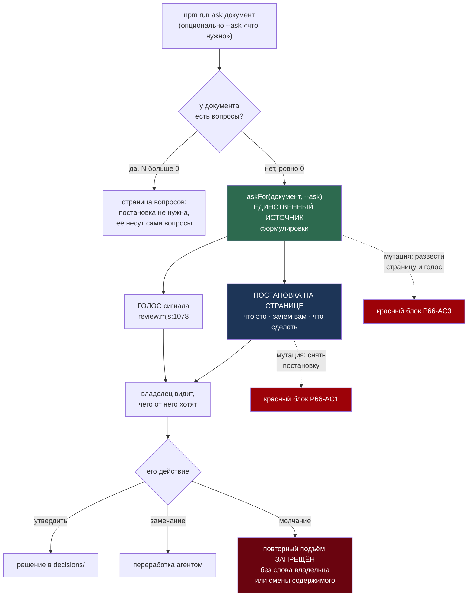

# Bug 66 — страница контура не говорит владельцу, ЧТО от него нужно; агент поднял её повторно без его сигнала

**Статус:** ✅ ЗАКРЫТ 2026-08-29 (сессия 65) — постановка на странице, сторожа N1-N3 доказаны красным.
**Версия:** `main` @ `28e25bc` · **Где:** `tools/review.mjs` (страница документа без вопросов) ·
поведение агента (повторный подъём).
**Класс:** экономия на том, что владелец видит (граница молитвы) — родня `bugs/65`.

## Слово владельца — оба раза через сам контур

> **09:34:** *«Что от меня нужно?»*
> **09:51 (на повторном подъёме):** *«Зачем показываешь мне это? Что хочешь?»*

## Симптом

Контур согласований поднят для `ЗАКАЗ.md` — документа БЕЗ вопросов (`вопросов 0`). Страница
показывает текст и поле комментария, но НЕ говорит: что это, зачем ему это показали и какое
действие закрывает вычитку (утвердить / оставить замечание). Владелец дважды спросил ровно это.

## Две причины, и они разные

1. **Дефект инструмента:** маршрут «документ без вопросов» строился для вычитки, где сама
   страница объясняется вопросами. Без них у страницы нет шапки-постановки: «Агент просит:
   УТВЕРДИТЬ этот документ (кнопка) или оставить замечание — тогда переработка. Что это и
   почему — одной строкой» (текст даёт вызывающий, `npm run ask` — параметром/шапкой документа).
2. **Дефект поведения агента (этой сессии):** после первого «Что от меня нужно?» агент ответил в
   чате И ТУТ ЖЕ поднял окно снова, не дождавшись реакции. Повторный подъём того же документа
   без нового сигнала владельца — не «терпение машины», а дёрганье человека. Правило:
   **повторный подъём контура — только по слову владельца** («подними ещё раз», «утверждаю»,
   ответ на вопрос из чата), либо при СМЕНЕ содержимого страницы.

## Repro

`npm run ask <любой .md без секции вопросов>` → страница не содержит ни одной строки о том,
какое действие ожидается.

## План починки (цена ~полвечера; НЕ начата — мораторий на неё не распространяется? НЕТ:
это правка СУЩЕСТВУЮЩЕГО контура согласований, не новый контур)

1. Шапка-постановка на странице документа без вопросов: «что это · зачем вам · что сделать»
   (кнопка «УТВЕРДИТЬ» + поле замечания уже есть — их назвать в шапке).
2. Текст постановки передаёт вызывающий (`npm run ask ЗАКАЗ.md --ask "…"`), без него —
   честная общая формула.
3. Правило поведения (п. 2 выше) — в `interviews/README` или канон контура.
4. Сторож: `review --selftest` блок «страница без вопросов несёт постановку».

## Решения, принятые без владельца

- Заведён тикет вместо немедленной починки: до 10:30 — граница защищённого цикла, резать
  контур в спешке значило бы повторить класс `bugs/65` (полусделанное на витрине).

## Ссылки

`bugs/65` (класс: экономия на видимом) · `bugs/64` (соседний дефект контура) · `plans/53` шаг 4
(повод) · `decisions/ЗАКАЗ.decision.json` (оба комментария записаны контуром).

---

# План починки — оперативный (2026-08-29)

> Тест тяжести (`AGENT_GUIDE.md` → Planning discipline): подсистем — одна (`tools/review.mjs` и его
> набор сторожей), внешней истины нет, в сессию помещается, поставку наружу не меняет, развилки
> владельцу нет — **1 признак из пяти, задача ОБЫЧНАЯ**. Один оперплан, без лестницы.

## Вектор цели

**Боль.** Контур поднят, окно открылось, владелец смотрит на страницу и спрашивает вслух: *«Что от
меня нужно?»* Страница показывает текст, три пилюли со счётом «всего вопросов 0» и поле
комментария — и ни одной строки о том, ЧТО она от него хочет. Счёт нулями — не постановка, а отчёт
о её отсутствии.

**Улика, найденная при планировании, и она меняет суть починки.** Нужная формулировка В КОДЕ УЖЕ
ЕСТЬ — но только в ГОЛОСЕ: `review.mjs:1078` произносит *«Вопросов без ответа нет, нужна ваша
вычитка»*. То есть контур ЗНАЕТ, чего хочет от владельца, и говорит это вслух — а на странице, куда
владелец смотрит, молчит. **Значит работа не «написать текст», а СВЕСТИ ДВА ВЫХОДА К ОДНОМУ
ИСТОЧНИКУ.** Второй написанный текст был бы новой парой, которую пришлось бы сторожить
(`AGENT_GUIDE.md` → реестр пар: пару лучше УБРАТЬ, чем за ней следить).

**Куда хотим.** Страница документа без вопросов открывается постановкой: что это · зачем это вам ·
что сделать, чтобы закрыть. Текст даёт вызывающий агент, а без него — честная общая формула. Голос
и страница произносят ОДНО И ТО ЖЕ, потому что берут из одной функции.

**Тип цели:** Achieve (постановка на странице) + Avoid (не завести пару «голос ↔ страница»,
которая разойдётся).

## Критерии приёмки — счётные

- **P66-AC1 — страница без вопросов несёт постановку.** *Шкала:* блок постановки в HTML.
  *Прибор:* блок в `tools/verify-review-contour.mjs`. *Цель:* рендер документа с нулём вопросов
  содержит все ТРИ части (что это · зачем вам · что сделать), и мутация, снявшая постановку,
  краснит **ровно этот блок и только его**.
- **P66-AC2 — текст постановки даёт вызывающий.** *Шкала:* два рендера одного документа.
  *Прибор:* блок сравнения. *Цель:* `--ask "…"` кладёт свой текст; без флага страница несёт общую
  формулу — не пустоту и не выдумку.
- **P66-AC3 — голос и страница из ОДНОГО источника.** *Шкала:* число мест, где написана
  формулировка. *Прибор:* блок, который берёт строку страницы и строку голоса и требует
  совпадения; мутация, разведшая их, краснит. *Цель:* 1 — пара невозможна по построению.
- **P66-AC4 — правило поведения записано в канон.** *Шкала:* наличие правила. *Прибор:* чтение
  `interviews/README.md`. *Цель:* «повторный подъём контура — только по слову владельца либо при
  СМЕНЕ содержимого страницы» стоит текстом (это причина №2 из тикета).
- **P66-AC5 — контур не сломан.** *Прибор:* `npm run verify:contour` и `npm run selftest:all`.
  *Цель:* ноль красных, число блоков контура выросло ровно на новые.

## Механизм — как это устроено после починки

## Шаги

- [x] **1. Вынести формулировку в одну функцию `askFor(doc, askText)`** — она возвращает три части
      постановки. Голос (`review.mjs:1078`) начинает звать её вместо своей строки. **Пара
      УБИРАЕТСЯ, а не заводится** (`PHILOSOPHY.md` → DRY).
- [x] **2. Постановка на странице документа без вопросов** — блок в шапке, до текста документа:
      что это · зачем вам · что сделать. Пилюли со счётом при нуле вопросов не показывать: счёт
      нулями сообщает об отсутствии вопросов, а не о деле.
- [x] **3. Флаг `--ask "…"`** кладёт текст вызывающего; без флага — общая формула из `askFor`.
- [x] **4. Сторожа в `tools/verify-review-contour.mjs`** — по одному на AC1, AC2, AC3.
      **Адресность мутаций объявляется ДО прогона** (канон судьи): мутант «снять постановку» →
      краснеет ровно блок AC1; мутант «развести страницу и голос» → ровно AC3; на целом коде — ноль
      красных.
- [x] **5. Правило повторного подъёма — в `interviews/README.md`** (P66-AC4).
- [x] **6. Ворота:** `npm run verify:contour` и `npm run selftest:all` зелёные; рендер
      `--no-serve --no-open` прочитать ГЛАЗАМИ — это текст, который увидит владелец, а на видимом
      владельцу агент не экономит (граница молитвы).

## Проверка наблюдением (не «должно работать»)

| что утверждаем | чем смотрим | где живёт |
|---|---|---|
| страница без вопросов несёт постановку | блок AC1 и мутация | `tools/verify-review-contour.mjs` |
| текст даёт вызывающий, без него — формула | блок AC2, два рендера | там же |
| голос и страница не могут разойтись | блок AC3 и мутация | там же |
| правило повторного подъёма записано | чтение файла | `interviews/README.md` |
| контур цел | `npm run verify:contour`, `npm run selftest:all` | батарея |
| текст читается человеком | рендер `--no-serve --no-open`, глаза агента, затем вычитка владельца | `homeworks/05` |

## Риски (Мёрфи, по ярусам)

1. **🔴 Агент сочинит владельцу текст, который тот не признает своим.** Это ровно тот класс, за
   который заведены `bugs/65` и этот тикет. *Реакция:* общая формула отвечает НА ЕГО ЖЕ ВОПРОС
   дословно («Что от меня нужно?») и держится трёх фактов, без украшений; окончательный вердикт —
   его вычитка, а не мой вкус (`TESTING_FRAMEWORK.md` → класс вкуса судит владелец).
2. **🟠 Сторож докажет СТРОКУ, а не смысл.** Блок, сверяющий подстроку, зазеленеет на чужом тексте.
   *Реакция:* блок AC3 сверяет ДВА ВЫХОДА МЕЖДУ СОБОЙ, а не с константой — тогда он ловит
   расхождение, а не написание.
3. **🟡 Постановка полезет на страницы с вопросами и станет шумом.** *Реакция:* маршрут строго
   один — ноль вопросов; на странице с вопросами постановку несут сами вопросы (ветка «да» схемы).

## Решения, принятые без владельца

| # | решение | почему так, и чем отменить |
|---|---|---|
| 1 | **Общая формула постановки написана агентом**, а не спрошена у владельца | Ждать его слова означало оставить страницу немой ещё на сессию — а немая страница и есть дефект. Формула отвечает на ЕГО ЖЕ вопрос дословно и держится трёх фактов без украшений. **Вердикт «мой это язык или нет» остаётся за ним** — заведено в очередь вычитки |
| 2 | **Пилюли со счётом при нуле вопросов УБРАНЫ, а не оставлены рядом** | «всего вопросов 0» сообщает об отсутствии просьбы человеку, который пришёл узнать просьбу. Два сообщения об одном месте спорят между собой. Отменяется одной строкой в `buildPage` |
| 3 | **Постановка показывается ТОЛЬКО на маршруте «ноль вопросов»** | На странице с вопросами её несут сами вопросы; лишний блок стал бы шумом (риск 3 плана). Отменяется снятием условия `totalQ === 0` |
| 4 | **Голос переведён на `askFor`, то есть его формулировка ИЗМЕНИЛАСЬ** | Прежняя строка голоса была второй редакцией того же смысла. Сохранить её значило оставить пару, ради устранения которой всё и делалось. Прежний текст восстановим из истории |

## ✅ СТАТУС: ЗАКРЫТ (2026-08-29, сессия 65)

**Что сделано.** Формулировка «чего агент хочет от владельца» сведена в одну функцию `askFor` в
`tools/review.mjs`; из неё теперь кормятся ОБА выхода — блок постановки на странице и голос
сигнала. Документ без вопросов открывается тремя строками: что это · зачем это вам · что закрывает
дело. Текст даёт вызывающий флагом `--ask`, без него стоит общая формула. Правило «повторный
подъём — только по слову владельца либо при смене содержимого» записано в `interviews/README.md`.

**Чем проверено — красным, а не зелёным.** Три сторожа в `tools/verify-review-contour.mjs`
(N1 постановка · N2 текст вызывающего · N3 страница и голос из одного источника); контур
**19 → 22 блока**, батарея **40 наборов / 1659 / 0**.

**Мутации — адресность объявлялась ДО прогона, и одно предсказание прогон опроверг:**

| мутант | предсказано | получилось |
|---|---|---|
| снять блок постановки со страницы | красные N1 и N3 | 🔴 **N1, N2 И N3** — предсказание было УЖЕ факта: без блока `--ask` тоже некуда лечь. Записано как есть, не подогнано |
| голос пишет собственную формулировку | ровно N3 | ✅ ровно N3 |
| `--ask` молча игнорируется | ровно N2 | ✅ ровно N2 |
| целый код (откат копией) | ноль красных | ✅ ноль |

**Что увидит владелец** (рендер `--no-serve`, прочитан глазами агента):

> **АГЕНТ ПРОСИТ ВАС**
> **Вычитка: ЗАКАЗ — действующие определения проекта KAGO**
> Вопросов в документе нет — агент просит вашу вычитку: согласны ли вы с текстом.
> Согласны — напишите это одной строкой в поле внизу; не согласны — оставьте замечание, и агент переработает. Достаточно одного комментария.

**Что НЕ закрыто этим тикетом.** Вердикт «это мой язык» выносит владелец, а не агент
(`TESTING_FRAMEWORK.md` → класс вкуса). До его вычитки формула — рабочая, а не принятая.
