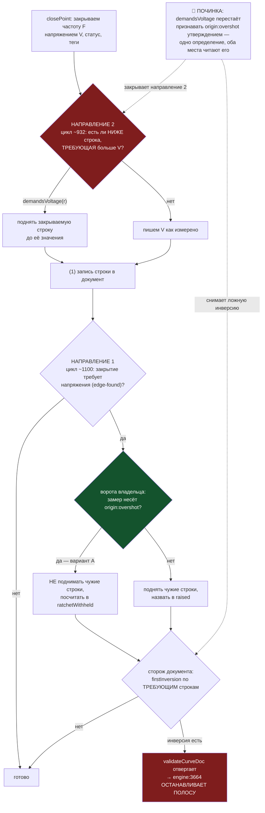

# Bug 72 — ворота промаха закрыли ОДНО направление храповика, а на втором сделали документ невалидным и останавливают полосу

**Статус:** ✅ **ЗАКРЫТ 2026-08-30 13:1x** — обе половины, шесть критериев взяты, мутации EH · EJ · EK
краснят каждая свои блоки. Заведён 2026-08-30 13:0x агентом при подготовке ремонта строк `bugs/63`.
**Версия:** `main` @ `47c5b05` · **Где:** `curve-store.demandsVoltage` · `curve-store.closePoint`
(два цикла храповика) · `curve-store.firstInversion` · проводка `engine.mjs:3664`.
**Класс:** сторож, ставший стеной — тот же, что R12 · R13 · R17 и [[EXP-0193]], сутки спустя.
**Срочность:** 🔴 **БЛОКЕР БЛИЖАЙШЕГО ЖИВОГО ПРОГОНА** — вечернего. Это named-исключение моратория
интервью 017 Q1 («новых контуров не открываем, кроме блокера ближайшего живого прогона»).

---

## Вектор цели

**Тип: Avoid.** Боль: вчерашняя починка `bugs/63` (вариант A владельца) на живой полосе либо
**останавливает прогон**, либо **пропускает ту же кражу 45 мВ через второе направление**. Куда
хотим: решение владельца («промахнувшийся замер не двигает чужие строки») действует на ОБА
направления храповика и не отвергает собственный документ.

### Критерии приёмки

| # | Критерий | Мера · Прибор · Цель |
|---|---|---|
| П72-AC1 | Закрытие с промахом не оставляет документ невалидным | Шкала: отказов `validateCurveDoc` · Прибор: блок набора на ТРЕБУЮЩЕЙ удерживаемой строке · Цель: **0** |
| П72-AC2 | Промахнувшаяся нижняя соседка не поднимает ЗАКРЫВАЕМУЮ строку | Шкала: мВ в документе · Прибор: блок набора (заказ 850 при соседке-промахе 895) · Цель: **850** |
| П72-AC3 | Чистый замер поднимает как поднимал — ворота не стали стеной | Шкала: `raised.length` · Прибор: контрольный блок · Цель: **1** |
| П72-AC4 | Каждый новый блок покраснел на сломанной версии | Шкала: красных блоков на мутацию · Прибор: мутации · Цель: **≥1 на каждый** |
| П72-AC5 | Строка доставки не сдвинулась от правки предиката | Шкала: `краёв X/389` · Прибор: `npm run curve -- --progress` до и после · Цель: **11/389 без изменений** |
| П72-AC6 | Батарея цела | Шкала: наборов / блоков / красных · Прибор: `npm run selftest:all` · Цель: **красных 0** |

---

## Симптом — замерено пробами, не прочитано

Два цикла храповика внутри `closePoint`, и решение владельца стоит только на одном.

### Направление 1 — закрываемая строка поднимает ЧУЖИЕ строки выше (`curve-store.mjs` ~1100)

Ворота варианта A стоят здесь. Они работают: подъём удерживается, удержание называется полем
`ratchetWithheld`. **Но удержанная строка остаётся ТРЕБУЮЩЕЙ, и документ становится
противоречивым — а собственный сторож документа противоречие отвергает.**

Проба на чистой фикстуре (посторонних отказов ноль, чтобы находка не была спорной):

| закрытие 2700 МГц на 895 мВ | `raised` | `firstInversion` | отказов `validateCurveDoc` |
|---|---|---|---|
| чистый замер | 1 (2800 МГц 850→895) | `null` | **0** |
| **тот же замер с `origin:overshot`** | 0, удержано 1 | **`{at:1, loAt:2}`** | 🔴 **1** |

Единственный отказ — ровно монотонность:

> `frequencies[2].voltageMv — 2700 МГц требует 895 мВ, а более ВЫСОКАЯ 2800 МГц — только 850 мВ.`

**Что делает с этим проводка.** `engine.mjs:3664` после каждого `closePoint` зовёт
`validateCurveDoc(closed.doc)` и на ЛЮБОМ отказе ставит `report.ok = false`,
`stoppedBy: 'document'` и **`break`** — полоса встаёт, документ на диск не едет. То есть 26 августа
эта же починка не отобрала бы 45 мВ, а **остановила бы прогон на первой же промахнувшейся ступени**.

### Направление 2 — НИЖНЯЯ соседка поднимает ЗАКРЫВАЕМУЮ строку (`curve-store.mjs` ~932)

Ворот здесь нет вовсе. Проба: 2700 МГц уже стоит на 895 мВ с тегом `origin:overshot`, закрываем
2800 МГц честными измеренными 850 мВ.

| нижняя соседка | заказывали записать | **в документе оказалось** |
|---|---|---|
| `origin:overshot` (промах) | 850 мВ | 🔴 **895 мВ**, тег `origin:ratcheted` |
| контроль: без промаха | 850 мВ | 895 мВ — и это ЗАКОННО |

**Обе строки таблицы одинаковы — значит ворота этого направления не видят вовсе.** Кража 45 мВ,
ради отмены которой владелец принимал решение, проходит здесь целиком, и на СВЕЖЕМ честном замере.

### Побочно найденное (отдельной строкой, не смешивать)

Сводка `why` печатает `2800 МГц закрыта: 850 мВ`, когда в документ ушло **895**: строка собирается
из ЗАКАЗАННОГО `voltageMv`, а не из записанного `effectiveMv` (`curve-store.mjs:1151`). Подъём
ЧУЖИХ строк в сводке называется, подъём САМОЙ закрываемой — нет. Семья `bugs/46` («печатался не тот
шаг»). Лечится одной строкой в этом же заходе.

## Почему набор этого не увидел — причина механическая, а не небрежность

Фикстура ворот (`curve-store.mjs:1820`, блоки EE · EF · EG) даёт удерживаемой строке
`frequencies[3]` теги `[stop:lever-limited, origin:measured]`. А `demandsVoltage` для
`lever-limited` возвращает `false`, значит **в сверку инверсий эта строка не входит по построению** —
инверсия в фикстуре невозможна, каким бы ни был код. И ни один из пяти новых блоков не утверждает
`validateCurveDoc(overshot.doc).length === 0`, хотя соседний блок обычного храповика (строка 1674)
именно это и утверждает.

Это [[EXP-0193]] слово в слово, сутки спустя: **доказанное суждение при недоказанном следствии.**
Судья (ворота) проверен тремя мутациями; что документ после его работы ОСТАЁТСЯ документом — не
проверено ничем.

## Причина — одно понятие определено в двух местах

`demandsVoltage` — единственный в модуле ответ на вопрос «является ли напряжение этой строки
УТВЕРЖДЕНИЕМ О ПОТРЕБНОСТИ частоты». Его шапка уже исключает `origin:ratcheted` ровно этим доводом:
*«поднятая храповиком строка не требует ничего — она СЛЕДСТВИЕ, а не причина»*.

Довод владельца по варианту A дословно тот же, только про другой тег: промахнувшаяся строка честна
про СЕБЯ («частоту обслуживало 915 мВ, и это прошло прожиг») и **не говорит ничего о потребности
частоты** — это замер состояния карты в ту минуту.

Значит `origin:overshot` — это второй случай уже существующего понятия, а ворота 30 августа завели
ему ВТОРОЕ определение (`closeIsOvershot`) в одном из двух мест. Отсюда обе половины дефекта:
второе место (направление 2) о новом определении не знает, а сверка инверсий не знает, что
удержанная строка ничего не требует.

## План починки

**Мера — один предикат, а не второй сторож** (Оккам; DRY: одно понятие живёт в одном месте).

**Шаги.**

- [x] 1. `demandsVoltage` возвращает `false` для строки с `origin:overshot`; довод дописан в её
      шапку рядом с доводом про `origin:ratcheted` — одним и тем же аргументом, со ссылкой на
      `interviews/018` = A. Второго определения не заведено.
- [x] 2. Блок набора П72-AC1: удерживаемая строка — **`stop:edge-found`**, а не `lever-limited`, и
      блок утверждает `validateCurveDoc(...).length === 0`. Прежняя фикстура не тронута: она
      проверяет своё.
- [x] 3. Блок набора П72-AC2: нижняя соседка с промахом не поднимает закрываемую строку; контроль —
      та же соседка без промаха поднимает (П72-AC3).
- [x] 4. Сводка `why` называет ЗАПИСАННОЕ напряжение и подъём самой закрываемой строки (побочная
      находка).
- [x] 5. Мутации прогнаны из корня репозитория, каждая краснит свои блоки.
- [x] 6. `npm run curve -- --progress` до и после — строка доставки не двинулась (П72-AC5).
- [x] 7. `npm run selftest:all` — красных 0 (П72-AC6).

## ✅ Исполнено — числа прогонов, а не заявления

| критерий | мера | результат |
|---|---|---|
| П72-AC1 | отказов `validateCurveDoc` после удержания на ТРЕБУЮЩЕЙ строке | было **1** (монотонность) → стало **0**, `firstInversion` = `null` |
| П72-AC2 | мВ в документе при промахнувшейся нижней соседке | было **895** при заказе 850 → стало **850** |
| П72-AC3 | `raised` при ЧИСТОЙ нижней соседке | **1** (850 → 900, тег `origin:ratcheted`) — направление цело |
| П72-AC4 | мутации | **EH** 3 красных (AC1 · AC2 · сводка) · **EJ** 8 красных (AC3 + пять прежних блоков храповика и инверсий) · **EK** ровно 1 · целый код — **0** |
| П72-AC5 | строка доставки | `краёв 11/389 (прожигом 9 · соседкой 1 · выведено 0) · не тронуто 299 · режимов 0/4` — **до и после посимвольно одна** |
| П72-AC6 | батарея | **41 набор / 1685 зелёных / 0 красных**, 31,3 с (было 1681 — ровно четыре новых блока) · `curve` 85 → **89** |

**Мутация EJ важнее прочих.** Она проверяет, что предикат не превратился в стену: восемь красных
блоков — из них пять СТАРЫХ (сверка инверсий, подъём закрываемой строки, свидетель подъёма, отказ
«выше стока не поднимаем»). То есть исключение сделано узким и ничего не отключило заодно.

## Решения, принятые без владельца

- **Лечение поставлено в `demandsVoltage`, а не третьим сторожем.** Понятие «утверждение о
  потребности частоты» в модуле уже есть и уже исключает `origin:ratcheted` тем же доводом.
  Заводить второе определение значило бы завести пару «истина ↔ зеркало» внутри одного файла — тот
  самый класс, который и породил этот дефект. Отменяется одной строкой.
- **Ворота `closeIsOvershot` в направлении 1 ОСТАВЛЕНЫ, хотя Оккам спросил бы, не лишние ли они
  теперь.** Не лишние, и причина конкретна: они смотрят на теги ЗАКРЫВАЕМОГО замера, которого в
  документе ещё нет, — `demandsVoltage` его увидеть не может. И главное: именно они СЧИТАЮТ
  удержанные подъёмы в `ratchetWithheld`. Свернув их в предикат, проект потерял бы счётность долга
  монотонности, а это половина варианта A, которую владелец выбирал против варианта C.
- **Побочная находка про сводку починена в этом же заходе, а не отдельным тикетом.** Она в одной
  строке с правкой и в одном блоке набора; разводить их значило бы платить ceremony дороже работы.
- **Ремонт строк документа (`bugs/63`) НЕ делался здесь.** Разные половины: код и боевые данные,
  каждой нужна своя проверка.

**Чего этот тикет НЕ делает:** ремонт 15 (по описи — 16) строк документа за 26.08. Он остаётся за
`bugs/63` и делается ПОСЛЕ этой починки — потому что ремонт вернёт документ ровно в то состояние,
на котором направление 2 и ложная инверсия и срабатывают.

## Ссылки

`bugs/63` (ворота варианта A, чей хвост это) · `interviews/018` (решение владельца) ·
[[EXP-0193]] (доказанный судья при недоказанной проводке) · [[EXP-0147]] (перечисляй направления
механизма механически, а не по рассказу об инциденте) · `bugs/46` (печаталось не то число) ·
`PROJECT_ARCHITECTURE_INTERNAL_MAP.md` → R17.
