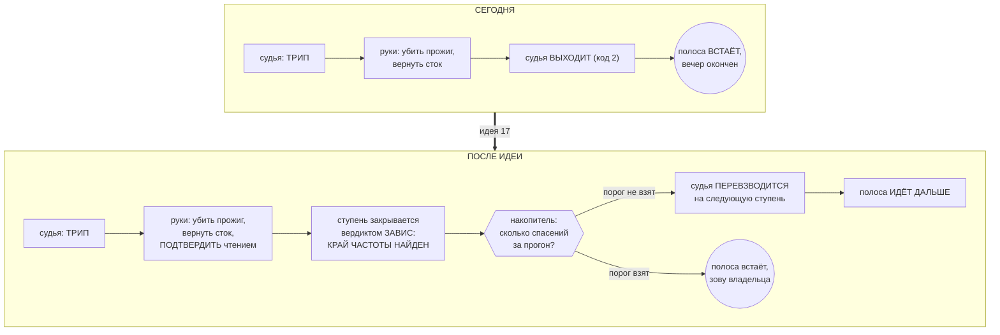

# Идея 17 — предохранитель спасает ВНУТРИ прогона: трип становится знанием о крае, а полоса идёт дальше

> **Создан:** 2026-08-31 08:3x +03:00 (записал агент по прямому слову владельца в чате, сразу после
> первого живого срабатывания предохранителя) · **Родитель:** `bugs/86` (случай, который это
> породил) · `plans/58` (фаза 5 эпика предохранителя) · **Статус:** ❓ ОЖИДАЕТ ОДОБРЕНИЯ ВЛАДЕЛЬЦА —
> не реализуется до его слова · **Вовне:** решение владельца; при одобрении — правка жизненного
> цикла судьи (`fuse.mjs`) и того, как развёртка читает его выход (`engine.sweepRange` → `stopWhen`)

---

## Слово владельца, дословно

> *«было бы хорошо, чтобы предохранители не останавливали прогон, а спасали комп от зависания в
> рамках прогона, чтобы это становилось знанием о том, что край найден, и чтобы прогон продолжался
> — это запрос на улучшение, запиши тикетом»*

---

## Боль — измерена в то же утро, а не предположена

Живой прогон 2026-08-31, полоса 2145…2000 МГц. Предохранитель сработал **впервые за жизнь проекта
на реальном пути** и отработал безупречно: руки вернули напряжение и подтвердили сток чтением
(остаточных смещений 0). После чего:

```
ОСТАНОВЛЕНО (fuse-rescue): ПОЛОСА ОСТАНОВЛЕНА ВНЕШНИМ СТОПОМ ПЕРЕД 2115 МГц
ПОКРЫТИЕ: закрыто 0 из 20 (0 %)
ВРЕМЯ: 143.3 с
```

**Двадцать частот, ноль закрытых, машина жива, карта чиста.** Спасение сработало — и стоило всего
вечера. При этом само событие («на 2145 МГц при 790 мВ машине стало плохо») — **это и есть тот
самый край, ради которого прогон существует**, и сегодня он не записан никуда, кроме журнала судьи.

## Почему сегодня так, и это не случайность

Устройство сложилось из двух верных по отдельности решений:

1. **Судья завершается после трипа** — «один трип кончает этого судью: ступень всё равно окончена,
   а второй трип сработал бы на трупе» (`fuse.mjs`);
2. **Прогон без предохранителя запрещён** (фаза 5 эпика 51), поэтому развёртка читает выход судьи
   как внешний стоп и встаёт перед следующей частотой.

Вместе они дают: **любое спасение = конец вечера.** Ни одно из двух решений не про это.

## Что предлагается — механизм



**Три части, и третья — та, без которой первые две опасны:**

1. **Судья переживает спасение и перевзводится.** Сегодня он выходит; надо, чтобы после отработки
   рук он сбросил своё состояние и продолжил судить следующую ступень.
2. **Трип доезжает до развёртки как ВЕРДИКТ СТУПЕНИ, а не как стоп полосы.** Вердикт `ЗАВИС`
   первого класса у проекта уже есть, и он уже закрывает частоту КРАЕМ (`bugs/23`, правило R18) —
   ровно то, что просит владелец словами «становилось знанием о том, что край найден». Новой
   сущности заводить не надо.
3. **Решение об остановке полосы принимает НАКОПИТЕЛЬ, а не отдельное спасение** (`bugs/80`,
   `bugs/84`). Это уже построено и работает: три предупреждения за прогон — полоса встаёт, два у
   самого стока — встаёт раньше. Спасения кладутся в тот же счёт своим родом.

## Риски, названные вслух

- **(а) Судья, переживший трип, может судить труп.** Комментарий, которым сегодня оправдан выход,
  верен для случая «машина уже умирает». **Смягчение:** перевзведение только после того, как рука 2
  ПОДТВЕРДИЛА сток чтением (сегодня она это делает и печатает «остаточных смещений 0»); не
  подтвердила — прежнее поведение, выход и остановка.
- **(б) Череда спасений подряд превратится в череду убитых прожигов.** **Смягчение:** пункт 3 —
  накопитель; плюс существующий тормоз «два зависания подряд на ОДНОЙ ступени» (единственная
  аварийная остановка, оставленная владельцем).
- **(в) Спасение станет дешёвым, и появится соблазн ходить глубже.** Это изменение ОЦЕНКИ события,
  а слово владельца прямо запрещает считать зависание нормальным (`GOAL.md` → «ЗАВИСАНИЕ — НЕ
  НОРМАЛЬНОЕ СОБЫТИЕ, А НАШ ПРОВАЛ»). **Смягчение:** число спасений за вечер остаётся показателем
  качества и печатается в сводке прогона отдельной строкой.

## Чем проверим, что сработало

| # | критерий | Шкала · Прибор · Порог |
|---|---|---|
| **I17-AC1** | Спасение не кончает прогон | Шкала: частот, закрытых после первого спасения · Прибор: прогон с подложенным трипом на двойнике · **Порог: > 0. Сегодня — 0 из 20** |
| **I17-AC2** | Спасение становится ЗНАНИЕМ | Шкала: строк документа кривой, закрытых краем по спасению · Прибор: журнал + документ · **Порог: 1 на каждое спасение. Сегодня — 0** |
| **I17-AC3** | Судья снова взведён к следующей ступени | Шкала: ступеней после спасения, прошедших без взведённого судьи · **Порог: 0** |
| **I17-AC4** | Неподтверждённый сток НЕ даёт продолжения | Шкала: продолжений полосы при неподтверждённом откате · **Порог: 0** (обе стороны доказать мутацией) |
| **I17-AC5** | Накопитель по-прежнему останавливает | Шкала: спасений подряд до остановки полосы · **Порог: тот же, что у предупреждений (3 за прогон, 2 у стока)** |
| **I17-AC6** | Ноль записей в GPU при разработке | Прибор: `watchdog --status` до и после · **Порог: 0** |

## Что эта идея НЕ трогает

- **Не делает предохранитель мягче.** Порог N не меняется, руки те же, порядок тот же.
- **Не отменяет правило «прогон без предохранителя запрещён».** Наоборот: сегодня после трипа
  прогон остаётся без судьи — идея это чинит, перевзводя его.
- **Не меняет вердикт `ЗАВИС`.** Он и сегодня первого класса и закрывает частоту краем.

## Связи

`bugs/86` (случай 31.08, который это породил) · `bugs/67` (спасение — происшествие, а не исход:
именно оттуда сегодняшний код стопа) · `bugs/23` + R18 (зависание закрывает частоту краем — готовый
механизм для пункта 2) · `bugs/80` и `bugs/84` (накопитель — готовый механизм для пункта 3) ·
`plans/58` фаза 5 · `fuse.mjs` (жизненный цикл судьи) · `GOAL.md` → «🚑 СПАСЕНИЕ ВМЕСТО
КОНСТАТАЦИИ» и «🏗 ЗДАНИЕ ВАЖНЕЕ ЛЕСОВ».
