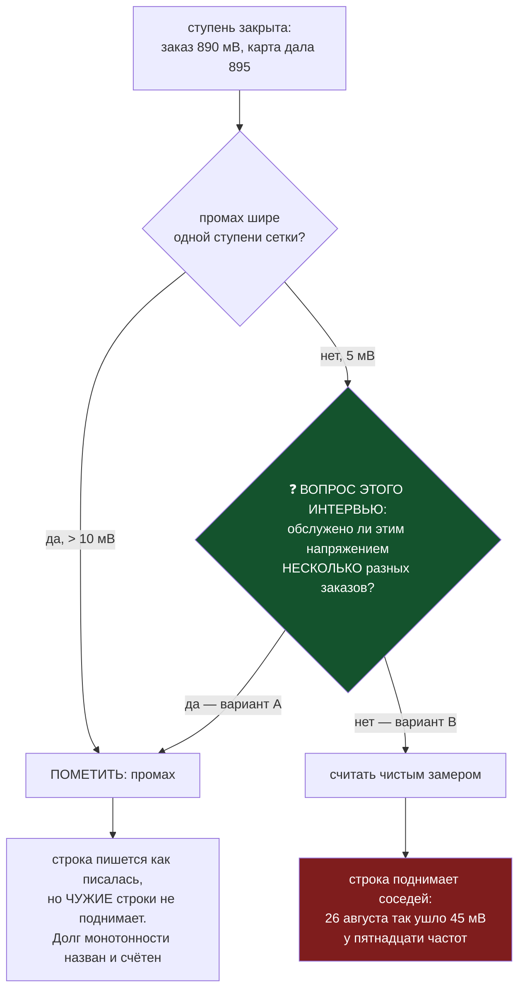

# Интервью 020 — считается ли ПЛАТО ВЫДАЧИ промахом (`bugs/73`, хвост `bugs/63`)

**Topic:** вы уже решили 30 августа, что промахнувшийся замер не поднимает чужие строки. Оказалось,
что «промах» опознавался по ШИРИНЕ, а пол карты узнаётся по ПОВТОРЕНИЮ — и та самая ступень, которая
отобрала 45 мВ, под прежний признак не попадала. Ниже — рисунок, график и цена каждого варианта.
**Status:** 🔴 ОТКРЫТО — ждёт владельца.
**Создано:** 2026-08-30 (сессия 67) · **Родитель:** `bugs/73` · прецеденты — ваши `interviews/018`
(30.08) и слово 2026-08-16 «одна ступень вверх — ПОПАДАНИЕ»
**Куда уйдут ответы:** Q1 → признак `floorPlateau` в `engine.overshootMarkFor` (уже включён,
отменяется одной строкой) + ремонт 11 строк документа кривой

---

## Коротко, одним абзацем

30 августа вы решили: замер, где карта подставила своё напряжение вместо заказанного, не имеет права
поднимать соседние строки. Решение исполнено. Но когда дошло до ремонта испорченных строк,
выяснилось: **ступень, которая их и испортила, под признак «промах» не попадала** — её промах был
5 мВ, одну ступень сетки, а признак срабатывал от 10. Вопрос ровно один: считать ли промахом то,
что видно на рисунке ниже.

## Рисунок 1. Чем ПОЛ отличается от округления

```
   ПОЛ КАРТЫ — так выглядит, когда карта НЕ ИДЁТ ниже
   (это ваш же рисунок из интервью 018, частота 2700 МГц)

   напряжение
       ▲
   915 ┤ ██ ██ ██ ██ ██ ██ ██ ██   ← карта обслужила 915 ВСЕ восемь раз
       │  ▲  ▲  ▲  ▲  ▲  ▲  ▲  ▲
   885 ┤  ✎  ✎  ✎  ✎  ✎  ✎  ✎  ✎   ← а заказывали 885, восемь прожигов подряд
       ▼  1  2  3  4  5  6  7  8

   ТА ЖЕ САМАЯ КАРТИНА, но узкая — 26 августа, 2700 МГц, seq 792 и 793:

   напряжение
       ▲
   895 ┤ ██ ██                      ← выдача ОДНА И ТА ЖЕ на два разных заказа
       │  ▲  ▲
   890 ┤  ·  ✎                      ← заказ 890
   895 ┤  ✎                         ← заказ 895
       ▼  1  2

   Промах здесь всего 5 мВ — ОДНА ступень сетки. Прежний признак его не видел.
   А форма — та же: мы спустились на ступень, карта не пошла.

   ─────────────────────────────────────────────────────────────────────
   А ВОТ ЗАКОННОЕ ОКРУГЛЕНИЕ, которое метить НЕ НАДО:

   напряжение
       ▲
   895 ┤ ██                         ← выдача
       │  ▲
   890 ┤  ✎                         ← ОДИН заказ, и следующего вниз не было
       ▼  1

   Отличие ровно одно: СКОЛЬКО РАЗНЫХ ЗАКАЗОВ обслужено одним напряжением.
   Один — округление. Два и больше — карта не пошла ниже.
```

**Почему нельзя различать по величине промаха.** Наш рычаг — в МЕГАГЕРЦАХ, мы двигаем таблицу
целиком. Поэтому набор напряжений, ДОСТИЖИМЫХ для конкретной частоты, — это подмножество сетки
карты, а не вся сетка. Ваши же слова 2026-08-16: *«ближайшее верхнее из тех, которые карточка
ПРЕДОСТАВЛЯЕТ»*. Значит одиночный промах в одну ступень принципиально двусмысленный: он и пол, и
законная соседняя достижимая ступень. **Повторение — единственное, что их различает.**

## График 1. Сколько таких мест в боевом журнале

Пересчитано 2026-08-30 по 784 ступеням журнала; записей в карту ноль.

```
  ПЛАТО ВЫДАЧИ (≥2 разных заказа → одна выдача), всего 35, по размаху заказов:

   50 мВ  ▌1   2820 МГц: 910 → 900 → 860  обслужены 915
   45 мВ  ▌1   2820 МГц: восемь заказов 915…870 обслужены 915   ← ваш рисунок из 018
   35 мВ  ▌1   2737 МГц: 885 → 850 обслужены 890
   30 мВ  ▌1
   25 мВ  ▌▌2
   20 мВ  ▌1
   15 мВ  ▌▌▌▌▌▌6
  ─────────────────────  ← ГРАНИЦА ПРЕЖНЕГО ПРИЗНАКА: выше метилось, ниже нет
   10 мВ  ▌▌▌▌▌5
    5 мВ  ▌▌▌▌▌▌▌▌▌▌▌▌▌▌▌▌16      ← среди них ступень 26.08, отобравшая 45 мВ

  Над границей 14 плато — их признак ловил и раньше.
  Под границей 21 плато — уходили в документ как ЧИСТЫЙ замер.
```

## Блок-схема. Где стоит вопрос



## Что НЕ меняется ни при каком ответе — названо, чтобы не пришлось спрашивать

- **Ваше правило 2026-08-16 «одна ступень вверх — ПОПАДАНИЕ, мерой становится выданное» в силе.**
  Оно отвечает на вопрос «какое число записать в строку». Здесь спор о другом — вправе ли эта строка
  ТРЕБОВАТЬ столько же от соседей. Число в строке не меняется ни при A, ни при B.
- **Правило монотонности в силе.** Более высокой частоте не может хватать меньшего напряжения.
- **Поднимать безопасно, опускать нельзя.** Тоже в силе.

## Q1. Считается ли плато выдачи промахом?

Развилка на блок-схеме выше. Всё, что перечислено в разделе «что не меняется», остаётся как есть
при любом вашем ответе.

- **A. ДА — несколько разных заказов, обслуженных ОДНИМ напряжением, это пол карты** *(рекомендовано)*
  — и такая строка чужие строки не поднимает. Ширина промаха роли не играет.
  **Получаем:** ваше решение от 30 августа начинает действовать там, где урон и случился;
  **разблокируется ремонт 11 строк — возвращается 355 мВ измеренного андервольта, до 45 мВ на
  частоту.** **Платим:** удержаний станет больше (21 место в архиве против нуля), долг монотонности
  будет называться чаще, восстанавливает его следующий честный прожиг. **Цена работы:** сделано и
  проверено, ремонт документа ~полчаса. Отменяется одной строкой.

- **B. НЕТ — признаком остаётся только ширина промаха.** Одна ступень вверх — попадание во всех
  смыслах, включая право поднимать соседей.
  **Получаем:** ни одной новой сущности, всё как было до сегодня. **Платим:** вечер 26 августа
  воспроизводится на любой полосе, где карта упрётся в пол узко; **ремонт 11 строк отменяется**, и
  355 мВ остаются отданными. **Цена работы:** откат одной строкой, ~десять минут.

- **C. ДА, но только когда плато ШИРЕ одной ступени** — то есть разных заказов три и больше.
  **Получаем:** середину; ловит 2737 МГц (885 → 850). **Платим:** пропускает ровно ступень
  26 августа — ту, ради которой всё и затевалось; **ремонт 11 строк не разблокируется.**
  **Цена работы:** ~двадцать минут.

- **D. Ваш вариант** — если видите четвёртый путь, напишите его; прецедент есть, в `interviews/014`
  Q2 вы переписали вариант своими словами, и это было лучше моих трёх.

**Ответ:** 

## Что произойдёт при ответе A — ремонт документа, поимённо

Возвращается ровно то, что храповик забрал; откуда взято прежнее значение — названо по каждой
строке. Пять строк, которые прогон 26.08 УЛУЧШИЛ (стояли 950…965 мВ), не трогаются.

| частота | сейчас | станет | вернётся | откуда прежнее значение |
|---|---|---|---|---|
| 2887 МГц | 895 | 875 | −20 мВ | улика в самой строке |
| 2880 МГц | 895 | 875 | −20 мВ | улика в самой строке |
| 2842 МГц | 895 | 860 | −35 мВ | улика в самой строке |
| 2827 МГц | 895 | 865 | −30 мВ | git, снимок 25.08 |
| 2820 МГц | 895 | 865 | −30 мВ | улика в самой строке |
| 2812 МГц | 895 | 865 | −30 мВ | git, снимок 25.08 |
| 2805 МГц | 895 | 860 | −35 мВ | улика в самой строке |
| **2797 МГц** | 895 | **850** | **−45 мВ** | улика в самой строке |
| **2790 МГц** | 895 | **850** | **−45 мВ** | улика в самой строке |
| 2767 МГц | 895 | 865 | −30 мВ | улика в самой строке |
| 2745 МГц | 895 | 860 | −35 мВ | улика в самой строке |
| 2760 · 2730 · 2722 · 2715 · 2707 | 895 | **остаются 895** | — | до прогона стояли 950…965 — их прогон улучшил |

**Итого 11 строк, 355 мВ, в среднем 32 мВ на строку.**
