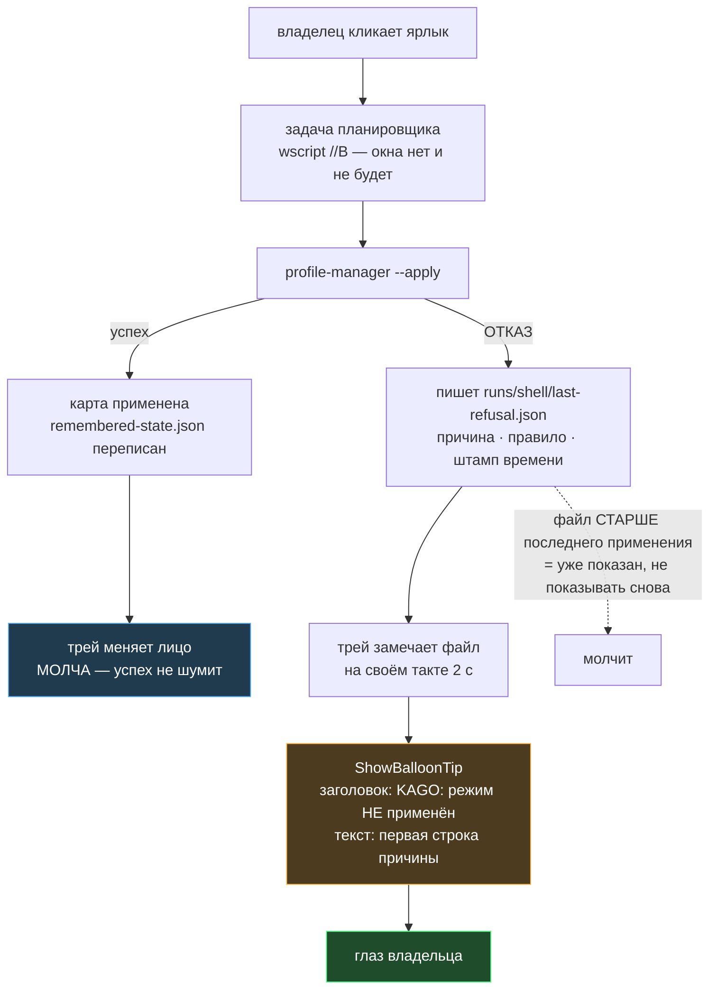

# План 100 — ЯРЛЫК ПЕРЕСТАЁТ МОЛЧАТЬ, КОГДА ОТКАЗЫВАЕТ

> **Создан:** 2026-09-09 (сессия 97) · **Родитель:** `bugs/135`; разведка `researches/38` ·
> **Статус:** 🔲 не начат; писать код в новом чате · **Исходящее:** —

---

## 1. Вектор цели

**Боль.** Владелец кликает по ярлыку. Применение отказывает. Он не видит **ничего** — ни строки, ни
значка, ни звука. Отличить «применилось» от «отказало» он может только по косвенному признаку:
появилась ли иконка режима в трее. 09.09 это стоило ему вечера и вопроса «Почему?».

**Куда хотим.** Отказ применения доходит до владельца **в момент отказа**, без консольного окна, с
причиной, а не со словом «ошибка».

**Тип цели: Achieve.**

**Развилка ЗАКРЫТА разведкой, а не рассуждением** (`researches/38` §3): говорит **трей**, всплывающей
подсказкой через уже стоящий `NotifyIcon`. Прецедент в этом же репозитории — `tools/loop-guard.mjs`
уже показывает владельцу подсказку без окна.

---

## 2. Механизм

**Почему говорит ТРЕЙ, а не применитель.** Применитель живёт под `wscript //B` — процесс без
интерфейса, поднятый планировщиком с правами администратора. Поднимать из него оконный класс значит
рисовать в чужой сессии. Трей уже стоит в сессии ВЛАДЕЛЬЦА, уже имеет цикл сообщений и уже читает
файл на такте 2 с. Оккам: ни одной новой движущейся части.

---

## 3. Шаги

### Ш1. Применитель оставляет улику отказа
- `runs/shell/last-refusal.json`: `at` · `profile` · `rule` (R11/R12/R13/…) · `why` (полный текст) ·
  `firstLine` (то, что уедет в подсказку) · `consent` (клик владельца · восстановление при входе).
- Пишется **только при отказе**, атомарно (temp + rename, R14a).
- **Успех файл УДАЛЯЕТ** — иначе старый отказ будет показан после удачного применения.

### Ш2. Трей замечает и говорит
- На том же такте 2 с, что и `remembered-state.json`: если файл есть и его штамп **новее** последней
  показанной подсказки — `ShowBalloonTip(20000, 'KAGO: режим НЕ применён', firstLine, 'Warning')`.
- Показанный штамп хранится **в памяти трея**, не на диске: перезапуск трея не должен превращаться в
  повторный крик о старом отказе.

### Ш3. Молчание при успехе — доказано блоком
- Успешное применение НЕ производит подсказки. Блок: применение прошло → файла нет → подсказок 0.
- **Это не украшение критерия.** Подсказка на каждый успешный клик станет шумом, владелец научится
  её игнорировать, и отказ снова станет невидим — дефект вернётся в одежде починки.

### Ш4. Ворота: окон по-прежнему ноль
- `EnumWindows`: консольных окон ВИДИМЫХ 0 — тот же прибор, которым закрывали `bugs/17` и `bugs/39`.
- Прогоняется ПОСЛЕ правки, а не до.

### Ш5. Живой свидетель
- Подложить заведомо отказной профиль → кликнуть ярлык → владелец **видит подсказку своим глазом**.
- Затем вернуть рабочий профиль и показать, что подсказки нет.

---

## 4. Критерии приёмки — сценариями

**P100-AC1 — отказ виден без окна.**
- Ситуация. Профиль, который применитель отвергает; трей запущен.
- Действие. Владелец кликает ярлык.
- Результат. В течение ~2 с появляется всплывающая подсказка с ПРИЧИНОЙ отказа.
- Проверка. Глаз владельца + `runs/shell/tray.log` несёт строку о показе.

**P100-AC2 — успех молчит.**
- Ситуация. Рабочий профиль.
- Действие. Владелец кликает ярлык.
- Результат. Режим применён, подсказки нет.
- Проверка. `tray.log` не содержит строки о показе за окно применения; блок в наборе трея.

**P100-AC3 — окон не прибавилось.**
- Ситуация. Правка внесена.
- Действие. Клик по ярлыку.
- Результат. Видимых консольных окон ноль.
- Проверка. `EnumWindows` — тот же прибор, что закрывал `bugs/17` и `bugs/39`.

**P100-AC4 — старый отказ не кричит дважды.**
- Ситуация. Отказ показан; трей перезапущен.
- Действие. Трей стартует и видит тот же файл.
- Результат. Подсказки нет.
- Проверка. Блок в самопроверке `tray.ps1` (в нём уже есть песочница без `NotifyIcon`).

**P100-AC5 — подсказка несёт причину, а не слово «ошибка».**
- Ситуация. Отказ R12 на точке 57.
- Действие. Подсказка показана.
- Результат. Её текст содержит номер правила и суть.
- Проверка. Блок сверяет `firstLine` с текстом отказа применителя.

---

## 5. Риски

**(а) Средний — трей получает состояние.** Он ИНДИКАТОР и состоянием не владеет (внутренняя карта
§4). **Управление:** показ есть отображение, а не состояние; трей ничего не решает о карте, и это
проверяется тем же блоком, что и раньше.

**(б) Средний — подсказка станет шумом.** **Управление:** P100-AC2 существует ровно против этого.

**(в) Низкий — подсказки Windows отключены у владельца в настройках.** **Управление:** назвать это
границей честно; проверяется на живом свидетеле Ш5. Если отключены — развилка возвращается владельцу,
а не решается обходом.

---

## 6. Чего этот план НЕ делает

- Не трогает причину отказов (`bugs/133`, `bugs/136`) — он про то, чтобы отказ было ВИДНО.
- Не добавляет трею кнопок и меню сверх того, что уже решено владельцем (пункт `Exit`, 23.08).

---

## 7. Решения, принятые без владельца

1. **Говорит трей, а не применитель.** Причина: применитель под `wscript //B` в сессии
   администратора; трей уже в сессии владельца с циклом сообщений. Плюс прецедент `loop-guard.mjs`.
2. **Штамп показанной подсказки хранится в памяти, не на диске.** Причина: перезапуск трея не должен
   быть поводом крикнуть о старом отказе; а файл на диске был бы ещё одной парой «правда↔зеркало».
3. **Успех удаляет файл отказа.** Причина: иначе показ зависит от порядка чтения, а не от факта.
