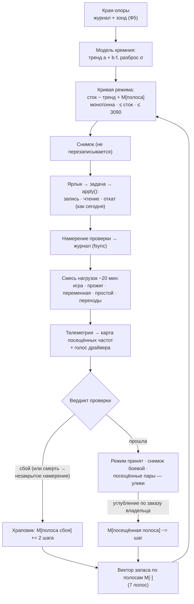
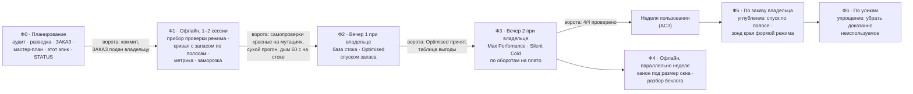

# ЭПИК 101 — разворот: модель кремния, проверка целого режима, углубление по полосам

**Создан:** 2026-09-25, сессия 101 · **Родитель:** `MASTER_PLAN.md` (редакция 25.09) · ответ владельца
на `interviews/interview_030` (A + углубление) · аудит `reports/KAIF_AUDIT/2026-09-25_audit_04_change_the_method.md`
· разведка `researches/39_the_turnaround_silicon_model_and_whole_mode_validation.md`
**Статус:** 🟢 Ф0 (планирование) исполнена 2026-09-25 · Ф1 — следующая, оперплан `plans/102_epic101_phase1_the_mode_check_and_the_banded_curve.md`
**Вовне:** `ЗАКАЗ.md` (редакция 25.09, **утверждена владельцем 25.09**: «ЗАКАЗ принят») · `AGENT_GUIDE.md` → The critical path rule

---

## Вектор цели

**Тип: Deliver.** Боль: за шесть недель и ~100 сессий — 5 краёв из 389, 1 режим из 4, 19 аварийных
перезагрузок, 5,4 часа реального прожига; метод «край каждой частоты через отказ машины»
арифметически не доходит до цели (аудит 4, §4 К1). Куда хотим: **четыре режима на ярлыках, каждый
проверен целиком и неделей пользования, у каждого — измеренная выгода против стока**, — за два
вечера при владельце после одной офлайн-сессии; и **сохранённый путь углубления**, по которому
владелец потом «выжимает соки» шаг за шагом, не возвращаясь к поиску каждого края смертью машины.

## Критерии приёмки эпика (шкала · прибор · цель)

| # | критерий | прибор | цель |
|---|---|---|---|
| E101-AC1 | режимов проверено целиком | `npm run curve -- --progress` (новая метрика, Ф1) | **4 из 4** |
| E101-AC2 | у каждого режима таблица выгоды против стока: FPS · Вт · °C · обороты на плато, с разбросом прибора | отчёт проверки режима (`runs/validate/`) | 4 таблицы; `Optimised` ≥ 95 % FPS от `Max Perfomance`; `Silent Cold` ≤ 50 % оборотов на плато, желательно 40…50 % |
| E101-AC3 | неделя обычного пользования без сбоя | журнал Windows: `nvlddmkm` 153, Kernel-Power 41, 6008 за 7 суток + слово владельца | 0 сбоев, либо сбой поднят храповиком и режим перепроверен |
| E101-AC4 | аварийных перезагрузок за вечера Ф2–Ф3 | журнал Windows, событие 6008 | **≤ 3** (было 19 за проект) |
| E101-AC5 | углубление: один шаг — одна команда, откат — одно действие | живой шаг Ф5 | шаг принят или откачен без ручной правки файлов |
| E101-AC6 | ядро перечитывания канона | `wc -c` девяти документов ядра (+ `ЗАКАЗ.md`) | **≤ 300 КБ** (было 809) и каждый документ в своём бюджете KAIF |

## Контур, который строится

## Фазы, порядок и ворота

**Почему такой порядок.** Продукт раньше канона: боль владельца — время (13.09), а Ф1–Ф3 не требуют
новой машинерии, только одного прибора. Минимальная часть диеты канона (новый `STATUS.md` ≤ 200
строк) сделана уже в Ф0, потому что без неё следующая сессия с окном 200 тыс. токенов не сможет
даже войти. Остальная диета (Ф4) идёт в неделю пользования, когда карта не нужна. Углубление (Ф5) —
после приёмки: ему нужна принятая база, от которой шагает храповик. Упрощение (Ф6) — последним,
потому что удаление требует улик, что часть машинерии действительно не нужна.

### Ф0 — Планирование разворота ✅ 2026-09-25

Аудит 4 · разведка 39 · `ЗАКАЗ.md` (редакция 25.09, утверждена владельцем) · `MASTER_PLAN.md` (редакция
25.09) · этот эпик · оперплан Ф1 · `STATUS.md` заново (прежний — дословно в летопись) · правило
критического пути в `AGENT_GUIDE.md` приведено к ответу A.

### Ф1 — Прибор проверки режима и кривая с запасом по полосам (офлайн, 1–2 сессии)

Скелет (детали — `plans/102`): построитель кривой получает вектор запаса по полосам · прибор
`mode-validate`: намерение → применение путём ярлыка → смесь нагрузок → телеметрия, карта посещений,
голос драйвера → вердикт → отчёт · незакрытое намерение после перезагрузки = сбой в последней полосе
· новая метрика в `--progress` · заморозка машинерии записана в канон.
**Ворота:** самопроверки чистых функций покраснели на названных мутациях; `--dry-run` на живой карте
без записи; дым смеси нагрузок 60 с на стоке — с разрешения владельца (занимает экран).

### Ф2 — Вечер 1: `Optimised` (при владельце)

Скелет: проверка стока 20 мин (база таблицы) → кривая «тренд + 30 мВ» → проверка → спуск запаса по
10 мВ во всех посещённых полосах → на первом сбое +2 шага в полосе сбоя → повторная проверка →
снимок → ярлык → таблица выгоды. **Ворота:** `Optimised` принят, таблица снята, перезагрузок ≤ 2.

### Ф3 — Вечер 2: `Max Perfomance` и `Silent Cold` (при владельце)

Скелет: `Max Perfomance` — та же кривая при 300 Вт; карта живёт выше (~2940 МГц), поэтому проверка
отдельная, храповик — в её полосе. `Silent Cold` — потолки-кандидаты, проверка до плато (≥ 10 мин
каждая), выбор потолка с оборотами на плато не более 50 %, желательно 40…50 %. Четыре ярлыка. **Ворота:** AC1 = 4/4, AC2 — четыре
таблицы; начинается неделя пользования (AC3).

### Ф4 — Канон под размер окна и разбор беклога (офлайн, параллельно неделе)

Скелет: `AGENT_GUIDE.md` в бюджет KAIF (решения владельца — в `ЗАКАЗ.md`, справочник машинерии — в
отдельный файл) · после утверждения `ЗАКАЗ.md` — `GOAL.md` выходит из ритуала перечитывания (тикет в
исток #84 уже подан) · `MASTER_PLAN.md` ≤ 300 строк · беклог: планы и баги замороженной машинерии —
статус «заморожен эпиком 101» одной строкой. **Ворота:** AC6; `kaif-core check --gate-budgets` зелёный
для STATUS и MASTER_PLAN.

### Ф5 — Углубление «выжимать соки» (по заказу владельца, при нём)

Скелет: команда `deepen --mode <режим> --band <полоса>` — шаг запаса вниз → проверка → принят (новый
снимок) или храповик; зонд края на опорной частоте формой записи режима — прежний движок, но без
равномерного подъёма всей кривой; новая опора → перерасчёт тренда → меньший σ.
**Ворота:** AC5.

### Ф6 — Упрощение по уликам (офлайн, по мере накопления улик)

Скелет: что из замороженного за Ф2–Ф5 не понадобилось ни разу — в архив (двойник, полигон,
ловушки, предохранитель, окно как условие запуска); применитель — к ~500 строкам на прежнем
транзакционном образце; официальный путь NVML (`nvmlDeviceSetClockOffsets`) — рассмотреть как
второй бэкенд. Только с уликой «не нужно» у каждого пункта.

## Что эпик замораживает (остаётся на диске, новых работ нет, не условие запуска)

Эпики и планы: 42 (гибкий тюнинг по прожигам) · 51 и дети (предохранитель, предсказатель) · 59 и
дети (двойник как равноправный стенд) · 67 (генератор карт, полигон) · 73 (чёрный ящик зависания) ·
76 (сторожа против модели угрозы) · 95 (канарейка) · 98 фазы 2–3 (ворота передачи — проверка режима
их заменяет) · 90 (перепрожиг 42 строк) · 87 (7 краёв «без сторожа»). Баги, чья единственная цель —
живой свидетель замороженной машинерии, получают статус «заморожен эпиком 101» в Ф4.

**Что остаётся в силе и используется:** журнал упреждающей записи · применитель и откат · R13 ·
построитель кривой по тренду и редактор · снимки · игровой стенд с разбросом прибора · тепловое
плато · голос драйвера · оболочка (ярлыки, трей, автозапуск).

## Риски (Мёрфи), по ярусам

- **Ярус 1 — машина.** Спуск запаса у края вешает машину. Мера: спуск одной величиной от безопасного
  (+30 мВ над трендом), шаг 10 мВ, остановка на первом сбое; только при владельце; AC4 считает.
- **Ярус 1 — редкая нестабильность.** 20 минут не ловят сбой, который приходит раз в несколько дней.
  Мера: неделя пользования (AC3) и храповик по полосе без нового вечера.
- **Ярус 2 — модель ниже 2137 МГц — экстраполяция.** Мера: увеличенный запас, не глубже нижнего края;
  тяжёлая нагрузка туда не приходит.
- **Ярус 2 — `Max Perfomance` живёт выше, чем `Optimised`.** Мера: отдельная проверка, храповик в её
  полосе; модель там опирается на края 2947–3030.
- **Ярус 3 — привычка.** Следующая сессия откроет новую машинерию «ради безопасности». Мера: мораторий
  до 4/4 (`ЗАКАЗ.md` §9), метрика печатается командой, правило критического пути перечитывается.

## Решения, принятые агентом `[AI]` — пересматриваемы, вето владельца открыто

- Семь полос, их границы; запас старта +30 мВ, шаг 10 мВ, храповик +2 шага сетки, проверка ~20 мин.
- Состав смеси нагрузок (свобода агента по слову 26.08); простой и переходы — обязательны.
- Заморозка перечисленных эпиков — по мандату 25.09 и правилу «машинерию решаю сам по ценности для
  продукта».
- Порядок фаз и граница ≤ 300 КБ для ядра канона.
