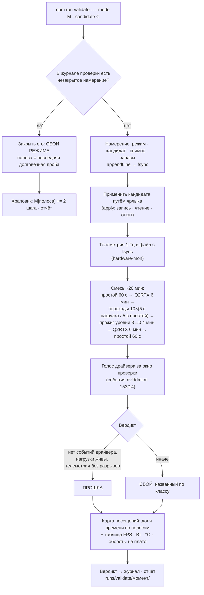

# План 102 — эпик 101, Ф1: прибор проверки режима и кривая с запасом по полосам

**Создан:** 2026-09-25, сессия 101 · **Родитель:** `plans/101_EPIC_turnaround_silicon_model_and_whole_mode_validation.md`
Ф1 · разведка `researches/39` §3.1, §4
**Статус:** 🟡 не начат · офлайн, 1–2 сессии; живое — только дым 60 с на стоке с разрешения владельца
**Вовне:** `AGENT_GUIDE.md` → Test harness (строка прибора) · `npm run curve -- --progress` (метрика)

---

## Вектор цели

**Тип: Build.** Якорь в эпике: *«Ф1 · Офлайн, 1–2 сессии: прибор проверки режима · кривая с запасом
по полосам · метрика · заморозка»*. Боль: у проекта нет прибора, который отвечает на вопрос владельца
«этот режим держится?» — есть только прожиг одной частоты. Куда хотим: одна команда применяет
кандидата путём ярлыка, гоняет смесь нагрузок ~20 минут, пишет намерение до записи в карту, снимает
карту посещённых частот, читает голос драйвера и выносит вердикт с таблицей выгоды; и построитель,
который делает кривую «тренд + запас по полосам». С этим Ф2 — один вечер.

## Критерии приёмки Ф1

| # | критерий | прибор | цель |
|---|---|---|---|
| P102-AC1 | инварианты кривой с запасом: монотонна · ≤ сток · ≤ 3090 МГц · напряжения с сетки карты, округление вверх | `node tools/curve-proposal.mjs --selftest` | блоки зелёные; 3 названные мутации краснят ровно свои блоки |
| P102-AC2 | храповик и шаг запаса: PASS опускает только посещённые полосы; сбой поднимает полосу сбоя на 2 шага и ставит ей пол | `npm run validate -- --selftest` | блоки зелёные; 2 мутации краснят свои |
| P102-AC3 | незакрытое намерение после «смерти» даёт вердикт «сбой в полосе X» по последней долговечной пробе | тот же набор, фикстура журнала и проб | вердикт и полоса совпадают с фикстурой |
| P102-AC4 | сухой прогон на живой карте ничего не пишет | `npm run validate -- --mode optimised --dry-run` + чтение сдвигов до и после | код 0; сдвигов изменено 0 |
| P102-AC5 | дым 60 с на стоке: отчёт с картой посещений, ≥ 55 проб телеметрии, окном голоса драйвера, вердиктом | `npm run validate -- --mode factory --minutes 1` (с разрешения владельца) | отчёт в `runs/validate/<момент>/` со всеми четырьмя частями |
| P102-AC6 | метрика нового критерия | `npm run curve -- --progress` | первая строка `РЕЖИМОВ ПРОВЕРЕНО Y/4 · …` |
| P102-AC7 | ворота сборки | `npm run check` · `npm run selftest:all` | зелёные; новый набор в батарее |

## Схема прибора

## Шаги

- [ ] **Ш1. Кривая с запасом по полосам.** Якорь: *«построитель кривой получает вектор запаса по
      полосам»*. В `tools/curve-proposal.mjs`: чистая функция `bandedCurve({ stock, trend, bands,
      margins, grid })` и ключи `--margin <мВ>` (одинаковый) · `--band-margins a,b,c,d,e,f,g`. Семь полос
      из `researches/39` §4 п. 2 — одна константа рядом с функцией. Верх (> 2950) и низ (< 2157) — с
      надбавкой, не глубже крайнего края (правило R5 уже в файле).
      *Проверка:* блоки инвариантов P102-AC1; мутации — снять зажим монотонности · перевернуть знак
      запаса · сдвинуть границу полосы на одну частоту.
- [ ] **Ш2. Кандидат как профиль.** Якорь: *«применение путём ярлыка»*. Прочитать правила
      `profile-store` для `*.local.json` и согласия черновика (`profile-manager.mjs:1010`); выбрать форму
      кандидата: `profiles/candidate-<режим>.local.json` → снимок `npm run curve -- --snapshot --from`.
      Боевой профиль режима и ярлык не меняются до принятия.
      *Проверка:* сухой путь resolve → вектор → R11/R12/R13 без записи (как 14.09) даёт вектор.
- [ ] **Ш3. Журнал проверки.** `runs/validate/journal.jsonl`, строки `intent` / `verdict` через
      `sweep-journal.appendLine` (тот же `fsync`, второго определения не заводить); чтение незакрытых —
      `orphanIntents`. *Проверка:* P102-AC3 на фикстуре.
- [ ] **Ш4. Прибор `automation-engine/lib/mode-validate.mjs`** (`npm run validate`): ключи `--mode` ·
      `--candidate` · `--minutes` (по умолчанию 20) · `--dry-run` · `--plan` · `--selftest`. Смесь из
      готовых частей: `graphics-load` (Q2RTX, PresentMon), `stress-tester` (уровни 3→0), паузы простоя;
      телеметрия — `hardware-mon`; голос драйвера — `driver-voice.driverEventsInWindow`. Предохранитель,
      окно наблюдения, режим дисков — НЕ условия запуска (заморозка, `ЗАКАЗ.md` §3).
      *Проверка:* P102-AC4 (сухой прогон, чтение сдвигов до и после).
- [ ] **Ш5. Вердикт, храповик, карта посещений** — чистые функции `verdictOf(...)`, `hitMap(samples,
      bands)`, `nextMargins(margins, verdict, hitMap, step)`. *Проверка:* P102-AC2 с мутациями.
- [ ] **Ш6. Метрика.** `npm run curve -- --progress`: первая строка — `РЕЖИМОВ ПРОВЕРЕНО Y/4 · запас
      по полосам · выгода`, из журнала проверки и профилей; строка краёв остаётся второй, справочной.
      *Проверка:* P102-AC6.
- [ ] **Ш7. Канон.** Строка прибора в `AGENT_GUIDE.md` → Test harness; набор в `selftest:all`.
      *Проверка:* P102-AC7.
- [ ] **Ш8. Дым на стоке — с разрешения владельца** (Q2RTX займёт экран на минуту). *Проверка:*
      P102-AC5; карта после дыма — заводская (чтение).
- [ ] **Ш9. Судья** (`/fable-judge`) по утверждениям Ф1; затем — оперплан Ф2 с тем, чему научила Ф1.

## Риски

- **Q2RTX в цикле** — перезапуск демо стоит секунды простоя между запусками; это и есть переход,
  полезный для проверки, но FPS считать только внутри запусков (PresentMon по процессу).
- **Прибор сам станет лесами.** Мера: ≤ 400 строк логики; никаких новых процессов-сторожей; всё, что
  не отвечает на вопрос «режим держится?», — вне Ф1.
- **Повышенные права.** Применение идёт из оболочки агента (под администратором) напрямую
  `profile-manager --apply`; если права не те — путь задачи планировщика, как у ярлыка.
- **Смесь не воспроизводит смерти 08.09.** Они жили на простое после глубокой записи; смесь начинается
  и кончается простоем и несёт десять переходов — это лучшее, что даёт отрасль (OCCT, `researches/39`
  §2.2); остаток ловит неделя пользования.

## Решения агента `[AI]`

Состав и длительность смеси · форма кандидата · имя команды `validate` · семь полос — всё
пересматриваемо, вето владельца открыто.
