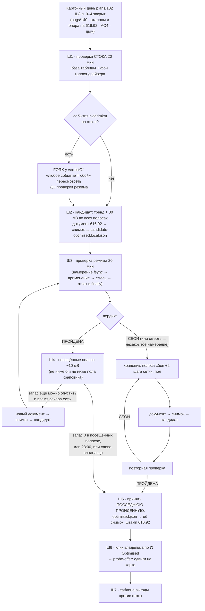

# План 103 — эпик 101, Ф2: `Optimised` на драйвере 616.92, проверенный целиком

**Создан:** 2026-09-25 08:50, сессия 103 · **Родитель:** `plans/101_EPIC_turnaround_silicon_model_and_whole_mode_validation.md`
Ф2 · оперплан Ф1 `plans/102` (Ш8 — порядок карточного дня) · ответ владельца на `interviews/interview_031` (вариант A:
заводские до вечера проверки)
**Статус:** 🟡 ИДЁТ — вечер 25.09 (сессия 104) при владельце. Ш0: `bugs/140` ✅, эталоны 616.92 ✅, AC4 ✅, дым стока ✅ ·
опора на 616.92 ❌ (`bugs/142`) — Ф2 пошла без неё по слову владельца («гоу тюнить»). Ш1 (сток 20 мин) — не делался:
«никаких 20 минут… максимум 5» (длительность — `ЗАКАЗ.md` §8). Ш2/Ш3 ✅ +30 — 5 мин ПРОЙДЕНА (19-15-33). Ш4 ✅ спуск
равномерным запасом +20 → +10 → 0, смоуки по 30 с ПРОЙДЕНА (полосной вектор 20/30/30/20/20/30/20 отвергнут R12 до
`40e2c86`). Ш3 на 0 ✅ ПРОЙДЕНА (19-55-54, фактически 5:47). Ш5 — не срабатывал. Ш6 — наполовину: `optimised.json` на
снимке `2026-09-25T19-53-52`, штамп 616.92 (`c6ba81f`); клик по ярлыку ⚖️ на карте — НЕ сделан. Ш7 (таблица выгоды) — нет:
стока той же длины нет. Ш8 судья — сессия 104 (поправки внесены). Дальше — «вся кривая → полоса → частота» (новый оперплан).
**Вовне:** `profiles/optimised.json` (новый снимок, штамп 616.92) · `npm run curve -- --progress` (РЕЖИМОВ ПРОВЕРЕНО 1/4)

---

## Вектор цели

**Тип: Deliver.** Якорь в эпике: *«Ф2 · Вечер 1: проверка стока 20 мин (база таблицы) → кривая «тренд + 30 мВ» →
проверка → спуск запаса по 10 мВ во всех посещённых полосах → на первом сбое +2 шага в полосе сбоя → повторная
проверка → снимок → ярлык → таблица выгоды»*. Боль: с 18.09 ваш `Optimised` не включается (драйвер 616.92 против
штампа 610.88), карта под игрой на ~300 Вт, 81 °C и 86 % оборотов. Куда хотим: ярлык ⚖️ Optimised снова включает
режим — построенный моделью кремния, проверенный целиком на ТЕКУЩЕМ драйвере, с таблицей выгоды против стока.

## Критерии приёмки Ф2

| # | критерий | прибор | цель |
|---|---|---|---|
| P103-AC1 | база стока снята проверкой той же смесью | `npm run validate -- --mode stock-default --candidate profiles/factory.json` | вердикт ПРОЙДЕНА · отчёт `runs/validate/<момент>/` · число событий `nvlddmkm` на стоке названо |
| P103-AC2 | кандидат «тренд + 30 мВ» прошёл проверку целиком | `npm run validate -- --mode optimised --candidate profiles/candidate-optimised.local.json` | ПРОЙДЕНА · карта посещений · таблица выгоды |
| P103-AC3 | запас спущен до первого сбоя или до нуля в посещённых полосах; сбойная полоса поднята храповиком и перепроверена | журнал `runs/validate/journal.jsonl` · `nextMargins` | последняя проверка ПРОЙДЕНА на тех запасах, что уходят в снимок |
| P103-AC4 | режим на ярлыке | `profiles/optimised.json` → новый снимок, штамп 616.92 · клик владельца по ⚖️ Optimised · `node tools/probe-offer.mjs` | ненулевых сдвигов > 0 после клика; `--progress` → РЕЖИМОВ ПРОВЕРЕНО 1/4 |
| P103-AC5 | выгода против стока | `npm run validate -- --compare --stock <захваты стока> --mode <захваты режима>` | FPS · Вт · °C · обороты на плато; обороты ≤ 60 % (`ЗАКАЗ.md` §1). Кадры: цель эпика — **≥ 95 % от Max Perfomance** (E101-AC2, `ЗАКАЗ.md` §1) — сверяется в Ф3, когда Max Perfomance проверен; `[AI]` на вечер Ф2 промежуточно — против СТОКА, и разница называется только вместе с разбросом прибора (`MASTER_PLAN.md` «потери нет — после замера разброса») |
| P103-AC6 | аварийных перезагрузок за вечер | журнал Windows, событие 6008 | **≤ 2** (E101-AC4 — ≤ 3 на Ф2–Ф3) |

## Схема вечера

## Шаги

- [ ] **Ш0. Предусловие — карточный день закрыт** (`plans/102` Ш8, п. 0–4): `bugs/140` засвидетельствован; эталоны
      прожига и опора применения переснята на 616.92 (`stress --capture-baseline`/`--verify-baseline`, `curve
      --take-reference`/`--reference`); AC4 сухого прогона; дым 60 с на стоке ПРОЙДЕНА. Любой красный — Ф2 не
      начинается, чинится то, что покраснело.
- [ ] **Ш1. Проверка стока, 20 мин.** `npm run validate -- --mode stock-default --candidate profiles/factory.json` →
      отчёт = база таблицы выгоды (захваты Q2RTX стока) и **фон голоса драйвера**. Если на стоке `nvlddmkm` что-то
      сказал — правило `verdictOf` «любое событие драйвера = сбой» режим завалит не за его вину: `FORK:` у `verdictOf`
      (варианты: событие = сбой · сбой = событие СВЕРХ фона стока · событие = только сигнал), консультация —
      `researches/30` (порог окна, форма Windows TDR) и слово владельца, если цена ошибки — ложный провал режима.
- [ ] **Ш2. Кандидат «тренд + 30 мВ».** Документ уже есть: `curves/model-trend-plus-30-d616-92.json` (штамп 616.92,
      `dataDriver` 610.88; строки те же, что у `model-trend-plus-30.json`). Если `gpu:info` вечером покажет не
      616.92 — новый документ `node tools/curve-proposal.mjs --margin 30 --write-doc <имя> --stamp-driver <драйвер>`.
      Затем `npm run curve -- --snapshot --from model-trend-plus-30-d616-92` (валидатор снимка — суд передачи, слово
      владельца 09.09) → файл кандидата из `profiles/optimised.json` одной заменой (`mode-validate.candidateProfile`:
      кривая = снимок, `qualified: false`, штамп — драйвер карты, запасы) → `profiles/candidate-optimised.local.json`.
      *Офлайн-часть этого шага можно сделать до вечера; сухой путь resolve → вектор читает живую карту — вечером.*
- [ ] **Ш3. Проверка кандидата, 20 мин.** `npm run validate -- --mode optimised --candidate profiles/candidate-optimised.local.json`
      (владелец у машины: игра займёт экран). Код 0 только на ПРОЙДЕНА.
- [ ] **Ш4. Спуск запаса.** ПРОЙДЕНА → `nextMargins`: посещённые (≥ 30 с) полосы −10 мВ, остальные не трогаются;
      новый вектор запасов → `node tools/curve-proposal.mjs --band-margins a,b,c,d,e,f,g --write-doc <имя> --stamp-driver 616.92`
      → снимок → кандидат → Ш3. Ожидаемо живут B4/B5 (2700–2900 МГц; карта посещений записей 14.09: 2800–2900 — 86 %).
      Запас 0 — нижний предел построителя (кривая касается самого требовательного края); ниже — отказ по имени.
- [ ] **Ш5. Храповик.** СБОЙ (или смерть машины → на следующем запуске незакрытое намерение закрывается сбоем в полосе
      последней долговечной пробы) → полоса сбоя +2 шага сетки и пол → документ → снимок → кандидат → повторная
      проверка; ПРОЙДЕНА — к Ш6. Каждая смерть — разбор (`GOAL.md` 30.08: зависание — наш провал).
- [ ] **Ш6. Принятие и ярлык** — владелец у машины, его клик: `profiles/optimised.json` → `curveSnapshot` = снимок
      последней ПРОЙДЕННОЙ проверки, штамп 616.92 (`qualified` — по правилу формата для принятого режима); ⚖️ Optimised
      на рабочем столе → `node tools/probe-offer.mjs` (сдвиги на карте) · `npm run profile -- --state` (250 Вт) ·
      `npm run curve -- --progress` → РЕЖИМОВ ПРОВЕРЕНО 1/4. Следующий вход в систему — `runs/shell/boot-apply.jsonl`
      `applied` (а не `degraded-to-factory`).
- [ ] **Ш7. Таблица выгоды** против стока Ш1: `npm run validate -- --compare --stock … --mode …` → в отчёт Ф2 и в
      `MASTER_PLAN.md` «Четыре режима».
- [ ] **Ш8. Судья** (`/fable-judge`) по утверждениям Ф2 → оперплан Ф3.

## Риски (Мёрфи)

- **Ярус 1 — машина.** Спуск запаса у края вешает машину. Мера: старт +30 мВ над трендом (на 2842 МГц это +35 над
  рабочей точкой края), шаг 10 мВ, остановка на первом сбое; только при владельце; перезагрузок ≤ 2 (AC6), третья —
  вечер кончается на последней ПРОЙДЕННОЙ.
- **Ярус 1 — новый драйвер.** Все края сняты на 610.88; 616.92 мог сдвинуть потребность в напряжении. Мера: сама
  проверка режима на 616.92 и есть перепроверка, которой требует R6; старт с запасом +30.
- **Ярус 2 — фон голоса драйвера на стоке** (Ш1). Мера: FORK до проверки режима, а не после ложного провала.
- **Ярус 2 — 20 минут не ловят редкий сбой.** Мера: неделя пользования (E101-AC3) и храповик по полосе без нового вечера.
- **Ярус 3 — вечер кончится раньше спуска до нуля.** Мера: принимается последняя ПРОЙДЕННАЯ — режим на ярлыке
  в любом случае; углубление — Ф5.

## Решения агента `[AI]` — пересматриваемы, вето владельца открыто

Черновик плана до закрытия Ф1 (чтобы вечер не ждал плана) · предел вечера 23:00 · ≤ 2 перезагрузки за вечер ·
принимается последняя ПРОЙДЕННАЯ проверка, а не «спуск до конца любой ценой».
