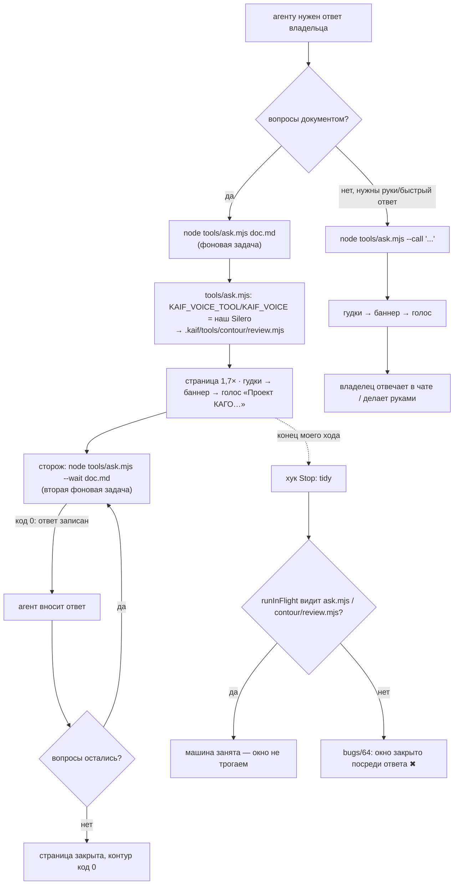

# План 104 — страница вопросов и зов по договору KAIF 2.8 (долг обновления до 2.8)

**Создан:** 2026-09-26 ≈ 16:1x +03:00 (закоммичен в `ba0f0b8` в 16:15:31; ✏️ первая редакция писала «16:3x» — впереди часов) · **Родитель:** слово владельца в чате 2026-09-26: «давай сделаем, что осталось, что 2.8
просит и у нас это пока долг - делаем. интерактивный контур, голос» · **Статус:** ✅ исполнен 2026-09-26 16:2x (кроме Ш9 — снятие файла старой страницы вместе с разделением её набора проверок) · **Разведка:** `researches/40` ·
**Вовне:** `tools/ask.mjs` (новый вход контура), `tools/tidy.mjs` (близнец `bugs/64`), `.kaif/kaif.json` → `contour`,
`package.json` (`ask`), `HOUSE_RULES.md` §6 · **Мораторий** (`ЗАКАЗ.md` §9): исключение по слову владельца «что 2.8 просит и у нас это пока долг - делаем» (строка
«Родитель»), цена — §5.

## 1. Вектор цели

Владелец отвечает на вопросы документа по одному, на крупной странице, которая не закрывается после первого ответа, и слышит
зов нашим голосом, когда агенту нужны его руки или быстрый ответ, — всё по договору KAIF 2.8
(`.kaif/INTERACTIVE_CONTOUR_SPEC.md` §4–§6), без потери того, что у нас уже работает: голос Silero «eugene» и уборка, которая не
трогает живую страницу (`bugs/64`).

## 2. Критерии приёмки

| # | Шкала | Прибор | Цель |
|---|---|---|---|
| AC1 | страница на запись одного ответа | живой прогон с владельцем, документ из 2 вопросов | после первого ответа — «Записано. Осталось вопросов: 1», окно открыто; после второго — страница закрыта, код 0 |
| AC2 | сторож ответа | `node tools/ask.mjs --wait <doc>` фоновой задачей | код 0 на каждую запись ответа |
| AC3 | размер страницы | глаз владельца на AC1 | читает без зума (1,7× страница, 1,5× кнопка — из поставки) |
| AC4 | зов голосом | `node tools/ask.mjs --call "<что нужно>"` вживую | владелец слышит гудки и голос «eugene», фраза начинается «Проект КАГО» |
| AC5 | уборка не закрывает страницу | `node tools/tidy.mjs --selftest` + прогон AC1 через границу хода | новый блок: живой `tools/ask.mjs` и `.kaif/tools/contour/review.mjs` делают машину занятой; мгновенные формы — нет |
| AC6 | старая страница снята | `package.json`, `HOUSE_RULES.md` §6 | ни одна команда её не открывает — слово владельца, `interviews/interview_032` Q2 = A («Убрать сразу — новая подошла») |
| AC7 | ворота | `npm run check` · `npm run selftest:all` · `node .kaif/tools/contour/review.mjs --selftest` | зелёные |

## 3. Блок-схема

## 4. Шаги

- [x] **Ш1. `tools/ask.mjs`** — тонкий вход: ставит `KAIF_VOICE_TOOL`/`KAIF_VOICE` только для своего дочернего процесса (из
  `KAGO_VOICE_TOOL`/`KAGO_VOICE`, иначе прежние значения старого контура) и передаёт все аргументы поставляемому контуру; блок
  `@fork owner-contour-2-8` рядом. Голос задаётся самим KAGO и не зависит от окружения машины. ✏️ Первая редакция обосновывала
  это тем, что общая переменная «молча сменила бы голос» в соседних проектах, — но на этой машине окружение пользователя УЖЕ
  держит `KAIF_VOICE=eugene` и тот же `KAIF_VOICE_TOOL` (нашёл шестой проход судьи): вход — гарантия, а не защита.
- [x] **Ш2. `.kaif/kaif.json` → `contour`:** `callName` «Проект КАГО», `spokenProjectName` «КАГО» — обращение как у старого контура,
  без выдуманной русской формы имени владельца.
- [x] **Ш3. Близнец `bugs/64` в `tools/tidy.mjs`:** `runInFlight` узнаёт живой `tools/ask.mjs` и `.kaif/tools/contour/review.mjs`
  (мгновенные формы `--selftest`, `--dry-run`, `--no-serve`, `--list`, `--search`, `--check` — не преграда); блок самопроверки;
  мутация: убрать новый путь → блок красный.
- [x] **Ш4. `package.json`:** `ask` → `node tools/ask.mjs`, `ask:legacy` → `node tools/review.mjs`; `ask:batch` остаётся на старом.
  *Заменено ответом владельца (interview 032, Q2 = A):* `ask:legacy` снят, `ask:batch` → `node tools/ask.mjs --queue`.
- [x] **Ш5. Канон:** `HOUSE_RULES.md` §6 — строки `npm run ask` / `ask:legacy` / `--call` / `--wait`; `STATUS.md` одной строкой.
  *Там же после Q2 = A:* строка `ask:legacy` заменена строкой `ask:batch` и записью о снятии старой страницы.
- [x] **Ш6. Офлайн:** `--call --dry-run`, `--selftest` контура, `tidy --selftest`, `npm run check`, `selftest:all`.
- [x] **Ш7. Вживую с владельцем (~2 минуты):** зов `--call` (AC4), затем страница из 2 настоящих вопросов о новой странице и голосе
  (AC1–AC3) со сторожем `--wait` (AC2); ответы владельца внести.
  *Итог Ш7 (2026-09-26):* страница interview 032 — Q1 записан один («Questions left: 1 — the page STAYS open», сторож `--wait`
  код 0), Q2 — позже, страница кончилась сама с кодом 0 (AC1–AC3); зов `--call` 16:22:49, 9 с, код 0 — владелец
  ответил на его «спасибо» в чате: «пожалуйста)» (AC4: зов до него ДОШЁЛ; что звучал именно eugene, говорит строка журнала контура
  «voice — eugene via KAIF_VOICE_TOOL», а не его слово). AC5 — `bugs/143`, свидетель на живой странице. Его замечание на странице
  («Не снимаются радиокнопки повторным тапом») — `bugs/144`, исток #128. Отчёт о прогоне — `testcases/reports/2026-09-26_contour_2_8_live.md`.
- [x] **Ш8. Закрытие:** коммит, строка в `STATUS.md`; старая страница снята со всех входов СРАЗУ — слово владельца (interview 032, Q2 = A). Ш7 дал `bugs/143`: уборка, ослепшая без `wmic`, закрыла первую страницу — починено и засвидетельствовано.
- [ ] **Ш9. Снять файл `tools/review.mjs`:** разделить `tools/verify-review-contour.mjs` — блоки сторожа вопросов (G1, G12a–d), ворот одобрения (GATE) и ворот отправки (C7–C9) оставить, блоки старой страницы (A, B, I, N, ANSWERABLE, G12e–f) снять вместе с файлом; батарея зелёная до и после.

## 5. Цена и что она вытесняет

Работа агента за столом, в этот день; ни одного карточного вечера. Вытесняет офлайн-работу эпика 101 на этот вечер (оперплан
«вся кривая → полоса → частота», разбор `bugs/142`). Владельцу — две минуты у машины на Ш7.

## 6. Риски

- **Уборка закрывает живую страницу между ходами** (`bugs/64`) — Ш3 до первого живого запуска, мутация доказывает блок.
- **Голос молчит или говорит шум** — у поставки свой запасной путь (системный голос по языку, «engine not installed» в строке зова);
  Ш7 слушает владелец.
- **Страница поставки выглядит иначе, чем привычная** — это то, что видит владелец; его ответ на Ш7 (вопрос о странице) решает.
- **Ответ владельца на старой вкладке** — поставка отвечает 409 и сохраняет текст на странице (проверено её самопроверкой, 111 блоков).
