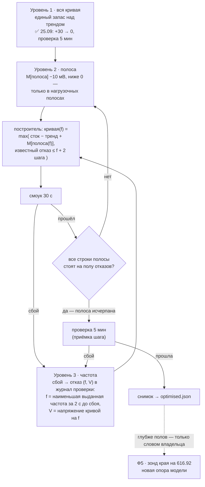
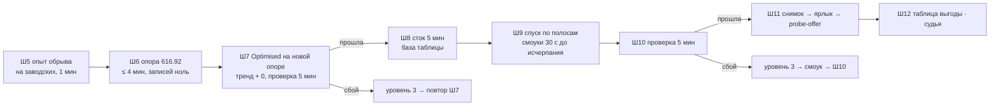

# План 105 — эпик 101, Ф2 (вторая часть): приближение «вся кривая → полоса → частота» и закрытие Ф2

> **Создан:** 2026-09-27 23:37 +03:00, сессия 106 · **Родитель:** `plans/101_EPIC_turnaround_silicon_model_and_whole_mode_validation.md`
> Ф2 (якорь: *«спуск запаса по 10 мВ во всех посещённых полосах → на первом сбое +2 шага в полосе сбоя → повторная
> проверка → снимок → ярлык → таблица выгоды»*) и Ф5 (якорь: *«шаг запаса вниз → проверка → принят (новый снимок) или
> храповик; зонд края…»*) · продолжение `plans/103` (Ш4–Ш7) · слово владельца 25.09 (`GOAL.md` → «⚡ КАРТОЧНЫЙ ВЕЧЕР
> 25.09»: *«нужна точность до частоты · Вся кривая -> полоса -> точка · так и делаем приближение»*; `ЗАКАЗ.md` §10)
> · `bugs/142` (опора 610.88)
> **Статус:** 🟡 ИДЁТ. Сессия 106 (27.09 23:37 … 28.09 00:03 +03:00 запись статуса, владелец у машины с 23:4x): Ш5 ✅ (P105-AC1: обрыв → 153 в
> ту же секунду, естественный конец → 0) · Ш8 ✅ сток 4 мин ПРОЙДЕНА, драйвер 0 событий (`runs/validate/2026-09-27T23-43-36/`)
> · Ш0 а/б ✅ в коде (худший случай за 8 чтений, нагрузка без обрыва; `--sustain` куска — `[NOT-TESTED]`), Ш0 в — сверка
> штампа ОТЛОЖЕНА до опоры 616.92 · Ш1 ✅ (запас < 0 в нагрузочных полосах, исчерпание полосы, мутации MN1–MN5) ·
> Ш6 ❌ две попытки опоры — отказ «режим не удержан 20 с» (форма нагрузки, `bugs/142`), записей ноль · Ш2–Ш4, Ш7, Ш9–Ш12 — нет
> **Вовне:** порядок вечера — владельцу в чат одной строкой (вето открыто); после Ф2 — оперплан Ф3

---

## Вектор цели

**Тип: Achieve.** Боль: уровень «вся кривая» исчерпан 25.09 — единый запас над касающимся трендом доведён до 0 и
прошёл проверку 5 мин, а спускаться дальше нечем: построитель отклоняет запас < 0 (`tools/curve-proposal.mjs`
`marginRefusal`), прибор не опускает запас ниже 0 (`mode-validate.nextMargins`), и сбой проверки поднимает целую
полосу, тогда как владелец спрашивает: *«А если будет зависать? но из-за одной точки? как ты её будешь искать?
Чтобы другие ещё поднять, а эту наоборот снизить?»*. Вдобавок кривая считается против опоры драйвера 610.88
(`bugs/142`), и две ошибки драйвера 25.09 не объяснены. Куда хотим: `Optimised` на опоре 616.92, с запасом,
спущенным ниже тренда в полосах, где карта живёт под нагрузкой, до известных отказов; сбой проверки поднимает
**окрестность своей частоты**, а не полосу; каждый шаг — одна команда.

**Что покупает спуск — арифметика по краям (замер 2026-09-27, `node tools/curve-proposal.mjs --margin 0`).** На
«тренд + 0» кривая стоит над границами известных краёв (отказ + 2 шага сетки) на **0…+20 мВ**: 2805 — +0 · 2842 —
+15 · 2865 — +10 · 2880 — +15 · 2887 — +20 · 2947 — +15 · 3015/3030 — +5. Значит, полосный спуск даст в рабочей
полосе ещё **~10–15 мВ** (✏️ расчёт построителя 27.09 при −30: 2800–2900 — до 20 мВ глубже, 2900–2950 — на 25–30), после чего кривая встанет на рабочие точки краёв, то есть на определение «протюнено
до края» владельца от 24.08. Глубже известных отказов — только через новые края на 616.92 (зонд, Ф5) и словом
владельца: эти отказы — зависания машины, а не придуманные запреты.

## Как устроено приближение

- **Нагрузочные полосы** — 2700–2800 · 2800–2900 · 2900–2950 · выше 2950: там карта живёт под игрой и прожигом
  (проверка 25.09: 2800–2900 — 49 %, 2900–2950 — 14 %, выше 2950 — 22 % времени) и там же лежат 13 из 14 краёв.
  Полосы ниже 2700 остаются на запасе ≥ 0: карта проходит их на простое и переходах, выгоды по ваттам там нет,
  а доказанная смерть 08.09 пришла именно на простое после записи (`researches/36`) — Парето и Мёрфи вместе.
- **Уровень частоты не требует нового механизма.** Построитель уже держит каждую строку не ниже «известный отказ на
  частоте ≤ f + 2 шага сетки» (физика: Vmin не убывает с частотой, `researches/09` §2.3). Сбой проверки
  становится ещё одним таким отказом; кривая поднимается у его частоты и выше неё до пола, остальные частоты
  продолжают спуск. Это и есть ответ на *«эту наоборот снизить, другие ещё поднять»*.
- **Приписка сбоя частоте — консервативно:** сэмплер пишет раз в 500 мс, поэтому берётся **наименьшая** выданная
  частота за 2 с до момента сбоя: пол действует на все частоты выше неё, и промах вниз невозможен. Смерть без
  долговечной пробы — прежний храповик всех полос (`nextMargins`).

## Критерии приёмки

| # | критерий | прибор | цель |
|---|---|---|---|
| P105-AC1 | причина событий `nvlddmkm` 153 в 19:01:08 и 19:27:07 25.09 названа управляемым опытом | Ш5: прожиг на заводской кривой, обрыв процесса `kill` на 20-й секунде; `npm run events -- --since <начало опыта>` | событие 153 есть после обрыва и нет при естественном конце — гипотеза «эхо нашего обрыва» подтверждена; иначе — опровергнута и названа |
| P105-AC2 | опора применения снята на 616.92 и применитель отвергает устаревшую по имени | `npm run curve -- --reference` · `npm run profile -- --selftest` | штамп `616.92`; блок «ОПОРА ЧУЖОГО ДРАЙВЕРА ОТВЕРГНУТА» красный на мутации «`cardStamp` не передан» |
| P105-AC3 | построитель строит запас < 0 в нагрузочных полосах, отклоняет его ниже 2700 по имени и печатает исчерпание полосы | `node tools/curve-proposal.mjs --band-margins 0,0,0,-10,-10,-10,-10` · `--selftest` | строк ниже пола отказов 0; строка «полоса упёрлась в известные отказы: k из n строк»; мутации MN1–MN3 красят свои блоки |
| P105-AC4 | сбой проверки становится отказом на своей частоте и поднимает только её окрестность | `npm run validate -- --selftest` (блок на построенных данных: сбой на 2865 при 880 мВ) | строки ≥ 2865 не ниже 880 + 2 шага; строки < 2865 не изменились; мутация «приписать заказанной, а не выданной» красная |
| P105-AC5 | шаг приближения — одна команда | `npm run validate -- --step --mode optimised --band-margins a,b,c,d,e,f,g --minutes 0.5` | документ → снимок → кандидат → проверка одной командой; сухой вариант `--dry-run` не пишет в карту |
| P105-AC6 | `Optimised` на опоре 616.92 со спущенным запасом прошёл проверку целиком | `runs/validate/<момент>/report.md` | ПРОЙДЕНА, 5 мин, драйвер 0 событий; запасы по полосам напечатаны в отчёте |
| P105-AC7 | режим на ярлыке | клик ⚖️ Optimised (агент, `explorer.exe`) → `node tools/probe-offer.mjs` · `npm run curve -- --progress` | ненулевых сдвигов > 0; РЕЖИМОВ ПРОВЕРЕНО ≥ 2/4 |
| P105-AC8 | таблица выгоды против стока | `npm run validate -- --compare --stock <захваты> --mode <захваты>` | Вт · °C · обороты · FPS с разбросом прибора; обороты ≤ 60 % |
| P105-AC9 | аварийных перезагрузок за вечер | журнал Windows, событие 6008 | ≤ 2 |

## Порядок вечера

Время карты: ~30–40 мин. Предел вечера и пределы длительности — `ЗАКАЗ.md` §8 (проверка ≤ 5 мин, смоук 30 с).

## Шаги

**Офлайн — без карты:**

- [ ] **Ш0. `bugs/142`, офлайн-половина.** (а) Записать в баг гипотезу и её улики: оба события 153 совпали с отказом
      чтения опоры, после которого `cmdTakeReference` обрывает прожиг `load.kill()` посреди работы ядра
      (`curve-store.mjs` ~3464); в проверках 25.09 прожиг кончался сам — событий 0. (б) Снятие опоры: вместо требования
      «два одинаковых чтения» — худший случай по каждой точке за N чтений (наименьшая частота точки; это и есть смысл
      опоры по `bugs/97`), прожиг — короткими кусками, остановка — ожиданием конца куска, без обрыва. (в) `cardStamp`
      передаётся применителю — включается ПОСЛЕ появления опоры 616.92 (иначе все режимы теряют базу).
      Самопроверки с мутациями на (б) и (в). *Якорь Ф2: «переснимаются первыми (`plans/102` Ш8, порядок дня)».*
- [ ] **Ш1. Отрицательная ветка запаса.** `marginRefusal`: целое число мВ, < 0 — только в нагрузочных полосах
      (граница 2700 — одна константа в `config.mjs` рядом с `MODE_BANDS`); `nextMargins`: пол 0 только для полос
      ниже 2700; построитель печатает по полосе «упёрлась в известные отказы: k из n строк». Блоки + мутации MN1
      (снять пол ниже 2700), MN2 (снять пол отказов), MN3 (перепутать знак). *Якорь Ф5: «шаг запаса вниз».*
- [ ] **Ш2. Уровень частоты.** Вердикт СБОЙ пишет в журнал проверки `failureAt: { mhz, voltageMv }` (наименьшая
      выданная частота за 2 с до сбоя; напряжение строки снимка на ней); построитель читает эти отказы вместе с
      отказами журнала развёртки как заслуживающие доверия. Блок P105-AC4 + мутация. *Якорь Ф2: «на первом сбое +2 шага».*
- [ ] **Ш3. Шаг — одна команда.** `validate --step`: построитель → документ (`--write-doc`, штамп карты) → снимок →
      `candidateProfile` → проверка; `--dry-run` — всё, кроме записи в карту. Композиция существующих функций, новой
      логики нет. *Якорь E101-AC5: «один шаг — одна команда, откат — одно действие».*
- [ ] **Ш4. Ворота офлайна.** `npm run check` · `npm run selftest:all` (55 наборов, красных 0) · `--step --dry-run`
      печатает план шага. Коммит.

**Живые — только при владельце у машины (`ЗАКАЗ.md` §8):**

- [ ] **Ш5. Опыт обрыва** (P105-AC1): заводская кривая, прожиг 60 с, `kill` на 20-й секунде; затем прожиг 30 с до
      естественного конца. Журнал событий после каждого. Записей в карту ноль.
- [ ] **Ш6. Опора 616.92** (P105-AC2): `npm run curve -- --take-reference` новой формой Ш0; затем `cardStamp` включается
      коммитом Ш0 (в).
- [ ] **Ш7. `Optimised` на новой опоре:** `validate --step --band-margins 0,0,0,0,0,0,0 --minutes 5`. Новая опора
      меняет применяемые сдвиги — принятое 25.09 не наследуется (`bugs/142`, решения агента).
- [ ] **Ш8. Сток 5 мин** той же смесью — база таблицы выгоды (`plans/103` Ш1 в пределе 5 мин).
- [ ] **Ш9. Спуск по полосам:** посещённые в Ш7 нагрузочные полосы −10 мВ за шаг, смоук 30 с, до исчерпания (все строки
      полосы на полу отказов) или до первого сбоя → уровень 3.
- [ ] **Ш10. Проверка 5 мин** последнего прошедшего смоука (P105-AC6).
- [ ] **Ш11. Принятие:** `profiles/optimised.json` → снимок Ш10, штамп 616.92 → ярлык ⚖️ Optimised запускает агент
      (`explorer.exe <.lnk>`) → `probe-offer` → `--progress` (P105-AC7).
- [ ] **Ш12. Таблица выгоды** (P105-AC8) → `MASTER_PLAN.md` «Четыре режима»; судья (`/fable-judge`); оперплан Ф3.

## Проверка наблюдением — где живут средства проверки

- Ш0–Ш3 рождают свои блоки в тех же шагах: `curve --selftest` (опора), `profile --selftest` (штамп), `node
  tools/curve-proposal.mjs --selftest` (MN1–MN3), `validate --selftest` (уровень частоты, `--step`); все — в `npm run
  selftest:all`.
- Живые шаги оставляют отчёты `runs/validate/<момент>/report.md` и прогонный отчёт вечера
  `testcases/reports/<дата>_approximation.md` (семь полей, `TESTING_FRAMEWORK.md`).

## Риски (Мёрфи)

- **Ярус 1 — машина.** Спуск ниже тренда вешает машину у края. Мера: шаг 10 мВ, пол известных отказов в построителе,
  полосы ниже 2700 не спускаются, смоук перед каждой проверкой, ≤ 2 перезагрузки (AC9); третья — вечер кончается на
  последней ПРОЙДЕННОЙ.
- **Ярус 1 — края сняты на 610.88.** Драйвер 616.92 мог сдвинуть потребность в напряжении, и пол отказов может
  оказаться ниже настоящего. Мера: сама проверка режима на 616.92; сбой → уровень 3 кладёт новый отказ уже на 616.92.
- **Ярус 2 — гипотеза Ш5 опровергнута** (событие 153 есть и без обрыва). Тогда правило `verdictOf` «любое событие =
  сбой» даст ложные сбои: `FORK:` у `verdictOf` ДО спуска (варианты — `plans/103` Ш1), консультация — `researches/30`.
- **Ярус 2 — опора снова не снимается.** Мера: худший случай за N чтений не требует совпадения; если и он не
  сходится — вечер идёт на старой опоре с названной ценой (подписи запаса неточны, проверка доказывает применённое).
- **Ярус 3 — полосы исчерпаются за 1–2 шага.** Это ожидаемо по арифметике (10–15 мВ); дальше — Ф5 словом владельца.

## Решения агента `[AI]` — пересматриваемы, вето владельца открыто

- Порядок: **сначала глубже `Optimised`, затем Ф3** (`Max Perfomance`, `Silent Cold`). Кривая у всех режимов одна
  (`ЗАКАЗ.md` §1): спуск после Ф3 потребовал бы перепроверки трёх режимов на каждом шаге, спуск до Ф3 — одной.
- Граница нагрузочных полос — 2700 МГц; полосы ниже не спускаются ниже тренда.
- Приписка сбоя — наименьшая выданная частота за 2 с; сбой — отказ на частоте, а не храповик полосы.
- Шаг спуска — прежние 10 мВ; приёмка шага — проверка 5 мин после смоуков.
