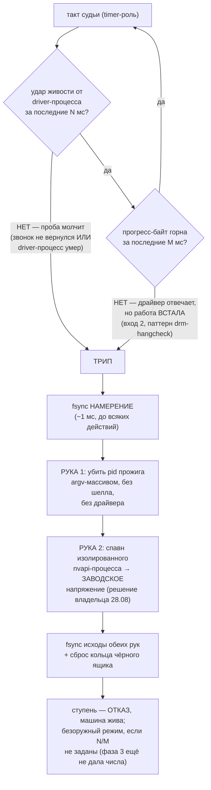

# План 55 — эпик 51 фаза 2: офлайн-скелет предохранителя (deadman-фьюз)

> **Создан:** 2026-08-28 20:4x +03:00 · **Родитель:** `plans/51` → фазовая таблица, строка
> «2 — ⚡ предохранитель, офлайн-скелет» (ревизия 28.08) · разведка `researches/21` §5 ·
> слово владельца — `GOAL.md` → «⚡ Механизм назван владельцем: ПРЕДОХРАНИТЕЛИ»
> **Статус:** 🟡 ГОТОВ К ИСПОЛНЕНИЮ — вся фаза офлайн: фикстуры + виртуальная карта, ноль
> записей в живую карту (E51-AC4 продолжает действовать)

---

## Вектор цели фазы

**Боль.** Сторож смерти видит миллисекундную живость карты, но только РЕГИСТРИРУЕТ: строка
пишется после возврата звонка, и роковой звонок, который не вернулся, не оставляет ничего
(28.08: оба файла пусты). Машина зависает, владелец идёт к кнопке, диски рискуют
(`researches/17`).

**Куда хотим.** Процессы сторожа становятся ПРЕДОХРАНИТЕЛЕМ: отсутствие удара живости дольше
N мс — само по себе команда спасать, в реальном времени, в памяти, без диска в контуре. Две руки:
снять нагрузку (без драйвера), поднять напряжение (изолированно). К закрытию фазы всё это
доказано на фикстурах и виртуальной карте; живой машины фаза не касается.

**Тип цели:** Achieve (новый контур) + Avoid (ложное спасение — риск (г) эпика; контур, который
сам вешает систему).

## Критерии приёмки фазы (все — наблюдаемые, офлайн)

- **P55-AC1.** Шкала: поведение фьюза на фикстуре «проба застыла» (удары прекратились, N истёк) ·
  Мера: селфтест-блок · Цель: **спасение запущено, руки в порядке слова владельца: сперва
  нагрузка, потом напряжение**.
- **P55-AC2.** Шкала: поведение на фикстуре «прогресс горна застыл при живой пробе» · Мера:
  селфтест-блок · Цель: **спасение запущено** (вход 2 работает независимо от входа 1).
- **P55-AC3.** Шкала: запись намерения ДО рук · Мера: блок читает журнал фьюза после
  фикстурного трипа · Цель: **строка намерения существует и предшествует строкам исходов рук**.
- **P55-AC4.** Шкала: мутационное доказательство · Мера: мутанты «фьюз не срабатывает», «рука 1
  не вызвана», «удар не отправлен» · Цель: **каждый мутант красный** (сторож доказанно умеет
  краснеть, `TESTING_FRAMEWORK.md`).
- **P55-AC5.** Шкала: чёрный ящик · Мера: блок «трип посреди потока тактов» · Цель: **кольцо
  сброшено при трипе и содержит суб-10мс такты, которых нет в файле промахов**.
- **P55-AC6.** Шкала: записей в живую карту за фазу · Мера: журнал развёртки + строка доставки ·
  Цель: **0** (вся фаза на моках и виртуальной карте).
- **P55-AC7.** Шкала: батарея · Мера: `npm run selftest:all` · Цель: **0 красных**.

## Конструкция (из `researches/21` §5, зафиксировано до кода)

Схема контура и лестницы фаз — в мета-плане (`plans/51`, две mermaid-схемы). Здесь — схема
РЕШЕНИЯ судьи, того самого куска, который эта фаза строит и доказывает на фикстурах:

Решения, принятые фазой (обратимые, каждое — одна константа/один модуль):

1. **Судья — процесс timer-роли.** Он один никогда не трогает драйвер, потому не может зависнуть
   вместе с ним (риск (д) эпика). Драйверный процесс — только источник ударов.
2. **Канал ударов — датаграммы на loopback** (в памяти ОС, миллисекундный, без диска — T3
   владельца). Джиттер канала меряется фикстурой; если на этой машине он ест бюджет — канал
   меняется на именованный пайп тем же контрактом (решение по замеру, шаг 1).
3. **Рука 2 — СТОК (`zeroCurve`): ✅ РЕШЕНО ВЛАДЕЛЬЦЕМ 2026-08-28 («Заводское»)** — спасаем
   машину, не ступень. «Ступень выше» остаётся тем же вызовом с другим вектором на будущее,
   но дефолт больше не развилка.
4. **N и M в фазе 2 — параметры, не числа.** Числа выведет фаза 3 из пола под нагрузкой; скелет
   принимает их аргументами и отказывается стартовать без них ВЗВЕДЁННЫМ (безоружный режим —
   только наблюдение, как сторож сейчас).
5. **Чёрный ящик** — кольцо всех тактов (обещано/факт/звонок) в памяти каждого наблюдателя;
   сброс с fsync ПРИ трипе и на закрытии ступени. НЕ в такте контура.

## Шаги

- [x] **1. Контракты каналов** *(якорь: мета-план, строка фазы 2 — «две руки спасения»,
  «сердцебиение прогресса»)*: контракт в шапке `fuse.mjs` — удар `0x01` / прогресс `0x02` одной
  датаграммой, журнал `runs/death-watch/*-fuse.jsonl` (intent/outcome), кольцо `*-fuse-ring.jsonl`.
  Джиттер-замер: `fuse --jitter-floor` (отправитель — настоящий цикл пробы, `--beat-sender`).
  Числа 60-секундного прогона — в шапке модуля. ✅ 2026-08-28
- [x] **2. Чистая логика фьюза** *(якорь: «таймер N мс, тикающий НЕЗАВИСИМО от возврата пробы»)*:
  `judgeLiveness` / `decideRescue` — чистые, граница ВКЛЮЧИТЕЛЬНО (канон `classifyTick`);
  невзведённый наблюдает; непроведённый прогресс не трипает. Блоки P55-AC1/AC2 зелёные. ✅
- [x] **3. Руки спасения** *(якорь: «актор timer-роли убивает pid; актор driver-роли пишет
  writeCurve/zeroCurve»; порядок — слово владельца)*: `makeKillHand` — taskkill argv-массивом
  (EXP-0057); `fuse-rescue-hand.mjs` — изолированный процесс, сток с проверкой чтением (EXP-0024),
  судья его НЕ ждёт. Порядок рук закреплён блоком. ✅
- [x] **4. Проводка в сторожа** *(якорь: строка фазы 2 целиком)*: driver-роль шлёт удар после
  каждого успешного возврата пробы (ТОЛЬКО status 0 — потерянная карта отвечает ошибкой мгновенно,
  и удар по ней усыпил бы фьюз на трупе); режимы `--probe` (живой, для фаз 4–5) и `--beat-sender`
  (безкарточный двойник цикла). Интеграционный блок: живой судья + настоящие датаграммы. ✅
  ⚠️ **Вход 2 (прогресс горна) — ЯВНОЕ РЕШЕНИЕ, не молчаливый провал:** горн исполняется через
  `spawnSync` на всю 10-секундную форму, его stdout буферизован до конца — миллисекундного
  прогресс-канала без перестройки ядра замера не существует, а перестройка = перекомпиляция CUDA
  с перепрошивкой контрольных сумм манифеста. Порт входа 2 в судье ГОТОВ и доказан фикстурой
  (P55-AC2); живой источник подключается отдельным решением, когда/если появится дешёвый канал.
  Боевой фьюз едет на входе 1 — проба и так ходит через умирающий драйвер в карту.
- [x] **5. Чёрный ящик** *(якорь: «кольцо суб-10мс тактов… сброс ПРИ срабатывании»)*: кольцо
  15 000 тактов (~30 с при 2 мс), сброс при трипе и на закрытии; P55-AC5 зелёный. ✅
- [x] **6. Мутационное доказательство** *(якорь: ворота фазы — «сторожа доказанно умеют
  краснеть»)*: мутант «граница `>=`→`>`» → 1 красный (граничный блок) · «рука 1 выфильтрована» →
  6 красных · «отправка удара удалена» → 1 красный (получено 0). Каждый откачен, батарея после —
  зелёная. ✅ 2026-08-28
- [x] **7. Батарея и строка доставки**: **32 набора / 1460 блоков / 0 красных** (fuse 27,
  перемерено 2026-08-28 20:58); строка доставки не изменилась (краёв 11/389, не тронуто 299) —
  **карта фазой не тронута** (P55-AC6 ✅, P55-AC7 ✅). Джиттер-пол канала: три прогона, каждый —
  находка (12,72 % заблокированный loop → 14 % пер-процессный квант → **98,86 %**, медиана
  2,01 мс, max 10,46 мс); история в шапке `fuse.mjs`, урок EXP-0165. ✅ 2026-08-28

## Статус фазы: шаги 1–7 исполнены; закрытие фазы — за судейской приёмкой

Осталось до ворот фазы (мета-план, строка 2): пас `/fable-judge` — владелец согласился звать
независимого контролёра (`KAGO-team-verifier`, окно + строка-адрес, инструктаж `plans/54` §7).
После вердикта — оперплан фазы 3 (пол под нагрузкой, при владельце, БЕЗ поиска края).

## Риски фазы

- **Джиттер канала ударов на Windows** съест бюджет N → замер шагом 1 ДО остальной проводки;
  запасной канал назван (пайп).
- **Зависший драйверный звонок валит весь driver-процесс** (kernel-side) → судья и рука 1 живут
  в другом процессе by design; блок «источник ударов умер молча» обязателен (это тот же трип).
- **Горн окажется дорогим для прогресс-канала** → вход 2 отделяется явным решением, фьюз едет
  на входе 1 (проба — тоже прогресс: она ходит через драйвер в карту).

## Верификация фазы целиком

`npm run selftest:all` (батарея, ожидание: +1–2 набора к 31) · `npm run curve -- --progress`
(строка доставки не изменилась: карта не тронута) · чтение `runs/death-watch/` — фикстурные
артефакты фьюза лежат в песочнице тестов, НЕ в боевой папке (урок EXP-0025: тест, пишущий в
боевое состояние, фабрикует форензику).
