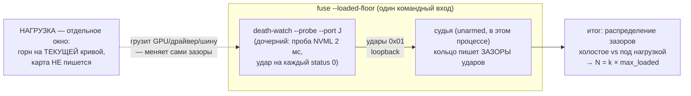

# План 56 — эпик 51 фаза 3: пол шума ПОД НАГРУЗКОЙ и вывод боевого N

> **Создан:** 2026-08-28 21:3x +03:00 · **Родитель:** `plans/51` → фазовая таблица, строка
> «3 — пол шума ПОД НАГРУЗКОЙ, вывод N и M» · предыдущая фаза: `plans/55` ✅ ОТСУЖЕНА
> (VERIFIED WITH CAVEATS — её оговорка про `--out` закрывается здесь шагом 1)
> **Статус:** ✅ ИСПОЛНЕН 2026-08-28 21:3x — N = 60 мс выведено из двух живых замеров под горном
> (§Итог замера); карта не писана (строка доставки неизменна); батарея 32 набора / 0 красных
> **Вовне:** число N (боевой порог deadman) → взведение фьюза в фазах 4–5; распределения →
> архив фазы 6

---

## Вектор цели фазы

**Боль.** Фьюз построен и отсужен, но НЕ ВЗВЕДЁН: N — параметр без числа. Назначить N из головы
запрещено (три двери, `plans/51` риск (а): тревога, которая врёт, отменяет весь прибор). Пол шума
канала измерен только на холостом ходу (98,6–98,9 %, max зазор 8–10 мс) — а фьюз поедет РЯДОМ С
ПРОЖИГОМ, где планировщик, шина и драйвер нагружены, и зазоры могут быть другими.

**Куда хотим.** Распределение зазоров ударов при живом горне на БЕЗОПАСНОМ напряжении измерено;
боевое N выведено формулой из max этого распределения с названным запасом; зазор до предвестников
удушения (3042/4490 мс) назван явно. Фьюз получает право взводиться.

**Тип цели:** Achieve (число из замера) + Avoid (N, выдуманное из головы или из холостого пола).

## Критерии приёмки фазы

- **P56-AC1.** Шкала: замер под нагрузкой · Мера: ≥ 60 с горна при ударах пробы · Цель:
  **распределение зазоров приложено** (медиана · p99 · max · доставка %), рядом холостое для
  сравнения.
- **P56-AC2.** Шкала: вывод N · Мера: формула в документе · Цель: **N = k × max_loaded, k ≥ 5,
  и N ≤ 1/10 предвестника удушения 3042 мс** — оба плеча зазора названы числом.
- **P56-AC3.** Шкала: записей в карту за фазу · Мера: строка доставки до/после · Цель: **0**
  (нагрузка идёт на ТЕКУЩЕЙ кривой, ничего не пишем и не двигаем).
- **P56-AC4.** Шкала: оговорка судьи фазы 2 · Мера: `fuse --judge --out <путь>` существует и
  покрыт блоком · Цель: **закрыта** (песочные репетиции не пишут в боевую папку — EXP-0025).
- **P56-AC5.** Шкала: батарея · Мера: `npm run selftest:all` · Цель: **0 красных**.

## Схема замера (три процесса, кто что меряет)

## Шаги

- [x] **1. `--out` у судьи + песочница** *(якорь: оговорка вердикта `plans/55`)*: флаг есть, блок
  живым CLI доказывает: журнал и кольцо в песочнице, боевая папка НЕ пополнилась. P56-AC4 ✅
- [x] **2. Режим `--loaded-floor`** *(якорь: мета-план ф.3)*: судья unarmed + живая проба ребёнком
  на его порту; разбор зазоров — `gapsFromRing` (локальные максимумы пилы; хвост без удара — не
  зазор; медиана по сырой пиле ≈ gap/2 — отвергнута как бухгалтерский трюк) + `distStats`. Блоки
  на фикстурной пиле. По дороге оплачены и починены: кольцо 30 с резало 90-секундный прогон
  (ёмкость теперь от длины прогона) · кириллица+бэкслэши в фоновом grep молча крутили цикл
  ожидания (маркер `LOAD-NOW` — ASCII). ✅
- [x] **3. Разведка команды нагрузки** *(якорь: «на доказанно безопасной ступени»)*: выбран ПРЯМОЙ
  запуск `workloads/furnace.exe 2400 8192 256 64 --sustain 60` (уровень 0 лестницы, ~307 Вт,
  никакой машинерии между командой и нагрузкой); карта на стоке после перезагрузки; невинность
  доказана строкой доставки до/после. ✅
- [x] **4. Живой замер ×2** *(якорь: ворота ф.3)*: две 90-секундные сессии, горн 60 с с ~12-й
  секунды, контрольные суммы горна идентичны (`2fa22073660f99b5`), 0 плохих запусков. ✅
- [x] **5. Вывод N и фиксация** *(якорь: «N и M выводятся ИЗ ЗАМЕРА»)*: §Итог замера ниже;
  `DERIVED_ARM_N_MS = 60` в `fuse.mjs` с блоком на оба плеча; M остаётся невзведённым (вход 2 —
  явное решение `plans/55` шага 4). ✅

## Итог замера (2026-08-28 21:36–21:39, карта на стоке, записей в карту 0)

| прогон | ударов | зазоры: медиана | p99 | **max** | такт судьи max |
|---|---|---|---|---|---|
| холостой (дым, 8 с) | 97,53 % | 1,95 мс | 4,91 мс | 5,91 мс | 5,05 мс |
| **под горном №1** (90 с, горн 60 с, 215 запусков) | 99,01 % | 1,96 мс | 4,42 мс | **9,57 мс** | 5,43 мс |
| **под горном №2** (90 с, горн 60 с, 216 запусков) | 98,91 % | 1,96 мс | 4,45 мс | **7,28 мс** | 5,43 мс |

**N = 60 мс.** Оба плеча: `k = 60/9,57 = 6,3 ≥ 5` над max под нагрузкой (и 5,7× над худшим
зазором ВСЕХ полов — 10,46 мс холостого джиттер-пола); `60 ≤ 302 мс` — впятеро ниже потолка
(десятой предвестника удушения 3042 мс); 11× над худшим тактом самого судьи (5,43 мс — судья не
трипнет на собственном опоздании). Нагрузка меняет хвост распределения (max 5,91 → 9,57), но не
медиану — ровно то, ради чего пол мерился под горном, а не на холостом ходу.

## Риски

- **Нагрузка задушит сам замерный контур** (судья и проба — тоже процессы этой машины): это не
  порча замера, а ЕГО СМЫСЛ — фьюз поедет ровно в этих условиях; потому N выводится из
  нагруженного max, а не из холостого.
- **Разовый выброс max** (антивирус, фоновая задача): потому ×2 прогона и k ≥ 5 сверху.
- **Команда нагрузки окажется пишущей** — ловится шагом 3 до живого замера (строка доставки).

## Верификация фазы целиком

`npm run selftest:all` (0 красных) · `npm run curve -- --progress` до/после (без изменений) ·
распределения приложены в этом документе · N проходит обе границы P56-AC2.
