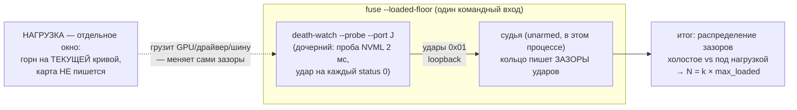

# План 56 — эпик 51 фаза 3: пол шума ПОД НАГРУЗКОЙ и вывод боевого N

> **Создан:** 2026-08-28 21:3x +03:00 · **Родитель:** `plans/51` → фазовая таблица, строка
> «3 — пол шума ПОД НАГРУЗКОЙ, вывод N и M» · предыдущая фаза: `plans/55` ✅ ОТСУЖЕНА
> (VERIFIED WITH CAVEATS — её оговорка про `--out` закрывается здесь шагом 1)
> **Статус:** 🟡 ГОТОВ К ИСПОЛНЕНИЮ — вся фаза БЕЗ записей в карту (E51-AC4); поиска края НЕТ,
> потому по канону Q4 (интервью 017) исполнима и без владельца; при владельце — лучше
> **Вовне:** число N (боевой порог deadman) → взведение фьюза в фазах 4–5; распределения →
> архив фазы 6

---

## Вектор цели фазы

**Боль.** Фьюз построен и отсужен, но НЕ ВЗВЕДЁН: N — параметр без числа. Назначить N из головы
запрещено (три двери, `plans/51` риск (а): тревога, которая врёт, отменяет весь прибор). Пол шума
канала измерен только на холостом ходу (98,6–98,9 %, max зазор 8–10 мс) — а фьюз поедет РЯДОМ С
ПРОЖИГОМ, где планировщик, шина и драйвер нагружены, и зазоры могут быть другими.

**Куда хотим.** Распределение зазоров ударов при живом горне на БЕЗОПАСНОМ напряжении измерено;
боевое N выведено формулой из max этого распределения с названным запасом; зазор до предвестников
удушения (3042/4490 мс) назван явно. Фьюз получает право взводиться.

**Тип цели:** Achieve (число из замера) + Avoid (N, выдуманное из головы или из холостого пола).

## Критерии приёмки фазы

- **P56-AC1.** Шкала: замер под нагрузкой · Мера: ≥ 60 с горна при ударах пробы · Цель:
  **распределение зазоров приложено** (медиана · p99 · max · доставка %), рядом холостое для
  сравнения.
- **P56-AC2.** Шкала: вывод N · Мера: формула в документе · Цель: **N = k × max_loaded, k ≥ 5,
  и N ≤ 1/10 предвестника удушения 3042 мс** — оба плеча зазора названы числом.
- **P56-AC3.** Шкала: записей в карту за фазу · Мера: строка доставки до/после · Цель: **0**
  (нагрузка идёт на ТЕКУЩЕЙ кривой, ничего не пишем и не двигаем).
- **P56-AC4.** Шкала: оговорка судьи фазы 2 · Мера: `fuse --judge --out <путь>` существует и
  покрыт блоком · Цель: **закрыта** (песочные репетиции не пишут в боевую папку — EXP-0025).
- **P56-AC5.** Шкала: батарея · Мера: `npm run selftest:all` · Цель: **0 красных**.

## Схема замера (три процесса, кто что меряет)

## Шаги

- [ ] **1. `--out` у судьи + песочница** *(якорь: оговорка вердикта `plans/55`)*: CLI `--judge`
  принимает `--out <файл>`; кольцо и журнал ложатся рядом с ним; блок селфтеста. Закрывает
  P56-AC4.
- [ ] **2. Режим `--loaded-floor`** *(якорь: мета-план ф.3 — «распределение задержки звонка … под
  горном»)*: судья unarmed в основном процессе + спавн `--probe` со своим портом; по завершении —
  разбор СОБСТВЕННОГО кольца: распределение `beatSilenceMs` по тактам (медиана/p99/max/доставка).
  Печать двух колонок: замер и холостой эталон. Блоки на фикстурном кольце.
- [ ] **3. Разведка команды нагрузки** *(якорь: «на доказанно безопасной ступени»)*: выбрать
  команду горна, которая НЕ пишет в карту (кандидаты: формы `stress-tester`
  (`furnace/sustained@0` на текущей кривой) · `npm run bench` · `npm run gfx`-нагрузка);
  доказательство невинности — строка доставки до/после холостого запуска этой команды.
- [ ] **4. Живой замер** *(якорь: ворота ф.3)*: `--loaded-floor` 90 с: первые ~15 с холостых,
  затем нагрузка (окно 2) ≥ 60 с. Повторить ×2 для устойчивости max. Владельцу — приглашение
  смотреть; по канону Q4 присутствие НЕ обязательно (края нет: кривая не трогается).
- [ ] **5. Вывод N и фиксация** *(якорь: «N и M выводятся ИЗ ЗАМЕРА»)*: N по P56-AC2; число и
  формула — в этот план (раздел «Итог замера»), в шапку `fuse.mjs` и в `plans/51`; M остаётся
  невзведённым (вход 2 — отдельное решение, `plans/55` шаг 4). Батарея, строка доставки, коммит.

## Риски

- **Нагрузка задушит сам замерный контур** (судья и проба — тоже процессы этой машины): это не
  порча замера, а ЕГО СМЫСЛ — фьюз поедет ровно в этих условиях; потому N выводится из
  нагруженного max, а не из холостого.
- **Разовый выброс max** (антивирус, фоновая задача): потому ×2 прогона и k ≥ 5 сверху.
- **Команда нагрузки окажется пишущей** — ловится шагом 3 до живого замера (строка доставки).

## Верификация фазы целиком

`npm run selftest:all` (0 красных) · `npm run curve -- --progress` до/после (без изменений) ·
распределения приложены в этом документе · N проходит обе границы P56-AC2.
