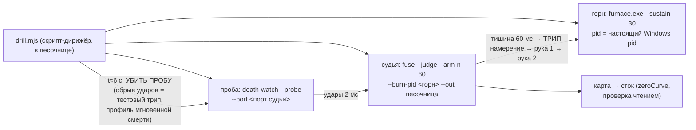

# План 57 — эпик 51 фаза 4: живая репетиция рук (тестовый трип без края)

> **Создан:** 2026-08-28 21:4x +03:00 · **Родитель:** `plans/51` → строка «4 — живая репетиция
> рук, без края» · предыдущие: `plans/55` ✅ (скелет, отсужен) · `plans/56` ✅ (N = 60 мс)
> **Статус:** ✅ ИСПОЛНЕН 2026-08-28 21:4x — спасение отработало живьём конец-в-конец
> (§Итог репетиции); две находки оплачены и починены (EXP-0166)
> **Вовне:** времена рук (E51-AC7) → взведение фьюза на боевом дежурстве (фаза 5)

## Вектор цели фазы

**Боль.** Руки доказаны на моках. Живая рука 1 (taskkill настоящего горна) и живая рука 2
(настоящий `zeroCurve` с чтением) не исполнялись ни разу; их ВРЕМЯ не названо — а бюджет спасения
при удушении конечен.

**Куда хотим.** Один настоящий трип на живой машине: судья с боевым N=60 видит обрыв ударов,
убивает настоящий горн, возвращает карту в сток; обе руки с секундомером; журнал читается.

## Критерии приёмки

- **P57-AC1.** Трип настоящий: судья armed N=60 трипает на обрыве ударов (профиль мгновенной
  смерти — пробу убиваем снаружи), причина в журнале `beat-silence`, тишина ≈ 60–65 мс.
- **P57-AC2** *(= E51-AC7)***.** Обе руки исполнились на живой машине, **время каждой названо**;
  рука 1 подтверждена исчезновением pid горна; рука 2 — её собственной строкой «сток подтверждён
  чтением» (remainingNonZero 0).
- **P57-AC3.** Журнал полон и в порядке: намерение → исход руки 1 → исход руки 2 → строка руки 2
  из её процесса; кольцо сброшено.
- **P57-AC4.** Артефакты репетиции — в песочнице (`--out`), боевая папка не тронута (EXP-0025).
- **P57-AC5.** Честность про запись: рука 2 делает ОДНУ настоящую запись — нули поверх стока
  (карта после перезагрузки и так на стоке; смещений не применяем — E51-AC4 не размывается).

## Схема репетиции

## Шаги

- [x] 1. Скрипт-дирижёр в песочнице (не в кодовой базе — одноразовый): горн → судья (парсинг
  порта) → проба → t+6 c убить пробу → дождаться судьи (ожидаем код 2 = трип) → проверить pid
  горна исчез → распечатать журнал и времена. ✅
- [x] 2. Прогон репетиции — ОБА названных риска выстрелили и оплачены: рука 1 через taskkill —
  131,95 мс > N (заменена сисколлом `process.kill` + смерть подтверждается пробой сигналом 0 +
  откат на taskkill /T для деревьев) · рука 2 молчала — недетачнутый ребёнок на этой машине
  умирает с родителем, а судья выходит через ~100–200 мс после трипа (`detached: true`, доказано
  тремя спавнами: родитель жив 3 с / detached-сирота / недетачнутый-сирота; EXP-0166). ✅
- [x] 3. Фиксация времён (§Итог ниже), `plans/51` E51-AC7, батарея, строка доставки, коммит. ✅

## Итог репетиции (вторая, после починок; 2026-08-28 21:49)

| момент | время | свидетель |
|---|---|---|
| обрыв ударов (проба убита) | t = 0 | дирижёр |
| **ТРИП** `beat-silence` | **61,46 мс** (N=60 + такт судьи) | намерение в журнале, fsync |
| **рука 1: горн МЁРТВ** (подтверждено пробой сигналом 0) | **+0,26 мс** | исход в журнале; pid исчез |
| рука 2 отправлена (detached) | +5,69 мс | исход в журнале |
| **сток подтверждён ЧТЕНИЕМ** (остаточных смещений 0) | **+1148,69 мс** | собственная строка руки 2 |
| судья вышел, кольцо сброшено (2582 такта) | +99 мс | код 2; кольцо в песочнице |

**Прочтение E51-AC7 честно:** обе руки ОТПРАВЛЕНЫ судьёй за ≤ 6 мс (≪ N=60) и нагрузка снята за
0,26 мс; ПОДТВЕРЖДЁННЫЙ сток — 1,15 с, потому что открытие NVAPI само стоит сотни мс, и под 60 мс
он не влезет никогда. Этого и не требуется: бюджет спасения при удушении — секунды (предвестники
3042/4490 мс), и 1,15 с сидит в нём втрое. Первая репетиция (до починок): трип 60,62 мс ·
taskkill 131,95 мс · строка руки 2 не пришла вовсе — оба дефекта видны только живьём, ради этого
фаза и существовала.

## Риски — как отработали

- **Рука 1 медленнее N** — ВЫСТРЕЛИЛ (131,95 мс) и закрыт сисколлом (0,26 мс, в 500 раз быстрее).
- **Рука 2 и умирающий родитель** — выстрелил в неожиданной форме: убил руку не драйвер, а ВЫХОД
  СУДЬИ (недетачнутый ребёнок умирает с родителем). Закрыт `detached: true` + блок селфтеста.
