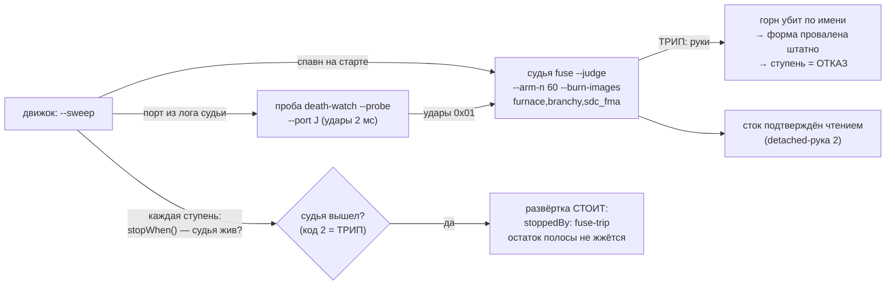

# План 58 — эпик 51 фаза 5: боевое дежурство (фьюз взведён на каждом живом прогоне)

> **Создан:** 2026-08-28 21:5x +03:00 · **Родитель:** `plans/51` → строка «5 — 🚑 боевое
> дежурство» · предыдущие: `plans/55–57` ✅ (скелет · N=60 · руки живьём)
> **Статус:** 🟢 ПРОВОДКА ИСПОЛНЕНА 2026-08-28 22:0x (шаги 1–3 ✅, батарея 32/1472/0). Живой дым
> (P58-AC5) ОТЛОЖЕН словом владельца — дословно: «сегодня работаем только на виртуальной
> видеокарте. ей взвод безопасности не нужен» (ворота полу-взведённого safe-mode остановили дым
> штатно; у виртуального стенда входа развёртки нет — дым едет первым делом следующего карточного
> вечера). ПРИЁМКА фазы (P58-AC6 = E51-AC6) — на живых вечерах по построению
> **Вовне:** каждый живой прогон отныне идёт под взведённым фьюзом; спасённая ступень — ОТКАЗ

## Вектор цели фазы

**Боль.** Фьюз спасает — но только там, где его подняли руками. Движок на живом прогоне
поднимает голого регистратора (`--floor`), который умеет лишь записывать смерть.

**Куда хотим.** Развёртка сама поднимает связку судья(N=60)+проба; трип останавливает развёртку
штатным механизмом (не подделкой вердикта); убитый рукой 1 горн проваливает форму штатной
дорогой оракула — ступень закрывается ОТКАЗОМ без нового кода записи.

## Критерии приёмки

- **P58-AC1.** Развёртка поднимает судью и пробу сама; в логе прогона — их pid и порт; при
  выходе развёртки всадники гаснут.
- **P58-AC2.** Судья в режиме движка вооружён рукой 1 ПО ИМЕНАМ (`--burn-images furnace.exe,…`):
  pid горна недоступен снаружи `spawnSync` по построению — убийство по образу, argv-массивом.
- **P58-AC3.** Трип → развёртка останавливается ДО следующей ступени с именованной причиной
  (`stopWhen` в `sweepRange`, дефолт null = прежнее поведение); блок в селфтесте движка.
- **P58-AC4.** Ступень, чей горн убит рукой 1, закрывается ОТКАЗОМ существующей дорогой оракула
  (мёртвый процесс = проваленная форма) — новых путей записи НЕТ.
- **P58-AC5.** Батарея 0 красных; дымовой прогон: развёртка по ЗАКРЫТОЙ полосе (жечь нечего,
  карта не пишется) поднимает и гасит всадников.
- **P58-AC6** *(= E51-AC6, живая приёмка — БУДУЩИЕ вечера)*: спасение при удушении ≥ 1 при
  владельце; ложных срабатываний 0; чёрный ящик прочитан после каждого случая.

## Схема дежурства

## Шаги

- [x] 1. `fuse.mjs`: рука 1 по именам (`makeImageKillHand`, taskkill `/IM <имя> /F` argv-массивом;
  «образ не найден» = не отказ), `--burn-images` в CLI, блоки.
- [x] 2. `engine.mjs` (+3 блока, движок 367→370): `stopWhen` в `sweepRange` (проверка перед ступенью; дефолт null); блок в
  селфтесте движка «трип после первой ступени — вторая не жжётся, причина названа».
- [x] 3. Проводка всадников: судья+проба вместо `--floor`-регистратора; `DERIVED_ARM_N_MS` из
  fuse.mjs (один источник); гашение на тех же путях, что у сэмплера.
- [x] 4. Батарея 32/1472/0 ✅; дым отложен (см. Статус); STATUS; коммит. Интент смерти 2137/770 остаётся в журнале до первой живой развёртки — сложится сам.

## Риски

- **Живой путь движка** — правки точечные (параметр с дефолтом + замена спавна), доказательство —
  батарея (367 блоков движка) + дым по закрытой полосе без единого прожига.
- **Ложный трип на дежурстве** глушит вечер — цена названа риском (г) эпика; N=60 несёт 6×
  запас, счёт ложных ведёт приёмка P58-AC6.
- **Судья умер сам (не трип)** — `stopWhen` не отличает «вышел кодом 2» от «упал»: ОБА случая
  останавливают развёртку (прогон без фьюза запрещён этой же фазой), причина в тексте различена.
