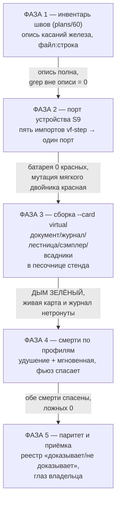
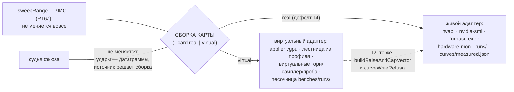

# Эпик 59 — ЦИФРОВОЙ ДВОЙНИК карты как РАВНОПРАВНЫЙ СТЕНД: движку всё равно, кого тюнить

> **Термин — слово владельца (2026-08-28): «digital twin».** Виртуальная карта проекта — цифровой
> двойник ЕГО экземпляра (derive из его словарей, смерти из его архивов); таксономия и источники —
> `researches/22` §3а. Эпик достраивает digital shadow до digital twin: отлаженное на двойнике
> (N, репетиции спасения) едет на живую карту.

> **Создано:** 2026-08-28 22:3x +03:00 · **Родитель:** слово владельца дословно — `GOAL.md` →
> «🖥 ВИРТУАЛЬНАЯ КАРТА — РАВНОПРАВНЫЙ СТЕНД» (2026-08-28 вечер) · разведка `researches/22`
> **Статус:** 🟠 В РАБОТЕ — фазы 1–4 ✅ (1: `researches/23` · 2: `plans/61` · 3: `plans/62` ·
> 4: `plans/63` — обе смерти спасены, ЗАВИС полом, ложных трипов 0); осталась фаза 5 —
> паритет и приёмка владельца, оперплан `plans/64`
> **Мораторий:** идёт при моратории по прямому слову владельца («это эпик») и в связке с
> критическим путём: приёмка предохранителя (эпик 51 фаза 5) требует репетиций смертей, которые
> живой карте не закажешь.
> **Наружу:** дым живого пути и отладка предохранителей переезжают на виртуалку; живая карта
> остаётся единственным источником ПРАВДЫ о кремнии (T5 не размывается).

## Заказ владельца, дословно

> *«разаиввем стенд виртуальной видеоккрты, чтобы она вела себя, как реальная. чтобы нашему
> движку каго было почти всё равно какую видеокарту тюнить, и на какой отлаживать предохранители,
> на реальной или на виртуальной. делаем так, чтобы смоук был возможен на виртуалке. это эпик.»*

## Вектор цели

**Боль, показанная этим же вечером.** Дым фазы 5 предохранителя упёрся в ворота safe-mode, а
владелец сказал «сегодня только виртуалка» — и дыму оказалось негде жить: живой путь движка
(`--sweep` со всадниками) не умеет собираться против виртуальной карты, хотя сама она глубока
(96 блоков, край, модель отказов, ЗАВИС). Каждая репетиция спасения сегодня стоит риска живой
машине; каждый дефект проводки ловится только живым вечером.

**Куда хотим.** `npm run engine -- --sweep --card virtual …` проходит ТОТ ЖЕ путь, что живой
прогон: всадники поднимаются, ступени жгутся виртуальным горном, таблица едет, край находится,
смерти играются по измеренным профилям, фьюз спасает, полоса встаёт — и всё это не касаясь ни
живой карты, ни её документа, ни боевого журнала. Живому вечеру остаётся то, что умеет только
кремний: правда о вольтах.

**Тип цели:** Achieve (равноправная сборка) + Avoid (двойник мягче оригинала; виртуальная запись
в боевое состояние — класс EXP-0025).

## Инварианты эпика (нарушение любого = красный, без обсуждения)

- **I1.** Виртуальный прогон НЕ касается: живой карты (ни одного NVAPI/NVML/nvidia-smi вызова),
  `curves/measured.json`, боевого журнала зависаний, боевой папки `runs/death-watch/`.
  Виртуальный ЗАВИС, севший в настоящий журнал, родил бы настоящий пол зависания — это
  сфабрикованная форензика (EXP-0025), худший класс проекта.
- **I2.** Двойник НЕ МЯГЧЕ живого пути: вектор и отказы — те же функции (планка vgpu держится);
  новый шов S9 обязан звать общий код, а не вторую арифметику.
- **I3.** Каждый виртуальный прогон печатает строку канона: зелёный на виртуалке — утверждение
  о ЛОГИКЕ, не о кремнии владельца (`researches/10` §4).
- **I4.** Дефолт — ЖИВАЯ карта. Виртуальность включается только явным `--card virtual`.

## Фазы, их ворота и порядок

| фаза | что делает | ворота выхода |
|---|---|---|
| **1 — инвентарь швов** (`plans/60`) | Точная опись КАЖДОГО касания железа и боевого состояния на пути `--sweep` | ✅ ИСПОЛНЕНА 28.08 — `researches/23`: 4 находки, сжимающие эпик: на пути ОДИН узел nvapi (runStep; 4 прибора вне пути) · сэмплер говорит nvidia-smi, не NVML · журнал и документ УЖЕ параметричны (E1/E4/E9) · лаунчеры горнов инъекционны (T2). Grep вне описи = 0 |
| **2 — порт устройства S9** | Порт в runStep — единственном узле nvapi на пути (уточнение по описи; 4 прибора вне пути сохраняют прямые импорты) | ✅ ИСПОЛНЕНА 28.08 (`plans/61`): 23 замены, живой адаптер бит-в-бит (батарея без правки старых блоков), путь записи ВПЕРВЫЕ офлайн целиком (75 блоков), 3 мутанта красные (в т.ч. «мягкий двойник» — потолок пробит, C3), +3 pm-шва найдены и внесены в опись |
| **3 — виртуальная сборка `--card virtual`** | Одна СБОРКА КАРТЫ (S1–S10 из `researches/22` §2.2): виртуальные документ/журнал/лестница/сторож/сэмплер в песочнице стенда; ворота safe-mode — пропуск по слову владельца; всадники: судья без изменений + виртуальная проба | **ДЫМ ЗЕЛЁНЫЙ**: `--sweep --card virtual` от старта до отчёта со всадниками; строка доставки живой карты БЕЗ изменений; боевой журнал нетронут (I1 проверяется командой, не глазами) |
| **4 — смерти по профилям** | Виртуальная проба играет оба измеренных режима: удушение (0,13→4,49 с) и мгновенную (обрыв); фьюз спасает виртуалку end-to-end; спасённая ступень — ОТКАЗ в виртуальном документе; ЗАВИС vgpu складывается в ВИРТУАЛЬНЫЙ пол зависания | ✅ **ИСПОЛНЕНА 29.08 00:0x (`plans/63`):** strangle 7/7 · instant 7/7 (кольца 1826/252 тактов — режимы различимы) · hang: ЗАВИС+пол вторым прогоном · ложных трипов 0 · профили ВЫВЕДЕНЫ из фикстуры 2797 и пустых хвостов 28.08 · батарея 33/1498/0, мутации MA–MD адресно. Уточнение к формулировке ворот: спасённая ПЕРВАЯ ступень полосы в документ законно НЕ пишется («уточнять не от чего» — канон владельца), причина названа вслух; границы модели — `plans/63` §Итог |
| **5 — паритет и приёмка владельца** | Реестр паритета: что виртуалка ДОКАЗЫВАЕТ и чего НЕ доказывает (provability line — в каждый отчёт); прогон при владельце: он смотрит виртуальный вечер и говорит, «ведёт ли себя как реальная» (T4 судит его глаз) | слово владельца сказано; реестр паритета в доке эпика; строка I3 в каждом отчёте |

### Блок-схема: лестница фаз

### Блок-схема: сборка карты (что переключает `--card`)

## Критерии приёмки эпика

- **E59-AC1.** Шкала: дым живого пути на виртуалке · Мера: `--sweep --card virtual` от старта до
  отчёта со всадниками · Цель: **зелёный, при нетронутых живой карте/документе/журнале**
  (нетронутость — командой: строка доставки + хэш журнала до/после).
- **E59-AC2.** Шкала: спасение на виртуалке · Мера: смерти по обоим профилям · Цель: **обе
  спасены фьюзом end-to-end, ложных 0**.
- **E59-AC3.** Шкала: касаний живого железа из виртуального прогона · Мера: опись фазы 1 +
  grep-сторож · Цель: **0**.
- **E59-AC4.** Шкала: мягкость двойника · Мера: мутация фазы 2 + планка vgpu · Цель: **двойник
  зовёт общий код; мутация мягкости краснеет**.
- **E59-AC5.** Шкала: слово владельца (T4 «ведёт себя как реальная») · Мера: его вердикт после
  виртуального вечера · Цель: сказан.

## Риски, по ярусам

- **(а) Высший — виртуальная запись в боевое состояние** (документ/журнал/пол зависания): инвариант
  I1, проверяется командой в воротах КАЖДОЙ фазы, начиная с 3.
- **(б) Двойник мягче** — каждый зелёный лжёт: I2 держится общими функциями + мутацией.
- **(в) Порт S9 сломает живой путь** — правки в сердце записи: фаза 2 требует бит-в-бит поведения
  живого адаптера (батарея 370+ блоков движка и 70 vf-step держат), и живой дым фазы 5 эпика 51
  остаётся финальным свидетелем на ближайшем карточном вечере.
- **(г) Виртуальная «реальность» разойдётся с картой** (таблица едет иначе, тайминги другие):
  честно называется в реестре паритета (фаза 5), НЕ чинится подгонкой — виртуалка доказывает
  логику, правду о кремнии добывает живой вечер (I3).

## Реестр паритета (фаза 5, `plans/64` шаг 1 — P64-AC1)

> Сведён 2026-08-29 00:2x из оплаченных оговорок фаз 1–4 (`plans/62` I2 · `plans/63` §Итог ·
> `researches/22` §1 T4/T5 · `researches/23`). Правило реестра: ни одной строки без СВИДЕТЕЛЯ;
> замечание владельца входит сюда строкой ДО всякой починки (`plans/64` риск (в)).

| свойство | вердикт | свидетель | граница модели |
|---|---|---|---|
| Путь записи атома (план → вектор → запись → сверка → откат) | ✅ доказывает | порт S9: живой адаптер бит-в-бит, 5 портовых блоков (`vfstep` 75) · twin блок «СБОРКА» | сами вызовы NVAPI (мост, ABI, драйвер) — только живая карта |
| Вердикты оракула (SDC/CRASH/ЗАВИС у края, PASS вдали) | ✅ доказывает ЛОГИКУ вердиктного стека | боевые `runBurst`+`decideVerdict` (B2-AC7) · twin блок «КРАЙ» · SDC-сигналы смоука | ПОЛОЖЕНИЕ края — вымысел (I3); правду о кремнии добывает живой вечер |
| Сверка записи и классификатор отказов | ✅ доказывает | боевые `pollUntilApplied`+`classifyWriteFailure`; класс C4 доезжает классом (twin блок «СВЕРКА») | тайминги устаканивания живой таблицы |
| Закрепление и граница конверта | ✅ доказывает | настоящий `profile-manager.apply` поверх бэкенда двойника · `vgpu` 96 | — |
| Журнал упреждающей записи + пол зависания (R15/R18) | ✅ доказывает end-to-end | `--rehearse-hang` 4/4: fsync-намерение пережило SIGKILL → «ЗАВИС» → пол → спуск не вернулся | смерть ПРОЦЕССА моделирует смерть МАШИНЫ; реальная смерть уносит и ОС (R10 — три слоя отката требуют живой ОС) |
| Спасение фьюза: трип и рука 1 | ✅ доказывает | `--rehearse-death strangle` 7/7 · `instant` 7/7 · `fuse` 41 (пид-файл В МОМЕНТ трипа, смерть носителя верифицирована) | живая рука 1 целится ПО ОБРАЗАМ exe, виртуальная — по пид-файлу носителя: две прицельные системы, каждая доказана своими блоками |
| Спасение фьюза: рука 2 (сток) | ✅ доказывает ФОРМУ | тот же `doStockRescue`, мост-модель, обнуление наблюдено, сверка чтением, своя fsync-строка `-twin` (fuse блок «рука 2 двойника») | ТОЖДЕСТВО СОСТОЯНИЯ: рука держит СВОЙ экземпляр модели (живой сток — состояние машины, твин — процесса); живая рука 2 доказана живой репетицией 28.08 (`plans/57`) |
| Профили смертей | ✅ доказывает воспроизведение ИЗМЕРЕННОГО | `deathwatch` 11: удушение ВЫВОДИТСЯ из фикстуры 2797 (18×11–29 мс → 2070 → 2366), мгновенная — обрыв | паузы между остановами СЖАТЫ (`--between-ms`, правило ускорения `ideas/04`) — макс тишины сохранён, каденция нет |
| Подписи режимов смерти в форензике | ✅ доказывает | кольца 1826 (удушение) против 252 (мгновенная) тактов — различимы пост-фактум | — |
| Телеметрия полосы (сэмплер E6) | 🔴 НЕ доказывает | отчёт прогона: «сэмплер полосы не поднимается — пробы синтезирует устройство сборки» | E11/дашборд живут данными ЖИВОГО сэмплера; пульс как четвёртое наблюдение — только живой |
| Тайминги ступени (стенка, голова/хвост) | 🔴 НЕ доказывает | носитель держит реальные секунды ТЕЛА, оракул судит модельными; расхождение названо (`plans/63` риск (в)) | замер стенки ступени — только живой (`bugs/53`) |
| Дрейф таблицы от тепла | ✅ доказывает ФОРМУ (таблица едет, ЗАКАЗ↔ВЫДАЧА расходятся) | смоук фазы 3: «монотонность нарушена» как находка о модели · vgpu тепловая модель | ЧИСЛО дрейфа (−1,7 МГц/°C) — живой замер; модель несёт свой коэффициент |
| Кремний владельца | 🔴 НЕ доказывает НИЧЕГО | строка канона I3 в отчётах (P64-AC2 делает её всеобщей) | вся правда о кремнии — живые прожиги; T5 не размывается |

## Границы — чего эпик НЕ делает

Не обещает правды о кремнии (I3) · не меняет `sweepRange` (он уже чист) · не трогает живую карту
ни одной фазой · не подменяет живую приёмку фьюза (E51-AC6 остаётся за живым вечером) · не
строит вторую виртуальную карту (vgpu — единственная; эпик её ДОСОБИРАЕТ в живой путь).

## Ссылки

`GOAL.md` → «🖥 ВИРТУАЛЬНАЯ КАРТА — РАВНОПРАВНЫЙ СТЕНД» · `researches/22` (разведка эпика) ·
`researches/10` · `ideas/04` · `ideas/11` · `virtual-gpu.mjs` · `plans/51` (потребитель: репетиции
спасения) · `plans/58` (дым, которому негде было жить)
