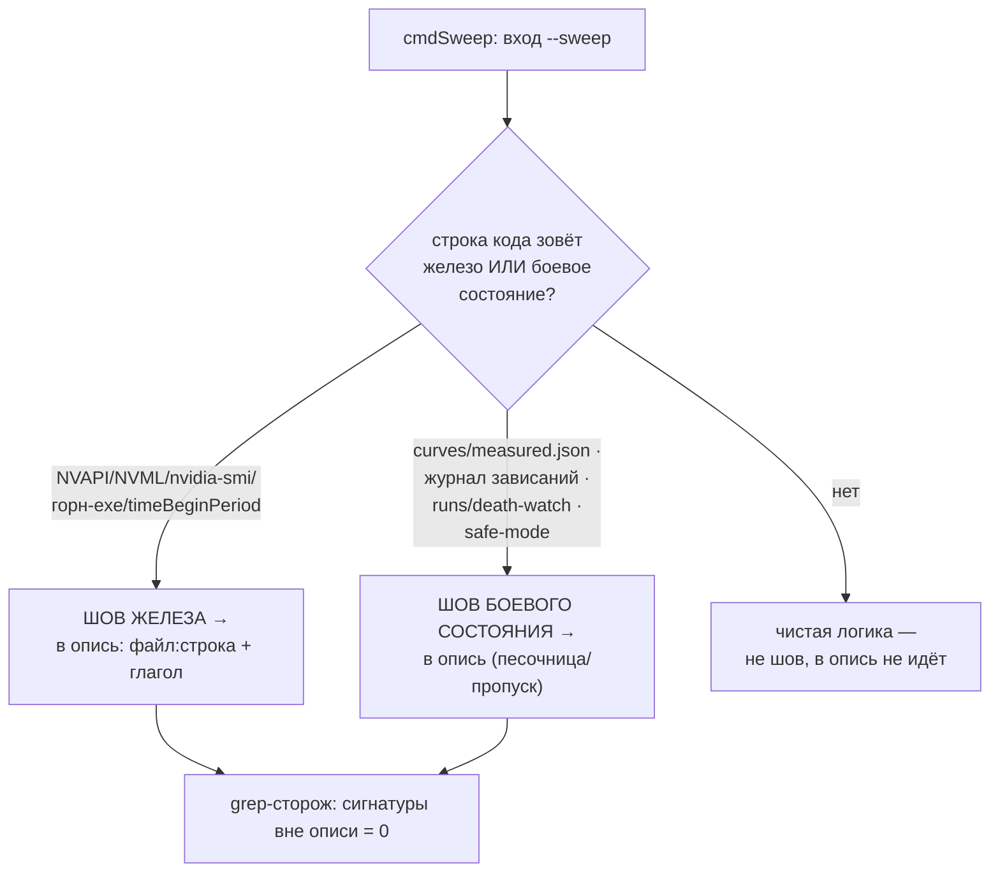

# План 60 — эпик 59 фаза 1: инвентарь швов живого пути

> **Создан:** 2026-08-28 22:3x +03:00 · **Родитель:** `plans/59` → строка «1 — инвентарь швов»
> **Статус:** ✅ ИСПОЛНЕН 2026-08-28 22:5x — опись: `researches/23` (E1–E12 · V1–V13 · T1–T3 · R1–R3, grep-сторож сведён в ноль вне описи); карта не тронута, код не правился
> **Вовне:** опись — единственный источник объёма фаз 2–3 (канон: нет строки инвентаря — нет кода)

## Вектор цели фазы

**Боль.** Грубая карта швов (`researches/22` §2.2, S1–S10) снята по верхам за вечер; фазы 2–3
будут резать порт и собирать виртуальную сборку ПО ней — а пропущенный шов всплывёт как
виртуальный прогон, тихо трогающий живую карту (нарушение I1, худший класс).

**Куда хотим.** Полная опись КАЖДОГО касания железа и боевого состояния на пути
`--sweep`: файл:строка · что зовёт · когда исполняется · чем заменяется в виртуальной сборке ·
риск замены. Плюс grep-сторож: перечень запрещённых вызовов, которых вне описи ноль.

## Критерии приёмки

- **P60-AC1.** Опись покрывает путь целиком: `cmdSweep` (вход→отчёт) · `vf-step.runStep` (вся
  цепочка записи/пина/прожига/отката) · `stress-tester` (лаунчеры) · всадники (судья/проба) ·
  сэмплер · дашборд · журнал · документ · watchdog · safe-mode. Каждая строка — файл:строка.
- **P60-AC2.** Grep-доказательство полноты: список сигнатур железа (`openNvapi` · `openNvml` ·
  `nvidia-smi` · `GetPowerUsage` · `spawn.*furnace` · `curves/measured` · `runs/sweep` ·
  `runs/death-watch` · `timeBeginPeriod`) прогнан по пути; **вызовов вне описи — 0**, каждое
  совпадение либо в описи, либо письменно объяснено, почему не шов (например, чистая арифметика).
- **P60-AC3.** Каждая строка описи несёт СПОСОБ виртуализации одним из четырёх глаголов:
  ПЕРЕКЛЮЧИТЬ (шов уже инъекционный) · ПРОРЕЗАТЬ (порт нужно создать — S9) · ПЕСОЧНИЦА (путь
  файла/журнала) · ПРОПУСК (ворота, слово владельца). Пятого глагола нет — появился, значит
  опись неполна концептуально.
- **P60-AC4.** Судья по описи (`/fable-judge`): выборочная проверка строк против кода + прогон
  grep-сторожа свежим.

## Схема (что считается швом)

## Шаги

- [x] 1. Пройти `cmdSweep` сверху вниз (движок ~8600–9260), выписать каждое касание — строки S1–S8, S10
  грубой карты уточнить до файл:строка, найти пропущенные.
- [x] 2. Пройти `vf-step.runStep` целиком (цепочка одной ступени: намерение → преднастройка →
  запись → пин → прожиг → чтение → откат) — раскрыть S9 в поимённый список вызовов у каждого из
  пяти `import('./nvapi.mjs')` + все спавны.
- [x] 3. Пройти лаунчеры `stress-tester` и обвязку всадников/сэмплера/дашборда.
- [x] 4. Grep-сторож (P60-AC2): прогнать сигнатуры, свести нули, объяснить исключения.
- [x] 5. Опись — отдельным документом `researches/23_seam_inventory.md` (это данные, не план);
  судья; коммит.

## Риски

- **Опись устареет** — фазы 2–3 меняют те же строки: правило — опись правится ТЕМ ЖЕ коммитом,
  что двигает шов (пара правда↔зеркало названа и схлопнута дисциплиной коммита).
- **Динамические импорты прячут касания** (`await import` внутри веток): grep-сторож ловит по
  сигнатурам вызовов, не по импортам — потому список сигнатур в P60-AC2 главнее списка модулей.
