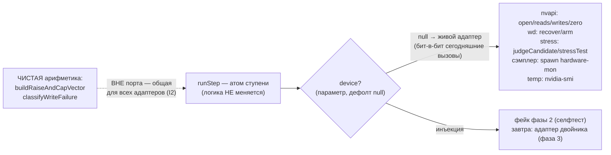

# План 61 — эпик 59 фаза 2: порт устройства в атоме ступени (S9)

> **Создан:** 2026-08-28 23:0x +03:00 · **Родитель:** `plans/59` → строка «2 — порт устройства
> S9» · опись: `researches/23` §2, §6 (единственный источник объёма — канон инвентаря)
> **Статус:** ✅ ИСПОЛНЕН 2026-08-28 22:4x — порт прорезан (23 замены), путь записи впервые офлайн целиком (75 блоков vf-step), 3 мутанта красные у адресатов, батарея 32/1477/0, карта не тронута
> **Уточнение объёма по описи (правит формулировку мета-плана, причина названа):** порт режется
> в `runStep` — ЕДИНСТВЕННОМ узле nvapi на пути `--sweep`; четыре прибора вне пути (`runAscent` ·
> `measureUndervolt` · `probeCurveSnap` · `runShapeExperiment`) сохраняют прямые импорты и
> перечислены потребителями порта НА БУДУЩЕЕ. Мета-план говорил «пять импортов» до описи;
> опись главнее (нет строки инвентаря — нет кода).

## Вектор цели фазы

**Боль.** Путь записи `runStep` (намерение → преднастройка → запись → прожиг → чтение → откат)
никогда не исполнялся офлайн целиком — шапка vf-step признаёт это словами. Каждый дефект этой
цепочки ловится только живой картой.

**Куда хотим.** ОДИН инъекционный порт устройства: живой адаптер — сегодняшние вызовы бит-в-бит
(дефолт, поведение не меняется), фейковый — гоняет всю цепочку офлайн. Чистая арифметика
(`buildRaiseAndCapVector` · `classifyWriteFailure`) В ПОРТ НЕ ВХОДИТ — фейк физически не может
принести свою (якорь I2).

## Критерии приёмки

- **P61-AC1.** `runStep` с инъекцией фейкового устройства проходит ОФЛАЙН всю цепочку счастливого
  пути (вердикт PASS, откат в finally вызван) — впервые в жизни модуля.
- **P61-AC2.** Живой адаптер = те же вызовы на тех же местах: батарея (vf-step 70 · движок 370)
  0 красных БЕЗ правки существующих блоков (правка старого блока = сигнал сломанного поведения).
- **P61-AC3.** Мутации, адресаты названы до прогона: (а) «откат выброшен из finally» → красный
  блок отката; (б) «запись объявляет успех без чтения-подтверждения» → красный блок судьбы
  ступени; (в) «порт расширен арифметикой» — блок-свидетель: фейк НЕ спрошен о векторе.
- **P61-AC4.** Карта фазой не тронута (строка доставки прежняя); опись `researches/23` правлена
  тем же коммитом (V1–V7, V9–V11 получают пометку «порт прорезан»).

## Схема порта

## Шаги

- [x] 1. Прочитать тело `runStep` целиком; выписать все точки касания (опись даёт 17 адресов).
- [x] 2. Порт: `device = null` в сигнатуре; `liveDevice()` — обёртка сегодняшних импортов;
  замена точек на `dev.*`; чистые функции остаются на статическом импорте nvapi.
- [x] 3. Селфтест: фейковое устройство + сквозной офлайн-блок (P61-AC1) + блоки-свидетели.
- [x] 4. Мутации P61-AC3 — все красные у названных адресатов: (а) обнуление не зовётся → «откат
  отработал»; (б) полный отказ записи не останавливает → «не рождает вердикта» (PASS вместо null);
  (в) мягкий двойник арифметики (равномерный подъём без потолка) → сквозной «0 красных» (потолок
  пробит, C3). Батарея 32/1477/0 (vfstep 70→75) · строка доставки прежняя · опись дополнена
  V14–V16 (pm-строки, найдены резкой) тем же коммитом. ✅
