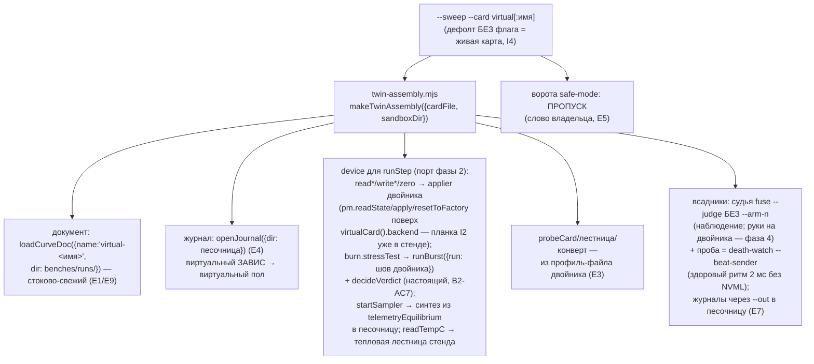

# План 62 — эпик 59 фаза 3: сборка `--card virtual` (смоук живого пути на двойнике)

> **Создан:** 2026-08-28 23:2x +03:00 · **Родитель:** `plans/59` → строка «3 — виртуальная
> сборка» · опись: `researches/23` (E1–E12 — все швы движка параметричны или переключаемы)
> **Статус:** 🟡 ГОТОВ К ИСПОЛНЕНИЮ — свежей головой (сборка ~сессия; писано на закрытии 58-й)
> **Вовне:** это фаза, дающая владельцу заказанный смоук: `npm run engine -- --sweep --card
> virtual …` со всадниками, без единого касания живой карты

## Вектор цели фазы

**Боль.** Порт прорезан (фаза 2), но живой путь по-прежнему собирается только против железа:
дым, репетиции спасения и отладка проводки требуют живого вечера и рискуют машиной.

**Куда хотим.** Одна сборка: `--card virtual` — и та же команда развёртки проходит от конверта
до отчёта на цифровом двойнике: виртуальные документ/журнал/лестница/сэмплер в песочнице стенда,
всадники подняты, ступени жгутся вероятностной моделью двойника, край находится. Живая карта,
её документ, боевой журнал — нетронуты (I1 проверяется командой).

## Критерии приёмки (= ворота фазы в мета-плане)

- **P62-AC1.** ДЫМ ЗЕЛЁНЫЙ: `--sweep --card virtual --from X --to Y` от старта до отчёта; в логе
  прогона — всадники (судья unarmed + виртуальная проба), строка канона I3 напечатана.
- **P62-AC2.** I1 командой: строка доставки живой карты ДО/ПОСЛЕ идентична · хэш боевого журнала
  ДО/ПОСЛЕ идентичен · в `runs/death-watch/` не прибавилось файлов (всадники пишут в песочницу
  через `--out`).
- **P62-AC3.** Виртуальный документ живёт в `benches/runs/` (имя `virtual-<профиль>`), инициируется
  СТОКОВО-свежим (без чужих краёв); виртуальный ЗАВИС двойника складывается в ЖУРНАЛ ПЕСОЧНИЦЫ.
- **P62-AC4.** Батарея 0 красных; новые блоки сборки: твин-устройство гоняет runStep через порт
  фазы 2 (та же поверхность, что фейк — но с настоящей моделью края двойника).
- **P62-AC5.** Дефолт НЕ тронут (I4): без `--card` — живой путь бит-в-бит (батарея это держит).

## Схема сборки

## Шаги

- [ ] 1. `twin-assembly.mjs`: `makeTwinAssembly({cardFile = benches/cards/rtx5070ti.json,
  sandboxDir = benches/runs/<штамп>})` → `{ device, docName, docDir, journalDir, probeCard,
  recover, riderArgs }`. Device реализует ровно поверхность порта фазы 2; вердикты — через
  НАСТОЯЩИЙ `decideVerdict` поверх `runBurst({run: шов двойника})` (строка 1663 стенда);
  сэмплер — синтез `telemetryEquilibrium` в jsonl песочницы. Блоки: устройство гоняет runStep
  (как фейк фазы 2, но с моделью края — у края двойника вердикты меняются).
- [ ] 2. Инициализация виртуального документа: стоково-свежий из словарей (`curve --init`-путь с
  `{name, dir}`), `card.maxGraphicsMhz` — из профиля двойника. НИКОГДА не копия живого
  `measured.json` (его края — заработанные знания, стенд их не наследует).
- [ ] 3. Ветка `--card virtual` в `cmdSweep`: E1/E3/E4/E5/E9/E10 — подстановки сборки; E2/E8 —
  чтения через устройство сборки; всадники по riderArgs (судья `--out` песочница, unarmed;
  `--beat-sender` вместо `--probe`). Дефолт без флага — ни одной изменённой строки поведения.
- [ ] 4. Смоук + I1-доказательство командой (P62-AC1/AC2): полоса по верхам двойника; лог
  прогона в песочницу; строка доставки и хэш журнала до/после — в вывод смоука.
- [ ] 5. Батарея; опись `researches/23` — пометки «ПЕРЕКЛЮЧЕНО сборкой» тем же коммитом; STATUS;
  коммит.

## Риски

- **Поверхность applier ≠ поверхность порта** (стенд писан под profile-manager, порт — под
  nvapi-вызовы): сшивка в устройстве сборки, НЕ правкой стенда и НЕ правкой runStep — оба уже
  доказаны своими батареями; шов один и новый.
- **Виртуальный прогон дотянется до живого пути незаметно** (пропущенный шов): P62-AC2 ловит
  командой; grep-сторож описи — свежим прогоном на закрытии фазы.
- **Время двойника** (10-с формы делают смоук минутами): у стенда есть быстрый тайминг (FAST в
  его селфтесте) — сборка обязана уметь сжимать время, НЕ меняя логики ступени.
