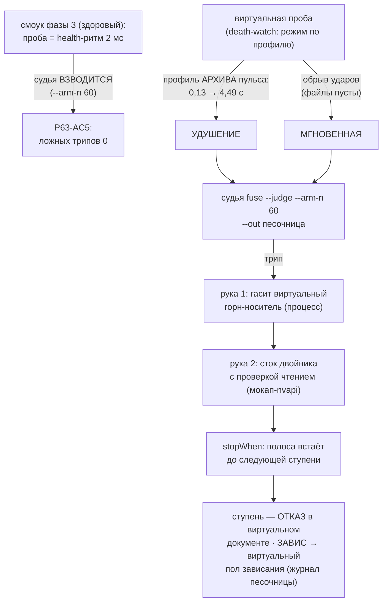

# План 63 — эпик 59 фаза 4: смерти по профилям (репетиции спасения фьюза на двойнике)

> **Создан:** 2026-08-28 23:3x +03:00 (закрытие сессии 59 — план пишется на закрытии фазы N для
> фазы N+1, лестница `plans/59`) · **Родитель:** `plans/59` → строка «4 — смерти по профилям» ·
> сборка фазы 3 — `plans/62` (✅), опись — `researches/23` R1 · разведка смертей — `researches/21`
> **Статус:** ✅ **ИСПОЛНЕН 2026-08-29 00:0x (сессия 60, защищённый цикл).** Все 6 шагов, все 6
> ворот: AC1 удушение спасено (7/7 проверок) · AC2 мгновенная спасена (7/7) · AC3 руки били по
> двойнику, I1 отпечатком в каждом прогоне · AC4 виртуальный ЗАВИС закрыт вторым прогоном, пол
> поднят, спуск не вернулся · AC5 взведённый здоровый смоук — ложных трипов 0 · AC6 батарея
> 33/1498/0, мутации MA–MD красили ровно своих адресатов. Итог — §Итог внизу
> **Вовне:** слово владельца 2026-08-28 (записано в `GOAL.md` → «🖥 ЦИФРОВОЙ ДВОЙНИК»): *«при
> разработке и отладке движка каго, его оракула и предохранителей, движок через тесторые мокап
> инструменты работает с виртуальной видеокпртой»* — эта фаза и есть отладка ПРЕДОХРАНИТЕЛЕЙ на
> двойнике

## Вектор цели (Achieve)

**Боль.** Фьюз (эпик 51) доказан репетицией на живой машине один раз (`plans/57`), а оба
ИЗМЕРЕННЫХ профиля смерти машины он ещё ни разу не проходил end-to-end: живые смерти дороги
(перезагрузка владельца), и репетировать их на живой карте запрещено здравым смыслом. Двойник
после фазы 3 умеет прогон, но его проба шлёт только ЗДОРОВЫЙ ритм.

**Куда хотим.** Виртуальная проба умеет играть ОБА измеренных профиля смерти; взведённый судья
спасает виртуальный прогон end-to-end (трип → руки → стоп полосы), спасённая ступень ложится
ОТКАЗОМ в виртуальный документ, виртуальный ЗАВИС складывается в виртуальный пол зависания; на
здоровом виртуальном прогоне ложных трипов ноль.

## Критерии приёмки (= ворота фазы в мета-плане)

- **P63-AC1.** Профиль «УДУШЕНИЕ» сыгран И СПАСЁН: интервалы проб растут по замеру 2026-08-23
  (0,11–0,13 с → 4,49 с на роковой ступени, `npm run pulse`; форма кривой — из архива пульса, не
  выдумана) → судья трипует по N=60 мс → руки отработали → `stopWhen` встал до следующей ступени.
- **P63-AC2.** Профиль «МГНОВЕННАЯ» сыгран И СПАСЁН: обрыв ударов без деградации (третья смерть
  28.08: оба файла сторожа ПУСТЫ — роковой звонок не вернулся) → трип → руки → стоп.
- **P63-AC3.** Руки бьют по ДВОЙНИКУ: рука 1 гасит виртуальный горн (горн фазы 4 — отдельный
  процесс-носитель, чтобы образу было кого убивать), рука 2 — сток двойника С ПРОВЕРКОЙ ЧТЕНИЕМ
  через мокап-nvapi (та же форма, что живая рука 2). Ни одного касания живой карты (I1 командой).
- **P63-AC4.** Спасённая ступень — ОТКАЗ в ВИРТУАЛЬНОМ документе со своей причиной; виртуальный
  ЗАВИС (профиль, где процесс развёртки умирает) закрыт журналом ПЕСОЧНИЦЫ и стал виртуальным
  полом зависания — повторный виртуальный прогон на роковую ступень не возвращается.
- **P63-AC5.** ЛОЖНЫХ ТРИПОВ 0: здоровый смоук фазы 3 под ВЗВЕДЁННЫМ судьёй (`--arm-n` тот же
  N=60) проходит без единого трипа; кольцо судьи читается после каждого случая.
- **P63-AC6.** Батарея 0 красных; блоки фазы — мутационно доказаны (адресаты названы до прогона).

## Схема

## Шаги (каркас — детализация за исполнителем)

- [x] 1. **Профили смерти из замеров** ✅ — источником оказался НЕ `runs/pulse-archive` (его нет на
  диске), а закоммиченная фикстура `__fixtures__/pulse_2797mhz_death__captured.jsonl` —
  единственная запись потери такта перед смертью (шапка pulse-report.mjs говорит это прямо).
  Извлечено: 18 перелётов 11–29 мс (деградация без трипа), затем **+2070 мс и +2366 мс** (сумма
  ≈ 4,49 с ступени — сошлось с прибором), хвост файла — NUL-байты (кэш страниц умер с машиной).
  Между 29 и 2070 мс ПУСТО — трип N=60 ложится ровно на первый большой останов. Профиль
  ВЫВОДИТСЯ из фикстуры функцией `strangleStallsFromPulse` (DRY: числа не могут разъехаться);
  мгновенная = обрыв без сужения, `DEATH_PROFILES` несёт источники.
- [x] 2. **Виртуальная проба** ✅ — `death-watch --beat-sender --play-profile strangle|instant
  --after-pidfile <ф>`: здоровый ритм до РОЖДЕНИЯ носителя (удушения начинались под прожигом —
  без гонок по времени), затем профиль; сжатие пауз между остановами названо (`--between-ms`,
  правило ускорения стенда `ideas/04`). deathwatch 8 → 11 блоков.
- [x] 3. **Горн-носитель** ✅ — `twin-burn-carrier.mjs`: тело прожига держит ВРЕМЯ СТЕНЫ и пишет
  пид-файл (fsync), вердикт остаётся у ВНУТРИПРОЦЕССНОГО оракула — состояние модели (тепло, ГСЧ,
  смещения) не форкается в ребёнка (I2). Убитый носитель возвращается статусом ≠ 0 дословно в
  форме spawnSync → `runBurst` валит его штатной дорогой («нагрузка вышла с кодом …») — ровно как
  taskkill валит furnace на живом пути. Носитель ездит ТОЛЬКО в репетиции (`deathRehearsal`),
  дефолтный твин-смоук бит-в-бит прежний.
- [x] 4. **Рука 2 на двойника** ✅ — `fuse-rescue-hand --twin <карта>`: тот же `doStockRescue`,
  мост — `buildTwinNvapiModule` (модель с ПОДНЯТОЙ кривой — обнуление не вакуумно), сверка
  чтением настоящая; строка журнала помечена `stock-voltage-verified-twin` (след двойника в
  форензике обязан быть отличим — EXP-0025). Судья: `--burn-pidfile` (pid читается В МОМЕНТ
  трипа) + `--twin-stock` (взведение на двойнике НЕ БЫВАЕТ без руки 2 двойника — одна дверь).
  fuse 36 → 41 блок.
- [x] 5. **End-to-end** ✅ — четыре сквозных прогона командами:
  `--smoke --armed` (AC5: 0 ложных трипов) · `--rehearse-death strangle` (AC1: 7/7) ·
  `--rehearse-death instant` (AC2: 7/7; кольца 1826 против 252 тактов — подписи двух режимов
  различимы) · `--rehearse-hang` (AC4: SIGKILL движка посреди прожига → fsync-намерение выжило →
  второй прогон: «ЗАВИС: 2842/1020», «ПОЛ ЗАВИСАНИЯ», код 0). I1 отпечатком в каждом.
- [x] 6. **Батарея + мутации + опись + STATUS + коммит** ✅ — 33 набора / 1498 блоков / 0 красных;
  мутации MA (порог профиля) · MB (pid на старте) · MC (рапорт без обнуления) · MD (взведён без
  руки 2) — каждая красила РОВНО своих названных адресатов, откаты копией файла (урок TA1
  сессии 59). Опись: `researches/23` R1 → ПЕРЕКЛЮЧЕНО.

## Итог (2026-08-29 00:0x)

**Фьюз прошёл оба измеренных профиля смерти end-to-end на двойнике, не тронув живую карту.**
Цепь: профиль из фикстуры → трип по beat-silence → рука 1 убивает носителя по пид-файлу →
рука 2 детачнуто подтверждает сток двойника чтением → ступень проваливается дорогой оракула с
названной причиной → stopWhen ставит полосу до следующей ступени. Виртуальный ЗАВИС — вторым
прогоном: намерение → «ЗАВИС» → пол → спуск не возвращается (R15/R18 отрепетированы целиком).

**Границы, названные честно:**
- Рука 2 двойника держит СВОЙ экземпляр модели (живой сток — состояние машины, твин — процесса);
  репетируется ФОРМА руки (детач, мост, обнуление, сверка чтением, своя fsync-строка). Тождество
  состояния — в реестр паритета (фаза 5 эпика 59).
- Спасение в репетициях ложится на ПЕРВУЮ ступень полосы (профиль играет от рождения первого
  носителя) — строка в документ не пишется, потому что прошедшего напряжения ещё нет («уточнять
  не от чего», канон владельца: частота закрыта со своей названной причиной). Спасение посреди
  спуска с готовой строкой edge-found — вариант места трипа, не механизма; отдельной машинерии
  не заводилось (мораторий интервью 017).
- Тайминги носителя (реальные секунды тела) против модельных секунд оракула — расхождение честно
  едет в реестр паритета фазы 5, как и предупреждал риск (в).

## Риски

- **(а) Профиль выдуман, а не измерен** — ворота фазы прямо запрещают; каждый профиль цитирует
  свой замер (архив пульса · пустые хвосты). Нет архива — СТОП и вопрос, а не изобретение.
- **(б) Ложные трипы на здоровом прогоне** — ровно то, что `ideas/10` §5.5 запрещает отгружать;
  P63-AC5 меряет нулём, N не подгоняется под зелёное (N=60 выведен фазой 3 эпика 51 из замеров).
- **(в) Горн-носитель изменит тайминги двойника** — носитель тонкий, время двойника по-прежнему
  чтения/секунды модели; расхождение честно едет в реестр паритета (фаза 5), не подгоняется.
- **(г) Виртуальный ЗАВИС убьёт процесс движка вместе с полосой** — это и есть моделируемое
  поведение (на живом пути умирает МАШИНА); журнал песочницы обязан пережить (fsync до касания —
  R15 уже держит), следующий запуск закрывает. Проверяется шагом 5, отдельным запуском.
