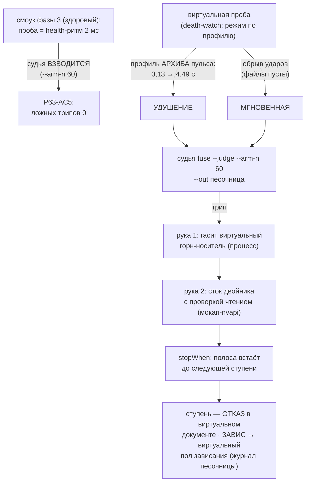

# План 63 — эпик 59 фаза 4: смерти по профилям (репетиции спасения фьюза на двойнике)

> **Создан:** 2026-08-28 23:3x +03:00 (закрытие сессии 59 — план пишется на закрытии фазы N для
> фазы N+1, лестница `plans/59`) · **Родитель:** `plans/59` → строка «4 — смерти по профилям» ·
> сборка фазы 3 — `plans/62` (✅), опись — `researches/23` R1 · разведка смертей — `researches/21`
> **Статус:** 🟡 ГОТОВ К ИСПОЛНЕНИЮ — свежей головой; шаги детализируются исполнителем по этому
> каркасу, числа профилей берутся ИЗ ЗАМЕРОВ (не выдумываются — ворота фазы говорят это прямо)
> **Вовне:** слово владельца 2026-08-28 (записано в `GOAL.md` → «🖥 ЦИФРОВОЙ ДВОЙНИК»): *«при
> разработке и отладке движка каго, его оракула и предохранителей, движок через тесторые мокап
> инструменты работает с виртуальной видеокпртой»* — эта фаза и есть отладка ПРЕДОХРАНИТЕЛЕЙ на
> двойнике

## Вектор цели (Achieve)

**Боль.** Фьюз (эпик 51) доказан репетицией на живой машине один раз (`plans/57`), а оба
ИЗМЕРЕННЫХ профиля смерти машины он ещё ни разу не проходил end-to-end: живые смерти дороги
(перезагрузка владельца), и репетировать их на живой карте запрещено здравым смыслом. Двойник
после фазы 3 умеет прогон, но его проба шлёт только ЗДОРОВЫЙ ритм.

**Куда хотим.** Виртуальная проба умеет играть ОБА измеренных профиля смерти; взведённый судья
спасает виртуальный прогон end-to-end (трип → руки → стоп полосы), спасённая ступень ложится
ОТКАЗОМ в виртуальный документ, виртуальный ЗАВИС складывается в виртуальный пол зависания; на
здоровом виртуальном прогоне ложных трипов ноль.

## Критерии приёмки (= ворота фазы в мета-плане)

- **P63-AC1.** Профиль «УДУШЕНИЕ» сыгран И СПАСЁН: интервалы проб растут по замеру 2026-08-23
  (0,11–0,13 с → 4,49 с на роковой ступени, `npm run pulse`; форма кривой — из архива пульса, не
  выдумана) → судья трипует по N=60 мс → руки отработали → `stopWhen` встал до следующей ступени.
- **P63-AC2.** Профиль «МГНОВЕННАЯ» сыгран И СПАСЁН: обрыв ударов без деградации (третья смерть
  28.08: оба файла сторожа ПУСТЫ — роковой звонок не вернулся) → трип → руки → стоп.
- **P63-AC3.** Руки бьют по ДВОЙНИКУ: рука 1 гасит виртуальный горн (горн фазы 4 — отдельный
  процесс-носитель, чтобы образу было кого убивать), рука 2 — сток двойника С ПРОВЕРКОЙ ЧТЕНИЕМ
  через мокап-nvapi (та же форма, что живая рука 2). Ни одного касания живой карты (I1 командой).
- **P63-AC4.** Спасённая ступень — ОТКАЗ в ВИРТУАЛЬНОМ документе со своей причиной; виртуальный
  ЗАВИС (профиль, где процесс развёртки умирает) закрыт журналом ПЕСОЧНИЦЫ и стал виртуальным
  полом зависания — повторный виртуальный прогон на роковую ступень не возвращается.
- **P63-AC5.** ЛОЖНЫХ ТРИПОВ 0: здоровый смоук фазы 3 под ВЗВЕДЁННЫМ судьёй (`--arm-n` тот же
  N=60) проходит без единого трипа; кольцо судьи читается после каждого случая.
- **P63-AC6.** Батарея 0 красных; блоки фазы — мутационно доказаны (адресаты названы до прогона).

## Схема

## Шаги (каркас — детализация за исполнителем)

- [ ] 1. **Профили смерти из замеров:** вынуть форму удушения из архивного пульса рокового прогона
  (2797 МГц, `runs/pulse-archive/…` — адрес уточнить по `plans/27`) и форму мгновенной из хвостов
  сторожа третьей смерти (пустые файлы = обрыв). В код профили едут ИМЕНОВАННЫМИ ({class, points})
  с источником в комментарии.
- [ ] 2. **Виртуальная проба:** режим проигрывания профиля у отправителя ударов (`death-watch`,
  рядом с `--beat-sender`; сигнатура по месту) — здоровый ритм · удушение · обрыв. Песочница
  журналов — как у фазы 3.
- [ ] 3. **Горн-носитель:** прожиг двойника в фазе смерти идёт ОТДЕЛЬНЫМ процессом-носителем (иначе
  руке 1 некого убивать; сегодня oracle.run живёт внутри процесса движка). Носитель — тонкий:
  оборачивает `oracle.run` двойника, умирает по руке штатно (форма проваливается дорогой оракула —
  как в фазе 5 эпика 51).
- [ ] 4. **Рука 2 на двойника:** виртуальный сток с проверкой чтением (мокап-nvapi сборки), та же
  форма отчёта, что у живой руки (`fuse-rescue-hand`).
- [ ] 5. **End-to-end обе смерти + здоровый прогон под взведённым судьёй:** P63-AC1/2/5; спасённая
  ступень и виртуальный пол — P63-AC4; I1 отпечатком (`npm run twin -- --i1`).
- [ ] 6. **Батарея + мутации + опись R1 тем же коммитом + STATUS + коммит.**

## Риски

- **(а) Профиль выдуман, а не измерен** — ворота фазы прямо запрещают; каждый профиль цитирует
  свой замер (архив пульса · пустые хвосты). Нет архива — СТОП и вопрос, а не изобретение.
- **(б) Ложные трипы на здоровом прогоне** — ровно то, что `ideas/10` §5.5 запрещает отгружать;
  P63-AC5 меряет нулём, N не подгоняется под зелёное (N=60 выведен фазой 3 эпика 51 из замеров).
- **(в) Горн-носитель изменит тайминги двойника** — носитель тонкий, время двойника по-прежнему
  чтения/секунды модели; расхождение честно едет в реестр паритета (фаза 5), не подгоняется.
- **(г) Виртуальный ЗАВИС убьёт процесс движка вместе с полосой** — это и есть моделируемое
  поведение (на живом пути умирает МАШИНА); журнал песочницы обязан пережить (fsync до касания —
  R15 уже держит), следующий запуск закрывает. Проверяется шагом 5, отдельным запуском.
