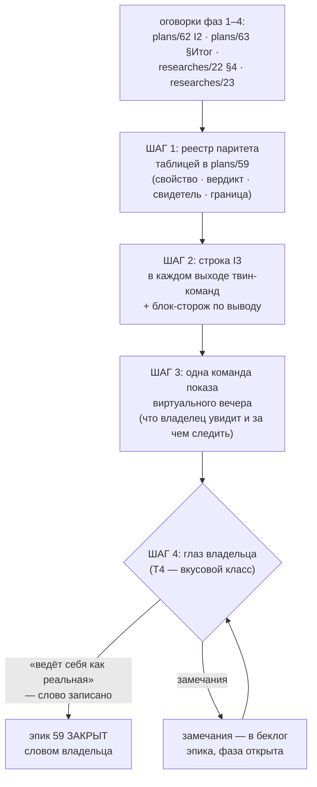

# План 64 — эпик 59 фаза 5: реестр паритета и приёмка владельца

> **Создан:** 2026-08-29 00:1x +03:00 (закрытие фазы 4 — план фазы N+1 пишется на закрытии фазы N,
> лестница `plans/59`) · **Родитель:** `plans/59` → строка «5 — паритет и приёмка владельца» ·
> фаза 4 — `plans/63` (✅)
> **Статус:** 🟡 ГОТОВ К ИСПОЛНЕНИЮ — машинная половина (шаги 1–3) офлайн; финал (шаг 4) ждёт
> ГЛАЗА ВЛАДЕЛЬЦА и его слова — это вкусовой класс (T4), агент его не заменяет
> **Вовне:** слово владельца после виртуального вечера — единственные ворота закрытия эпика 59

## Вектор цели (Achieve)

**Боль.** Двойник уже равноправный стенд (фазы 1–4), но что он ДОКАЗЫВАЕТ и чего НЕ доказывает —
разбросано по оговоркам четырёх планов (`plans/62` I2-оговорки, `plans/63` §Итог, `researches/22`
§4) и живёт в головах сессий. Отчёты несут строку I3 не везде (фильтр репетиций её не печатает).
Владелец двойника в деле ещё не видел — а T4 судит его глаз.

**Куда хотим.** Один РЕЕСТР ПАРИТЕТА в доке эпика (свойство → доказывает ли виртуалка → чем →
граница модели); строка I3 — в каждом выходе каждой твин-команды; владелец посмотрел виртуальный
вечер и сказал своё слово — эпик 59 закрыт его решением, не самообъявлением.

## Критерии приёмки (= ворота фазы в мета-плане)

- **P64-AC1.** Реестр паритета стоит В ДОКЕ ЭПИКА (`plans/59`) таблицей: каждая строка — свойство,
  вердикт «доказывает / НЕ доказывает», СВИДЕТЕЛЬ (команда/блок/прогон) и граница модели. Ни одной
  строки без свидетеля — реестр из впечатлений был бы тем самым выдуманным паритетом.
- **P64-AC2.** Строка канона I3 печатается КАЖДЫМ выходом твин-команд: `--smoke` (обе формы),
  `--rehearse-death` (оба профиля), `--rehearse-hang`, `--i1`, и отчёт `--sweep --card virtual`.
  Проверяется блоком по выводу, не глазами.
- **P64-AC3.** Виртуальный вечер владельца: ОДНА команда показа, подготовленная заранее; его слово
  («ведёт ли себя как реальная») записано дословно в док эпика. Слова нет — фаза открыта, эпик
  открыт; торопить владельца фаза не смеет.

## Схема

## Шаги (каркас — детализация за исполнителем)

- [x] 1. **Свести реестр паритета** ✅ 2026-08-29 00:2x — таблица 13 строк в `plans/59` (раздел
  «Реестр паритета»), каждая со свидетелем и границей; три честных «НЕ доказывает» (телеметрия
  полосы · тайминги ступени · кремний владельца) названы, а не спрятаны.
- [ ] 2. **Строка I3 в каждом выходе** — ревизия всех дверей твин-команд; печать из ОДНОГО места
  (canonLine сборки), не копиями; блок-сторож в `twin --selftest` по выводу команд.
- [ ] 3. **Команда показа вечера** — что запускает владелец (или агент при нём), что на экране,
  за чем следить; отправной кандидат: `--rehearse-death strangle` (спасение зрелищнее смоука).
- [ ] 4. **Слово владельца** — записать дословно в `plans/59`; замечания — строками беклога эпика.

## Риски

- **(а) Реестр разрастётся в философию** — держать ТАБЛИЦЕЙ, свидетель обязателен, прозы нет.
- **(б) Владелец занят** — шаги 1–3 офлайн и не ждут; шаг 4 ждёт любого удобного вечера, фаза
  не блокирует очередь аудита §7 (после машинной половины — `plans/53` «ЗАКАЗ»).
- **(в) Соблазн подогнать модель под замечания вслепую** — замечание сперва строкой в реестр
  (свойство → НЕ доказывает), починка — отдельным решением с ценой (интервью 017, Q5).
