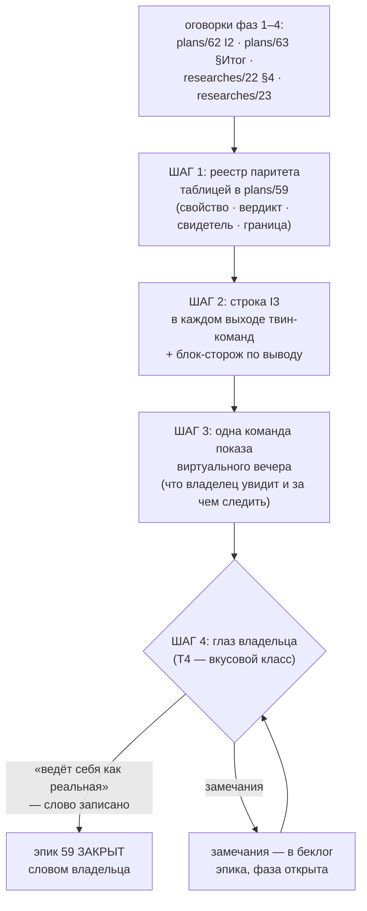

# План 64 — эпик 59 фаза 5: реестр паритета и приёмка владельца

> **Создан:** 2026-08-29 00:1x +03:00 (закрытие фазы 4 — план фазы N+1 пишется на закрытии фазы N,
> лестница `plans/59`) · **Родитель:** `plans/59` → строка «5 — паритет и приёмка владельца» ·
> фаза 4 — `plans/63` (✅)
> **Статус:** 🟠 шаги 1–3 ✅ (реестр 13 строк в `plans/59` · строка I3 одной дверью + сторож ·
> **шаг 3 ПЕРЕПИСАН 2026-08-29 09:2x после починки `bugs/65`: показ идёт В ОКНЕ НАБЛЮДЕНИЯ** —
> окно поднимается на твин-пути с песочными путями данных, пилюля на странице печатает
> «ЦИФРОВОЙ ДВОЙНИК — ВЫМЫСЕЛ (I3)»; репетиция с окном прогнана, 9/9 проверок). Первый заход
> шага 3 был опровергнут владельцем 2026-08-29 00:4x («я ничего не видел. даже визуализатор
> не открылся») — история в `bugs/65`. Шаг 4 (глаз владельца, T4) ОТКРЫТ и готов к показу.
> Эпик 59 закрывается только словом владельца
> **Вовне:** слово владельца после виртуального вечера — единственные ворота закрытия эпика 59

## Вектор цели (Achieve)

**Боль.** Двойник уже равноправный стенд (фазы 1–4), но что он ДОКАЗЫВАЕТ и чего НЕ доказывает —
разбросано по оговоркам четырёх планов (`plans/62` I2-оговорки, `plans/63` §Итог, `researches/22`
§4) и живёт в головах сессий. Отчёты несут строку I3 не везде (фильтр репетиций её не печатает).
Владелец двойника в деле ещё не видел — а T4 судит его глаз.

**Куда хотим.** Один РЕЕСТР ПАРИТЕТА в доке эпика (свойство → доказывает ли виртуалка → чем →
граница модели); строка I3 — в каждом выходе каждой твин-команды; владелец посмотрел виртуальный
вечер и сказал своё слово — эпик 59 закрыт его решением, не самообъявлением.

## Критерии приёмки (= ворота фазы в мета-плане)

- **P64-AC1.** Реестр паритета стоит В ДОКЕ ЭПИКА (`plans/59`) таблицей: каждая строка — свойство,
  вердикт «доказывает / НЕ доказывает», СВИДЕТЕЛЬ (команда/блок/прогон) и граница модели. Ни одной
  строки без свидетеля — реестр из впечатлений был бы тем самым выдуманным паритетом.
- **P64-AC2.** Строка канона I3 печатается КАЖДЫМ выходом твин-команд: `--smoke` (обе формы),
  `--rehearse-death` (оба профиля), `--rehearse-hang`, `--i1`, и отчёт `--sweep --card virtual`.
  Проверяется блоком по выводу, не глазами.
- **P64-AC3.** Виртуальный вечер владельца: ОДНА команда показа, подготовленная заранее; его слово
  («ведёт ли себя как реальная») записано дословно в док эпика. Слова нет — фаза открыта, эпик
  открыт; торопить владельца фаза не смеет.

## Схема



## Шаги (каркас — детализация за исполнителем)

- [x] 1. **Свести реестр паритета** ✅ 2026-08-29 00:2x — таблица 13 строк в `plans/59` (раздел
  «Реестр паритета»), каждая со свидетелем и границей; три честных «НЕ доказывает» (телеметрия
  полосы · тайминги ступени · кремний владельца) названы, а не спрятаны.
- [x] 2. **Строка I3 в каждом выходе** ✅ 2026-08-29 00:1x — `CANON_LINE` экспортом (ОДИН дом),
  `main()` сборки печатает её на каждой двери CLI (кроме `--selftest` — его вывод читает батарея
  построчно), движок печатает её же из сборки; блок-сторож «КАНОН I3» сквозным `--i1` (twin 14),
  мутация ME (снять печать) красит ровно его. Батарея 33/1499/0.
- [x] 3. **Команда показа вечера** ✅ **ПЕРЕПИСАН 2026-08-29 09:2x после починки `bugs/65` —
  носитель показа теперь ОКНО НАБЛЮДЕНИЯ, терминал — приложение.** Первый заход (сценарий из
  терминальных строк) был опровергнут глазом владельца 2026-08-29 00:4x: *«я ничего не видел.
  даже визуализатор не открылся»* — история и починка в `bugs/65`. Что стоит теперь: окно на
  твин-пути поднимается тем же сервером с ПЕСОЧНЫМИ путями данных (`--pulse`/`--telemetry` CLI
  дашборда, прокладка через `raiseDashboard`), пульс объявляет «ЦИФРОВОЙ ДВОЙНИК — ВЫМЫСЕЛ (I3)»
  и страница печатает это пилюлей на своём лице; индикаторы кормит модель. Прогнано с окном:
  9/9 проверок, зритель подписан, I1 цел.
- [ ] 4. **Слово владельца** — записать дословно в `plans/59`; замечания — строками беклога эпика.

## Виртуальный вечер владельца (шаг 3 — сценарий показа, P64-AC3; редакция 2 — В ОКНЕ)

Одна команда, ~40 секунд, живая карта не участвует вовсе; **ОКНО НАБЛЮДЕНИЯ откроется само**
(`--no-window` — только для безголовой отладки):

```
node automation-engine/lib/twin-assembly.mjs --rehearse-death strangle
```

**Что владелец увидит В ОКНЕ, по порядку** (прогнано этой сессией с окном, лог
`benches/runs/twin-death-strangle-*.log`):

1. Окно поднимается с пилюлей **«ЦИФРОВОЙ ДВОЙНИК — ВЫМЫСЕЛ (I3)»** над картой — вечер двойника
   нельзя перепутать с живым; индикаторы (частота · температура · вентилятор · ватты) — от модели.
2. Полоса 2842…2812: ступень объявляется, идёт стресс-тест — секунды тикают, картинка живёт.
3. Смерть по ИЗМЕРЕННОМУ профилю удушения (запись рокового прогона 2797 МГц от 23.08): трип
   судьи → рука 1 убивает горн → рука 2 возвращает двойника к заводу с проверкой чтением →
   полоса встаёт — «ПРОГОН ОСТАНОВЛЕН» в окне вместо перезагрузки машины.
4. Окно закрывается вместе с прогоном — как на живом пути (окно принадлежит прогону).
5. В терминале — приложение: строка I3, «⚡ ПРЕДОХРАНИТЕЛЬ … ВЗВЕДЁН N=60 мс», девять
   ✅-проверок и адрес кольца судьи.

Виртуальный ЗАВИС тем же носителем: `--rehearse-hang` — картинка в окне ЗАСТЫВАЕТ вместе с
убитым движком (ровно сигнал настоящей смерти), второй прогон перехватывает окно и закрывает
намерение полом зависания.

**За чем следить владельцу (T4 — «ведёт ли себя как реальная»):** узнаёт ли он в пунктах 2–3
картину своих вечеров (деградация без трипа → большой останов → спасение вместо перезагрузки);
раздражает ли что-то как «не по-настоящему». Его слово — дословно в `plans/59`; замечания —
строками в реестр паритета (свойство → НЕ доказывает), починка отдельным решением с ценой.

## Риски

- **(а) Реестр разрастётся в философию** — держать ТАБЛИЦЕЙ, свидетель обязателен, прозы нет.
- **(б) Владелец занят** — шаги 1–3 офлайн и не ждут; шаг 4 ждёт любого удобного вечера, фаза
  не блокирует очередь аудита §7 (после машинной половины — `plans/53` «ЗАКАЗ»).
- **(в) Соблазн подогнать модель под замечания вслепую** — замечание сперва строкой в реестр
  (свойство → НЕ доказывает), починка — отдельным решением с ценой (интервью 017, Q5).
