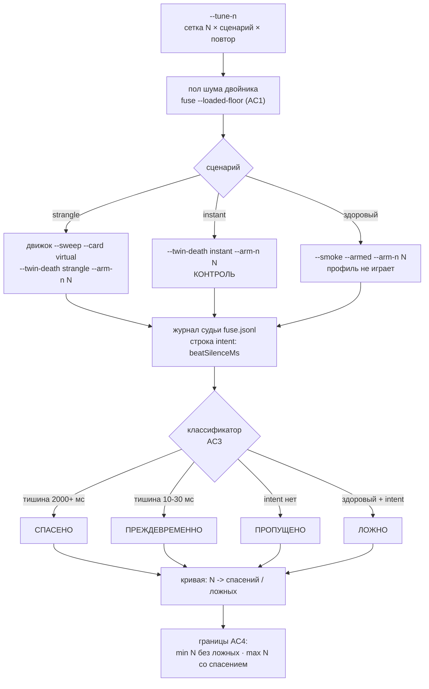

# План 65 — эпик 51 фаза 5б: НАСТРОЙКА предохранителя на цифровом двойнике

> **Создан:** 2026-08-29 · **Родитель:** `plans/51` → строка «3 — пол шума ПОД НАГРУЗКОЙ, вывод N и M»
> (*«N и M выводятся ИЗ ЗАМЕРА (запас от max шума), не из головы»*) и строка «5 — 🚑 боевое
> дежурство» (*«ложных срабатываний 0»* — сегодня это ОДНО наблюдение).
> **Предыдущие:** `plans/55–58` ✅ (скелет · N=60 · руки живьём · дежурство) · `plans/63` ✅ (обе
> измеренные смерти сыграны на двойнике end-to-end).
> **Заказ владельца 2026-08-29:** *«тюним предохранители на виртуалке»*.
> **Наружу:** плану принадлежит ФОРМА кривой порога, а не выбор точки для живой карты — точку
> выбирает живой пол шума и слово владельца.

## Вектор цели

**Боль, названная числом.** Предохранитель настроен ОДНОЙ точкой. `N = 60 мс` выведен верно —
6,3× над максимумом шума под горном (9,57 мс, `plans/56`), — но это вывод про ОДИН конец шкалы.
**Цена ошибки в обе стороны не измерена ни разу:** сколько ложных трипов даёт N = 30 и сколько
смертей пропускает N = 150 — не знает никто, а «ложных 0» стоит на ОДНОМ прогоне здорового смоука
(`plans/63`, AC5). На живой карте эту кривую снять нельзя: каждая её точка — смерть машины.

**Куда хотим.** У каждого N из сетки — измеренная пара чисел (спасений / ложных) на трёх сценариях,
повторённая. Выбранное N становится точкой НА КРИВОЙ, а не единственным наблюдением.

**Тип цели:** Achieve (новая величина — кривая порога) + Avoid (не выпустить порог, который врёт по
расписанию; `bugs/27` — тревога, отменяющая сама себя).

## Что фикстура говорит ДО единого прогона (снято 2026-08-29, `strangleStallsFromPulse`)

Измеренное удушение 2797 МГц — двадцать остановов, и они распадаются на две группы без единого
значения между ними:

```
15 11 13 13 13 14 13 15 12 12 11 26 29 12 11 11 12 16 | 2070 2366
        деградация: 11…29 мс (18 штук)                |  роковые
```

**Отсюда окно решения для N — открытый интервал (29 · 2070) мс, и это ДРУГОЕ обоснование, чем то,
которым N выбирали.** `N = 60` защищали запасом 6,3× над полом шума (9,57 мс). Но связывает не пол
шума, а **перелёты самой смерти: 29 мс, и запас там всего 2,07×.** Это арифметический прогноз, а не
результат; сетка проверяет, совпадает ли он с поведением сквозного прогона (дрожание пробы
складывается с остановом и границу двигает).

## Критерии приёмки (готово, когда)

- **P65-AC1 — фон РЕПЕТИЦИИ измерен своим числом.** ⚠️ `fuse --loaded-floor` здесь НЕ ГОДИТСЯ: он
  меряет живой стенд (проба через NVML + `furnace.exe`, запускаемый оператором), а у двойника
  прожиг — носитель на времени стены, нагрузки на карту нет вовсе. Значит меряется то, что реально
  видит судья репетиции: **зазоры ударов на здоровом сквозном прогоне** (`--smoke --armed`, кольцо
  судьи). Шкала — миллисекунды · прибор — кольцо `fuse-ring.jsonl` · цель — медиана, p99 и max
  названы. **И записывается граница переноса: это НИЖНЯЯ оценка** — живой пол под горном (9,57 мс,
  `plans/56`) остаётся числом, которое правит боевым N. Наследовать числа между формами запрещено
  оплаченным уроком EXP-0165.
- **P65-AC2 — сетка одной командой.** `twin-assembly --tune-n` прогоняет N × сценарий × повтор и
  пишет машиночитаемый итог в `benches/runs/`. Сценариев ТРИ: `strangle` · `instant` · здоровый
  (без профиля). Повторов ≥ 3.
- **P65-AC3 — исходы различаются ЧЕТЫРЬМЯ именами, а не двумя.** Различитель уже лежит в журнале
  судьи и нового прибора не требует — поле `beatSilenceMs` строки `intent`:

  | исход | признак | цена на живой карте |
  |---|---|---|
  | **спасено** | трип на роковом останове (тишина ≈ 2000+ мс) | машина жива, ступень = ОТКАЗ |
  | **преждевременно** | трип на перелётах деградации (тишина ≈ 10–30 мс) | ступень потеряна зря |
  | **пропущено** | трипа за прогон нет | машина умирает |
  | **ложно** | трип на здоровом сценарии | полоса встала без причины |

  ⚠️ `instant` — КОНТРОЛЬ, а не мишень: на живом железе трип по мгновенному обрыву спасать уже
  некого (`plans/51` → таблица режимов). Он меряет ровно одно — что порог не краснеет РАНЬШЕ обрыва.
- **P65-AC4 — границы названы числами.** По сетке: минимальное N без ложных на здоровом и
  максимальное N, ещё спасающее удушение. Таблица — в §Итог этого плана, сырьё — в `benches/runs/`.
- **P65-AC5 — батарея 0 красных**; блоки на классификатор исходов в `fuse --selftest`; мутация,
  сдвигающая границу исхода, краснеет РОВНО свой блок; мутация, снимающая проброс N, краснеет блок
  дефолта.
- **P65-AC6 — живая карта не участвует.** `twin-assembly --i1`: отпечаток до/после идентичен,
  строка доставки не сдвинулась.

## Схема сетки



## Шаги

- [ ] **1. Фон репетиции (AC1).** Здоровый сквозной прогон `--smoke --armed`, кольцо судьи →
      медиана · p99 · max зазора ударов; в §Итог с пометкой «нижняя оценка, живой пол правит боевым
      N». *Якорь родителя: «N и M выводятся ИЗ ЗАМЕРА (запас от max шума), не из головы».*
- [ ] **2. Шов: N наружу у репетиции.** Сегодня `makeTwinAssembly` прошивает `DERIVED_ARM_N_MS` в
      `riders.judgeArgs`. Добавить параметр `armNMs` (дефолт — прежняя константа) и флаг `--arm-n`
      у твин-команд. **Дефолт без флага обязан остаться бит-в-бит (I4)** — блок именно на это.
- [ ] **3. Классификатор исходов + блоки (AC3, AC5).** Чистая функция над строками `fuse.jsonl`
      (`classifyTripOutcome`), место — `fuse.mjs` рядом с `judgeLiveness`: там же живёт словарь
      причин, DRY. Блоки на все четыре имени и на границу между ними.
- [ ] **4. Сетка одной командой (AC2).** Режим `--tune-n` в `twin-assembly.mjs` — не новый модуль:
      репетиция и сбор улик (`collectRescueEvidence`) уже здесь, Оккам. Грубая сетка ПЯТЬ значений:
      20 · 40 · 60 · 90 · 150 мс. Сырьё — `benches/runs/tune-n-<штамп>.jsonl`, строка на прогон.
- [ ] **5. Прогон и сгущение.** Сперва грубая сетка ×3 повтора; сгущать ТОЛЬКО вокруг найденной
      границы. Бюджет: ≈40 с на прогон × 5 значений × 3 сценария × 3 повтора ≈ 30 мин машинного
      времени.
- [ ] **6. Итог (AC4) + отпечаток (AC6):** таблица в §Итог, границы названы числами.
- [ ] **7. Развилка владельцу — ТОЛЬКО если данные скажут, что 60 не лучшая точка.** Оформляется
      через `/interview` с ценами; боевое N до его слова не трогается.

## Что ВНЕ этого плана и почему

**Взведение M (сердцебиение прогресса горна) НЕ ВХОДИТ.** Судья это уже умеет: `judgeLiveness`
несёт вход 2 (`armMMs`, причина `progress-stall`), флаг `--arm-m` есть, сторож `progressWired`
различает «непроведён» и «застыл». **Не хватает ИСТОЧНИКА:** прожиг запускается `spawnSync` и
печатает единственную строку `KAGO-WORKLOAD` в КОНЦЕ — сообщать о продвижении сегодня некому.
Источник = правка `.cu`-нагрузок + канал + свой измеренный пол, то есть отдельная работа со своей
ценой. Названа здесь, чтобы «M не взведён» не читалось как недосмотр этого плана.

## Проверка — какими артефактами и где они лежат

| утверждение | чем наблюдается | путь |
|---|---|---|
| фон репетиции | кольцо судьи здорового прогона `--smoke --armed` | `benches/runs/twin-*/fuse-ring.jsonl` |
| классификатор различает четыре исхода | блоки в `fuse --selftest` | `automation-engine/lib/fuse.mjs` |
| дефолт репетиции не сдвинулся (I4) | блок «без `--arm-n` аргументы судьи бит-в-бит» | `twin-assembly --selftest` |
| кривая N → исходы | сырьё сетки, ≥ 3 повтора на точку | `benches/runs/tune-n-<штамп>.jsonl` |
| живая карта не тронута | `node automation-engine/lib/twin-assembly.mjs --i1` до/после | вывод + §Итог |
| блоки красят своих | мутации: граница исхода · снятый проброс N | откат КОПИЕЙ файла (урок TA1) |

## Риски (Мёрфи) и реакция

1. **Фон двойника НИЖЕ живого по построению — карту никто не греет.** Значит «ложных 0» на
   двойнике при малом N ничего не обещает живой карте. Реакция и граница переноса, обе явно в
   §Итог: **переносима та половина кривой, что стоит на РЕАЛЬНЫХ числах** — перелёты деградации
   (11…29 мс) и роковые останова (2070/2366 мс) взяты из фикстуры настоящей смерти; **не переносим
   порог ложных срабатываний** — его правит живой пол под горном (9,57 мс). Оплаченный урок про
   наследование чисел между формами — EXP-0165.
2. **Сетка съест машинное время.** Реакция: грубые пять значений, сгущение только у границы (шаг 5).
3. **Правка шва ломает бит-в-бит дефолт (I4).** Реакция: блок на дефолт + мутация (шаг 2); откат
   мутанта КОПИЕЙ файла, не `git checkout` — урок TA1 оплачен потерей некоммиченных правок.

## Итог

*(заполняется по исполнении)*
