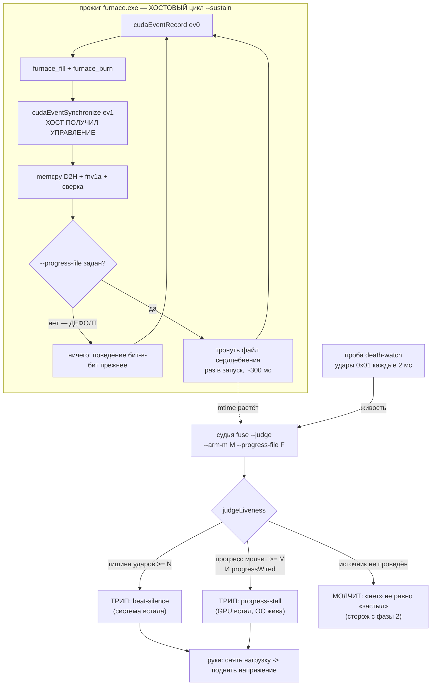

# План 66 — эпик 51 фаза 5в: ВХОД 2 предохранителя получает источник

> **Создан:** 2026-08-29 12:0x +03:00 · **Родитель:** `plans/51` → строка «5в — ВХОД 2:
> сердцебиение прогресса» · **разведка:** `researches/24` (обязательна к прочтению: она
> переопределила задачу и назвала цену)
> **Предыдущие:** `plans/55` (вход 2 в судье, P55-AC2) · `plans/56` (как выводится порог) ·
> `plans/65` (кривая порога на двойнике, метод сетки переиспользуется)
> **Заказ владельца:** *«тюним предохранители на виртуалке»* → *«планируем, делаем»* (2026-08-29).
> **Наружу:** пересобираются три `.exe`. Прибор обязан остаться прежним, и это проверяется
> механически — `run_checksum` манифеста.

## Вектор цели

**Боль, названная числом.** Судья умеет вход 2 с фазы 2, но кормить его нечем: `progressWired`
никогда не становится истиной. Отказ «GPU не двигает работу, ОС жива» держит сегодня один грубый
рубеж — таймаут прожига **60 000 мс** (`BURST_TIMEOUT_FLOOR_MS`). Он не срабатывал ни разу за 1614
строк журнала, но это единственное, что стоит на этой дороге.

**Куда хотим.** Прожиг сообщает о продвижении раз в запуск; судья видит остановку прогресса за
**≈ 1000 мс** вместо 60 000 — в шестьдесят раз раньше, — и спасает машину теми же двумя руками.

**Тип цели:** Achieve (новое наблюдение) + Avoid (не сдвинуть измерительный прибор: ядра, контракт
строки и `run_checksum` обязаны остаться прежними).

⚠️ **Чего эта фаза НЕ покупает, и это сказано до работы** (`researches/24` §4): на измеренном
профиле удушения вход 2 сработал бы в **17 раз ПОЗЖЕ** входа 1 (≈1000 мс против 60 мс). Он не
ускоряет спасение — он закрывает ДРУГОЙ отказ, тот, где удары идут ровно и N молчит по построению.

## Критерии приёмки (готово, когда)

- **P66-AC1 — прибор остался прежним, доказано механически.** **`run_checksum` всех трёх нагрузок
  совпал до бита** с манифестом от 2026-08-22 (`branchy 67e95c85bb6299a2` · `furnace
  2fa22073660f99b5` · `sdc_fma e27ec24a82d509d7`). Не совпал — правка откатывается целиком, фаза
  встаёт.
  ⚠️ **Прибор проверки уточнён разведкой инструмента:** `workloads:verify` пересчитывает только
  хеши ФАЙЛОВ и нагрузок не запускает; `run_checksum` рождается СБОРКОЙ (`proveDeterminism`,
  5 повторов + проверка нейтральности `--sustain 2`), и она перезаписывает манифест. Значит порядок
  такой: **контрольная сборка НЕТРОНУТОГО исходника ПЕРВОЙ** — она отвечает, воспроизводит ли
  сегодняшняя пара «карта + инструментарий» суммы от 22.08 вообще. Только после этого разница
  становится уликой против МОЕЙ правки, а не против сегодняшнего дня.
  ⚠️ Расхождение `run_checksum` не всегда вина правки: SDC на карте с приложенным режимом даёт то
  же расхождение. При расхождении — перепроверка на заводском состоянии до всяких выводов.
- **P66-AC2 — источник есть и он ВЫКЛЮЧЕН по умолчанию.** Без нового аргумента поведение прожига
  бит-в-бит прежнее: ни файла, ни лишней строки, ни системного вызова. Шкала — наличие файла ·
  прибор — прогон без флага · цель — ноль созданных файлов.
- **P66-AC3 — такт прогресса ИЗМЕРЕН, а не взят из архива.** Замер на той форме, что жжётся:
  медиана и **max** такта; архивные 302,32 / 330,68 мс (`researches/24` §3) — ожидание, которое
  замер обязан подтвердить или опровергнуть, а не заменить.
- **P66-AC4 — M ВЫВЕДЕН из формы, а не назначен.** `M = k × max(такт формы)`, `k ≥ 3` (правило
  индустрии, `researches/24` §2). Число считается для формы В МОМЕНТ взведения; константы M в коде
  нет. Блок: две разные формы дают два разных M.
- **P66-AC5 — «прогресс встал при ЖИВЫХ ударах» отрепетировано на двойнике end-to-end.** Удары идут
  ровно, сердцебиение прогресса замирает → трип с причиной **`progress-stall`** (не `beat-silence`),
  обе руки отработали, полоса встала.
  ✏️ **Исправлено по исполнении:** здесь стояло «новый профиль в `DEATH_PROFILES`». Так делать
  НЕЛЬЗЯ, и это выяснилось при написании кода: тот словарь описывает ДВЕ ИЗМЕРЕННЫЕ смерти этой
  машины, каждая запись называет свой замер источником. «Прогресс встал» — класс индустрии
  (TDR/hangcheck), у нас не наблюдавшийся. Репетиция живёт своим именем в сборке, словарь
  измеренного остался чистым.
- **P66-AC6 — ложных срабатываний 0** на здоровом сквозном прогоне с взведённым M, повторов ≥ 3.
  ✏️ **Исправлено по исполнении:** здесь стояло «сеткой `--tune-n`». Сетка меряет порог N по
  профилям смерти и вход 2 не взводит; для этого замера открыта своя дверь — `--smoke --armed
  --arm-m`. Метод (повторы, счёт намерений в журнале судьи) взят у `plans/65` без изменений.
- **P66-AC7 — живая карта не участвует:** I1-отпечаток до/после, строка доставки не сдвинулась.
  Пересборка `.exe` карту не трогает; `workloads:verify` — прогон нагрузок, он к карте обращается,
  и это ЕДИНСТВЕННОЕ разрешённое обращение фазы (без записи, только прогон).

## Схема входа 2

## Шаги

- [x] **1. Источник в трёх `.cu` — ИСПОЛНЕН 2026-08-29 12:1x.** Шов оказался одинаковым во всех
      трёх: `launches++` в конце хостового цикла, сразу после сверки запуска с эталоном (удар до
      сверки докладывал бы о намерении, а не о прогрессе). Исходное: Аргумент
      `--progress-file <путь>`; в хостовом цикле, ПОСЛЕ сверки запуска — открыть/записать/закрыть
      короткую строку (счётчик запусков). Без аргумента — ни одного системного вызова. **Ядра не
      трогаются ВООБЩЕ**, строка `KAGO-WORKLOAD` не меняется.
- [x] **2. Пересборка и ворота прибора (AC1) — ✅ ВОРОТА ОТКРЫТЫ.** Контрольная сборка НЕТРОНУТОГО
      исходника прошла первой и воспроизвела все три суммы 22.08 — база честная. После правки:
      `branchy 67e95c85bb6299a2` · `furnace 2fa22073660f99b5` · `sdc_fma e27ec24a82d509d7` —
      **совпали до бита. Прибор прежний.** Побочная находка о самом манифесте — `researches/24` §9:
      из трёх сумм воспроизводима ТОЛЬКО `run_checksum`, бинарники расходятся при любой пересборке.
- [x] **3. Замер такта (AC3) — ИСПОЛНЕН.** `furnace --sustain 5 --progress-file`: 15 касаний,
      **медиана 264,71 · p99 279,04 · max 279,04 мс**. Архивное ожидание (302,32 / 330,68) не
      опровергнуто, а уточнено: такт зависит от рабочей точки карты (сегодня приложен режим 250 Вт),
      поэтому **M выводится от МАКСИМУМА обоих источников (330,68), а не от сегодняшнего замера.**
      И `AC2` взят той же пробой: без флага файлов создано НОЛЬ.
- [x] **4. Вывод M (AC4) — ИСПОЛНЕН.** `PROGRESS_TICK_MAX_MS` (максимум ДВУХ источников) ×
      `ARM_M_K = 3` → **furnace 993 · branchy 246 · sdc_fma 3 мс.** Незнакомая нагрузка — отказ.
      **Третий вывод, которого в плане не было: `sdc_fma` НЕ ВЗВОДИТСЯ вовсе.** Его порог 3 мс
      мельче трёх тактов наблюдения (150 мс): такт запуска 0,8 мс быстрее, чем файловая дорога
      способна разглядеть. Порог, который краснел бы на собственной дороге вместо отказа карты —
      оплаченный класс (EXP-0165). Форма получает честное «не взведён с названной причиной»
      (`armMDecision`), и это РЕШЕНИЕ, а не заявление о невозможности (EXP-0169).
- [x] **5. Проводка (AC2, AC5) — ИСПОЛНЕНА.** Дорога: прожиг трогает файл → **ПРОБА** читает его
      подвыборкой (50 мс) и шлёт судье удар `0x02` → судья решает. **Судья диска не касается** — у
      него одна дверь, память и датаграммы. Ретранслятор на своём таймере (такт живости не
      сдвигается ни на такт), удар шлётся ТОЛЬКО на изменение счётчика: неподвижный файл — это и
      есть остановившийся прогресс, а повторные удары по нему усыпили бы предохранитель трупом.
      Исходное: Движок передаёт судье `--arm-m M` и `--progress-file F`, а
      прожигу — тот же `F`; путь один, задаётся в одном месте. Носитель двойника трогает тот же
      файл тем же тактом.
- [x] **6. Новый профиль (AC5) — ИСПОЛНЕН, репетиция прошла целиком.** `--rehearse-death
      progress-stall`: трип с причиной **`progress-stall`** (не `beat-silence` — причина стала
      частью проверки, иначе репетировался бы не тот отказ), рука 1 убила носителя, рука 2
      подтвердила сток двойника чтением, полоса встала до следующей ступени, ступень провалилась
      дорогой оракула, I1 цел, кольцо 867 тактов.
      ⚠️ **Профиль НЕ добавлен в `DEATH_PROFILES` — намеренно.** Тот словарь описывает ДВЕ
      ИЗМЕРЕННЫЕ смерти этой машины и каждая запись называет свой замер источником. «Прогресс
      встал» — класс индустрии (TDR/hangcheck), у нас НЕ наблюдавшийся; смешивать измеренное с
      моделируемым в одном словаре значит отравить его доверие.
- [x] **7. Ложные (AC6) — ЗАКРЫТ: ЗАМЕР ПОЙМАЛ НАСТОЯЩИЙ ДЕФЕКТ, он же его и вылечил. После ворот: 3 прогона × 21 ступень, намерений НОЛЬ.**
      **Предсказано до данных:** между ступенями прожига нет, прогрессу взяться неоткуда, а таймер
      входа 2 всё равно тикает — у входа 1 этой дыры нет, проба бьёт непрерывно.
      **Наблюдено:** здоровый прогон дал ложный трип `progress-stall` при тишине **994,9 мс**, удары
      при этом идеальны (**0,87 мс**), рука 1 сама назвала причину — *«no burn pid — nothing to
      kill»*. Трип на пустом месте.
      **Лечение — ВОРОТА «идёт ли прожиг».** Признак выбран не первый попавшийся: пид-файл есть
      только у двойника (на живом пути pid заперт в `spawnSync`), и ворота на нём молча выключили
      бы вход 2 там, где он и нужен. Признак — **сам файл сердцебиения**: его создаёт прожиг и
      СНИМАЕТ при штатном выходе (`remove()` в трёх `.cu` и `rmSync` в носителе). Судья спрашивает
      только о СУЩЕСТВОВАНИИ файла и только тогда, когда вход 2 уже собрался трипнуть — не чаще
      раза за окно M, диска в такте по-прежнему нет.
      **Доказано парой сквозных блоков** (одного мало: первый прошёл бы и на вовсе сломанном входе):
      прогресс молчит + файла нет → трипа нет · тот же простой + файл есть → трип `progress-stall`.
- [x] **8. Итог + карта:** §Итог с числами, `PROJECT_ARCHITECTURE_INTERNAL_MAP.md` — вход 2 стал
      проведённым; `bugs/67` при этом НЕ чинится (отдельный тикет, свой шаг).

## Проверка — какими артефактами и где они лежат

| утверждение | чем наблюдается | путь |
|---|---|---|
| прибор прежний | `npm run workloads:verify` + сверка трёх `run_checksum` | `workloads/MANIFEST.json` |
| дефолт бит-в-бит | блок «без `--progress-file` файлов не создано» | `stress --selftest` |
| такт измерен | замер с включённым источником, медиана и max | §Итог + сырьё в `benches/` |
| M выводится из формы | блоки «две формы — два M» · «форма без замера — отказ» | `fuse --selftest` |
| прогресс встал при живых ударах | репетиция профиля, причина трипа `progress-stall` | `twin-assembly --rehearse-death progress-stall` |
| ложных 0 | сетка `--tune-n`, сценарий здоровый + M | `benches/fixtures/tune-n/` |
| карта не тронута | `twin-assembly --i1` до/после | вывод + §Итог |

## Риски (Мёрфи) и реакция

1. **🔴 Пересборка сдвинет прибор, и весь архив станет несравним.** Реакция: ворота AC1 стоят
   ВТОРЫМ шагом, до всякой проводки; ядра не трогаются вовсе; не совпал `run_checksum` — откат
   целиком, а не «разберёмся потом». Это единственный шаг, где фаза может законно остановиться.
2. **Ложные трипы по прогрессу на медленной ступени.** Под низким напряжением запуск может длиться
   дольше обычного. Реакция: `k ≥ 3` берётся от **max**, а не от медианы; шаг 7 меряет ложные тем
   же способом, каким их мерил `plans/65`.
3. **Работа под класс отказа, которого мы не видели** (`researches/24` §4, вывод 3). Реакция:
   владельцу это сказано числом (60 000 → 1000 мс), а не словами «улучшили предохранитель»; и
   вход 2 не трогает вход 1 — приоритет причин уже задан в `judgeLiveness`.
4. **Двойник не имеет `.cu`.** Реакция: носитель прожига двойника трогает тот же файл тем же
   тактом — репетиция идёт по той же дороге, что живой путь (принцип паритета эпика 59).

## Итог — ИСПОЛНЕН 2026-08-29 11:5x → 12:3x

**Живая карта участвовала ровно в одном: пересборке нагрузок (прогон, без записей). I1-отпечаток
до/после цел во всех твин-прогонах, строка доставки не сдвинулась.**

### Что построено

Дорога входа 2 целиком: **прожиг трогает файл сердцебиения раз в запуск → проба читает его
подвыборкой (50 мс) и шлёт судье удар `0x02` → судья решает.** Судья диска не касается: у него
одна дверь — память и датаграммы.

| критерий | результат |
|---|---|
| **AC1** прибор прежний | ✅ **дважды.** Контрольная сборка НЕТРОНУТОГО исходника прошла ПЕРВОЙ и воспроизвела суммы 22.08 — только после этого разница стала бы уликой против правки. После обеих правок `run_checksum` всех трёх совпали до бита |
| **AC2** дефолт молчит | ✅ без `--progress-file` файлов создано **0**, ни одного системного вызова |
| **AC3** такт измерен | ✅ `furnace` медиана **264,71** · max **279,04 мс** (15 касаний); архив (302,32 / 330,68) не опровергнут, а уточнён — такт зависит от рабочей точки карты |
| **AC4** M выведен из формы | ✅ **furnace 993 · branchy 246 · sdc_fma 3 мс**; незнакомая нагрузка — отказ. `sdc_fma` **не взводится вовсе** и говорит почему |
| **AC5** репетиция | ✅ `--rehearse-death progress-stall`: трип с причиной **`progress-stall`** (не `beat-silence`), обе руки, полоса встала, ступень провалилась дорогой оракула, кольцо 867 тактов |
| **AC6** ложных 0 | ✅ **3 прогона × 21 ступень ≈ 63 прожига с взведённым входом 2 — намерений в журналах судьи НОЛЬ.** Не пусто: M=993 напечатан, ступени по ~12 с (носитель ехал, источник живой) |
| **AC7** карта не тронута | ✅ I1 до/после совпал, строка доставки не сдвинулась |

### Три вещи, которые эта фаза выяснила, а не предполагала

1. **Вопрос был поставлен не туда.** Искали, как отдавать прогресс из CUDA-ядра; хостовый цикл
   `--sustain` знал момент отгрузки всегда и просто молчал. Источник — одна строка вместо
   машинерии (EXP-0172).
2. **Замер поймал дефект, который предсказание назвало раньше данных.** Между ступенями прожига
   нет — таймер входа 2 тикал впустую: ложный трип при тишине 994,9 мс и идеальных ударах 0,87 мс.
   Ворота поставлены на признак, существующий на ОБЕИХ дорогах.
3. **Пересборка нетронутого исходника даёт другие бинарники** (`researches/24` §9): из трёх сумм
   манифеста воспроизводима только `run_checksum`. Ворота будущих фаз обязаны опираться на неё.

### Проверка

`fuse` **54 зелёных / 0** (шесть новых: вывод M, отказ формы, пара сквозных блоков ворот) ·
`death-watch` **16 / 0** (пять новых на ретранслятор) · `twin` 18 / 0 · `stress` 68 / 0 ·
`npm run check` зелёный.

**Мутации, откат КОПИЕЙ файла (TA1):** ворота сняты → краснеет ровно блок ворот (53/1, и трип
пришёл с тем самым `no burn pid — nothing to kill`) · ретранслятор бьёт на каждый опрос → краснеют
два блока правила «удар только на продвижение» (14/2). Оба отката зелёные.

### Что осталось за фазой

- **Живой дым** — вход 2 на настоящем прожиге проверяется первым же карточным вечером; здесь он
  доказан на двойнике и на пересобранных бинарниках, но не на живой развёртке.
- **`bugs/67`** (трип останавливает полосу, а прогон возвращает 0) — отдельный тикет, не чинился.
- **M не взводится на живом пути автоматически:** движок передаёт `--arm-m` только на двойнике.
  Взведение на живом прогоне — решение владельца, и цена названа: 60 000 → ≈1000 мс на отказе,
  которого проект ни разу не наблюдал.
