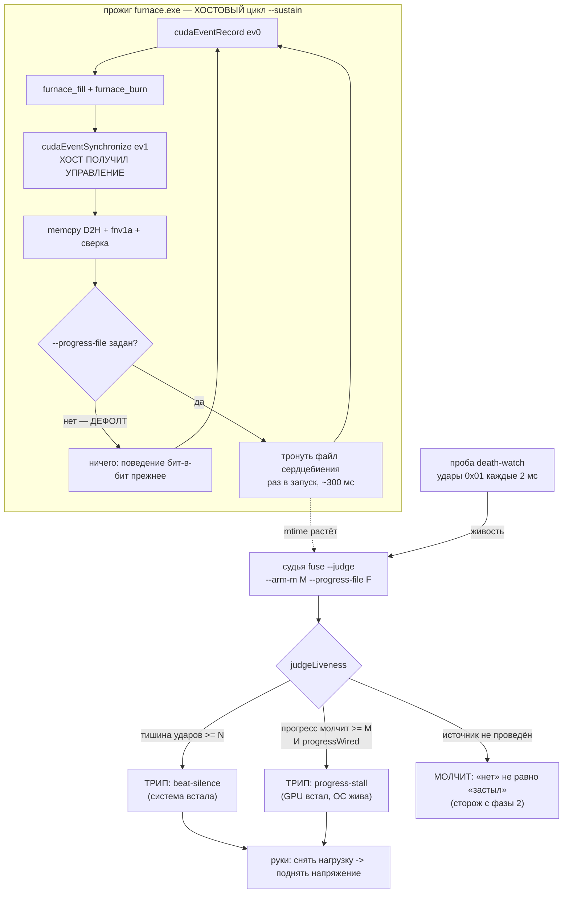

# План 66 — эпик 51 фаза 5в: ВХОД 2 предохранителя получает источник

> **Создан:** 2026-08-29 12:0x +03:00 · **Родитель:** `plans/51` → строка «5в — ВХОД 2:
> сердцебиение прогресса» · **разведка:** `researches/24` (обязательна к прочтению: она
> переопределила задачу и назвала цену)
> **Предыдущие:** `plans/55` (вход 2 в судье, P55-AC2) · `plans/56` (как выводится порог) ·
> `plans/65` (кривая порога на двойнике, метод сетки переиспользуется)
> **Заказ владельца:** *«тюним предохранители на виртуалке»* → *«планируем, делаем»* (2026-08-29).
> **Наружу:** пересобираются три `.exe`. Прибор обязан остаться прежним, и это проверяется
> механически — `run_checksum` манифеста.

## Вектор цели

**Боль, названная числом.** Судья умеет вход 2 с фазы 2, но кормить его нечем: `progressWired`
никогда не становится истиной. Отказ «GPU не двигает работу, ОС жива» держит сегодня один грубый
рубеж — таймаут прожига **60 000 мс** (`BURST_TIMEOUT_FLOOR_MS`). Он не срабатывал ни разу за 1614
строк журнала, но это единственное, что стоит на этой дороге.

**Куда хотим.** Прожиг сообщает о продвижении раз в запуск; судья видит остановку прогресса за
**≈ 1000 мс** вместо 60 000 — в шестьдесят раз раньше, — и спасает машину теми же двумя руками.

**Тип цели:** Achieve (новое наблюдение) + Avoid (не сдвинуть измерительный прибор: ядра, контракт
строки и `run_checksum` обязаны остаться прежними).

⚠️ **Чего эта фаза НЕ покупает, и это сказано до работы** (`researches/24` §4): на измеренном
профиле удушения вход 2 сработал бы в **17 раз ПОЗЖЕ** входа 1 (≈1000 мс против 60 мс). Он не
ускоряет спасение — он закрывает ДРУГОЙ отказ, тот, где удары идут ровно и N молчит по построению.

## Критерии приёмки (готово, когда)

- **P66-AC1 — прибор остался прежним, доказано механически.** После пересборки
  `npm run workloads:verify` зелёный и **`run_checksum` всех трёх нагрузок совпал до бита** с
  манифестом от 2026-08-22. Не совпал — правка откатывается целиком, фаза встаёт.
- **P66-AC2 — источник есть и он ВЫКЛЮЧЕН по умолчанию.** Без нового аргумента поведение прожига
  бит-в-бит прежнее: ни файла, ни лишней строки, ни системного вызова. Шкала — наличие файла ·
  прибор — прогон без флага · цель — ноль созданных файлов.
- **P66-AC3 — такт прогресса ИЗМЕРЕН, а не взят из архива.** Замер на той форме, что жжётся:
  медиана и **max** такта; архивные 302,32 / 330,68 мс (`researches/24` §3) — ожидание, которое
  замер обязан подтвердить или опровергнуть, а не заменить.
- **P66-AC4 — M ВЫВЕДЕН из формы, а не назначен.** `M = k × max(такт формы)`, `k ≥ 3` (правило
  индустрии, `researches/24` §2). Число считается для формы В МОМЕНТ взведения; константы M в коде
  нет. Блок: две разные формы дают два разных M.
- **P66-AC5 — «прогресс встал при ЖИВЫХ ударах» отрепетировано на двойнике end-to-end.** Новый
  профиль в `DEATH_PROFILES`: удары идут ровно, сердцебиение прогресса замирает → трип с причиной
  **`progress-stall`** (не `beat-silence`), обе руки отработали, полоса встала.
- **P66-AC6 — ложных срабатываний 0** на здоровом сквозном прогоне с взведённым M, сеткой
  `--tune-n` (метод `plans/65`), повторов ≥ 3.
- **P66-AC7 — живая карта не участвует:** I1-отпечаток до/после, строка доставки не сдвинулась.
  Пересборка `.exe` карту не трогает; `workloads:verify` — прогон нагрузок, он к карте обращается,
  и это ЕДИНСТВЕННОЕ разрешённое обращение фазы (без записи, только прогон).

## Схема входа 2

## Шаги

- [ ] **1. Источник в трёх `.cu`** — *якорь родителя: «нет ИСТОЧНИКА»*. Аргумент
      `--progress-file <путь>`; в хостовом цикле, ПОСЛЕ сверки запуска — открыть/записать/закрыть
      короткую строку (счётчик запусков). Без аргумента — ни одного системного вызова. **Ядра не
      трогаются ВООБЩЕ**, строка `KAGO-WORKLOAD` не меняется.
- [ ] **2. Пересборка и ворота прибора (AC1).** `npm run workloads:build` → `workloads:verify` →
      сверить `run_checksum` всех трёх с прежним манифестом. Не совпало — откат, фаза встаёт и
      несёт находку владельцу.
- [ ] **3. Замер такта (AC3)** на форме `furnace` с включённым источником: медиана и max интервала
      между касаниями файла. Сверить с архивным ожиданием 302,32 / 330,68 мс.
- [ ] **4. Вывод M (AC4).** `M = k × max`, `k ≥ 3`; функция от формы, не константа. Блоки: две
      формы — два M; форма без замера — отказ, а не догадка.
- [ ] **5. Проводка (AC2, AC5).** Движок передаёт судье `--arm-m M` и `--progress-file F`, а
      прожигу — тот же `F`; путь один, задаётся в одном месте. Носитель двойника трогает тот же
      файл тем же тактом.
- [ ] **6. Новый профиль смерти (AC5):** `progress-stall` в `DEATH_PROFILES` — удары ровные,
      касания файла прекращаются. Репетиция end-to-end на двойнике.
- [ ] **7. Ложные (AC6):** сетка `--tune-n` со сценарием «здоровый + взведённый M», повторов ≥ 3.
- [ ] **8. Итог + карта:** §Итог с числами, `PROJECT_ARCHITECTURE_INTERNAL_MAP.md` — вход 2 стал
      проведённым; `bugs/67` при этом НЕ чинится (отдельный тикет, свой шаг).

## Проверка — какими артефактами и где они лежат

| утверждение | чем наблюдается | путь |
|---|---|---|
| прибор прежний | `npm run workloads:verify` + сверка трёх `run_checksum` | `workloads/MANIFEST.json` |
| дефолт бит-в-бит | блок «без `--progress-file` файлов не создано» | `stress --selftest` |
| такт измерен | замер с включённым источником, медиана и max | §Итог + сырьё в `benches/` |
| M выводится из формы | блоки «две формы — два M» · «форма без замера — отказ» | `fuse --selftest` |
| прогресс встал при живых ударах | репетиция профиля, причина трипа `progress-stall` | `twin-assembly --rehearse-death progress-stall` |
| ложных 0 | сетка `--tune-n`, сценарий здоровый + M | `benches/fixtures/tune-n/` |
| карта не тронута | `twin-assembly --i1` до/после | вывод + §Итог |

## Риски (Мёрфи) и реакция

1. **🔴 Пересборка сдвинет прибор, и весь архив станет несравним.** Реакция: ворота AC1 стоят
   ВТОРЫМ шагом, до всякой проводки; ядра не трогаются вовсе; не совпал `run_checksum` — откат
   целиком, а не «разберёмся потом». Это единственный шаг, где фаза может законно остановиться.
2. **Ложные трипы по прогрессу на медленной ступени.** Под низким напряжением запуск может длиться
   дольше обычного. Реакция: `k ≥ 3` берётся от **max**, а не от медианы; шаг 7 меряет ложные тем
   же способом, каким их мерил `plans/65`.
3. **Работа под класс отказа, которого мы не видели** (`researches/24` §4, вывод 3). Реакция:
   владельцу это сказано числом (60 000 → 1000 мс), а не словами «улучшили предохранитель»; и
   вход 2 не трогает вход 1 — приоритет причин уже задан в `judgeLiveness`.
4. **Двойник не имеет `.cu`.** Реакция: носитель прожига двойника трогает тот же файл тем же
   тактом — репетиция идёт по той же дороге, что живой путь (принцип паритета эпика 59).

## Итог

*(заполняется по исполнении)*
