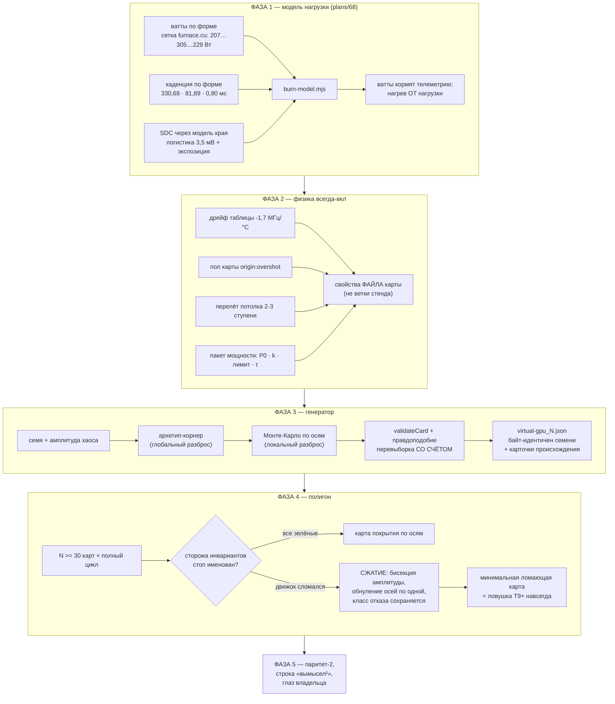

# Эпик 67 — генератор виртуальных карт и полигон неизвестных GPU

> **Создан:** 2026-08-29 14:5x +03:00 · **Заказ:** слово владельца 2026-08-29, дословно в
> `GOAL.md` → «🎲 ГЕНЕРАТОР ВИРТУАЛЬНЫХ КАРТ И ПОЛИГОН НЕИЗВЕСТНЫХ GPU» ·
> **Разведка:** `researches/25` (индустрия · локальный код · переформулировка «99 %») ·
> **Родители по коду:** `virtual-gpu.mjs` (модель, 3007 строк) · эпик 59 (`plans/59`, паритет;
> его граница «одна карта» снята этим заказом с датой) · эпик 51 (предохранители — полигон гоняет
> и их).
> **Статус:** ✅ **ЗАКРЫТ ЦЕЛИКОМ 2026-08-30** (сессия 65) — все пять фаз исполнены
> (`plans/68`, `plans/69`, `plans/70`, `plans/71_DONE`, `plans/72_DONE`), все семь критериев
> закрыты, слово владельца по E67-AC7 получено. Итог — § «Итог эпика» в конце файла.
> **Наружу:** обычная карта rtx5070ti остаётся байт-в-байт (I4-дисциплина); строка происхождения
> I3 у сгенерированных карт УСИЛИВАЕТСЯ («вымысел²»); правды о кремнии владельца эпик не обещает.

---

## Вектор цели

**Боль.** Движок КАГО доказан на ДВУХ объектах: живой карте владельца и одном её двойнике. Всё,
что движок «знает» о GPU, он знает из одного экземпляра — а его подсистемы (развёртка, оракул,
храповик, предохранители, журнал) обязаны быть честными на КАРТЕ ВООБЩЕ. Сегодня нет способа
спросить: «а если бы кремний был другим — злее, шумнее, с другим пакетом мощности — движок прошёл
бы цикл или соврал?» Каждый такой вопрос к живому железу стоит риска и вечера; к неизвестному
железу его задать вообще нельзя.

**Куда хотим.** Полигон: генератор из семени и амплитуды хаоса выпускает файлы правдоподобных
карт с ДРУГИМИ разбросами, дрейфами, напряжениями, частотами, пакетами и лимитами мощности;
пакетный прогон ведёт полный цикл оптимизации по каждой; движок на 100 % карт либо завершает цикл,
либо останавливается ИМЕНОВАННО; сломавшая карта сжимается до минимальной и коммитится вечной
ловушкой. Модель при этом доведена до полной поверхности поведения: нагрузка `.cu`, нагрев,
дрейфы, телеметрия — красных строк паритета «без причины» не остаётся.

**Тип цели:** Achieve (генератор + полигон + модель нагрузки) + Avoid (не сдвинуть обычную карту
ни на бит; не выдать вымысел за утверждение о кремнии — I3).

## Критерии приёмки эпика

- **E67-AC1 — модель нагрузки закрывает красную строку паритета.** Ватты, каденция запусков и
  механизм SDC на двойнике считаются МОДЕЛЬЮ, подогнанной к измеренному (сетка ватт по форме из
  `furnace.cu` · каденция 330,68/81,89/0,80 мс · крутизна края 3,5 мВ), а не константами-суррогатами.
  Шкала — строки реестра паритета · прибор — реестр в `plans/59` · цель — строка «нагрузка»
  переведена в ✅ со свидетелем.
- **E67-AC2 — генератор детерминирован и валиден.** Одно семя → байт-идентичный файл (sha256
  совпадает при повторе); **100 сгенерированных карт: 100 проходят `validateCard`**; статистика по
  100 картам укладывается в заявленные диапазоны осей (машинная сводка, не глаз). Перевыборка
  невалидных СЧИТАЕТСЯ и печатается — молчаливый re-draw прячет кривой генератор.
- **E67-AC3 — полигон.** ≥ 30 карт (практика Монте-Карло, `researches/25` §2.3) × полный цикл
  оптимизации: необработанных исключений **0** · нарушений инвариантных сторожей **0** · каждый
  стоп несёт имя причины (**100 %**). Карта покрытия по осям печатается с каждым прогоном.
- **E67-AC4 — сжатие работает.** Ломающая карта минимизируется с сохранением класса отказа до
  ≤ 3 активных осей хаоса и коммитится ловушкой T9+; продемонстрировано минимум на одном
  преднамеренно заложенном дефекте.
- **E67-AC5 — обычная карта не сдвинулась.** Твин-прогон rtx5070ti без новых флагов — бит-в-бит
  (батарея + I1-отпечаток держат).
- **E67-AC6 — происхождение честное.** Каждый файл сгенерированной карты и каждый полигон-отчёт
  несут строку: «СГЕНЕРИРОВАНО семенем N, амплитуда A — вымысел²: не существует и как замер».
- **E67-AC7 — глаз владельца** на полигон-отчёте (фаза 5): читается ли, верит ли.

## Фазы — порядок диктуется зависимостями

| фаза | что делает | ворота выхода |
|---|---|---|
| **1 — модель нагрузки** (`plans/68`) | Прожиг двойника перестаёт быть носителем-пустышкой: ватты по форме (сетка `furnace.cu`), каденция запусков по форме и рабочей точке, SDC через модель края, контрольные суммы по штампу, ватты кормят телеметрию (нагрев от нагрузки) | ✅ **ИСПОЛНЕНА 29.08 15:2x** (`plans/68` §Итог): все 10 строк сетки ±5 % · каденция ±10 % · SDC по-запусково без сдвига посеянной последовательности · штамп с золотым дефолтом (одна функция на обе стороны — прожиг и `goldenFor`) · батарея 34/1547/0 (`burn` 10, vgpu 105) · smoke·strangle·hang зелёные без правок проверок · строка паритета переведена со свидетелем. Открытое: fma=48 — два замера расходятся (269/303, живой перезамер) · `branchy` активность НАЗНАЧЕНА |
| **2 — физика «всегда-вкл» + параметрический пакет** | Механизмы, которые живая карта делает ВСЕГДА, а двойник нёс только ловушками, становятся свойствами ФАЙЛА карты: дрейф таблицы (−1,7 МГц/°C у образца), пол карты (`origin:overshot`), перелёт потолка, связь temp↔край (у образца слабая — 1,85 мВ/°C); телеметрия параметризуется пакетом (P₀, k, предел, вентилятор, τ) | ✅ **ИСПОЛНЕНА 29.08 15:3x** (`plans/69` §Итог): блок physics с закрытым словарём и origin-обязательностью · пакет/пол/edgeShift/дрейф действуют и ловятся (2 мутации адресные) · батарея 34/1553/0, vgpu 111 · первая «вторая карта» benches/cards/rtx5070ti-physics (3 листа ИЗМЕРЕННОЙ физики; floor/edgeShift честно без чисел). Побочно вылечена порядко-зависимость пульс-блока twin |
| **3 — генератор** (`plans/70`) | `card-generator.mjs`: семя + амплитуда хаоса (+ архетип-корнер) → файл `virtual-gpu_<семя>.json`; двухслойная выборка (архетипы = глобальный разброс, MC = локальный); карточка происхождения на каждый параметр (наш замер · публичный порядок · назначено); счётчик перевыборок | ✅ **ИСПОЛНЕНА 29.08 15:4x** (`plans/70` §Итог): `--batch 100 --amplitude 0.8` → **100/100 валидны, перевыборок 0**, пять архетипов по 20, диапазоны осей в границах — E67-AC2 до буквы; (семя, A, архетип) → байт-идентичная карта (sha256 ×2); «вымысел²» в каждом файле. Шаг 6 взят той же сессией: дверь `--twin-card` + сквозной `--sweep` на сгенерированной hot-unlucky, код 0. Оплачено красным: кривая стока не отсортирована — «верх» с хвоста массива давал 180 МГц |
| **4 — полигон** (`plans/71_DONE`) | Пакетный прогон: N карт × полный цикл (развёртка → урожай → отчёт) под сторожами инвариантов; карта покрытия по осям; интегрированное сжатие ломающей карты (бисекция амплитуды + обнуление осей по одной, класс отказа сохраняется); минимальная карта → ловушка | ✅ **ИСПОЛНЕНА 29.08 23:0x** (`plans/71_DONE` §Шаг 8): пакет **30 карт / 30 пройдено / 0 сломано**, время числом; карта покрытия по шести осям; **три ловушки краснят 3 из 3, каждая ровно своё**. Открытым уходит `P71-AC8` (наполовину: порознь оба сторожа доказаны, сложение структурно недостижимо — и это ЗАМЕРЕНО, а не предположено) |
| **5 — паритет-2 и приёмка** (`plans/72_DONE`) | Реестр паритета переиздаётся (что двойник и полигон ДОКАЗЫВАЮТ · чего НЕ доказывают); строка «вымысел²» во всех выходах; полигон-отчёт владельцу | ✅ **ИСПОЛНЕНА 30.08** (`plans/72_DONE` §Итог): 11 строк о полигоне в реестре, **6 из 11 — «НЕ доказывает» и стоят первыми**; «вымысел²» под блоком с семенем и амплитудой (мутации ×3); пробел зазоров проб закрыт исходом (а) — ветка `bugs/61` впервые прошла на вымысле; ворота E67-AC5 — документ 389/389 бит-в-бит; **слово владельца получено: «я прочитал, ок»** |

## Схема эпика

## Почему такой порядок

Полигон без модели нагрузки гонял бы цикл по суррогату (SDC от константной суммы, ватты из
воздуха) — «зелёный» такого полигона недорого стоит. Генератор без физики фазы 2 выбирал бы из
трёх ловушечных ручек — «непредсказуемости» на копейку. Поэтому: сначала модель честная (1–2),
потом множитель (3), потом контур проверки (4), и только потом слова о доказанном (5).

## Риски (Мёрфи, по ярусам)

1. **🔴 Полигон научит движок проходить ВЫМЫСЕЛ, а не кремний** (родовой порок стендов —
   `researches/10`: «fake that drifts, green becomes a lie»). Реакция: полигон проверяет ТОЛЬКО
   инварианты честности (цикл завершён/стоп именован, журнал цел, конверт не превышен), никогда —
   «нашёл ли правильный край»: правильного края у вымысла нет. Строка «вымысел²» в каждом выходе.
2. **🟠 Ось хаоса, которой нет в реальности, родит ложные ремонты движка.** Реакция: карточка
   происхождения на каждый параметр; ось «назначено» получает диапазон с обоснованием в файле
   генератора; находка полигона на такой оси сперва проверяется вопросом «а бывает ли так»
   (журнал решений).
3. **🟠 Обычная карта тихо сдвинется под тяжестью новой физики.** Реакция: E67-AC5 воротами каждой
   фазы, не только эпика; байт-идентичность держит батарея, а не обещание.
4. **🟡 Сжатие меняет класс отказа и маскирует дефект** (названный анти-паттерн PBT). Реакция:
   сжатый кандидат обязан падать ТЕМ ЖЕ именованным классом, иначе отвергается.
5. **🟡 Полигон дорог по времени.** Реакция: время прогона — число в отчёте (E67-AC3); ускорение
   стенда уже канон (`ideas/04`), сжатые паузы честно объявлены.

## Решения без владельца (журнал; авторизация — его слово «делай то в модели, что тебе нужно»)

| # | решение | цена отката |
|---|---|---|
| 1 | «99 %» читается как полнота ПОВЕРХНОСТИ ПОВЕДЕНИЯ (ноль красных строк паритета без причины), не как предсказание кремния | переформулировка критериев |
| 2 | Размер полигона по умолчанию 30…50 карт — из практики Монте-Карло | одна константа |
| 3 | Сжатие — интегрированное (минимизируется вход генератора) | способ сжатия, код фазы 4 |
| 4 | Осям хаоса разрешено превышать наблюдавшееся на НАШЕЙ карте (смысл «неизвестных GPU»), в границах правдоподобия с карточкой происхождения | сужение диапазонов |
| *(пополняется по фазам)* | | |

## Границы — чего эпик НЕ делает

Не предсказывает кремний владельца (I3; у сгенерированных карт — «вымысел²») · не строит второй
механизм модели (генератор порождает ФАЙЛЫ для единственного vgpu — R7) · не подменяет живую
приёмку ни одного эпика (карточный вечер, E51-AC6 — как были) · не выпускает пороги/константы
движка из полигонных чисел без живого подтверждения · не трогает живую карту ни одной фазой.

---

## Итог эпика — ЗАКРЫТ ЦЕЛИКОМ

**Дата закрытия:** 2026-08-30 (сессия 65), последним действием — слово владельца на отчёте полигона.
**Срок:** создан 2026-08-29 14:5x, закрыт через сутки, пять фаз.

### Критерии эпика — все семь

| критерий | вердикт | чем закрыт |
|---|---|---|
| **E67-AC1** — модель нагрузки закрывает красную строку паритета | ✅ | фаза 1: все 10 строк сетки ватт ±5 %, каденция ±10 %, SDC по-запусково, штамп с золотым дефолтом; строка «нагрузка» в реестре переведена СО СВИДЕТЕЛЕМ |
| **E67-AC2** — генератор детерминирован и валиден | ✅ | фаза 3: **100 карт → 100 валидны, перевыборок 0**; одно семя → байт-идентичный файл (sha256 ×2); диапазоны осей в заявленных границах машинной сводкой |
| **E67-AC3** — полигон ≥ 30 карт, 0 исключений, 100 % именованных стопов | ✅ | фазы 4 и 5: два независимых чистых пакета 30/30 (23:0x 29.08 и показ владельцу 30.08, 1460,2 с), карта покрытия печатается с каждым прогоном |
| **E67-AC4** — сжатие сохраняет класс отказа | ✅ | фаза 4, P71-AC4: подставной оракул + мутации; ловушки коммитятся картами с записанным намерением (`card.trap`) |
| **E67-AC5** — обычная карта не сдвинулась | ✅ **ворота каждой фазы, а не только эпика** | последняя сверка — фаза 5 против эталона `4cc4153`: **документ 389/389 строк бит-в-бит**, батарея 40 наборов / 1659 / 0 |
| **E67-AC6** — происхождение честное | ✅ | строка «вымысел²» с СЕМЕНЕМ И АМПЛИТУДОЙ в файле карты и в отчёте, **под блоком, а не под дисциплиной агента** (мутации ×3 краснят) |
| **E67-AC7** — глаз владельца на отчёте | ✅ | отчёт открыт агентом при владельце 2026-08-30; слово дословно: **«я прочитал, ок»** (`plans/72_DONE` §Шаг 6) |

### Что эпик дал проекту, одной фразой каждое

1. **Движок перестал быть доказанным на двух объектах.** Было: живая карта владельца и один её
   двойник. Стало: тридцать карт с другими разбросами, дрейфами, полами, пакетами мощности —
   и полный цикл оптимизации по каждой.
2. **Зелёный полигона стал отличим от зелёного полигона, который ловить не умеет** — это главный
   результат фазы 4, и он куплен тремя настоящими красными на ловушках, а не рассуждением.
3. **Ветка вердикта `bugs/61` впервые стала проверяемой без живого железа** (фаза 5, исход (а)).
4. **Граница вымысла записана в машине, а не в голове агента** — реестр паритета с 6 строками
   «НЕ доказывает» и сторож на строку происхождения.

### 🔴 Что уходит из эпика ОТКРЫТЫМ — читать вместе с «✅ закрыт целиком»

- **`P71-AC8` — наполовину.** Два сторожа порознь доказаны, их сложение на одной карте структурно
  недостижимо. Это ЗАМЕРЕНО, а не предположено, и причина названа в `plans/71_DONE`.
- **`pulseStallMsAtEdge` выведен из живого замера с n = 1.** Одна карта, один вечер, один ступор.
- **`deliverStepsAboveEnvelope` железом НЕ подтверждён вовсе** — заведён решением владельца
  (`interviews/019` = A). Обе физики ОПТ-ИН; карта без поля ведёт себя бит-в-бит как раньше.
- **`fma=48`: два замера расходятся** (269/303) — ждёт живого перезамера (наследство фазы 1).
- **Тридцать зелёных карт не означают, что движок верен.** Они означают: на широком поле поведений
  шесть сторожей честности не нашли нарушения инвариантов. О кремнии владельца эпик не сказал
  ничего и по построению сказать не мог.
