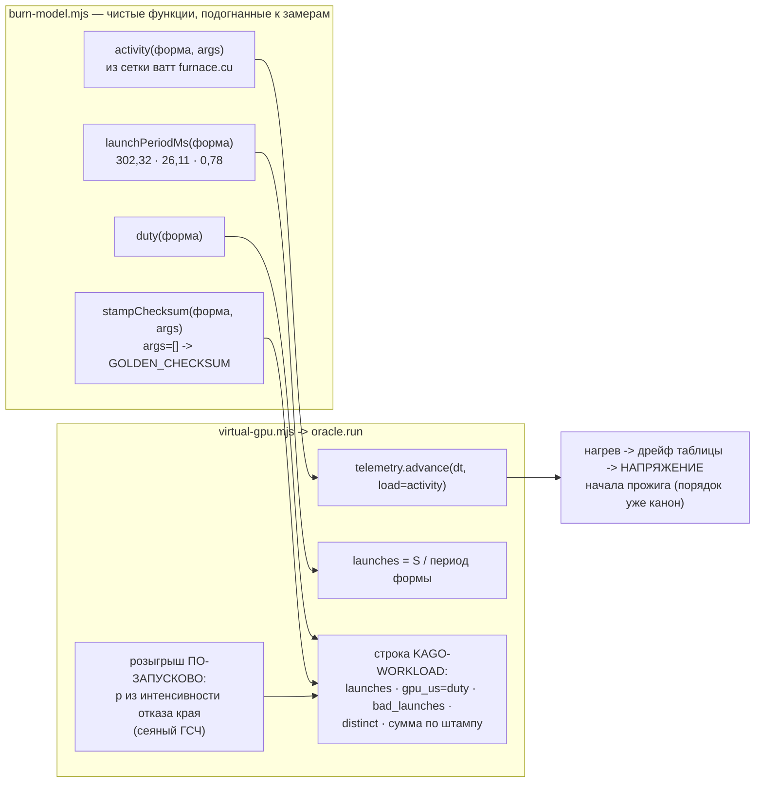

# План 68 — эпик 67 фаза 1: модель нагрузки (прожиг двойника перестаёт быть пустышкой)

> **Создан:** 2026-08-29 15:0x +03:00 · **Родитель:** `plans/67` → строка «**1 — модель нагрузки**:
> ватты по форме (сетка `furnace.cu`), каденция запусков по форме и рабочей точке, SDC через модель
> края, контрольные суммы по штампу, ватты кормят телеметрию» · **Разведка:** `researches/25` §3.2
> (все числа) · **Шов:** `virtual-gpu.mjs` → `oracle.run` (строки ~1776–1790: сегодня
> `gpu_us = launches × 900`, `work_per_launch = 100000` — константы из воздуха, ватт нет вовсе,
> «SDC» — один розыгрыш на весь прожиг от константной суммы).
> **Статус:** ✅ ИСПОЛНЕН 2026-08-29 15:2x — §Итог внизу; батарея 34/1547/0, сквозные smoke·strangle·hang зелёные.

## Вектор цели фазы

**Боль.** На двойнике прожиг — носитель времени стены: ватты не считаются, каденция одна на все
формы, контрольная сумма — константа, SDC — один розыгрыш на прожиг. Полигон, гоняющий цикл по
такому суррогату, дёшев: половина того, что движок делает со ступенью (греет карту, считает
запуски, ловит расхождение сумм, различает штампы интенсивности), на двойнике не происходит.

**Куда хотим.** Прожиг двойника СЧИТАЕТСЯ моделью, подогнанной к измеренному: форма → ватты →
нагрев; форма → каденция → счёт запусков и длительности; близость к краю → пораженные запуски →
расхождение сумм. Красная строка паритета «нагрузка» закрывается со свидетелем.

**Тип цели:** Achieve (модель) + Avoid (обычная карта и живой путь не сдвигаются ни на бит).

## Критерии приёмки (готово, когда)

- **P68-AC1 — ватты по форме.** Шкала — Вт · прибор — `telemetryEquilibrium` с активностью формы
  против измеренной сетки `furnace.cu` (fma/слово → Вт: 0→207 · 16→238 · 32→248 · 48→269 ·
  64→305 · 96→287 · 128→275 · 256→267 · 1024→252 · 4096→229) · цель — **каждая из 10 строк
  воспроизводится с точностью ±5 %**; строка 64 упирается в предел мощности (зажим наблюдался
  живьём — факт 16).
- **P68-AC2 — каденция и доля времени.** Шкала — запуски и мкс · прибор — разбор строки
  `KAGO-WORKLOAD` твин-прожига · цель — `launches` для `--sustain S` в пределах **±10 %** от
  S/медианы формы (302,32 · 26,11 · 0,78 мс — архив 42 прогонов, `researches/24` §3);
  `gpu_us/wall_us` в пределах **±5 п.п.** от измеренной доли (duty 0,987 у branchy).
- **P68-AC3 — SDC помножен на запуски.** Порча — ПО-ЗАПУСКОВО от интенсивности отказа модели края
  (сеяный ГСЧ — детерминизм на семени); `bad_launches > 0 ⇔ distinct > 1`; поля `bad_launches`,
  `bad_elems_max` печатаются честно — детектор «сумма разошлась ВНУТРИ прожига» (`stress-tester`
  блок 3) становится проверяемым на двойнике.
- **P68-AC4 — сумма по ШТАМПУ.** Контрольная сумма — функция (нагрузка, аргументы): другая
  интенсивность → другая сумма (дисциплина R6 «эталон снят на ТОЙ интенсивности» становится
  упражняемой). **Дефолтные аргументы дают прежний `GOLDEN_CHECKSUM`** — существующие эталоны и
  блоки не сдвигаются.
- **P68-AC5 — нагрев ОТ нагрузки.** `telemetry.advance` получает активность формы вместо
  бинарного `load: 1`: форма 0 fma греет к ~207 Вт равновесия, форма 64 — к зажиму предела.
  Прибор — равновесия из P68-AC1.
- **P68-AC6 — ничего не сдвинулось.** Батареи 0 красных; `--smoke`, `--rehearse-death strangle`,
  `--rehearse-hang` зелёные БЕЗ правок их проверок; живой путь (без `--card virtual`) не тронут;
  ловушки T1–T8 целы. Мутации: сдвиг строки сетки ватт · снятый по-запусковый розыгрыш · сумма,
  переставшая зависеть от штампа — каждая краснит РОВНО свой блок, откат КОПИЕЙ (TA1).

## Схема модели

## Шаги

- [x] **1. `burn-model.mjs` — активность по форме (AC1).** *Якорь: «ватты по форме (сетка
      `furnace.cu`)»*. Активность `a(форма, args)` калибруется так, чтобы
      `telemetryEquilibrium(сток, V(сток), a)` воспроизвёл все 10 строк сетки ±5 %. Формы
      `branchy`/`sdc_fma`: активность из их измеренных точек, если найдутся в `runs/power`
      (проверить при исполнении); иначе — ЧЕСТНАЯ пометка «предварительно, источник — отношение
      каденций», не молчаливое число.
- [x] **2. Каденция и доля времени (AC2).** *Якорь: «каденция запусков по форме и рабочей
      точке»*. Медианы и duty из архива 42 прогонов; максимумы НЕ трогаются — они принадлежат
      порогам предохранителя (`fuse.PROGRESS_TICK_MAX_MS`, разные потребители — оба из замера).
- [x] **3. Сумма по штампу + по-запусковый SDC (AC3, AC4).** `stampChecksum(workload, args)`:
      детерминированный хеш, `args=[]` → прежний `GOLDEN_CHECKSUM`. Розыгрыш пораженных запусков —
      `mulberry32` от семени карты; `bad_launches`, `bad_elems_max`, `distinct` — из розыгрыша.
- [x] **4. Проводка в `oracle.run` (AC5).** `launches` из каденции · `gpu_us` из duty ·
      `telemetry.advance(…, { load: a })` · порядок «вердикт по напряжению НАЧАЛА, тепло после» НЕ
      трогается (канон, оплачен тремя красными блоками 23.08).
- [x] **5. Каденция сердцебиения носителя** — сборка передаёт период ФОРМЫ вместо константы
      furnace (шов уже параметризован `--progress-tick-ms`).
- [x] **6. Блоки + мутации (AC6).** Названные адресаты: сетка ватт построчно · «launches растут с
      sustain» · «bad_launches ⇔ distinct» · «сумма различает штампы, дефолт — золотой» · «форма 0
      греет к 207, форма 64 — к зажиму». Три мутации из AC6, откат копией.
- [x] **7. Реестр паритета:** строка «нагрузка» → ✅ со свидетелем (`plans/59`); §Итог здесь.

## Риски

1. **Переподгонка к семье furnace** (сетка — только её): активности других форм слабее. Реакция:
   пометка происхождения на каждой константе; полигон (фаза 4) чувствителен к форме только через
   furnace-семью — этого хватает циклу.
2. **Сдвиг существующих эталонов суммой по штампу.** Реакция: `args=[]` → прежний золотой (AC4);
   grep всех потребителей `GOLDEN_CHECKSUM` до правки.
3. **Розыгрыш SDC сломает детерминизм репетиций.** Реакция: ГСЧ — от семени карты, как весь
   остальной шум; повтор семени = повтор байтов.

## Итог — ИСПОЛНЕН 2026-08-29 15:0x → 15:2x

**Живая карта не участвовала вовсе. Батарея: 34 набора / 1547 блоков / 0 красных (15:10) — новый
набор `burn` 10, vgpu 96 → 105.** Сквозные без правок их проверок: `--smoke --armed` (SDC-сигналы
находятся новой механикой, трипов 0, I1 держится) · `--rehearse-death strangle` 8/8 ·
`--rehearse-hang` 4/4 (намерение закрыто «ЗАВИС», пол поднят, спуск не вернулся, I1 цел).

| критерий | результат |
|---|---|
| AC1 ватты | ✅ все 10 строк сетки восстанавливаются обратным ходом ±5 % (худшая — доли процента); fma=64 упирается в предел 300 Вт как живая |
| AC2 каденция | ✅ furnace 3 с → ~10 запусков (302,32 мс); sdc_fma 1 с → ~1282 (0,78 мс); gpu_us/wall = duty ±1 п.п. |
| AC3 SDC | ✅ по-запусково от интенсивности края; `bad_launches ≥ 1`, `distinct = 1 + min(bad, 7)`, порча от суммы СВОЕГО штампа; счёт выведен из УЖЕ вытянутого `d.r` — **ноль лишних обращений к ГСЧ, посеянная последовательность не сдвинута** (её охранный блок «40 розыгрышей» зелёный без правок) |
| AC4 штамп | ✅ `stampChecksum(нагрузка, args, база)`: дефолт — прежний золотой дословно; эталонную половину двигает ТА ЖЕ функция в `goldenFor` сборки |
| AC5 нагрев | ✅ `telemetry.advance(load = активность формы)`: fma=0 греет к 207 Вт, fma=64 — к зажиму; порядок «вердикт по началу, тепло после» не тронут |
| AC6 не сдвинулось | ✅ батарея, ловушки 65/0, живой путь не редактировался (engine.mjs без правок этой фазой) |

**Мутации (откат КОПИЕЙ, TA1):** строка сетки 269→299 — пин узла в `burn` красный (9/1);
розыгрыш снят (bad=0) — блок AC3 красный (105/1); штамп перестал различать аргументы — vgpu
`FAIL НАГРУЗКА: сумма НЕдефолтного штампа…` + собственный набор падает громко (TypeError на
null-ветке). Каждый красит адресно, откаты зелёные.

**Три честных пометки, не решённых этой фазой:**
1. **Расхождение двух замеров fma=48:** сетка — 269 Вт, `FURNACE_LADDER.wattsSeen` — 303. Калибровка
   по сетке (один протокол, 10 точек одного дня); рассудит живой перезамер, не подгонка.
2. **`branchy` ваттами не измерялась** — активность 0,62 НАЗНАЧЕНА (карточка происхождения в
   `SHAPE_WATTS`); уточняется одним живым замером.
3. **Блок обратного хода vgpu — кругооборотный** (активность выведена из той же строки, что
   проверяется): правду ТАБЛИЦЫ держит пин узлов в `burn-model`, правду ЦЕПОЧКИ — обратный ход;
   мутация 1 это показала (пин красный, обратный ход зелёный) — пара покрывает обе стороны.

**Механизм порчи бит (какие слова, каким узором) остаётся вымыслом** — записано в новую строку
реестра паритета (`plans/59`). Фаза 2 эпика (физика «всегда-вкл») планируется на закрытии этой.

---

## Решения, принятые без владельца

Всё, что агент решил сам в этой фазе. Каждое названо здесь, чтобы следующая сессия не приняла его
за замер (`AGENT_GUIDE.md` → закрытие документа).

| # | решение | почему так, и чем отменить |
|---|---|---|
| 1 | **Калибровка ватт по СЕТКЕ, а не по `FURNACE_LADDER.wattsSeen`** — при расхождении на `fma=48` (269 Вт против 303) | Сетка есть один протокол и 10 точек ОДНОГО дня; лестница набиралась иначе. Это выбор источника, а не подгонка. **Отменяет живой перезамер** — он и рассудит |
| 2 | **Активность формы `branchy` НАЗНАЧЕНА (0,62), а не измерена** | Ваттами её никто не мерил; назначение снабжено карточкой происхождения в `SHAPE_WATTS`, чтобы через месяц не читаться замером. Отменяет один живой замер |
| 3 | **Кругооборотность блока обратного хода принята как покрытая ПАРОЙ, а не переписана** | Правду ТАБЛИЦЫ держит пин узлов в `burn-model`, правду ЦЕПОЧКИ — обратный ход; мутация 1 показала это разделение (пин красный, обратный ход зелёный). Отменяется независимым источником ватт |
| 4 | **Штамп по умолчанию оставлен дословно прежним золотым** | Иначе фаза сдвинула бы эталонную половину и обнулила смысл сверки. Одна функция обслуживает обе стороны (прожиг и `goldenFor`) — пара не может разойтись |

## ✅ СТАТУС: ЗАКРЫТ (2026-08-29)

**Что сделано:** прожиг двойника перестал быть носителем-пустышкой — ватты по форме, каденция
запусков, SDC через модель края, контрольные суммы по штампу, нагрев от нагрузки. Все шесть
критериев фазы ✅.
**Чем проверено:** батарея 34 набора / 1547 блоков / 0 красных; сквозные `--smoke --armed`,
`--rehearse-death strangle` 8/8, `--rehearse-hang` 4/4 — без правок их проверок; три мутации,
каждая краснит адресно, откаты зелёные.
**Открытым уходит:** расхождение двух замеров `fma=48` (269/303) — ждёт живого перезамера.
**Родитель:** эпик 67 закрыт целиком 2026-08-29 (`plans/67_DONE`, § Итог эпика).
