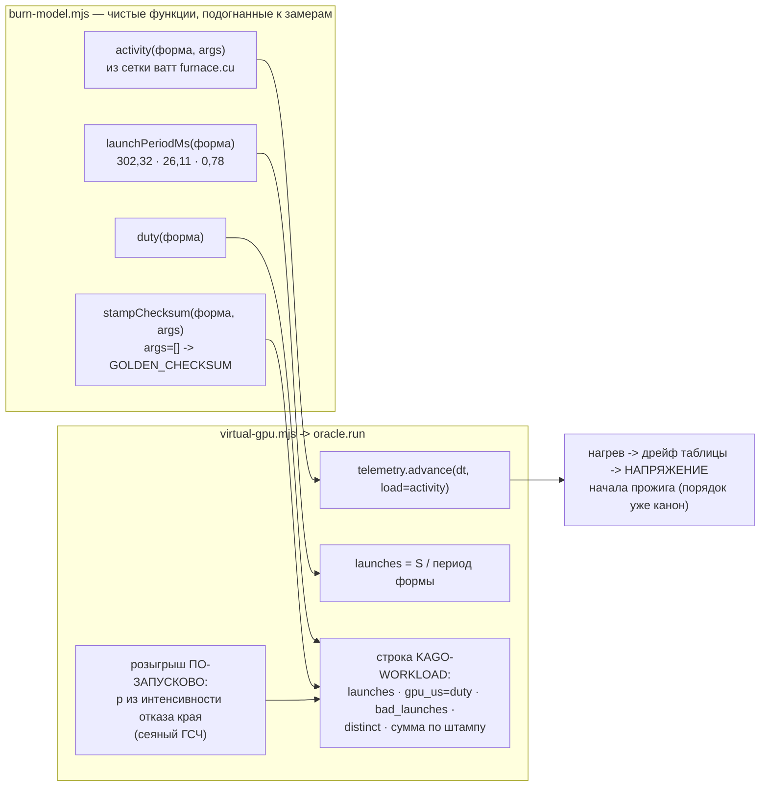

# План 68 — эпик 67 фаза 1: модель нагрузки (прожиг двойника перестаёт быть пустышкой)

> **Создан:** 2026-08-29 15:0x +03:00 · **Родитель:** `plans/67` → строка «**1 — модель нагрузки**:
> ватты по форме (сетка `furnace.cu`), каденция запусков по форме и рабочей точке, SDC через модель
> края, контрольные суммы по штампу, ватты кормят телеметрию» · **Разведка:** `researches/25` §3.2
> (все числа) · **Шов:** `virtual-gpu.mjs` → `oracle.run` (строки ~1776–1790: сегодня
> `gpu_us = launches × 900`, `work_per_launch = 100000` — константы из воздуха, ватт нет вовсе,
> «SDC» — один розыгрыш на весь прожиг от константной суммы).
> **Статус:** 🟠 В РАБОТЕ.

## Вектор цели фазы

**Боль.** На двойнике прожиг — носитель времени стены: ватты не считаются, каденция одна на все
формы, контрольная сумма — константа, SDC — один розыгрыш на прожиг. Полигон, гоняющий цикл по
такому суррогату, дёшев: половина того, что движок делает со ступенью (греет карту, считает
запуски, ловит расхождение сумм, различает штампы интенсивности), на двойнике не происходит.

**Куда хотим.** Прожиг двойника СЧИТАЕТСЯ моделью, подогнанной к измеренному: форма → ватты →
нагрев; форма → каденция → счёт запусков и длительности; близость к краю → пораженные запуски →
расхождение сумм. Красная строка паритета «нагрузка» закрывается со свидетелем.

**Тип цели:** Achieve (модель) + Avoid (обычная карта и живой путь не сдвигаются ни на бит).

## Критерии приёмки (готово, когда)

- **P68-AC1 — ватты по форме.** Шкала — Вт · прибор — `telemetryEquilibrium` с активностью формы
  против измеренной сетки `furnace.cu` (fma/слово → Вт: 0→207 · 16→238 · 32→248 · 48→269 ·
  64→305 · 96→287 · 128→275 · 256→267 · 1024→252 · 4096→229) · цель — **каждая из 10 строк
  воспроизводится с точностью ±5 %**; строка 64 упирается в предел мощности (зажим наблюдался
  живьём — факт 16).
- **P68-AC2 — каденция и доля времени.** Шкала — запуски и мкс · прибор — разбор строки
  `KAGO-WORKLOAD` твин-прожига · цель — `launches` для `--sustain S` в пределах **±10 %** от
  S/медианы формы (302,32 · 26,11 · 0,78 мс — архив 42 прогонов, `researches/24` §3);
  `gpu_us/wall_us` в пределах **±5 п.п.** от измеренной доли (duty 0,987 у branchy).
- **P68-AC3 — SDC помножен на запуски.** Порча — ПО-ЗАПУСКОВО от интенсивности отказа модели края
  (сеяный ГСЧ — детерминизм на семени); `bad_launches > 0 ⇔ distinct > 1`; поля `bad_launches`,
  `bad_elems_max` печатаются честно — детектор «сумма разошлась ВНУТРИ прожига» (`stress-tester`
  блок 3) становится проверяемым на двойнике.
- **P68-AC4 — сумма по ШТАМПУ.** Контрольная сумма — функция (нагрузка, аргументы): другая
  интенсивность → другая сумма (дисциплина R6 «эталон снят на ТОЙ интенсивности» становится
  упражняемой). **Дефолтные аргументы дают прежний `GOLDEN_CHECKSUM`** — существующие эталоны и
  блоки не сдвигаются.
- **P68-AC5 — нагрев ОТ нагрузки.** `telemetry.advance` получает активность формы вместо
  бинарного `load: 1`: форма 0 fma греет к ~207 Вт равновесия, форма 64 — к зажиму предела.
  Прибор — равновесия из P68-AC1.
- **P68-AC6 — ничего не сдвинулось.** Батареи 0 красных; `--smoke`, `--rehearse-death strangle`,
  `--rehearse-hang` зелёные БЕЗ правок их проверок; живой путь (без `--card virtual`) не тронут;
  ловушки T1–T8 целы. Мутации: сдвиг строки сетки ватт · снятый по-запусковый розыгрыш · сумма,
  переставшая зависеть от штампа — каждая краснит РОВНО свой блок, откат КОПИЕЙ (TA1).

## Схема модели

## Шаги

- [ ] **1. `burn-model.mjs` — активность по форме (AC1).** *Якорь: «ватты по форме (сетка
      `furnace.cu`)»*. Активность `a(форма, args)` калибруется так, чтобы
      `telemetryEquilibrium(сток, V(сток), a)` воспроизвёл все 10 строк сетки ±5 %. Формы
      `branchy`/`sdc_fma`: активность из их измеренных точек, если найдутся в `runs/power`
      (проверить при исполнении); иначе — ЧЕСТНАЯ пометка «предварительно, источник — отношение
      каденций», не молчаливое число.
- [ ] **2. Каденция и доля времени (AC2).** *Якорь: «каденция запусков по форме и рабочей
      точке»*. Медианы и duty из архива 42 прогонов; максимумы НЕ трогаются — они принадлежат
      порогам предохранителя (`fuse.PROGRESS_TICK_MAX_MS`, разные потребители — оба из замера).
- [ ] **3. Сумма по штампу + по-запусковый SDC (AC3, AC4).** `stampChecksum(workload, args)`:
      детерминированный хеш, `args=[]` → прежний `GOLDEN_CHECKSUM`. Розыгрыш пораженных запусков —
      `mulberry32` от семени карты; `bad_launches`, `bad_elems_max`, `distinct` — из розыгрыша.
- [ ] **4. Проводка в `oracle.run` (AC5).** `launches` из каденции · `gpu_us` из duty ·
      `telemetry.advance(…, { load: a })` · порядок «вердикт по напряжению НАЧАЛА, тепло после» НЕ
      трогается (канон, оплачен тремя красными блоками 23.08).
- [ ] **5. Каденция сердцебиения носителя** — сборка передаёт период ФОРМЫ вместо константы
      furnace (шов уже параметризован `--progress-tick-ms`).
- [ ] **6. Блоки + мутации (AC6).** Названные адресаты: сетка ватт построчно · «launches растут с
      sustain» · «bad_launches ⇔ distinct» · «сумма различает штампы, дефолт — золотой» · «форма 0
      греет к 207, форма 64 — к зажиму». Три мутации из AC6, откат копией.
- [ ] **7. Реестр паритета:** строка «нагрузка» → ✅ со свидетелем (`plans/59`); §Итог здесь.

## Риски

1. **Переподгонка к семье furnace** (сетка — только её): активности других форм слабее. Реакция:
   пометка происхождения на каждой константе; полигон (фаза 4) чувствителен к форме только через
   furnace-семью — этого хватает циклу.
2. **Сдвиг существующих эталонов суммой по штампу.** Реакция: `args=[]` → прежний золотой (AC4);
   grep всех потребителей `GOLDEN_CHECKSUM` до правки.
3. **Розыгрыш SDC сломает детерминизм репетиций.** Реакция: ГСЧ — от семени карты, как весь
   остальной шум; повтор семени = повтор байтов.

## Итог

*(заполняется по исполнении)*
