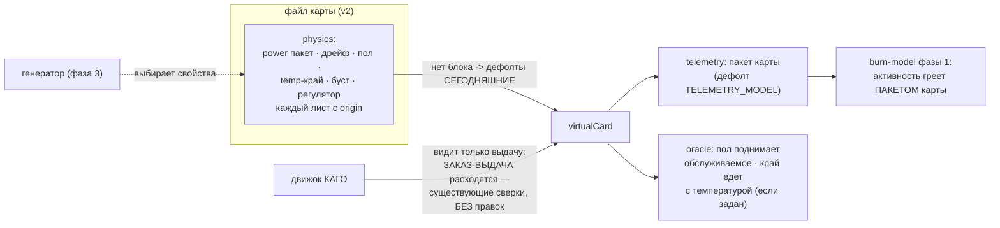

# План 69 — эпик 67 фаза 2: физика «всегда-вкл» и параметрический пакет карты

> **Создан:** 2026-08-29 15:3x +03:00 (на закрытии фазы 1, по канону лестницы) · **Родитель:**
> `plans/67` → строка «**2 — физика "всегда-вкл"**: механизмы, которые живая карта делает ВСЕГДА,
> а двойник нёс только ловушками, становятся свойствами ФАЙЛА карты … телеметрия параметризуется
> пакетом» · **Разведка:** `researches/25` §3.3 (оси хаоса) · **Предыдущая:** `plans/68` ✅.
> **Статус:** ✅ ИСПОЛНЕН 2026-08-29 15:3x — §Итог внизу; батарея 34/1553/0 (vgpu 111).
> **Уроки фазы 1, свёрнутые сюда:** карточка происхождения на КАЖДОМ параметре (форма
> `SHAPE_WATTS`) · «одна функция на обе стороны» против пар правда↔зеркало · пара «пин узла +
> обратный ход» для таблиц · мутации с откатом КОПИЕЙ (TA1).

## Вектор цели фазы

**Боль.** Генератору (фаза 3) сегодня почти нечего выбирать: пакет мощности — глобальная
константа (`TELEMETRY_MODEL` один на все карты), дрейф таблицы / недобор регулятора / перелёт
потолка — ловушечные ручки без происхождения у обычной карты, а пола карты (`origin:overshot`,
+40…75 мВ — `bugs/63`/`58`) в модели нет вовсе. «Другой мощностный пакет и лимит» из заказа
владельца упирается в константу.

**Куда хотим.** Всякая физика — свойство ФАЙЛА карты с карточкой происхождения; отсутствие
блока = сегодняшние глобальные константы (обратная совместимость по построению). Образец
rtx5070ti НЕ сдвигается ни на бит; выбирает из этих свойств генератор фазы 3.

**Тип цели:** Achieve (параметризация) + Avoid (байт-идентичность образца; ловушки целы).

⚠️ **Решение, наследуемое от эпика 59 и НЕ пересматриваемое молча:** у обычного образца дрейф
таблицы остаётся `null` (отгружаемая форма придавлена на потолок — общий дрейф отнял бы
обслуживающее напряжение, комментарий у `tableDriftMhzPerC`). «Всегда-вкл» здесь значит
«механизм доступен ЛЮБОЙ карте свойством файла», а не «образец получает новую физику». Реализм
−1,7 МГц/°C несёт ОТДЕЛЬНЫЙ файл-вариант для полигона, не правка образца.

## Критерии приёмки (готово, когда)

- **P69-AC1 — блок `physics` в файле карты.** Схема: `power {staticW · perMhzVolt2 · limitW ·
  fan{floorPct,anchorC,pctPerC} · tau{thermalS,fanS} · ambientC}` · `tableDriftMhzPerC` ·
  `floor {baseMv, perC}` (пол карты) · `edgeShiftMvPerC` (temp↔край) · `boostStepsAboveCeiling` ·
  `governorBelowCeilingMhz`. Каждый лист — с `origin`. `validateCard` отказывает кривому блоку
  ПО ИМЕНИ поля; **отсутствующий блок = сегодняшние константы дословно**.
- **P69-AC2 — образец не сдвинулся.** Батарея 0 красных · существующие 105 блоков vgpu без
  правок · I1-отпечаток · `--smoke --armed` зелёный. Шкала — блоки/байты · прибор — батарея +
  отпечаток · цель — ноль расхождений.
- **P69-AC3 — каждое новое свойство ДЕЙСТВУЕТ и ЛОВИТСЯ.** На НЕдефолтной карте: блок,
  показывающий эффект числом (пол поднимает обслуживаемое ниже `baseMv`; `edgeShiftMvPerC`
  двигает край с нагревом; пакет с `limitW: 250` зажимает на 250) + мутация, снимающая проброс, —
  красит ровно свой блок.
- **P69-AC4 — пол карты честен наружу.** Заказ ниже пола → карта ОБСЛУЖИВАЕТ выше заказа; существующие
  сверки движка («ЗАКАЗ↔ВЫДАЧА разошлись», словарь `origin:overshot`) видят это БЕЗ правок движка.
- **P69-AC5 — телеметрия читает пакет КАРТЫ.** `telemetryEquilibrium`/`telemetry` берут пакет из
  карты (дефолт — `TELEMETRY_MODEL`); четыре измеренные строки лестницы по-прежнему
  восстанавливаются дефолтным пакетом (существующий блок не трогается); блоки фазы 1 (сетка ватт)
  зелёные без правок.

## Схема

## Шаги

- [x] **1. Схема `physics` + валидатор (AC1).** *Якорь: «становятся свойствами ФАЙЛА карты»*.
      Отказ по имени поля; отсутствие блока — дефолты; карточки происхождения обязательны.
- [x] **2. Пакет мощности в телеметрию (AC5).** *Якорь: «телеметрия параметризуется пакетом»*.
      `TELEMETRY_MODEL` становится дефолтным пакетом; равновесие/инерция читают карту.
- [x] **3. Пол карты (AC4).** `servingVoltageMv` не опускается ниже `floor.baseMv (+ perC·ΔT)`;
      выдача честно выше заказа — существующие сверки движка ловят без правок.
- [x] **4. Temp↔край (`edgeShiftMvPerC`).** У образца `null` (замер `bugs/63`: связь слабая,
      1,85 мВ/°C при r = 0,22 — НЕ доказана направленно); механизм для карт полигона.
- [x] **5. Ловушечные ручки — в свойства файла.** `tableDriftMhzPerC` · `boostStepsAboveCeiling` ·
      `governorBelowCeilingMhz` переезжают из опций `buildFiction` в `physics` (ловушки T6–T8
      строятся через файл — их 65 утверждений остаются зелёными).
- [x] **6. Файл-вариант `virtual-rtx5070ti-physics.json`** — образец + измеренная физика
      (дрейф −1,7 · пол из `bugs/63` · перелёт 2 ступени): первая «вторая карта» для полигона,
      происхождение каждой строки — наш замер.
- [x] **7. Блоки + мутации (AC3) + §Итог**; мета-план — отметка фазы.

## Риски

1. **Байт-дрейф образца через дефолты.** Реакция: AC2 воротами; дефолт — ссылка на прежнюю
   константу, не её копия (DRY, пара невозможна).
2. **Пол карты ломает репетиции спуска** (двойник начнёт «не отдавать» глубину). Реакция: у
   образца пола НЕТ (`null`); эффект — только на картах, где задан.
3. **Схема v2 разъедется с генератором фазы 3.** Реакция: валидатор — единственная дверь; фаза 3
   строит через него же.

## Итог — ИСПОЛНЕН 2026-08-29 15:3x (автономное окно до 16:00)

**Батарея 34 набора / 1553 / 0 (vgpu 105 → 111). Живая карта не участвовала.**

| критерий | результат |
|---|---|
| AC1 схема+валидатор | ✅ блок `physics` со словарём ЗАКРЫТЫМ по имени; отказ несёт `field`: `physics.выдумка` · `physics.origin` · `physics.floor.baseMv` — блок проверяет все три |
| AC2 образец | ✅ все 105 прежних блоков без правок; **дефолт — ТА ЖЕ ССЫЛКА** на `TELEMETRY_MODEL` (без блока `physics` слияние не строится вовсе — пара невозможна по построению) |
| AC3 свойства действуют | ✅ `edgeShift` поднимает край ровно на mvPerC·ΔT (холодный равен базовому) · дрейф из файла двигает обслуживание · 2 мутации (проброс предела · пол) красят адресно, откат копией |
| AC4 пол карты | ✅ заказ ниже пола обслуживается выше заказа (`+30 мВ` в блоке); у образца пола нет — репетиции спуска не тронуты |
| AC5 пакет | ✅ `limitW: 250` зажимает форму 64 fma на 250; `telemetryEquilibrium` получил параметр `model`, все внутрикарточные вызовы едут через `TM` |

**Файл-вариант `benches/cards/virtual-rtx5070ti-physics.json`** — первая «вторая карта»: образец +
три листа ИЗМЕРЕННОЙ физики (дрейф −1,7 R14b · перелёт потолка 2 ступени `researches/11` §8 ·
предел 300 Вт факт 16). ✏️ **Скоуп-правка против плана, и она честная:** `floor` и `edgeShift` в
вариант НЕ вошли — их ЧИСЕЛ живой замер не давал (`bugs/63` дал r = 0,22, это не коэффициент), а
выдуманная строка в файле «с происхождением-замером» отравила бы сам смысл карточек происхождения.
Механизмы в модели есть и доказаны блоками — числа для них принесёт полигон или живой замер.

**Побочная находка, оплачена красным 15:37:** пульс-блок самопроверки двойника зависел от ПОРЯДКА
прогонов — репетиция ЗАВИСА законно оставляет в постоянной песочнице закрытый «ЗАВИС 2842/1020»,
и узкая полоса блока вставала на пол зависания. Вылечено тем же движением, что у репетиций:
`archiveTwinSandbox()` перед прогоном блока — свежий сток, порядок безразличен.

**Мелочь, замеченная по дороге:** sed-замена `const M = TELEMETRY_MODEL` зацепила и
`activityForShape` — поймано первым же прогоном самопроверки, возвращено с комментарием, ПОЧЕМУ
там глобальные константы (активность — свойство формы, откалиброванное к опорной точке замера,
а не к пакету карты).

Фаза 3 (генератор) планируется на закрытии этой — по канону лестницы.

---

## Решения, принятые без владельца

| # | решение | почему так, и чем отменить |
|---|---|---|
| 1 | **Скоуп-правка против плана: `floor` и `edgeShift` НЕ вошли в файл-вариант карты** | Их чисел живой замер не давал (`bugs/63` дал r = 0,22 — это не коэффициент). Выдуманная строка в файле «с происхождением-замером» отравила бы сам смысл карточек происхождения. Механизмы в модели есть и доказаны блоками; числа принесёт полигон или живой замер |
| 2 | **Словарь блока `physics` сделан ЗАКРЫТЫМ по имени**, а неизвестное поле — отказом с указанием `field` | Открытый словарь превращает опечатку в тихо игнорируемое свойство. Отменяется расширением списка имён |
| 3 | **Дефолт — ТА ЖЕ ССЫЛКА на `TELEMETRY_MODEL`**, а не копия | Копия завела бы пару, которую пришлось бы сторожить; здесь пара невозможна по построению (без блока `physics` слияние не строится вовсе) — DRY в чистом виде |
| 4 | **Пульс-блок вылечен `archiveTwinSandbox()` перед прогоном**, тем же движением, что у репетиций | Блок зависел от ПОРЯДКА прогонов; лечить порядок означало бы завести правило, которое надо помнить. Свежий сток делает порядок безразличным |

## ✅ СТАТУС: ЗАКРЫТ (2026-08-29)

**Что сделано:** механизмы, которые живая карта делает ВСЕГДА, стали свойствами ФАЙЛА карты —
дрейф таблицы, пол карты, перелёт потолка, связь temp↔край; телеметрия параметризована пакетом.
Все пять критериев фазы ✅. Родилась первая «вторая карта» — `benches/cards/rtx5070ti-physics`.
**Чем проверено:** батарея 34 набора / 1553 блока / 0 красных (vgpu 105 → 111); две адресные
мутации с откатом копией; побочная порядко-зависимость пульс-блока найдена и оплачена красным.
**Родитель:** эпик 67 закрыт целиком 2026-08-29 (`plans/67_DONE`, § Итог эпика).
