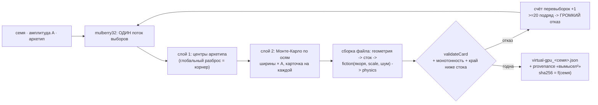

# План 70 — эпик 67 фаза 3: генератор виртуальных карт

> **Создан:** 2026-08-29 15:4x +03:00 (на закрытии фазы 2) · **Родитель:** `plans/67` → строка
> «**3 — генератор**: семя + амплитуда хаоса (+ архетип-корнер) → файл `virtual-gpu_<семя>.json`;
> двухслойная выборка; карточка происхождения на каждый параметр; счётчик перевыборок» ·
> **Разведка:** `researches/25` §2.3 (корнеры+MC), §2.4 (порядки разброса), §5.2.
> **Предыдущие:** `plans/68` ✅ (модель нагрузки) · `plans/69` ✅ (все оси — свойства файла).
> **Статус:** 🟠 К ИСПОЛНЕНИЮ.
> **Слово владельца, исполняемое дословно:** *«дать ему семена, амплитуду хаоса - он нам на выход
> даёт новый цифровой virtual-gpu_n … с другими расбросами, дрейфами, случайностями, напряжениями,
> частотами, с другим мощностным пакетом и лимитом»*.

## Вектор цели фазы

**Боль.** Карт две: образец и его physics-вариант. «Непредсказуемый объект оптимизации» пока
делается руками, а руки выбирают знакомое — полигон из ручных карт проверял бы воображение
автора, не движок.

**Куда хотим.** `card-generator.mjs`: (семя, амплитуда, архетип) → валидный файл карты,
байт-идентичный своему семени; сто карт за прогон со статистикой распределений и счётом
перевыборок; каждый параметр несёт происхождение своей ширины.

**Тип цели:** Achieve (генератор) + Avoid (образец не трогается; вымысел² объявлен в каждом файле).

## Критерии приёмки (готово, когда) — E67-AC2 целиком

- **P70-AC1 — детерминизм.** Одно (семя, амплитуда, архетип) дважды → sha256 файлов СОВПАДАЕТ.
  Шкала — хеш · прибор — двойная генерация в блоке · цель — равенство байт в байт.
- **P70-AC2 — валидность с счётом.** `--batch 100`: **100/100 проходят `validateCard`**;
  перевыборки невалидных СЧИТАЮТСЯ и печатаются (молчаливый re-draw прячет кривой генератор);
  подряд ≥ 20 отказов одной карты — ГРОМКИЙ отказ генератора, не тихий цикл.
- **P70-AC3 — статистика в заявленных диапазонах.** Машинная сводка по 100 картам: min/median/max
  каждой оси внутри диапазона её карточки происхождения; амплитуда 0 → все оси в центрах
  архетипа; бо́льшая амплитуда → строго не меньший разброс.
- **P70-AC4 — происхождение.** Каждый файл несёт `provenance`: строка «СГЕНЕРИРОВАНО семенем N,
  амплитуда A, архетип X — вымысел²: не существует и как замер» + карточка ширины на каждую ось
  (`наш замер` · `публичный порядок` · `назначено`).
- **P70-AC5 — образец цел.** Батарея 0 красных; генератор пишет ТОЛЬКО в свой каталог
  (`benches/cards/generated/`, в игноре); `validateCard` — единственная дверь валидации (никакой
  второй проверки внутри генератора).

## Оси и их источники (карточки ширин — ЗДЕСЬ, код их цитирует)

| ось | центр (архетип typical) | ширина ±1σ · источник |
|---|---|---|
| запас края по полосе | якоря образца | ×(1 ± 0,3·A) + сдвиг до ±25 мВ · «публичный порядок» (лотерея: десятки мВ между экземплярами, `researches/25` §2.4) |
| крутизна края `scaleMv` | 3,5 мВ | 2…6 мВ · «наш замер центра, ширина назначена» |
| шум/дрейф края | 8/20 мВ | ×(1 ± 0,5·A) · «назначено» |
| пакет: `staticW` · `perMhzVolt2` | 40,669 · 0,091223 | ±10 %·A · «наш замер центра (лестница), ширина — порядок разброса SKU» |
| предел мощности | 300 Вт | {250 · 285 · 300 · 320 · 350} · «публичный порядок SKU» |
| дрейф таблицы | −1,7 МГц/°C | −0,5…−3 · «наш замер центра» |
| пол карты | нет | у части архетипов: базис из глубины запаса · «назначено (число живым замером не снято — `plans/69`)» |
| temp↔край | 0 | 0…3 мВ/°C · «назначено; наш замер дал r = 0,22» |
| перелёт потолка | 2 ступени | {0,1,2,3} · «наш замер: 2 в 7 из 9, 3 в 2» |
| регулятор | нет | 0…80 МГц у архетипа angry-governor · «наш замер порядка (2820→2760…2805)» |
| геометрия сеток | сетки образца | сдвиг диапазона ±150 МГц, шаг тот же · «назначено» |

**Архетипы-корнеры** (глобальный слой, §2.3): `typical` · `cold-lucky` (глубокий запас, слабый
дрейф) · `hot-unlucky` (мелкий запас, сильный дрейф, пол) · `angry-governor` (недобор + перелёт) ·
`drifty` (край едет с теплом). Каждый ловит СВОЙ класс дефектов движка — как SS/FF ловят свои.

## Схема

## Шаги

- [ ] **1. Каркас `card-generator.mjs`:** один поток `mulberry32`, слои архетип→MC, таблица осей
      с карточками ширин (дословно из §выше). *Якорь: «двухслойная выборка (архетипы = глобальный
      разброс, MC = локальный)».*
- [ ] **2. Сборка файла:** геометрия → стоковая кривая (монотонная) → `buildFiction` с выбранными
      якорями/шумом → блок `physics` фазы 2. Дверь валидации — ТОЛЬКО `validateCard` (AC5).
- [ ] **3. Перевыборка со счётом (AC2)** и громкий отказ на ≥ 20.
- [ ] **4. CLI:** `--seed N --amplitude A [--archetype X] [--out dir]` · `--batch 100 --stats`
      (машинная сводка min/median/max по осям) · `--selftest`.
- [ ] **5. Блоки (AC1–AC4):** детерминизм sha256 ×2 · 100/100 валидных со счётом · A=0 → центры ·
      монотонность разброса по A · provenance в каждом файле. Мутации: сломанный посев (второй
      вызов даёт другой файл) · снятый счётчик перевыборок.
- [ ] **6. Дым:** одна сгенерированная карта проходит `--sweep --card virtual` (файл — параметром
      сборки; шов `cardFile` уже есть) — цикл живёт на чужой карте. §Итог.

## Риски

1. **Генератор научится обходить валидатор** (подгонка до зелёного). Реакция: счёт перевыборок
   печатается всегда; статистика отказов по ПРИЧИНАМ — в сводке `--batch`.
2. **Ширины «назначено» прочтут как замер.** Реакция: карточка происхождения на оси — часть файла
   карты, не только кода; provenance-строка «вымысел²».
3. **Сгенерированная геометрия ломает предпосылки движка** (сетки не те). Реакция: геометрия
   первой фазой шага 2 идёт консервативно (сдвиг диапазона, шаг образца); экзотика сеток — осознанным
   расширением после первого дыма.

## Итог

*(заполняется по исполнении)*
