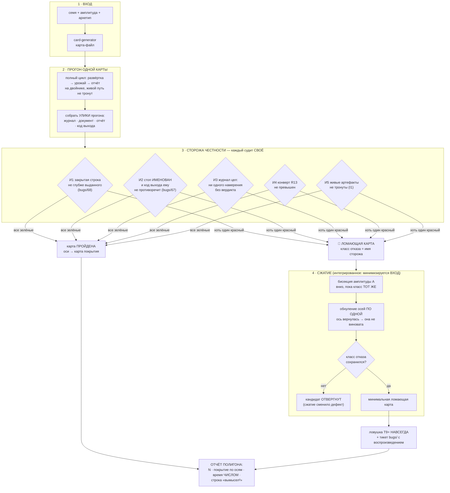

# План 71 — эпик 67, фаза 4: ПОЛИГОН

**Родитель:** `plans/67` (мета-план) · **Предыдущая фаза:** `plans/70` (генератор) — ✅ закрыта
2026-08-29, открытых пунктов не осталось.
**Написан:** 2026-08-29 18:4x, на закрытии фазы 3 — по правилу лестницы «фаза N+1 планируется, когда
закрывается N».
**Закрывает:** E67-AC3 (полигон) · E67-AC4 (сжатие) · «время полигона названо числом».

---

## Вектор цели

Фаза 3 дала множитель карт. Фаза 4 даёт **контур проверки**: пакетный прогон N карт через полный
цикл под **механическими сторожами честности** — и сжатие ломающей карты до минимальной, которая
навсегда становится ловушкой.

> ⚠️ **ГЛАВНАЯ ГРАНИЦА, ОНА ЖЕ РИСК №1 МЕТА-ПЛАНА.** Полигон судит **ТОЛЬКО ЧЕСТНОСТЬ УТВЕРЖДЕНИЙ
> ЦИКЛА** — никогда «нашёл ли движок правильный край». Правильного края у вымысла нет; полигон,
> проверяющий край, учил бы движок проходить вымысел, а не кремний (`researches/10`).

**Почему эта фаза не украшение — она уже окупилась ДО того, как была написана.** Первый же прогон
фазы 3 на сгенерированной карте дал `bugs/68`: документ закрыл строку 800 мВ при поле карты 1115.
**Но нашли это ГЛАЗАМИ по логу.** Разбор 2026-08-29 показал за той находкой ДВА дефекта — неверное
место пола в двойнике и затравку, писавшую заказ вместо выданного, — и второй **не покраснил ни
одного из 375 блоков движка**. Фаза 4 существует, чтобы такое ловил механизм, а не внимательность.

---

## Механизм



---

## Критерии приёмки — счётные

- **P71-AC1 — прогон пакета.** `npm run polygon -- --count 30` гоняет 30 сгенерированных карт через
  полный цикл. Выход: число пройденных, число ломающих, **время числом**. Живой путь не тронут —
  отпечаток I1 сверяется командой до и после.
- **P71-AC2 — сторожа судят и МОГУТ покраснеть.** Каждый из пяти инвариантов имеет свой блок И
  доказан КРАСНЫМ на подставной улике (сторож, не сработавший ни разу, ничего не доказывает).
  Отдельно: сторож И1 обязан краснеть на карте `virtual-gpu_42` с откаченной починкой `bugs/68`.
- **P71-AC3 — класс отказа = имя сторожа**, а не «что-то сломалось». Отчёт называет карту (семя,
  амплитуда, архетип), сторожа и строку улики.
- **P71-AC4 — сжатие сохраняет класс.** На подставной ломающей карте бисекция + обнуление осей дают
  меньший вход С ТЕМ ЖЕ именем сторожа; кандидат, сменивший класс, ОТВЕРГАЕТСЯ и это видно в выводе.
- **P71-AC5 — карта покрытия по осям.** Печатается, по каким осям пакет прошёлся и где дыры
  (ось, min, max, сколько карт) — иначе «30 карт» не отличить от «30 раз одна карта».
- **P71-AC6 — обычная карта не сдвинулась** (E67-AC5, ворота каждой фазы): твин-прогон
  `rtx5070ti` бит-в-бит прежний, батарея зелёная.

---

## Шаги

- [x] **1. Улики прогона — одна структура.** Что полигон собирает после каждой карты: код выхода,
      путь журнала, документ кривой, строки отчёта. Ничего не судит, только собирает.
- [x] **2. Пять сторожей, каждый чистой функцией** над уликами шага 1. Чистота — условие:
      сторож, которому нужен прогон, нельзя доказать красным дёшево.
- [x] **3. Красное доказательство каждого сторожа** на подставных уликах. Сторож И1 —
      дополнительно на настоящем откате починки `bugs/68` (мутацией файла, как в этой сессии).
- [x] **4. Пакетный прогон** `--count N --amplitude A --seed-base S`, с картой покрытия и временем.
- [x] **5. Сжатие**: бисекция A, затем обнуление осей по одной; отвергать кандидата со сменой класса.
- [ ] **6. Ловушка из минимальной карты** — файл в `benches/cards/traps/`, вход в `npm run traps`.
- [ ] **7. Ворота E67-AC5** и полная батарея; `cardgen`/новый набор в `selftest:all` ВМЕСТЕ с кодом.
- [ ] **8. Итог плана**: числом — N, время, покрытие, найденное.

---

## Проверка наблюдением (не «должно работать»)

| что утверждаем | чем смотрим |
|---|---|
| полигон гоняет настоящий цикл, а не суррогат | те же `engine --sweep`/урожай, что живой путь; ноль веток «мы на полигоне» в движке |
| сторожа могут краснеть | подставные улики + откат починки `bugs/68` |
| живой путь не тронут | отпечаток I1 до/после, командой |
| время честное | число в отчёте, не оценка |

---

## Риски этой фазы (Мёрфи)

1. **🔴 Сторож напишется под уже известный дефект и не поймает следующий.** Реакция: сторожа
   формулируются как ИНВАРИАНТЫ («закрытая строка не глубже выданного»), а не как «случай
   `bugs/68`». Проверка формулировки: сторож обязан быть осмысленным на карте БЕЗ пола.
2. **🟠 Полигон позеленеет, потому что 30 карт оказались одной картой.** Реакция: P71-AC5, карта
   покрытия — обязательная часть отчёта, а не приложение.
3. **🟠 Сжатие замаскирует дефект** (анти-паттерн PBT). Реакция: P71-AC4, смена класса = отказ.
4. **🟡 Полигон дорог.** Реакция: время числом; ускорение прожигов уже канон (`ideas/04`).

---

## Опора, оплаченная этой сессией

- `bugs/68` — оба дефекта и их разбор; ЕГО откат становится красным доказательством сторожа И1.
- `bugs/67` (открыт) — трип предохранителя при коде 0: это ровно инвариант И2, и полигон даст ему
  первого механического свидетеля.
- **Урок метода:** обе первые редакции починки `bugs/68` были отброшены НЕ вкусом, а замером —
  сшивкой живого журнала по `seq` (784 пары, 191 ступень с выдачей выше заказа, 183 без класса
  отказа записи). Сторожа фазы 4 писать так же: от улик, а не от правдоподобия.


---

## Ход исполнения

**Шаги 1-3 исполнены 2026-08-29 18:3x.** `automation-engine/lib/polygon-guards.mjs` — улики одного
прогона отдельной формой, пятеро сторожей чистыми функциями, **13 блоков**, набор `polyguard` вошёл
в батарею вместе с кодом (37 наборов / 1589 / 0).

**Все пять мутаций пойманы**, но путь к этому сам оказался уроком — и обе осечки были в ПРОВЕРКЕ, а
не в коде:

1. **Первый прогон мутаций не напечатал НИЧЕГО у всех пятерых.** Условие входа стояло на ИМЕНИ
   файла (`endsWith('polygon-guards.mjs')`), поэтому копия под другим именем переставала быть собой
   и набор не запускался вовсе. Мутационная проверка, у которой мутант молчит, читается как
   «мутация не поймана» — то есть ровно тот самообман, ради которого мутации и гоняют. Взят канон
   проекта: сравнение `path.resolve(argv[1])` с собственным URL.
2. **Мутация «сторож И1 считает и ОТКАЗАВШИЕ ступени» дважды прошла зелёной** на негодной фикстуре.
   Вторая редакция промахнулась ПО НАПРАВЛЕНИЮ ОСИ: «глубже» — это НИЖЕ по напряжению. Различает
   только фикстура, где отказавшая ступень обслужена ВЫШЕ строки: без фильтра сторож объявил бы
   завышение, которого нет.

Шаг 3 закрыт с оговоркой: сторож И1 доказан красным **на настоящих числах `bugs/68`** (800 против
1045, завышение 245 мВ), но пока на подставных уликах, а не на откате починки в живом коде. Откат
как красное доказательство остаётся в шаге 7.


**Шаг 4 исполнен 2026-08-29 18:4x.** `polygon.mjs`: пакет N карт, каждая — отдельным процессом
движка (только так полигон гоняет ТОТ ЖЕ путь и получает настоящий код выхода). Первый пакет,
числа честные: **5 карт (все пять архетипов) · 5 пройдено · 205,5 с · 41,1 с на карту** на полосе
из трёх частот · отпечаток живых артефактов СОШЁЛСЯ. Отсюда цена пакета из 30 карт — **около
20 минут**, число, а не оценка.

### 🔴 НАХОДКА О САМОМ ПОЛИГОНЕ (P71-AC2 пока НЕ закрыт)

Сквозное красное доказательство сторожа И1 **не получилось с первой попытки, и это важнее, чем
если бы получилось.** Откат починки `bugs/68` (половина B, затравка) в живом коде + прогон карты
`virtual-gpu_42` → полигон объявил карту **ПРОЙДЕННОЙ**.

**Причина, и она не в стороже.** После починки двойника (половина A) карта 42 больше НЕ ДОХОДИТ до
пути затравки: её пол 1115 мВ выше стока 1045, спуск невозможен, каждая частота закрывается на
первой же ступени сторожем `bugs/58`. А исходные «800 мВ» в том прогоне пришли из ЗАТРАВКИ ПО
СОБСТВЕННОЙ УЛИКЕ — то есть из журнала ПРЕДЫДУЩЕГО прогона, накопленного до починки. Чистый лист,
который полигон теперь наводит перед каждой картой, эту дорогу закрыл.

**Что это значит честно:** сторож И1 доказан красным на подставных уликах и на настоящих числах
`bugs/68`, но сквозного красного прогона у него нет.

### И это привело к настоящему выводу о конструкции — сторож И6

**И1 сверяет ДОКУМЕНТ с ЖУРНАЛОМ, а это два артефакта ОДНОГО цикла, читающие одну поверхность.
Ложь, которую они РАЗДЕЛЯЮТ, ему невидима по построению** — и `bugs/68` половина A была ровно
такой: прожиг шёл на 1115 мВ, а журнал и документ СОГЛАСНО говорили 800. Оба валидны, оба врут.
Поймать такое может только свидетель ВНЕ цикла.

Отсюда **И6 — фактура прожигов** (`burns.jsonl` в песочнице прогона двойника). ⚠️ Первая редакция
И6 сравнивала закрытую строку с напряжением прожига — и её отменил ЗАМЕР, а не рассуждение: на
карте с дрейфом прожиг честно идёт на 1240 мВ там, где таблица говорит 1040 (карта нагрелась,
`bugs/63`), а документ по канону хранит «частота → напряжение» ТАБЛИЦЫ. Такой сторож краснел бы на
каждой карте с дрейфом, то есть был бы шумом.

**Действующая формулировка судит ПАРУ ОТВЕТОВ ОДНОГО МГНОВЕНИЯ:** на чём прожиг рисовался (физика)
и что о той же частоте в ту же секунду говорит перечитанная кривая (единственный прибор цикла).
Дрейф двигает оба числа ВМЕСТЕ и молчит; зажим, невидимый чтению, их РАЗВОДИТ. Инвариант:
**вымысел не смеет знать о карте того, чего он не показывает циклу.**

### ✅ P71-AC2 ЗАКРЫТ СКВОЗНЫМ КРАСНЫМ ПРОГОНОМ

Откат половины A `bugs/68` в живом коде + прогон карты `virtual-gpu_42`:

```
🔴 ЛОМАЮЩАЯ · класс: И6 вымысел не прячет от цикла свою физику
   прожиг рисовался не на том, что цикл может прочитать: 2842 МГц рисовался на 1115 мВ,
   а кривая в ту же секунду отдавала 1020 мВ (разрыв 95 мВ)
```

С починкой на месте та же карта проходит. Откат снят точечно (не `git checkout` — в файле жила
несохранённая фактура), батарея после снятия зелёная: **38 наборов / 1603 / 0**.

⚠️ **Оговорка, названная вслух:** сторож И6 пропускает прожиги, где кривая не даёт ответа вовсе
(`readbackMv: null` — ни одна точка не достаёт до частоты). Это честный пропуск: там у цикла нет
числа, о котором можно было бы соврать. Но он сужает поле И6, и на карте 42 из четырёх прожигов
пару ответов имел один.


---

## Шаг 5 — сжатие (исполнен 2026-08-29 19:0x)

`polygon-shrink.mjs`: **чистая логика с ВНЕДРЯЕМЫМ оракулом.** В бою оракул — настоящий прогон под
сторожами (минуты), в наборе — подставная функция (миллисекунды). Только это и позволяет доказать
сжатие мутациями, не гоняя карты в батарее.

Бисекция амплитуды вниз → зануление осей по одной. Ось, БЕЗ которой отказ жив, снимается; ось, без
которой отказ исчезает, ВОЗВРАЩАЕТСЯ — она часть минимального объяснения. Кандидат со сменой класса
отвергается и называется (риск 4 эпика). **8 блоков, 4 мутации**, включая «считать чужой класс
успехом» и «не возвращать ось-виновницу».

Генератор получил `--freeze`. ⚠️ Бросок оси делается ВСЕГДА и отбрасывается — иначе заморозка
сдвинула бы посеянный поток и тройка перестала бы воспроизводить карту, то есть сжатие ломало бы
ровно то свойство, ради которого минимизируется ВХОД. Мутация «заморозка сдвигает поток» это краснит.

**Дыра, найденная проверкой CLI, а не рассуждением:** заморозка не входила в расписку — две РАЗНЫЕ
карты (с полом и без) несли одинаковое происхождение, и «воспроизводится по расписке» было
неправдой (E67-AC6). Исправлено, блок стоит.

---

## Первый ПОЛНЫЙ пакет (30 карт) — и почему его красные не считаются

Прогон 19:05 → 19:25: **30 карт · 20 пройдено · 10 сломано · 1187 с (39,6 с на карту) · отпечаток
живых артефактов СОШЁЛСЯ · покрытие по пяти осям, все пять архетипов по шесть карт.** Числа
времени и покрытия ДЕЙСТВИТЕЛЬНЫ — они не зависят от того, что описано ниже.

**А десять красных — НЕТ, и это признаётся, а не заминается.** Все десять несли один класс
(И2: «код 1, но ни одна строка не называет причину»), и ни один не воспроизвёлся на целом дереве:
карта 3009 прогнана заново — код 0, чисто. Причина в том, что я правил `card-generator.mjs`, ПОКА
шёл пакет. Себе я запретил трогать `engine.mjs` — и забыл, что пакет запускает генератор
ОТДЕЛЬНЫМ ПРОЦЕССОМ на каждую карту. Правило записано в EXP-0179: пока идёт прогон,
неприкосновенны ВСЕ модули, которые он поднимает новыми процессами, а не только очевидный главный.

⚠️ **Отдельно: расследование этих красных само дало ложный след.** Первое чтение stderr показало
`ERR_MODULE_NOT_FOUND: power-baseline.mjs`, и это выглядело как настоящий латентный дефект движка.
Дефекта не было: модуль снёс мой собственный `rm -f automation-engine/lib/po*.mjs` — шаблон совпал
с `power-baseline.mjs` и с тремя модулями полигона. Восстановлено из git, батарея зелёная.

### ⚠️ ПОПРАВКА, СНЯТАЯ ЧЕРЕЗ ПОЛЧАСА: ОБА ПАКЕТА ЗАГРЯЗНЕНЫ, ЧИСТОГО ПОЛНОГО ПРОГОНА ЕЩЁ НЕТ

Повторный пакет на 10 картах дал 9 красных того же класса — и его причина оказалась ещё грубее:
`power-baseline.mjs` (и три модуля полигона) были снесены **второй раз, прямо во время прогона**.
Механизм — EXP-0180: строку выше, где команда удаления записана в бэктиках, я отправлял в файл
через шелл, и bash ВЫПОЛНИЛ содержимое бэктиков как подстановку команды. Соседние фрагменты упали
с «command not found» и были видны как шум, а настоящая команда сработала молча.

**Честное состояние на конец окна:**

| прогон | числа | доверие |
|---|---|---|
| 5 карт (18:43) | 5/5 · 205,5 с · **41,1 с на карту** | ✅ чистый, до всех оплошностей |
| 30 карт (19:05) | 20/30 · покрытие по пяти осям | 🟡 покрытие и факт «доходит до конца» в силе; **10 красных и число «39,6 с на карту» — нет** |
| 10 карт (19:28) | 1/10 | 🔴 отброшен целиком |

### ✅ ЧИСТЫЙ ПРОГОН СНЯТ 19:36 → 19:41 — P71-AC1 ЗАКРЫТ

Условие соблюдено буквально: **за все пять минут прогона не тронут ни один файл.**

```
ПОЛИГОН: карт 5 · пройдено 5 · сломано 0
ВРЕМЯ: 318.2 с (63.6 с на карту)
ФАКТУРА ПРОЖИГОВ: собрана у 5 из 5 прогнанных карт
ЖИВЫЕ АРТЕФАКТЫ: отпечаток СОШЁЛСЯ до и после пакета
   архетипы: typical ×1 · cold-lucky ×1 · hot-unlucky ×1 · angry-governor ×1 · drifty ×1
```

Все пять архетипов, шесть сторожей зелёные на каждой карте, **фактура прожигов собрана у всех
пяти** (то есть сторож И6 судил, а не пропускал), код выхода 0. Разброс по картам — от 5,5 с
(hot-unlucky, спуска нет) до 152,9 с (cold-lucky, глубокий спуск), и это свойство КАРТ, а не шум.

**Цена пакета названа числом: 63,6 с на карту**, то есть 30 карт ≈ **32 минуты**. Прежняя оценка
41,1 с была снята на более узкой полосе и на меньшей выборке.

🟡 **Оговорка, без которой число врёт:** пять карт — это по одной на архетип, то есть покрытие осей
внутри архетипа не проверено вовсе (пол карты и сдвиг края попали по одной карте). Полный пакет на
30 картах остаётся нужным; закрыт критерий «полигон доходит до конца и судит честно», а не
«поле поведений покрыто».

**Что пакет всё-таки доказал:** полигон ДОХОДИТ до конца на 30 картах, судит их шестью сторожами,
печатает покрытие и время, не трогает живые артефакты — и его сторожа СРАБАТЫВАЮТ (пусть в тот раз
на моём же загрязнении, а не на дефекте движка). Первое настоящее срабатывание И2 при этом
вскрыло реальную дыру в самом полигоне: улики собирались только со stdout, а движок печатает
причины отказа в stderr.
