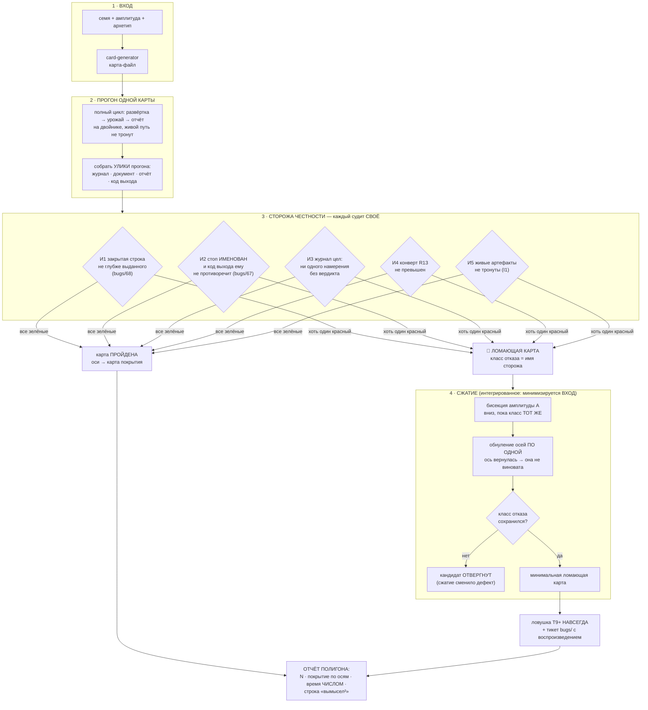

# План 71 — эпик 67, фаза 4: ПОЛИГОН

**Родитель:** `plans/67` (мета-план) · **Предыдущая фаза:** `plans/70` (генератор) — ✅ закрыта
2026-08-29, открытых пунктов не осталось.
**Написан:** 2026-08-29 18:4x, на закрытии фазы 3 — по правилу лестницы «фаза N+1 планируется, когда
закрывается N».
**Закрывает:** E67-AC3 (полигон) · E67-AC4 (сжатие) · «время полигона названо числом».

---

## Вектор цели

Фаза 3 дала множитель карт. Фаза 4 даёт **контур проверки**: пакетный прогон N карт через полный
цикл под **механическими сторожами честности** — и сжатие ломающей карты до минимальной, которая
навсегда становится ловушкой.

> ⚠️ **ГЛАВНАЯ ГРАНИЦА, ОНА ЖЕ РИСК №1 МЕТА-ПЛАНА.** Полигон судит **ТОЛЬКО ЧЕСТНОСТЬ УТВЕРЖДЕНИЙ
> ЦИКЛА** — никогда «нашёл ли движок правильный край». Правильного края у вымысла нет; полигон,
> проверяющий край, учил бы движок проходить вымысел, а не кремний (`researches/10`).

**Почему эта фаза не украшение — она уже окупилась ДО того, как была написана.** Первый же прогон
фазы 3 на сгенерированной карте дал `bugs/68`: документ закрыл строку 800 мВ при поле карты 1115.
**Но нашли это ГЛАЗАМИ по логу.** Разбор 2026-08-29 показал за той находкой ДВА дефекта — неверное
место пола в двойнике и затравку, писавшую заказ вместо выданного, — и второй **не покраснил ни
одного из 375 блоков движка**. Фаза 4 существует, чтобы такое ловил механизм, а не внимательность.

---

## Механизм

---

## Критерии приёмки — счётные

- **P71-AC1 — прогон пакета.** `npm run polygon -- --count 30` гоняет 30 сгенерированных карт через
  полный цикл. Выход: число пройденных, число ломающих, **время числом**. Живой путь не тронут —
  отпечаток I1 сверяется командой до и после.
- **P71-AC2 — сторожа судят и МОГУТ покраснеть.** Каждый из пяти инвариантов имеет свой блок И
  доказан КРАСНЫМ на подставной улике (сторож, не сработавший ни разу, ничего не доказывает).
  Отдельно: сторож И1 обязан краснеть на карте `virtual-gpu_42` с откаченной починкой `bugs/68`.
- **P71-AC3 — класс отказа = имя сторожа**, а не «что-то сломалось». Отчёт называет карту (семя,
  амплитуда, архетип), сторожа и строку улики.
- **P71-AC4 — сжатие сохраняет класс.** На подставной ломающей карте бисекция + обнуление осей дают
  меньший вход С ТЕМ ЖЕ именем сторожа; кандидат, сменивший класс, ОТВЕРГАЕТСЯ и это видно в выводе.
- **P71-AC5 — карта покрытия по осям.** Печатается, по каким осям пакет прошёлся и где дыры
  (ось, min, max, сколько карт) — иначе «30 карт» не отличить от «30 раз одна карта».
- **P71-AC6 — обычная карта не сдвинулась** (E67-AC5, ворота каждой фазы): твин-прогон
  `rtx5070ti` бит-в-бит прежний, батарея зелёная.

---

## Шаги

- [ ] **1. Улики прогона — одна структура.** Что полигон собирает после каждой карты: код выхода,
      путь журнала, документ кривой, строки отчёта. Ничего не судит, только собирает.
- [ ] **2. Пять сторожей, каждый чистой функцией** над уликами шага 1. Чистота — условие:
      сторож, которому нужен прогон, нельзя доказать красным дёшево.
- [ ] **3. Красное доказательство каждого сторожа** на подставных уликах. Сторож И1 —
      дополнительно на настоящем откате починки `bugs/68` (мутацией файла, как в этой сессии).
- [ ] **4. Пакетный прогон** `--count N --amplitude A --seed-base S`, с картой покрытия и временем.
- [ ] **5. Сжатие**: бисекция A, затем обнуление осей по одной; отвергать кандидата со сменой класса.
- [ ] **6. Ловушка из минимальной карты** — файл в `benches/cards/traps/`, вход в `npm run traps`.
- [ ] **7. Ворота E67-AC5** и полная батарея; `cardgen`/новый набор в `selftest:all` ВМЕСТЕ с кодом.
- [ ] **8. Итог плана**: числом — N, время, покрытие, найденное.

---

## Проверка наблюдением (не «должно работать»)

| что утверждаем | чем смотрим |
|---|---|
| полигон гоняет настоящий цикл, а не суррогат | те же `engine --sweep`/урожай, что живой путь; ноль веток «мы на полигоне» в движке |
| сторожа могут краснеть | подставные улики + откат починки `bugs/68` |
| живой путь не тронут | отпечаток I1 до/после, командой |
| время честное | число в отчёте, не оценка |

---

## Риски этой фазы (Мёрфи)

1. **🔴 Сторож напишется под уже известный дефект и не поймает следующий.** Реакция: сторожа
   формулируются как ИНВАРИАНТЫ («закрытая строка не глубже выданного»), а не как «случай
   `bugs/68`». Проверка формулировки: сторож обязан быть осмысленным на карте БЕЗ пола.
2. **🟠 Полигон позеленеет, потому что 30 карт оказались одной картой.** Реакция: P71-AC5, карта
   покрытия — обязательная часть отчёта, а не приложение.
3. **🟠 Сжатие замаскирует дефект** (анти-паттерн PBT). Реакция: P71-AC4, смена класса = отказ.
4. **🟡 Полигон дорог.** Реакция: время числом; ускорение прожигов уже канон (`ideas/04`).

---

## Опора, оплаченная этой сессией

- `bugs/68` — оба дефекта и их разбор; ЕГО откат становится красным доказательством сторожа И1.
- `bugs/67` (открыт) — трип предохранителя при коде 0: это ровно инвариант И2, и полигон даст ему
  первого механического свидетеля.
- **Урок метода:** обе первые редакции починки `bugs/68` были отброшены НЕ вкусом, а замером —
  сшивкой живого журнала по `seq` (784 пары, 191 ступень с выдачей выше заказа, 183 без класса
  отказа записи). Сторожа фазы 4 писать так же: от улик, а не от правдоподобия.
