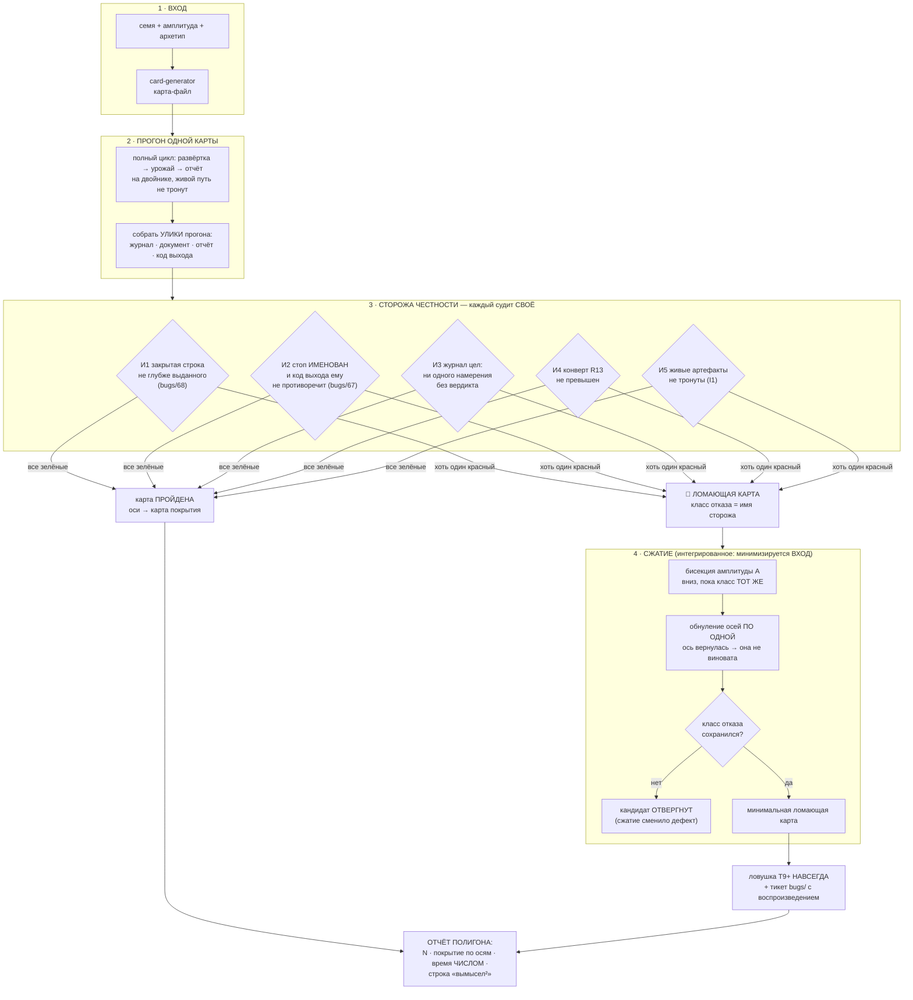
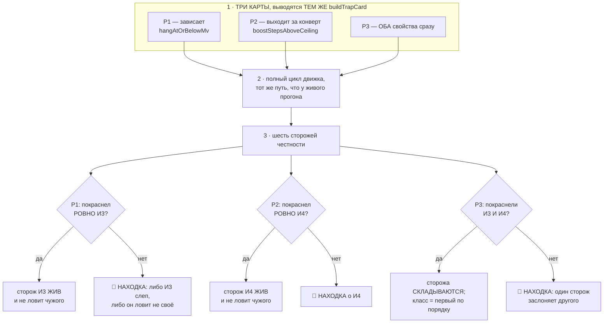

# План 71 — эпик 67, фаза 4: ПОЛИГОН

**Родитель:** `plans/67` (мета-план) · **Предыдущая фаза:** `plans/70` (генератор) — ✅ закрыта
2026-08-29, открытых пунктов не осталось.
**Написан:** 2026-08-29 18:4x, на закрытии фазы 3 — по правилу лестницы «фаза N+1 планируется, когда
закрывается N».
**Закрывает:** E67-AC3 (полигон) · E67-AC4 (сжатие) · «время полигона названо числом».

---

## Вектор цели

Фаза 3 дала множитель карт. Фаза 4 даёт **контур проверки**: пакетный прогон N карт через полный
цикл под **механическими сторожами честности** — и сжатие ломающей карты до минимальной, которая
навсегда становится ловушкой.

> ⚠️ **ГЛАВНАЯ ГРАНИЦА, ОНА ЖЕ РИСК №1 МЕТА-ПЛАНА.** Полигон судит **ТОЛЬКО ЧЕСТНОСТЬ УТВЕРЖДЕНИЙ
> ЦИКЛА** — никогда «нашёл ли движок правильный край». Правильного края у вымысла нет; полигон,
> проверяющий край, учил бы движок проходить вымысел, а не кремний (`researches/10`).

**Почему эта фаза не украшение — она уже окупилась ДО того, как была написана.** Первый же прогон
фазы 3 на сгенерированной карте дал `bugs/68`: документ закрыл строку 800 мВ при поле карты 1115.
**Но нашли это ГЛАЗАМИ по логу.** Разбор 2026-08-29 показал за той находкой ДВА дефекта — неверное
место пола в двойнике и затравку, писавшую заказ вместо выданного, — и второй **не покраснил ни
одного из 375 блоков движка**. Фаза 4 существует, чтобы такое ловил механизм, а не внимательность.

---

## Механизм



---

## Критерии приёмки — счётные

- **P71-AC1 — прогон пакета.** `npm run polygon -- --count 30` гоняет 30 сгенерированных карт через
  полный цикл. Выход: число пройденных, число ломающих, **время числом**. Живой путь не тронут —
  отпечаток I1 сверяется командой до и после.
- **P71-AC2 — сторожа судят и МОГУТ покраснеть.** Каждый из пяти инвариантов имеет свой блок И
  доказан КРАСНЫМ на подставной улике (сторож, не сработавший ни разу, ничего не доказывает).
  Отдельно: сторож И1 обязан краснеть на карте `virtual-gpu_42` с откаченной починкой `bugs/68`.
- **P71-AC3 — класс отказа = имя сторожа**, а не «что-то сломалось». Отчёт называет карту (семя,
  амплитуда, архетип), сторожа и строку улики.
- **P71-AC4 — сжатие сохраняет класс.** На подставной ломающей карте бисекция + обнуление осей дают
  меньший вход С ТЕМ ЖЕ именем сторожа; кандидат, сменивший класс, ОТВЕРГАЕТСЯ и это видно в выводе.
- **P71-AC5 — карта покрытия по осям.** Печатается, по каким осям пакет прошёлся и где дыры
  (ось, min, max, сколько карт) — иначе «30 карт» не отличить от «30 раз одна карта».
- **P71-AC6 — обычная карта не сдвинулась** (E67-AC5, ворота каждой фазы): твин-прогон
  `rtx5070ti` бит-в-бит прежний, батарея зелёная.

---

## Шаги

- [x] **1. Улики прогона — одна структура.** Что полигон собирает после каждой карты: код выхода,
      путь журнала, документ кривой, строки отчёта. Ничего не судит, только собирает.
- [x] **2. Пять сторожей, каждый чистой функцией** над уликами шага 1. Чистота — условие:
      сторож, которому нужен прогон, нельзя доказать красным дёшево.
- [x] **3. Красное доказательство каждого сторожа** на подставных уликах. Сторож И1 —
      дополнительно на настоящем откате починки `bugs/68` (мутацией файла, как в этой сессии).
- [x] **4. Пакетный прогон** `--count N --amplitude A --seed-base S`, с картой покрытия и временем.
- [x] **5. Сжатие**: бисекция A, затем обнуление осей по одной; отвергать кандидата со сменой класса.
- [ ] **6. Ловушки полигона — ТРИ КАРТЫ по слову владельца** (2026-08-29 20:0x): «одну вещь ломает,
      вторую вещь ломает, обе вещи ломает». Раскрыто ниже, в разделе «Шаг 6».
- [ ] **7. Ворота E67-AC5** и полная батарея; `cardgen`/новый набор в `selftest:all` ВМЕСТЕ с кодом.
- [ ] **8. Итог плана**: числом — N, время, покрытие, найденное.

---

## Проверка наблюдением (не «должно работать»)

| что утверждаем | чем смотрим |
|---|---|
| полигон гоняет настоящий цикл, а не суррогат | те же `engine --sweep`/урожай, что живой путь; ноль веток «мы на полигоне» в движке |
| сторожа могут краснеть | подставные улики + откат починки `bugs/68` |
| живой путь не тронут | отпечаток I1 до/после, командой |
| время честное | число в отчёте, не оценка |

---

## Риски этой фазы (Мёрфи)

1. **🔴 Сторож напишется под уже известный дефект и не поймает следующий.** Реакция: сторожа
   формулируются как ИНВАРИАНТЫ («закрытая строка не глубже выданного»), а не как «случай
   `bugs/68`». Проверка формулировки: сторож обязан быть осмысленным на карте БЕЗ пола.
2. **🟠 Полигон позеленеет, потому что 30 карт оказались одной картой.** Реакция: P71-AC5, карта
   покрытия — обязательная часть отчёта, а не приложение.
3. **🟠 Сжатие замаскирует дефект** (анти-паттерн PBT). Реакция: P71-AC4, смена класса = отказ.
4. **🟡 Полигон дорог.** Реакция: время числом; ускорение прожигов уже канон (`ideas/04`).

---

## Опора, оплаченная этой сессией

- `bugs/68` — оба дефекта и их разбор; ЕГО откат становится красным доказательством сторожа И1.
- `bugs/67` (открыт) — трип предохранителя при коде 0: это ровно инвариант И2, и полигон даст ему
  первого механического свидетеля.
- **Урок метода:** обе первые редакции починки `bugs/68` были отброшены НЕ вкусом, а замером —
  сшивкой живого журнала по `seq` (784 пары, 191 ступень с выдачей выше заказа, 183 без класса
  отказа записи). Сторожа фазы 4 писать так же: от улик, а не от правдоподобия.


---

## Ход исполнения

**Шаги 1-3 исполнены 2026-08-29 18:3x.** `automation-engine/lib/polygon-guards.mjs` — улики одного
прогона отдельной формой, пятеро сторожей чистыми функциями, **13 блоков**, набор `polyguard` вошёл
в батарею вместе с кодом (37 наборов / 1589 / 0).

**Все пять мутаций пойманы**, но путь к этому сам оказался уроком — и обе осечки были в ПРОВЕРКЕ, а
не в коде:

1. **Первый прогон мутаций не напечатал НИЧЕГО у всех пятерых.** Условие входа стояло на ИМЕНИ
   файла (`endsWith('polygon-guards.mjs')`), поэтому копия под другим именем переставала быть собой
   и набор не запускался вовсе. Мутационная проверка, у которой мутант молчит, читается как
   «мутация не поймана» — то есть ровно тот самообман, ради которого мутации и гоняют. Взят канон
   проекта: сравнение `path.resolve(argv[1])` с собственным URL.
2. **Мутация «сторож И1 считает и ОТКАЗАВШИЕ ступени» дважды прошла зелёной** на негодной фикстуре.
   Вторая редакция промахнулась ПО НАПРАВЛЕНИЮ ОСИ: «глубже» — это НИЖЕ по напряжению. Различает
   только фикстура, где отказавшая ступень обслужена ВЫШЕ строки: без фильтра сторож объявил бы
   завышение, которого нет.

Шаг 3 закрыт с оговоркой: сторож И1 доказан красным **на настоящих числах `bugs/68`** (800 против
1045, завышение 245 мВ), но пока на подставных уликах, а не на откате починки в живом коде. Откат
как красное доказательство остаётся в шаге 7.


**Шаг 4 исполнен 2026-08-29 18:4x.** `polygon.mjs`: пакет N карт, каждая — отдельным процессом
движка (только так полигон гоняет ТОТ ЖЕ путь и получает настоящий код выхода). Первый пакет,
числа честные: **5 карт (все пять архетипов) · 5 пройдено · 205,5 с · 41,1 с на карту** на полосе
из трёх частот · отпечаток живых артефактов СОШЁЛСЯ. Отсюда цена пакета из 30 карт — **около
20 минут**, число, а не оценка.

### 🔴 НАХОДКА О САМОМ ПОЛИГОНЕ (P71-AC2 пока НЕ закрыт)

Сквозное красное доказательство сторожа И1 **не получилось с первой попытки, и это важнее, чем
если бы получилось.** Откат починки `bugs/68` (половина B, затравка) в живом коде + прогон карты
`virtual-gpu_42` → полигон объявил карту **ПРОЙДЕННОЙ**.

**Причина, и она не в стороже.** После починки двойника (половина A) карта 42 больше НЕ ДОХОДИТ до
пути затравки: её пол 1115 мВ выше стока 1045, спуск невозможен, каждая частота закрывается на
первой же ступени сторожем `bugs/58`. А исходные «800 мВ» в том прогоне пришли из ЗАТРАВКИ ПО
СОБСТВЕННОЙ УЛИКЕ — то есть из журнала ПРЕДЫДУЩЕГО прогона, накопленного до починки. Чистый лист,
который полигон теперь наводит перед каждой картой, эту дорогу закрыл.

**Что это значит честно:** сторож И1 доказан красным на подставных уликах и на настоящих числах
`bugs/68`, но сквозного красного прогона у него нет.

### И это привело к настоящему выводу о конструкции — сторож И6

**И1 сверяет ДОКУМЕНТ с ЖУРНАЛОМ, а это два артефакта ОДНОГО цикла, читающие одну поверхность.
Ложь, которую они РАЗДЕЛЯЮТ, ему невидима по построению** — и `bugs/68` половина A была ровно
такой: прожиг шёл на 1115 мВ, а журнал и документ СОГЛАСНО говорили 800. Оба валидны, оба врут.
Поймать такое может только свидетель ВНЕ цикла.

Отсюда **И6 — фактура прожигов** (`burns.jsonl` в песочнице прогона двойника). ⚠️ Первая редакция
И6 сравнивала закрытую строку с напряжением прожига — и её отменил ЗАМЕР, а не рассуждение: на
карте с дрейфом прожиг честно идёт на 1240 мВ там, где таблица говорит 1040 (карта нагрелась,
`bugs/63`), а документ по канону хранит «частота → напряжение» ТАБЛИЦЫ. Такой сторож краснел бы на
каждой карте с дрейфом, то есть был бы шумом.

**Действующая формулировка судит ПАРУ ОТВЕТОВ ОДНОГО МГНОВЕНИЯ:** на чём прожиг рисовался (физика)
и что о той же частоте в ту же секунду говорит перечитанная кривая (единственный прибор цикла).
Дрейф двигает оба числа ВМЕСТЕ и молчит; зажим, невидимый чтению, их РАЗВОДИТ. Инвариант:
**вымысел не смеет знать о карте того, чего он не показывает циклу.**

### ✅ P71-AC2 ЗАКРЫТ СКВОЗНЫМ КРАСНЫМ ПРОГОНОМ

Откат половины A `bugs/68` в живом коде + прогон карты `virtual-gpu_42`:

```
🔴 ЛОМАЮЩАЯ · класс: И6 вымысел не прячет от цикла свою физику
   прожиг рисовался не на том, что цикл может прочитать: 2842 МГц рисовался на 1115 мВ,
   а кривая в ту же секунду отдавала 1020 мВ (разрыв 95 мВ)
```

С починкой на месте та же карта проходит. Откат снят точечно (не `git checkout` — в файле жила
несохранённая фактура), батарея после снятия зелёная: **38 наборов / 1603 / 0**.

⚠️ **Оговорка, названная вслух:** сторож И6 пропускает прожиги, где кривая не даёт ответа вовсе
(`readbackMv: null` — ни одна точка не достаёт до частоты). Это честный пропуск: там у цикла нет
числа, о котором можно было бы соврать. Но он сужает поле И6, и на карте 42 из четырёх прожигов
пару ответов имел один.


---

## Шаг 5 — сжатие (исполнен 2026-08-29 19:0x)

`polygon-shrink.mjs`: **чистая логика с ВНЕДРЯЕМЫМ оракулом.** В бою оракул — настоящий прогон под
сторожами (минуты), в наборе — подставная функция (миллисекунды). Только это и позволяет доказать
сжатие мутациями, не гоняя карты в батарее.

Бисекция амплитуды вниз → зануление осей по одной. Ось, БЕЗ которой отказ жив, снимается; ось, без
которой отказ исчезает, ВОЗВРАЩАЕТСЯ — она часть минимального объяснения. Кандидат со сменой класса
отвергается и называется (риск 4 эпика). **8 блоков, 4 мутации**, включая «считать чужой класс
успехом» и «не возвращать ось-виновницу».

Генератор получил `--freeze`. ⚠️ Бросок оси делается ВСЕГДА и отбрасывается — иначе заморозка
сдвинула бы посеянный поток и тройка перестала бы воспроизводить карту, то есть сжатие ломало бы
ровно то свойство, ради которого минимизируется ВХОД. Мутация «заморозка сдвигает поток» это краснит.

**Дыра, найденная проверкой CLI, а не рассуждением:** заморозка не входила в расписку — две РАЗНЫЕ
карты (с полом и без) несли одинаковое происхождение, и «воспроизводится по расписке» было
неправдой (E67-AC6). Исправлено, блок стоит.

---

## Первый ПОЛНЫЙ пакет (30 карт) — и почему его красные не считаются

Прогон 19:05 → 19:25: **30 карт · 20 пройдено · 10 сломано · 1187 с (39,6 с на карту) · отпечаток
живых артефактов СОШЁЛСЯ · покрытие по пяти осям, все пять архетипов по шесть карт.** Числа
времени и покрытия ДЕЙСТВИТЕЛЬНЫ — они не зависят от того, что описано ниже.

**А десять красных — НЕТ, и это признаётся, а не заминается.** Все десять несли один класс
(И2: «код 1, но ни одна строка не называет причину»), и ни один не воспроизвёлся на целом дереве:
карта 3009 прогнана заново — код 0, чисто. Причина в том, что я правил `card-generator.mjs`, ПОКА
шёл пакет. Себе я запретил трогать `engine.mjs` — и забыл, что пакет запускает генератор
ОТДЕЛЬНЫМ ПРОЦЕССОМ на каждую карту. Правило записано в EXP-0179: пока идёт прогон,
неприкосновенны ВСЕ модули, которые он поднимает новыми процессами, а не только очевидный главный.

⚠️ **Отдельно: расследование этих красных само дало ложный след.** Первое чтение stderr показало
`ERR_MODULE_NOT_FOUND: power-baseline.mjs`, и это выглядело как настоящий латентный дефект движка.
Дефекта не было: модуль снёс мой собственный `rm -f automation-engine/lib/po*.mjs` — шаблон совпал
с `power-baseline.mjs` и с тремя модулями полигона. Восстановлено из git, батарея зелёная.

### ⚠️ ПОПРАВКА, СНЯТАЯ ЧЕРЕЗ ПОЛЧАСА: ОБА ПАКЕТА ЗАГРЯЗНЕНЫ, ЧИСТОГО ПОЛНОГО ПРОГОНА ЕЩЁ НЕТ

Повторный пакет на 10 картах дал 9 красных того же класса — и его причина оказалась ещё грубее:
`power-baseline.mjs` (и три модуля полигона) были снесены **второй раз, прямо во время прогона**.
Механизм — EXP-0180: строку выше, где команда удаления записана в бэктиках, я отправлял в файл
через шелл, и bash ВЫПОЛНИЛ содержимое бэктиков как подстановку команды. Соседние фрагменты упали
с «command not found» и были видны как шум, а настоящая команда сработала молча.

**Честное состояние на конец окна:**

| прогон | числа | доверие |
|---|---|---|
| 5 карт (18:43) | 5/5 · 205,5 с · **41,1 с на карту** | ✅ чистый, до всех оплошностей |
| 30 карт (19:05) | 20/30 · покрытие по пяти осям | 🟡 покрытие и факт «доходит до конца» в силе; **10 красных и число «39,6 с на карту» — нет** |
| 10 карт (19:28) | 1/10 | 🔴 отброшен целиком |

### ✅ ЧИСТЫЙ ПРОГОН СНЯТ 19:36 → 19:41 — P71-AC1 ЗАКРЫТ

Условие соблюдено буквально: **за все пять минут прогона не тронут ни один файл.**

```
ПОЛИГОН: карт 5 · пройдено 5 · сломано 0
ВРЕМЯ: 318.2 с (63.6 с на карту)
ФАКТУРА ПРОЖИГОВ: собрана у 5 из 5 прогнанных карт
ЖИВЫЕ АРТЕФАКТЫ: отпечаток СОШЁЛСЯ до и после пакета
   архетипы: typical ×1 · cold-lucky ×1 · hot-unlucky ×1 · angry-governor ×1 · drifty ×1
```

Все пять архетипов, шесть сторожей зелёные на каждой карте, **фактура прожигов собрана у всех
пяти** (то есть сторож И6 судил, а не пропускал), код выхода 0. Разброс по картам — от 5,5 с
(hot-unlucky, спуска нет) до 152,9 с (cold-lucky, глубокий спуск), и это свойство КАРТ, а не шум.

**Цена пакета названа числом: 63,6 с на карту**, то есть 30 карт ≈ **32 минуты**. Прежняя оценка
41,1 с была снята на более узкой полосе и на меньшей выборке.

🟡 **Оговорка, без которой число врёт:** пять карт — это по одной на архетип, то есть покрытие осей
внутри архетипа не проверено вовсе (пол карты и сдвиг края попали по одной карте). Полный пакет на
30 картах остаётся нужным; закрыт критерий «полигон доходит до конца и судит честно», а не
«поле поведений покрыто».

### ВТОРОЙ ЧИСТЫЙ ПРОГОН, 19:45 → 19:58: 10 карт на амплитуде 0,9 — 10/10

```
ПОЛИГОН: карт 10 · пройдено 10 · сломано 0
ВРЕМЯ: 724.2 с (72.4 с на карту)
ФАКТУРА ПРОЖИГОВ: собрана у 10 из 10 прогнанных карт
ЖИВЫЕ АРТЕФАКТЫ: отпечаток СОШЁЛСЯ до и после пакета
   архетипы: typical ×2 · cold-lucky ×2 · hot-unlucky ×2 · angry-governor ×2 · drifty ×2
```

Условие чистоты снова соблюдено буквально: за тринадцать минут прогона не тронут ни один `.mjs`
(правились только `.md`, и пробы были read-only). **Амплитуда поднята 0,8 → 0,9** — поле шире,
результат тот же: шесть сторожей зелёные на каждой карте, фактура собрана у ВСЕХ десяти.

**Два чистых прогона подряд, 15 карт суммарно, ноль ломающих.** Цена уточнена: **72,4 с на карту**
на амплитуде 0,9 против 63,6 с на 0,8 — то есть более широкое поле стоит дороже, и полный пакет
на 30 картах обойдётся в **~36 минут**.

🟡 **И это же — вторая половина правды:** полигон пока не нашёл НИ ОДНОЙ настоящей ломающей карты.
Все красные за окно оказались либо моим загрязнением, либо дефектом самого полигона. Шаг 6
(ловушка из минимальной карты) поэтому не исполнен — сжимать нечего, и это честное состояние, а не
пропущенный шаг.

**Что пакет всё-таки доказал:** полигон ДОХОДИТ до конца на 30 картах, судит их шестью сторожами,
печатает покрытие и время, не трогает живые артефакты — и его сторожа СРАБАТЫВАЮТ (пусть в тот раз
на моём же загрязнении, а не на дефекте движка). Первое настоящее срабатывание И2 при этом
вскрыло реальную дыру в самом полигоне: улики собирались только со stdout, а движок печатает
причины отказа в stderr.

---

## Шаг 6 — ТРИ ЛОМАЮЩИЕ КАРТЫ (заказ владельца 2026-08-29 20:0x)

> Дословно: *«давай специально заведём в парке ломающую видеокарту»* → *«три карты. одну вещь
> ломает, вторую вещь ломает, обе вещи ломает»*.

### Зачем это, и почему без этого полигон стоит ноль

Полигон зелен на 15 картах двух чистых пакетов — **и его сторожа не краснели на настоящем прогоне
НИ РАЗУ.** По канону проекта сторож, ни разу не сработавший, не доказывает ничего
(`BUG_FIXING_FRAMEWORK.md` → Guards). Пока это так, зелёный полигона не отличим от полигона,
который ловить не умеет вовсе, — и искать на нём настоящие дефекты движка бессмысленно.

⚠️ **ГРАНИЦА, ЧТОБЫ КРАСНОЕ НЕ ПРОЧЛИ НЕВЕРНО.** Красный на этих картах доказывает, что **ПОЛИГОН
УМЕЕТ ЛОВИТЬ**, и НЕ доказывает дефекта в движке. Это ровно та же роль, что у `benches/cards/traps/`
T1…T8 для движка: карта существует, чтобы неправильный ПРИБОР на ней покраснел.

### Что именно ломается — физикой КАРТЫ, а не дефектом кода

Взяты две причины, независимые по построению: они живут в разных свойствах файла карты, идут
разными дорогами и судятся разными сторожами.

| ломает | свойство карты | сторож | почему это честная физика, а не подделка |
|---|---|---|---|
| **зависание** | `fiction.hangAtOrBelowMv` | **И3** — журнал цел | карта детерминированно умирает ниже названного напряжения; ЗАВИС на двойнике — настоящая смерть процесса, а не возвращённое значение (ловушка T2 уже стоит на этом) |
| **выход за конверт** | `physics.boostStepsAboveCeiling` | **И4** — конверт R13 не превышен | регулятор буста уносит карту выше выданного потолка; живой аналог измерен (`bugs/50`: кривая после записи предлагала на 15 МГц выше потолка) |

### Механизм



### Что даёт третья карта, чего не дают две первые

Две первые доказывают, что каждый сторож **срабатывает на своей причине и молчит на чужой** — это
независимость. Третья доказывает **сложение**: два нарушения сразу не должны схлопываться в одно.
Здесь ловится отдельный класс дефекта — «первый сработавший сторож заслоняет второго», из-за
которого отчёт назвал бы одну болезнь вместо двух, а сжатие пошло бы минимизировать не тот вход.

### Критерии приёмки

- **P71-AC7 — каждая карта краснит РОВНО свои сторожа.** Не «хотя бы», а ровно: лишний красный —
  такая же находка, как недостающий.
- **P71-AC8 — на третьей карте краснеют ОБА, отчёт перечисляет ОБА, класс = первый по порядку.**
- **P71-AC9 — намерение карты записано В САМОЙ КАРТЕ** (`card.trap`: что ловит · что прибор обязан
  сделать · чем грозит иначе · чем судится), как у T1…T8. Ловушка без расписки — это карта, про
  которую через месяц никто не скажет, зачем она.
- **P71-AC10 — ожидание объявлено ДО прогона.** Какой сторож обязан покраснеть, записано в файле
  карты; прогон это ПОДТВЕРЖДАЕТ или ОПРОВЕРГАЕТ. Подгонять ожидание под результат запрещено.

### Названный риск и предсказание, сделанное ДО прогона

🔴 **Подозрение на собственного сторожа И3.** Он требует «ни одного намерения без вердикта» — а
карта, которая ЧЕСТНО зависла, оставляет намерение открытым ПО ПОСТРОЕНИЮ: журнал упреждающей
записи ровно для этого и сделан, и закрывает такое намерение СЛЕДУЮЩИЙ запуск («намерение без
вердикта И ЕСТЬ ответ»). Если так — И3 в нынешней формулировке даёт ЛОЖНУЮ ТРЕВОГУ на честном
зависании, и карта P1 это вскроет. **Предсказание записано до прогона, чтобы результат нельзя было
подогнать.** Исход любой из двух — находка: либо сторож жив, либо сторож неверен и его
формулировку надо чинить (не «нет открытых намерений», а «открытое намерение объяснено ЗАВИСом»).

### 🔴 ПЕРВЫЙ ПРОГОН ТРЁХ ЛОВУШЕК 2026-08-29 20:1x — НИ ОДНА НЕ СРАБОТАЛА. Шаг 6 НЕ ЗАКРЫТ

```
🔴 P1 (одно: зависание)      28.3 с · ОБЕЩАНО И3 · ВЫШЛО — (все сторожа зелёные)
🔴 P2 (одно: выход за конверт) 36.6 с · ОБЕЩАНО И4 · ВЫШЛО — (все сторожа зелёные)
🔴 P3 (обе вещи)             17.1 с · ОБЕЩАНО И3+И4 · ВЫШЛО — (все сторожа зелёные)
ИТОГ: расхождений 3
```

**И это ровно та развилка, которую инструмент обязан был назвать сам: «сторож слеп ЛИБО карта не
ломает обещанного».** Разобрано уликами, а не догадкой:

| карта | улика | вывод |
|---|---|---|
| **P1** | журнал: **13 намерений, 13 вердиктов, открытых 0**; исходы `PASS`/`CRASH`, **ни одного `ЗАВИС`** | спуск до 1000 мВ НЕ ДОШЁЛ: придуманный край карты лежит ВЫШЕ напряжения зависания, и `CRASH` останавливает спуск раньше. Вторая половина: `ЗАВИС` на двойнике — настоящая смерть процесса ТОЛЬКО при взведённом `allowProcessDeath`, а полигон поднимает движок без него |
| **P2** | журнал: **43 выданных частоты, максимум 3082** при заказанном потолке 3082 и конверте 3090 | буст НЕ унёс выдачу выше потолка ни разу. Свойство `boostStepsAboveCeiling` в этой полосе не проявилось — вероятно, потолок держит закрепление, и оно подрезает перелёт |

**ВЫВОД, И ОН ПРОТИВОПОЛОЖЕН ПЕРВОМУ ВПЕЧАТЛЕНИЮ: сторожа не слепы — им НЕЧЕГО было ловить.**
Ни один инвариант не был нарушен, и зелёный был правильным ответом. Сломаны ЛОВУШКИ.

⚠️ **И это находка первой величины, а не досадная осечка.** Ловушка, которая не ловит, **хуже
отсутствующей**: она создаёт вид, что полигон доказан, когда не доказано ничего — тот же класс, что
«блок, который не может покраснеть» (EXP-0178) и «сторож, ни разу не сработавший». Три файла на
диске выглядят как проверка и проверкой не являются.

**Что делать дальше — по одному действию на карту, всё измерено, гадать не надо:**

1. **P1:** увести придуманный край НИЖЕ напряжения зависания (якоря глубокие, как у `T4`), чтобы
   спуск дошёл до 1000 мВ живым; и поднимать движок с взведённой смертью процесса, иначе `ЗАВИС`
   останется возвращаемым значением, а не смертью. **Только после этого предсказание про ложную
   тревогу И3 станет проверяемым** — сейчас оно НЕ проверено.
2. **P2:** найти полосу и форму, где перелёт буста ДЕЙСТВИТЕЛЬНО переваливает конверт, либо —
   если под закреплением это невозможно по построению — сменить вторую «вещь» на ту, что достижима
   физикой карты, и честно записать почему.
3. **P3** собирается из первых двух автоматически и трогать её отдельно не нужно.

**P71-AC7/AC8/AC9/AC10 — открыты.** AC9 и AC10 фактически исполнены (расписка и предсказание живут
в карте, сверка «ровно, а не хотя бы» доказана 11 блоками), но проверять им пока нечего.

### ✅ ВТОРОЙ ПРОГОН ТРЁХ ЛОВУШЕК 2026-08-29 21:2x — P1 И P3 КРАСНЯТ РОВНО И3, P2 ЗАПЕРТА ЗАМЕРОМ

```
✅ P1 (одно: зависание)        2.6 с · ОБЕЩАНО И3 · СУДИТСЯ И3 · ВЫШЛО И3
                                 улика: намерений без вердикта 1 (seq 2) — ступень потеряна молча
⛔ P2 (одно: выход за конверт) 37.3 с · ЗАПЕРТО И4 · СУДИТСЯ — НИЧЕГО: эта карта сейчас НЕ ПРОВЕРКА
✅ P3 (обе вещи)              11.6 с · ЗАПЕРТО И4 · СУДИТСЯ И3 · ВЫШЛО И3
                                 улика: намерений без вердикта 1 (seq 14)
ИТОГ: сработали РОВНО как обещано — 2 из 3.
⛔ КАРТ БЕЗ СУДИМОЙ ПРИЧИНЫ: 1 — они НЕ доказывают ничего и не выдают себя за доказательство.
```

Батарея после правок: **40 наборов / 1645 / 0** (было 40/1636/0). `npm run check` зелёный.
Записей в карту за всю работу — **ноль**: всё шло через `--card virtual`.

#### 1. 🔴 ДИАГНОЗ ПЕРВОГО ПРОГОНА ПО P1 БЫЛ НЕВЕРЕН, И ЭТО ВСКРЫЛ ЗАМЕР, А НЕ РАССУЖДЕНИЕ

Здесь стояло: *«спуск до 1000 мВ НЕ ДОШЁЛ: придуманный край карты лежит ВЫШЕ напряжения
зависания»*. Воспроизведение опровергло обе половины:

| улика | что она говорит |
|---|---|
| край карты P1 на полосе: **861,1…871,7 мВ** при стоке 1035…1045 | край лежит НИЖЕ зависания на ~130 мВ, а не выше — уводить его никуда не надо |
| прогон: `2835 МГц ← 1010 мВ … ПРОШЛО`, следом `2835 МГц ← 1000 мВ … CRASH` | спуск ДОШЁЛ до 1000 мВ, и граница легла РОВНО на `hangAtOrBelowMv` |
| текст отказа: «нагрузка не завершилась за 60000 мс — зависшее ядро» | это невзведённая ветка ЗАВИСа: она возвращает `ETIMEDOUT`, а слой вердикта честно называет такое CRASH-ем |

**То есть ловушка срабатывала с самого начала — её просто некому было увидеть.** Верной была ровно
вторая половина прежнего разбора: `ЗАВИС` на двойнике есть настоящая смерть процесса ТОЛЬКО при
взведённом `allowProcessDeath`, а полигон его не поднимал. Первое действие эстафеты («увести край
ниже, якоря как у `T4`») **отменено как ненужное**: край и так там.

#### 2. Починка — один флаг, поставленный в ОБЩУЮ часть обеих дорог

`engine.mjs` получил `--twin-hang-kills`: ступень зависания карты убивает ЭТОТ процесс по-настоящему.
Флаг живёт только с `--card virtual`, без него не меняется ни байта аргументов сборки (I4).

Почему флаг, а не вывод из самой карты: `virtualCard` держит смерть правилом **ARMED, NEVER
DEFAULT** — набор, чей оракул вправе убить бегуна, не может доложить свои результаты, а ловушки
движка `T2`/`T5` несут то же поле и гоняются ВНУТРИ процесса набора. Смерть законна там, где движок
поднят отдельным процессом, и это знает вызывающий, а не карта. Почему не `--twin-death hang`: тот
убивает движок СНАРУЖИ (репетиция руки 1 предохранителя) — здесь умирает САМА КАРТА на названной
ступени, то есть проверяется журнал упреждающей записи, а не судья всадников.

В `polygon.sweepAndCollect` флаг стоит для ВСЕХ карт, а не только для ловушек: генератор
`hangAtOrBelowMv` не пишет вовсе, поэтому для сгенерированной карты это ноль изменений, — а две
дороги вместо одной разошлись бы первой же правкой.

#### 3. 🔴 ПРЕДСКАЗАНИЕ ПРО ЛОЖНУЮ ТРЕВОГУ И3 — ОПРОВЕРГНУТО ПРОГОНОМ. Ложь давал И2

Записанный до прогона риск («И3 краснеет на честном зависании, потому что открытое намерение —
это ПО ПОСТРОЕНИЮ ответ, а не потеря») **не подтвердился, и это правильный исход предсказания**:
для ОДНОГО завершённого прогона полигона потерянная ступень есть потерянная ступень, и И3 назвал
её поимённо — 2842 МГц / 995 мВ. Формулировка И3 не тронута.

Ложную тревогу дал сосед. И2 требовал, чтобы ненулевой код был объяснён СЛОВАМИ отчёта, — а карта,
убившая процесс посреди ступени, напечатать не может НИЧЕГО по построению: причина названа
намерением без вердикта («намерение без вердикта И ЕСТЬ ответ», R15). Улика: код 70, ноль
стоп-слов, ровно одно открытое намерение. Прежняя редакция краснела бы на КАЖДОМ честном
зависании и разрушала независимость — класс карты назывался бы И2 вместо И3.

**Сужение и его доказательство.** Вторая ветка И2 молчит, если ненулевой код объяснён открытым
намерением; ветка `bugs/67` (остановка объявлена, код 0) не тронута ни на байт. Спрятать сужение
ничего не может, и это проверяемо: замолчать И2 способно ТОЛЬКО открытое намерение, а оно само есть
безусловный красный И3. Счёт открытых намерений вынесен в одну функцию `openIntentSeqs` на обоих
сторожей — пара «правда↔зеркало» там завелась бы первой же правкой формы журнала.
**Блоков 18 → 22, мутации ×2** (откат сужения → краснеет блок зависания; сужение сделано
безусловным → краснеют оба блока «отказ без имени»).

#### 4. 🔴 И4 НЕ КРАСНЕЕТ НИ ОТ КАКОЙ КАРТЫ, И ЭТО ИЗМЕРЕНО — `bugs/69`

Второе действие эстафеты («найти полосу, где перелёт буста реально переваливает конверт») исполнено
и дало отрицательный ответ с числами. Зонд с перелётом **20 ступеней** — вдесятеро больше
ловушечных двух:

| замер | значение |
|---|---|
| конверт карты | 3090 МГц |
| верх сетки частот | **3090 МГц — совпадает с конвертом** |
| верх таблицы карты | 3185 МГц — щель над конвертом есть, но она только в таблице |
| максимум ВЫДАННОЙ частоты при перелёте ×10 | **3082 МГц** |
| строк документа выше конверта | **0** |

Две независимые засовы, обе законные: выдача перебирает сетку частот, верх которой И ЕСТЬ конверт,
и сверху стоит ещё `Math.min` по конверту — а он ВЕРЕН (R13: выше огибающей экземпляра карта не
идёт ни при какой кривой). Щель закрывается ещё на записи (`curveWriteRefusal`). Отпереть И4 можно
одним способом — дать карте право ВЫДАВАТЬ выше, чем она ОБЪЯВЛЯЕТ, а это новое свойство закрытого
словаря `physics`, то есть слово владельца. Живого замера «кремний идёт выше объявленного
максимума» у проекта нет (`bugs/50` мерил выход за потолок КРИВОЙ — другое), значит источника нет и
выдумывать запрещено.

**До ответа владельца** P2 и P3 несут поле `trap.blocked` с этим замером; прогон вычитает запертого
сторожа ЯВНО, отдельной строкой, и карта без единого судимого сторожа перестаёт считаться проверкой
(`⛔ … эта карта сейчас НЕ ПРОВЕРКА`). Это прямое исполнение EXP-0181. **Блоков 11 → 16, мутации ×3.**

#### 5. Два кандидата во вторую причину проверены и отвергнуты — с уликами, чтобы не ходить туда снова

- **Регулятор буста (недобор до заказа).** Замерен: 60 МГц → «закрыто 0 из 5», замер лёг ВНЕ полосы
  (2842→2782), код 0. Сторож «полоса не закрыта ничем» ОТВЕРГНУТ до написания: он краснел бы на
  ПРАВИЛЬНОМ поведении — `T6` обязывает закрывать полосу по ВЫДАННЫМ частотам, а `GOAL.md` →
  «ЗДАНИЕ ВАЖНЕЕ ЛЕСОВ» запрещает ронять прогон на аномалии.
- **Два зависания подряд на одной ступени (форма `T5`).** Прогнан второй запуск по тому же журналу:
  намерение закрыто как `ЗАВИС`, ступень названа, **пол зависания R18 впервые отработал на
  двойнике живьём** — но прогон умер на следующей частоте, класс тот же И3.

**Структурный факт, найденный попутно:** карта с зависанием ВСЕГДА умирает на ПЕРВОЙ частоте
полосы — спуск на ней идёт настолько глубоко, насколько пускает потолок глубины, и встречает
ступень зависания раньше любой другой частоты. Значит вторая причина, чьи улики требуют
ЗАВЕРШЁННОГО прогона, на одной карте с зависанием ненаблюдаема в принципе. Это ограничение на
конструкцию третьей карты, а не дефект.

**P71-AC7 — ✅ закрыт** на достижимой причине: P1 и P3 краснят РОВНО И3, лишних красных нет.
**P71-AC9, AC10 — ✅ закрыты**: расписка и предсказание живут в карте, предсказание не подгонялось —
одно опровергнуто прогоном (И3), одно заперто замером (И4), и оба записаны как есть.
**P71-AC8 — 🔒 ЗАПЕРТ до слова владельца** (`bugs/69`): «оба сторожа на третьей карте» требует
второй достижимой причины, а её сегодня не существует.

### ✅ ТРЕТИЙ ПРОГОН 2026-08-29 22:0x — 3 ИЗ 3, КАЖДАЯ РОВНО СВОЁ. Шаг 6 ЗАКРЫТ

Владелец ответил на `interviews/019`: **вариант A — «карта выдаёт выше, чем объявляет»**. Исполнено
в тот же час.

```
✅ P1 (одно: зависание)        2.6 с · ОБЕЩАНО И3 · СУДИТСЯ И3 · ВЫШЛО И3
                                 улика: намерений без вердикта 1 (seq 2)
✅ P2 (одно: выход за конверт) 1.9 с · ОБЕЩАНО И4 · СУДИТСЯ И4 · ВЫШЛО И4
                                 улика: конверт 3090 МГц превышен, выдача 3098 МГц
✅ P3 (обе вещи)               1.9 с · ЗАПЕРТО И3 (замером) · СУДИТСЯ И4 · ВЫШЛО И4
ИТОГ: сработали РОВНО как обещано — 3 из 3. Код выхода 0.
```

Батарея: **40 наборов / 1647 / 0**. `npm run check` зелёный. Записей в карту НОЛЬ.

#### Свойство `deliverStepsAboveEnvelope` — что заведено и по какой цене

Новая строка ЗАКРЫТОГО словаря `physics` и словаря вымысла: **объявленный максимум карты и её
настоящий потолок выдачи — два разных числа.** Продолжение лестницы берёт ЗАЗОРЫ САМОЙ КАРТЫ (7 и 8
МГц вперемешку) и зеркалит их вверх — ни одного выдуманного мегагерца: 3090 → 3098 → 3105.

🔴 **Цена названа в карточке происхождения и не смягчается:** на кремнии выход за ОБЪЯВЛЕННЫЙ
максимум НЕ ИЗМЕРЕН. Измерен выход за СТОЯВШИЙ потолок (`bugs/50`, 9 из 9, 2-3 ступени сетки).
Живой замер, если появится, отменяет эту строку, а не наоборот.

#### 🔴 ЗАЖИМОВ ОКАЗАЛОСЬ ТРИ, А НЕ ДВА — третий нашёлся только прогоном

`bugs/69` называл два (сетка частот · `Math.min` по объявленному максимуму). После их снятия зонд
всё равно давал 3082: третьим, и самым глубоким, оказалась **ГРАНИЦА ЧАСТОТЫ — лекарство эпика 43**,
режущая выдачу до заказанного (`Math.min(d, lockCeilingMhz())`). Свойство доведено и до неё, и это
не расширение вымысла: `bugs/50` замерил ровно такой отказ живьём (запись легла, кривая предлагала
ровно потолок, карта ушла выше), а **держит ли граница эпика 43 на кремнии — открытый вопрос
E43-AC5** («доказывает ДВИЖОК, а не кремний»). Карта с этим свойством и есть модель того, что
граница не удержала — то есть ловушка встала ровно под незакрытый риск эпика 43.

#### 🔴 ТРЕТЬЯ КАРТА НЕ МОЖЕТ ПОКАЗАТЬ ОБЕ ВЕЩИ, И ЭТО СТРУКТУРА, А НЕ ДЕФЕКТ

Обе причины в карте и обе рабочие ПОРОЗНЬ. Вместе не складываются, и виновата не слепота сторожей, а
ПОРЯДОК: пробой потолка заставляет движок **пропустить частоту целиком** («строка в документ не
пишется, полоса продолжается» — правило владельца «здание важнее лесов»), то есть спуска по
напряжению на ней не происходит вовсе, — а зависание живёт на ступени спуска. Замер: 3 из 3 частот
пропущены, открытых намерений ноль. Обратный порядок зеркально так же плох: поднять ступень
зависания выше первой ступени спуска — умрёт прожиг, и наблюдения о пробое не случится.

**Общее правило, оплаченное этим прогоном: любая пара «усекающая причина + причина, которой нужен
продолжающийся прогон» на одной карте ненаблюдаема.** Третья карта требует двух ПРОДОЛЖАЮЩИХ причин.

Поэтому у P3 половина И3 объявлена запертой ЗАМЕРОМ, прогон говорит это вслух, и карта судит вторую
половину. Механизм запирания, построенный часом раньше под другую недостижимость, нашёл второго
клиента сразу же — и обе стороны (заперто / не заперто) стоят под своими блоками: набор краснеет,
если кто-то запрёт причину МОЛЧА.

**P71-AC7 ✅ · P71-AC9 ✅ · P71-AC10 ✅ · P71-AC8 🟡 — исполнен наполовину и половина названа:** оба
сторожа доказаны красным на своих картах (независимость), сложение на одной карте недостижимо
структурно. **Шаг 6 закрыт.**
