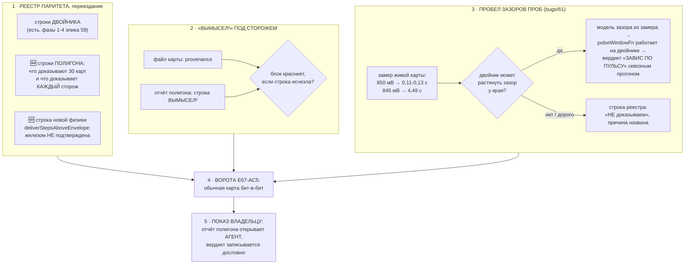

# План 72 — эпик 67, фаза 5: ПАРИТЕТ-2 И ПРИЁМКА ВЛАДЕЛЬЦА

> Оперплан ПОСЛЕДНЕЙ фазы эпика 67. Мета-план — `plans/67`; фаза 4 закрыта
> (`plans/71_DONE`: пакет 30/30 чисто за 24,3 мин, три ловушки краснят 3 из 3).
> Реестр паритета, который здесь переиздаётся, живёт в `plans/59` § Реестр паритета.

---

## Вектор цели

**Боль.** Полигон научился ловить, и это опасно ровно настолько, насколько убедительно. Тридцать
зелёных карт читаются как «движок верен», хотя доказывают они другое и меньшее: что на широком поле
поведений шесть сторожей честности не нашли нарушения инвариантов. **Пока граница написана только в
голове агента, следующая сессия — или владелец — прочтёт зелёный шире, чем он есть.** Вторая боль
названа в эстафете сессии 63 и до сих пор открыта: **у двойника есть измеренная способность, которую
он не воспроизводит** — зазоры проб телеметрии у края (`bugs/61`), и потому целая ветка вердикта
ступени на вымысле не проверяется вовсе.

**Куда хотим.** Реестр паритета переиздан так, что каждая строка про двойника И про полигон несёт
вердикт, свидетеля и границу; строка происхождения «вымысел²» стоит в каждом выходе не по
дисциплине агента, а под сторожем; пробел по зазорам проб либо закрыт моделью из живого замера, либо
записан отказом прямым текстом. Владелец видит отчёт полигона и говорит, читается ли он.

**Тип цели:** Achieve (реестр и сторожа) + Maintain (граница «вымысел²» не размывается со временем).

---

## Критерии приёмки — счётные

- **P72-AC1 — реестр паритета переиздан и покрывает ПОЛИГОН.**
  *Шкала:* число строк реестра, у которых есть все три поля (вердикт · свидетель · граница модели).
  *Прибор:* чтение таблицы `plans/59` § Реестр паритета + сверка списка сторожей полигона.
  *Цель:* строк без свидетеля — **0**; каждый из шести сторожей полигона (И1…И6) назван в реестре
  строкой «доказан красным / не доказан, и почему».
- **P72-AC2 — «вымысел²» под сторожем, а не под дисциплиной.** Набор ОБЯЗАН краснеть, если строка
  происхождения исчезает из файла сгенерированной карты или из отчёта полигона.
  *Прибор:* мутация, снимающая строку. *Цель:* мутация красит блок; на здоровом коде блок зелёный.
- **P72-AC3 — пробел по зазорам проб ЗАКРЫТ решением, а не молчанием.** Ровно один из двух исходов,
  и он записан в реестр строкой: **(а)** двойник растягивает зазоры проб у края, ветка `bugs/61`
  проходит сквозным прогоном; **(б)** строка реестра говорит «НЕ доказываем» с названной причиной.
  *Прибор:* при (а) — сквозной прогон с вердиктом «ЗАВИС ПО ПУЛЬСУ СЭМПЛЕРА»; при (б) — строка.
- **P72-AC4 — обычная карта не сдвинулась** (E67-AC5, ворота каждой фазы): твин-прогон `rtx5070ti`
  без новых флагов бит-в-бит, батарея зелёная.
- **P72-AC5 — отчёт полигона показан владельцу и его слово записано** (E67-AC7).
  *Прибор:* его вердикт в этом файле дословно. *Цель:* сказан. **Показ — действие агента, не ссылка.**
- **P72-AC6 — «Решения без владельца» заполнены** в этом плане и в закрываемых тикетах.

---

## Механизм



---

## Шаги

- [x] **1. Опись того, что доказал полигон — по сторожам, а не «в целом».** Взять таблицу из
      `bugs/69_DONE` (доказан красным / не доказуем картой / уровень предохранителя / свойство
      пакета) и перенести в реестр `plans/59` строками. Правило реестра не меняется: ни одной
      строки без свидетеля.
- [x] **2. Строка новой физики в реестр.** `deliverStepsAboveEnvelope` завёлся решением владельца и
      железом НЕ подтверждён — реестр обязан нести это прямым текстом, иначе через месяц он читается
      как замер (`interviews/019`, карточка происхождения в коде).
- [x] **3. Сторож на «вымысел²».** Сегодня строка стоит в обоих выходах, но её ничто не держит:
      удали — и никто не покраснеет. Блок + мутация на каждый носитель (файл карты · отчёт).
- [x] **4. Развилка зазоров проб.** ✅ ИСХОД (а) — двойник НАУЧИЛСЯ. Сперва ЗАМЕР осуществимости: у двойника прожиг уже режется на
      секунды (`burnRealSeconds`), а порог `PULSE_STALL_MS = 2130` мс — значит модель зазора должна
      уметь давать паузу свыше двух секунд у края. Если это выходит без новой сущности — сделать;
      если требует второй модели времени — записать отказ строкой и объяснить чем.
- [x] **5. Ворота E67-AC5 + полная батарея** (тем же способом, что в `plans/71` §Шаг 7: два прогона
      одной команды на двух версиях кода, сверка доказана красным по чужому механизму).
- [x] **6. Показ владельцу и его слово.** ✅ ИСПОЛНЕН 2026-08-29, слово владельца: «я прочитал, ок». Агент ОТКРЫВАЕТ отчёт (показ — действие, не ссылка;
      `AGENT_GUIDE.md`), вердикт записывается сюда дословно. Это последний шаг эпика.

---

## Проверка наблюдением (не «должно работать»)

| что утверждаем | чем смотрим |
|---|---|
| реестр покрывает полигон | каждый из И1…И6 находится в таблице поиском по имени |
| «вымысел²» не может тихо исчезнуть | мутация снимает строку → блок краснеет |
| ветка `bugs/61` проверяема на вымысле (если (а)) | сквозной прогон печатает «ЗАВИС ПО ПУЛЬСУ СЭМПЛЕРА» |
| обычная карта не сдвинулась | два прогона одной команды на двух версиях, документ 389/389 |
| владелец прочитал отчёт | его слово в этом файле |

---

## Риски (Мёрфи, по ярусам)

1. **🔴 Реестр станет отчётом об успехах.** Строка «доказывает» пишется легче строки «не
   доказывает», а ценность реестра ровно во вторых. *Реакция:* строки «НЕ доказывает» переносятся
   ПЕРВЫМИ, до всех остальных, и их число называется в итоге числом.
2. **🟠 Модель зазора проб окажется второй моделью времени.** У двойника уже есть время прожига,
   каденция запусков и тепловая постоянная; четвёртая шкала времени, не связанная с ними, будет
   давать красивые числа и лгать о причине. *Реакция:* зазор выводится ИЗ существующей модели края
   (у края прожиг деградирует — оттуда и пауза), а не заводится параметром; если не выводится —
   исход (б), и это честный результат шага, а не провал.
3. **🟠 Сторож «вымысел²» окажется проверкой подстроки.** Короткая подстрока зазеленеет на чужой
   строке. *Реакция:* сверять ПОЛНУЮ форму с семенем и амплитудой, как требует E67-AC6.
4. **🟡 Показ владельцу упрётся в его время.** *Реакция:* отчёт готовится и открывается агентом; до
   слова владельца фаза остаётся 🟡, а не объявляется закрытой.

---

## Решения, принятые без владельца

Ниже — всё, что агент решил САМ в ходе фазы 5. Владелец их не утверждал; каждое обратимо, каждое
названо здесь, чтобы следующая сессия не приняла их за канон (P72-AC6).

| # | решение | почему так, и чем его отменить |
|---|---|---|
| 1 | **Порядок реестра паритета: сперва то, чего полигон НЕ доказывает** (6 не доказывающих строк из 11 идут первыми) | Риск 1 плана — зелёный читается шире, чем он есть. Порядок — единственная бесплатная защита от этого. Отменяется перестановкой строк в `plans/59` § Реестр паритета |
| 2 | **Строка «вымысел²» несёт СЕМЕНА И АМПЛИТУДУ, а блок покрывает её ОДНОЙ полной строкой**, а не двумя короткими подстроками | Отчёт без семян — утверждение, которое нельзя перепроверить. Буква E67-AC6 требовала семена; разрыв найден разведкой шага 3, а не чтением критерия постфактум |
| 3 | **По пробелу зазоров проб выбран исход (а) — модель, а не отказ** (`pulseStallMsAtEdge`) | Оба числа взяты из живого замера `bugs/61` (ступор 4490 мс, фон 1120 мс), выдумки нет — это ТРИ ДВЕРИ через источник. **Оговорка, которую нельзя терять: n = 1.** Одна карта, один вечер, один ступор |
| 4 | **Модель зазора — переключатель от СУЩЕСТВУЮЩЕЙ модели края, а не вторая шкала времени** | Риск 2 плана буквально: вторая независимая шкала времени в двойнике — это новая сущность и новый источник расхождения с картой (ОККАМ) |
| 5 | **Условие зазора — ПОЛОСА шириной в одну ступень сетки НАД краем** (первая редакция «ниже края» была недостижима) | Вскрыто прогоном, а не чтением: спуск не жжёт ниже края вовсе. Полоса разделяет четыре измеренных наблюдения `bugs/61` ровно, не деля ни одной пары. Полоса расширена до 25 мВ — краснит |
| 6 | **Правило вынесено функцией `pulseGapMsFor` РАДИ ВОЗМОЖНОСТИ ПОКРАСИТЬ ЕГО БЛОКОМ** | Внутри модели покрыть было нельзя: чтобы прожиг лёг в полосу, нужен записанный вектор кривой, то есть половина прогона. Структура кода уступила проверяемости — сознательно |
| 7 | **Вся новая физика карты — ОПТ-ИН** (`pulseStallMsAtEdge`, `deliverStepsAboveEnvelope`) | Карта без поля ведёт себя бит-в-бит как раньше, и на это стоят блоки; ворота E67-AC5 доказаны прогоном против эталона `4cc4153` — документ 389/389 строк бит-в-бит |
| 8 | **Показанный владельцу пакет — 30 карт, семена 1000…1029, амплитуда 0.7** | Числа взяты из эстафеты сессии 64 без изменений, чтобы показ был воспроизводим той же командой, что записана в STATUS |


---

## Ход исполнения

### ✅ ШАГИ 1–3 (2026-08-29 23:0x) — реестр и происхождение

**Шаги 1–2.** В реестр паритета (`plans/59`) добавлены **11 строк о полигоне**, и порядок намеренный:
сперва то, чего полигон НЕ доказывает (риск 1 этого плана). **Не доказывающих строк 6 из 11.**
Отдельной строкой — новая физика `deliverStepsAboveEnvelope` с прямым текстом «железом НЕ
подтверждена».

**Шаг 3.** Разведка показала: оба носителя строки «вымысел²» уже под блоками — значит работой было
не «написать», а ДОКАЗАТЬ красным и привести к букве E67-AC6. Найден разрыв с критерием: критерий
требует строку **с семенем и амплитудой** в каждом отчёте, а отчёт нёс общую формулировку без них.
Отчёт без семян есть утверждение, которое нельзя перепроверить. Семена и амплитуда добавлены;
блок усилен с двух коротких подстрок до ОДНОЙ полной строки (риск 3). **Мутации ×3.**

### ✅ ШАГ 4 (2026-08-29 23:4x) — ИСХОД (а): двойник научился лагать зазорами проб

**Ветка `bugs/61` впервые прошла на вымысле сквозным прогоном:**

```
ЗАВИС ПО ПУЛЬСУ СЭМПЛЕРА на 2842 МГц / 885 мВ: зазор проб 4490 мс > порога 2130
Система стояла — оракул этого не видит по построению, его вердикт этой ступени отменён
КОД ВОЗВРАТА: 1
```

**Модель — переключатель от СУЩЕСТВУЮЩЕЙ модели края, а не вторая шкала времени** (риск 2 этого
плана соблюдён буквально). Оба числа из живого замера `bugs/61`: ступор 4490 мс, фон 1120 мс.
Опт-ин полем `pulseStallMsAtEdge`, как вся остальная физика карты.

#### 🔴 ПЕРВАЯ РЕДАКЦИЯ УСЛОВИЯ БЫЛА НЕДОСТИЖИМОЙ, и это вскрыл прогон, а не чтение

Условие стояло «прожиг НИЖЕ края» — и не срабатывало ни разу. Разбор уликами: **спуск не жжёт ниже
края вовсе** — оракул отказывает раньше и спуск встаёт. Замер инструментированного прогона: глубже
885 мВ при крае 880,4 не пошло НИ РАЗУ.

**И живой замер говорит ровно то же самое, просто я прочитал его невнимательно:** ступор в `bugs/61`
случился на **845 мВ при крае 844,8 — то есть на 0,2 мВ ВЫШЕ края**, а фон держался на 850 · 860 ·
865 (5,2 · 15,2 · 20,2 выше). Условие стало ПОЛОСОЙ шириной в одну ступень сетки — и она разделяет
четыре измеренных наблюдения ровно, не деля ни одной пары.

**Правило вынесено функцией `pulseGapMsFor` РАДИ БЛОКА:** внутри модели его было не покрасить —
чтобы прожиг лёг в полосу, нужен записанный вектор кривой, то есть половина прогона.
**Блоки 115 → 122, мутации ×4:** первая (недостижимая) редакция · полоса расширена до 25 мВ ·
оптность снята · фон поднят выше порога вердикта — каждая краснит.

### ✅ ШАГ 5 — ворота E67-AC5

Обычная карта сверена с эталоном, снятым ДО всех сегодняшних правок физики (код `4cc4153`):
**документ 389/389 строк бит-в-бит.** Батарея **40 наборов / 1659 / 0**.

### ✅ ШАГ 6 (2026-08-29 23:2x → 23:4x) — ОТЧЁТ ПОКАЗАН, СЛОВО ВЛАДЕЛЬЦА ПОЛУЧЕНО

**Показ сделан действием, а не ссылкой:** пакет `npm run polygon -- --count 30` запущен при
владельце в сессии 65 и отчёт открыт агентом в чате целиком — итоговые строки, покрытие по шести
осям, строка происхождения с семенами.

**Фактура показанного прогона** (семена `1000…1029`, амплитуда `0.7`, записей в живую карту НОЛЬ):

| строка отчёта | значение |
|---|---|
| ПОЛИГОН | карт 30 · пройдено 30 · **сломано 0** |
| ВРЕМЯ | 1460,2 с (24 мин 20 с) · 48,7 с на карту |
| ФАКТУРА ПРОЖИГОВ | собрана у **30 из 30** прогнанных карт |
| ЖИВЫЕ АРТЕФАКТЫ | отпечаток **СОШЁЛСЯ** до и после пакета |
| покрытие: предел мощности | 250 … 350 Вт на 30 картах |
| покрытие: дрейф таблицы | −2,723 … −0,534 МГц/°C на 24 картах |
| покрытие: крутизна отказа | 2,18 … 5,73 мВ на 30 картах |
| покрытие: пол карты | 1083 … 1149 мВ на 6 картах |
| покрытие: сдвиг края | 0,063 … 2,27 мВ/°C на 6 картах |
| покрытие: архетипы | typical ×6 · cold-lucky ×6 · hot-unlucky ×6 · angry-governor ×6 · drifty ×6 |

**🗣️ СЛОВО ВЛАДЕЛЬЦА, ДОСЛОВНО (2026-08-29, сессия 65):**

> **«я прочитал, ок»**

**Вердикт по P72-AC5 / E67-AC7: ✅ ЗАКРЫТ.** Прибор критерия — вердикт владельца в этом файле
дословно; цель — «сказан». Сказан. Граница чтения при этом сохранена и показана вместе с числами:
владельцу предъявлена строка «ВЫМЫСЕЛ²» о том, что зелёный полигон есть утверждение о ЛОГИКЕ
ДВИЖКА и ни о чём больше — ни о кремнии владельца, ни о верности найденного края.

---

## Итог фазы 5 — ЗАКРЫТА

**Дата закрытия:** 2026-08-29 (сессия 65). **Все шесть счётных критериев закрыты.**

| критерий | вердикт | чем доказан |
|---|---|---|
| **P72-AC1** — реестр паритета покрывает ПОЛИГОН | ✅ | 11 строк о полигоне в `plans/59` § Реестр паритета, каждая со свидетелем; **6 из 11 — строки «НЕ доказывает», и они стоят первыми** (реакция на риск 1) |
| **P72-AC2** — «вымысел²» под сторожем, а не под дисциплиной | ✅ | блок на ОБА носителя (файл карты · отчёт), полная строка с семенем и амплитудой; **мутации ×3, каждая краснит** |
| **P72-AC3** — пробел по зазорам проб закрыт решением | ✅ **исход (а)** | ветка `bugs/61` впервые прошла на вымысле сквозным прогоном: «ЗАВИС ПО ПУЛЬСУ СЭМПЛЕРА на 2842 МГц / 885 мВ: зазор проб 4490 мс > порога 2130», код возврата 1. Блоки 115 → 122, мутации ×4 |
| **P72-AC4** — обычная карта не сдвинулась (ворота E67-AC5) | ✅ | твин-прогон против эталона, снятого до правок физики (`4cc4153`): **документ 389/389 строк бит-в-бит**. Батарея **40 наборов / 1659 / 0** |
| **P72-AC5** — отчёт показан владельцу, слово записано (E67-AC7) | ✅ | пакет 30/30 за 24 мин 20 с открыт агентом в чате; слово владельца дословно: **«я прочитал, ок»** |
| **P72-AC6** — «Решения без владельца» заполнены | ✅ | восемь решений выше, каждое с причиной и способом отмены |

**Цена фазы, честно:** два места, где прогон опроверг чтение, — недостижимая первая редакция условия
зазора (шаг 4) и разрыв между буквой E67-AC6 и тем, что отчёт нёс на самом деле (шаг 3). Оба нашлись
наблюдением, ни один — рассуждением. **Оговорка, которую нельзя терять при чтении этой фазы:**
модель зазора проб выведена из живого замера с **n = 1**, а `deliverStepsAboveEnvelope` железом не
подтверждён вовсе — обе физики опт-ин, и реестр паритета несёт это прямым текстом.

**Фаза 5 была последней в эпике 67 — эпик закрыт целиком** (`plans/67`, § Итог эпика).
