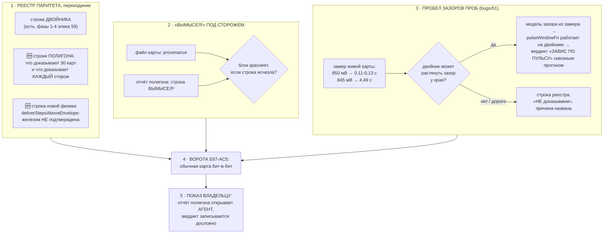

# План 72 — эпик 67, фаза 5: ПАРИТЕТ-2 И ПРИЁМКА ВЛАДЕЛЬЦА

> Оперплан ПОСЛЕДНЕЙ фазы эпика 67. Мета-план — `plans/67`; фаза 4 закрыта
> (`plans/71_DONE`: пакет 30/30 чисто за 24,3 мин, три ловушки краснят 3 из 3).
> Реестр паритета, который здесь переиздаётся, живёт в `plans/59` § Реестр паритета.

---

## Вектор цели

**Боль.** Полигон научился ловить, и это опасно ровно настолько, насколько убедительно. Тридцать
зелёных карт читаются как «движок верен», хотя доказывают они другое и меньшее: что на широком поле
поведений шесть сторожей честности не нашли нарушения инвариантов. **Пока граница написана только в
голове агента, следующая сессия — или владелец — прочтёт зелёный шире, чем он есть.** Вторая боль
названа в эстафете сессии 63 и до сих пор открыта: **у двойника есть измеренная способность, которую
он не воспроизводит** — зазоры проб телеметрии у края (`bugs/61`), и потому целая ветка вердикта
ступени на вымысле не проверяется вовсе.

**Куда хотим.** Реестр паритета переиздан так, что каждая строка про двойника И про полигон несёт
вердикт, свидетеля и границу; строка происхождения «вымысел²» стоит в каждом выходе не по
дисциплине агента, а под сторожем; пробел по зазорам проб либо закрыт моделью из живого замера, либо
записан отказом прямым текстом. Владелец видит отчёт полигона и говорит, читается ли он.

**Тип цели:** Achieve (реестр и сторожа) + Maintain (граница «вымысел²» не размывается со временем).

---

## Критерии приёмки — счётные

- **P72-AC1 — реестр паритета переиздан и покрывает ПОЛИГОН.**
  *Шкала:* число строк реестра, у которых есть все три поля (вердикт · свидетель · граница модели).
  *Прибор:* чтение таблицы `plans/59` § Реестр паритета + сверка списка сторожей полигона.
  *Цель:* строк без свидетеля — **0**; каждый из шести сторожей полигона (И1…И6) назван в реестре
  строкой «доказан красным / не доказан, и почему».
- **P72-AC2 — «вымысел²» под сторожем, а не под дисциплиной.** Набор ОБЯЗАН краснеть, если строка
  происхождения исчезает из файла сгенерированной карты или из отчёта полигона.
  *Прибор:* мутация, снимающая строку. *Цель:* мутация красит блок; на здоровом коде блок зелёный.
- **P72-AC3 — пробел по зазорам проб ЗАКРЫТ решением, а не молчанием.** Ровно один из двух исходов,
  и он записан в реестр строкой: **(а)** двойник растягивает зазоры проб у края, ветка `bugs/61`
  проходит сквозным прогоном; **(б)** строка реестра говорит «НЕ доказываем» с названной причиной.
  *Прибор:* при (а) — сквозной прогон с вердиктом «ЗАВИС ПО ПУЛЬСУ СЭМПЛЕРА»; при (б) — строка.
- **P72-AC4 — обычная карта не сдвинулась** (E67-AC5, ворота каждой фазы): твин-прогон `rtx5070ti`
  без новых флагов бит-в-бит, батарея зелёная.
- **P72-AC5 — отчёт полигона показан владельцу и его слово записано** (E67-AC7).
  *Прибор:* его вердикт в этом файле дословно. *Цель:* сказан. **Показ — действие агента, не ссылка.**
- **P72-AC6 — «Решения без владельца» заполнены** в этом плане и в закрываемых тикетах.

---

## Механизм

---

## Шаги

- [ ] **1. Опись того, что доказал полигон — по сторожам, а не «в целом».** Взять таблицу из
      `bugs/69_DONE` (доказан красным / не доказуем картой / уровень предохранителя / свойство
      пакета) и перенести в реестр `plans/59` строками. Правило реестра не меняется: ни одной
      строки без свидетеля.
- [ ] **2. Строка новой физики в реестр.** `deliverStepsAboveEnvelope` завёлся решением владельца и
      железом НЕ подтверждён — реестр обязан нести это прямым текстом, иначе через месяц он читается
      как замер (`interviews/019`, карточка происхождения в коде).
- [ ] **3. Сторож на «вымысел²».** Сегодня строка стоит в обоих выходах, но её ничто не держит:
      удали — и никто не покраснеет. Блок + мутация на каждый носитель (файл карты · отчёт).
- [ ] **4. Развилка зазоров проб.** Сперва ЗАМЕР осуществимости: у двойника прожиг уже режется на
      секунды (`burnRealSeconds`), а порог `PULSE_STALL_MS = 2130` мс — значит модель зазора должна
      уметь давать паузу свыше двух секунд у края. Если это выходит без новой сущности — сделать;
      если требует второй модели времени — записать отказ строкой и объяснить чем.
- [ ] **5. Ворота E67-AC5 + полная батарея** (тем же способом, что в `plans/71` §Шаг 7: два прогона
      одной команды на двух версиях кода, сверка доказана красным по чужому механизму).
- [ ] **6. Показ владельцу и его слово.** Агент ОТКРЫВАЕТ отчёт (показ — действие, не ссылка;
      `AGENT_GUIDE.md`), вердикт записывается сюда дословно. Это последний шаг эпика.

---

## Проверка наблюдением (не «должно работать»)

| что утверждаем | чем смотрим |
|---|---|
| реестр покрывает полигон | каждый из И1…И6 находится в таблице поиском по имени |
| «вымысел²» не может тихо исчезнуть | мутация снимает строку → блок краснеет |
| ветка `bugs/61` проверяема на вымысле (если (а)) | сквозной прогон печатает «ЗАВИС ПО ПУЛЬСУ СЭМПЛЕРА» |
| обычная карта не сдвинулась | два прогона одной команды на двух версиях, документ 389/389 |
| владелец прочитал отчёт | его слово в этом файле |

---

## Риски (Мёрфи, по ярусам)

1. **🔴 Реестр станет отчётом об успехах.** Строка «доказывает» пишется легче строки «не
   доказывает», а ценность реестра ровно во вторых. *Реакция:* строки «НЕ доказывает» переносятся
   ПЕРВЫМИ, до всех остальных, и их число называется в итоге числом.
2. **🟠 Модель зазора проб окажется второй моделью времени.** У двойника уже есть время прожига,
   каденция запусков и тепловая постоянная; четвёртая шкала времени, не связанная с ними, будет
   давать красивые числа и лгать о причине. *Реакция:* зазор выводится ИЗ существующей модели края
   (у края прожиг деградирует — оттуда и пауза), а не заводится параметром; если не выводится —
   исход (б), и это честный результат шага, а не провал.
3. **🟠 Сторож «вымысел²» окажется проверкой подстроки.** Короткая подстрока зазеленеет на чужой
   строке. *Реакция:* сверять ПОЛНУЮ форму с семенем и амплитудой, как требует E67-AC6.
4. **🟡 Показ владельцу упрётся в его время.** *Реакция:* отчёт готовится и открывается агентом; до
   слова владельца фаза остаётся 🟡, а не объявляется закрытой.

---

## Решения, принятые без владельца

<!-- заполняется при закрытии -->
