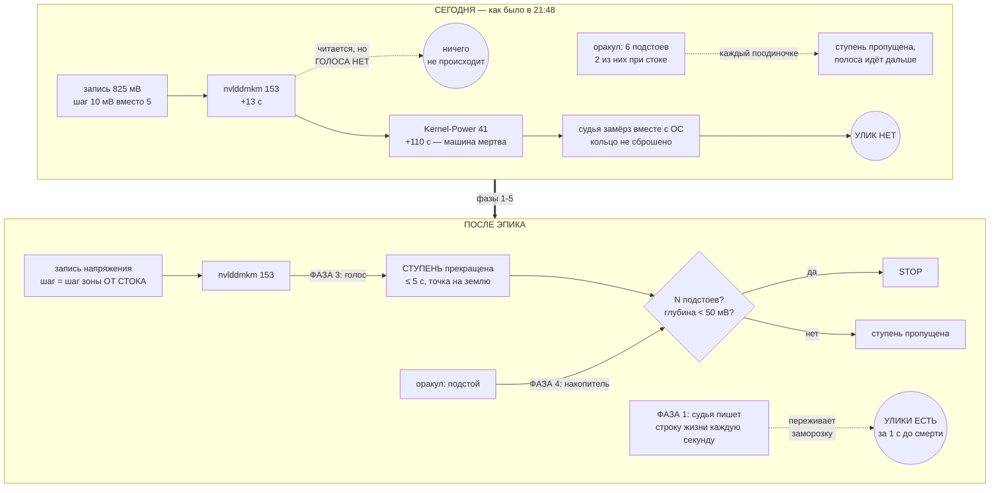

# Эпик 73 — Зависание перестаёт быть слепым: чёрный ящик, голос драйвера, накопитель и шаг от стока

> **Создан:** 2026-08-30, ночь, сразу после инцидента (агент, по прямому слову владельца: *«пиши
> операционные планы, баги, импрувменты - всё, что нужно, по сегодняшнему инциденту, чтобы это
> исправить»*)
> **Родитель:** `bugs/76` (разбор инцидента с форензикой) · `GOAL.md` → «🔴 ЗАВИСАНИЕ — НЕ НОРМАЛЬНОЕ
> СОБЫТИЕ, А НАШ ПРОВАЛ» (канон, данный владельцем за два часа ДО инцидента) ·
> `GPU_TUNING_RAILS.md` → S4
> **Статус:** 🟢 РАСПЛАНИРОВАН 2026-08-30, ни строки кода. Фаза 1 ждёт исполнения.
> **Карта:** фазы 1–4 офлайн, карта не нужна. Фаза 5 — живая, при владельце.

---

## 0. Одна страница для владельца

**Что случилось.** 2026-08-30 в 21:48 машина зависла на 2752 МГц / 825 мВ. Предохранитель молчал.
Разбирать оказалось почти нечем: журнал судьи 0 байт, кольца нет вовсе. Ваши слова: *«Запустили
тестовый полёт, разбили самолёт, и логов не сняли, так как чёрный ящик не работает»*.

**Что строим.** Не «более строгий сторож» — вы это запретили заранее. Строим три вещи, которых не
было, и чиним одну, которая была неверна:

| # | Чего не было | Что даёт |
|---|---|---|
| 1 | **Чёрного ящика, переживающего смерть** | следующий инцидент будет разбираемым. Сейчас — нет |
| 2 | **Голоса у драйвера** | ~~у нас было **110 секунд**~~ — **число опровергнуто замером 2026-08-31 (`researches/30` §0): 110 с это время до перезагрузки ВЛАДЕЛЬЦЕМ.** Настоящее окно 30.08 — **0,134 с** и отрицательное по смыслу; но на смерти 23.08 оно было **28 с**, и прогон потратил их на шаг вглубь. Фаза нужна, обещание — «голос успевает в двух смертях из четырёх», а не «в каждой» |
| 3 | **Накопителя предупреждений** | оракул предупредил **шесть раз**, два из них — шестисекундные подстои при почти стоковом напряжении; каждое обработано поодиночке и забыто |
| 4 | ~~Шага от стока~~ | 🔴 **ЗАМЕР 2026-08-31 ОПРОВЕРГ И ЭТО:** шаг от стока отмерялся всегда (журнал 30.08 печатает зону 5 на глубине 175). Последний шаг был 10 мВ, потому что **у карты нет 830 мВ** — 32 зазора по 10 из 127 точек сетки. Что делать на таком шаге — `interviews/021` |

## 0a. 🔴 ДВЕ РОЛИ, КОТОРЫЕ АГЕНТ СМЕШАЛ, И ТОЛЬКО ОДНА ИЗ НИХ НЕВОЗМОЖНА

Вопрос владельца дословно: *«судья живёт на той же машине — и что из этого следует? Что физически
невозможно этой же машиной видеть приближение края и спасти комп от зависания? Это невозможно? Я
ставлю невыполнимую физически задачу?»*

**Нет. Задача выполнима, и половина её уже работает — просто её выход никуда не подключён.**

| роль | что делает | на той же машине |
|---|---|---|
| **Deadman — КОНСТАТАЦИЯ** | «машина уже мертва → спасай карту» | **НЕВОЗМОЖНО.** Судья — процесс на этой же ОС; встала ОС — встал судья. Свойство устройства |
| **Оракул — ПРЕДСКАЗАНИЕ** | «машина ИДЁТ к смерти → встань ДО неё» | **ВОЗМОЖНО, и доказано уликами этого инцидента** |

**Доказательство — из логов 30 августа, а не из рассуждения.** Машина, будучи полностью живой,
своими собственными приборами УВИДЕЛА, НАЗВАЛА и ЗАПИСАЛА:

- шесть подстоев пульса сэмплера, два из них по ~6 с при глубине −20…−25 мВ от стока;
- `nvlddmkm` 153 в 21:48:34 и 153 + 14 в 21:48:39 — за 110 секунд до ПЕРЕЗАГРУЗКИ (🔴 не до смерти:
  замер 2026-08-31, `researches/30` §0, — окно до последнего вздоха наших приборов было 0,134 с).

Способности видеть ей хватило с запасом почти в две минуты. **Не хватило ПРАВА остановиться по
увиденному.** Поэтому эпик — не про «сделать невозможное», а про то, чтобы соединить уже
работающие глаза с уже работающими руками.

**Единственный физически безнадёжный случай** — мгновенный полный клин без предупреждения, когда
действовать некогда в принципе. Сегодняшний инцидент был противоположностью такого случая, и
доля таких случаев — величина, которую надо ЗАМЕРИТЬ (`researches/26`), а не назначить.

**Чего этот эпик НЕ обещает.** Что зависаний не будет вовсе: для мгновенного клина внутримашинного
средства нет, и честный ответ на него — сторож ВНЕ этой ОС (отдельная машина или аппаратный
таймер), а это отдельный предмет с отдельной ценой. Эпик обещает: **каждое зависание с
предупреждением встречается остановкой, а каждое случившееся — оставляет улики.**

## 1. Вектор цели и критерии приёмки

**Вектор (Achieve + Avoid):** зависание машины при тюнинге перестаёт быть событием, о котором мы
узнаём только от владельца и о котором нечего сказать. Избегаем: слепого инцидента, продолжения
спуска поверх предупреждений, шага крупнее политики.

| # | Критерий | Шкала · Прибор · Порог |
|---|---|---|
| **E73-AC1** | След судьи ПЕРЕЖИВАЕТ смерть машины | Шкала: возраст последней записи судьи на диске относительно момента смерти · Прибор: смоделированная смерть на стенде (убийство всего дерева процессов без штатного закрытия) · **Порог: ≤ 1,5 с. Сегодня — файла нет вовсе** |
| **E73-AC2** | Шаг спуска НИКОГДА не крупнее шага зоны, вычисленной ОТ СТОКА, **И НЕ ВЫНУЖДЕН СЕТКОЙ КАРТЫ** | Шкала: таких ступеней · Прибор: лестница по СНЯТОЙ сетке карты + сухой прогон полосы + блоки · **Порог: 0 — ✅ ВЗЯТ 2026-08-31.** ⚠️ Оговорка добавлена ЗАМЕРОМ: у этой карты 32 зазора по 10 мВ из 127 точек (830 · 855 · 880 · 805 отсутствуют), и на глубине, где политика просит 5 мВ, прежний порог 0 недостижим физически. Что делать на таком шаге — развилка владельца, `interviews/021` |
| **E73-AC3** | Серия ошибок `nvlddmkm` во время прогона ПРЕКРАЩАЕТ СТУПЕНЬ (о полосе решает накопитель) | Шкала: секунд от подложенных событий до РЕШЕНИЯ · Прибор: живая дорога доставки `EventLogWatcher`, `npm run drivervoice -- --bench-latency` · **Порог: ≤ 5 с. ВЗЯТ 2026-08-31: 291 · 302 · 284 мс тремя замерами** ⚠️ Формулировка исправлена с «останавливает ПОЛОСУ» замером архива (`researches/30` §2.1): остановка полосы дала бы две ложные остановки за семь дней прогонов, прекращение ступени — ноль |
| **E73-AC4** | Подстои оракула СКЛАДЫВАЮТСЯ в решение | Шкала: подстоев подряд до остановки полосы · Прибор: журнал прогона · **Порог: полоса встаёт и зовёт владельца; сегодня — 6 подстоев, 0 остановок** |
| **E73-AC5** | Подстой при глубине < 50 мВ от стока трактуется как нездоровье МАШИНЫ, а не край точки | Шкала: таких подстоев, закрытых как «край» · **Порог: 0. Сегодня — 2 из 2 закрыты пропуском ступени** |
| **E73-AC6** | Нигде не написано «предохранитель доказан» без класса, против которого доказан | Шкала: вхождений без класса рядом · Прибор: греп по `plans/` `bugs/` `STATUS.md` · **Порог: 0** |
| **E73-AC7** | Ноль записей в GPU за фазы 1–4 | Шкала: записей в карту · Прибор: `watchdog --status` до и после · **Порог: 0** |

## 2. Механизм — что и куда встраивается

## 3. Фазы, ворота и порядок — почему именно такой

Ворота — то, что должно быть ИСТИННО, а не сделано.

| Фаза | Предмет | Вход | Выход |
|---|---|---|---|
| **1** | **Чёрный ящик, переживающий смерть** (`bugs/78`) | `npm run check` зелёный | E73-AC1 взят: смоделированная смерть оставляет след ≤ 1,5 с. Доказано КРАСНЫМ — на старом коде след отсутствует |
| **2** | **Шаг от стока** (`bugs/77`) | фаза 1 закрыта | ✅ **ЗАКРЫТА 2026-08-31 — И ЕЁ ДИАГНОЗ ОКАЗАЛСЯ НЕВЕРЕН.** Зона всегда считалась от стока; шаг 10 мВ вынудила СЕТКА КАРТЫ (830 мВ у неё нет). Починено настоящее: прибор называл ложную причину. E73-AC2 взят в исправленной редакции; открыты `interviews/021` и `bugs/85` |
| **3** | **Голос драйвера** (`bugs/79`) | ~~фаза 2 закрыта~~ — порядок изменён СЛОВОМ ВЛАДЕЛЬЦА 2026-08-31 («bugs/79 → bugs/77») | ✅ **ЗАКРЫТА 2026-08-31:** E73-AC3 взят (291 мс), R4b-signal переписан, попутно найден и закрыт `bugs/84` — накопитель фазы 4 не получал НИ ОДНОЙ записи на живом пути |
| **4** | **Накопитель подстоев** (`bugs/80`) | фаза 3 закрыта | E73-AC4 и AC5 взяты |
| **5** | **Честная граница + живая приёмка** | фазы 1–4 закрыты · **владелец за машиной (S1)** | E73-AC6 взят; живой прогон той же полосы 2887…2745 при владельце |

**Почему чёрный ящик первым, а не голос драйвера, хотя голос — больший рычаг.** Потому что фазы
2–4 нечем будет ПРОВЕРИТЬ. Сегодняшний инцидент показал ровно это: три независимых дефекта, и по
двум из них точного ответа из улик не существует, потому что улики уничтожило само событие. Пока
инструмент разбора слеп, любая починка — заявление, а не измерение. Это прямое следствие
`TESTING_FRAMEWORK.md`: наблюдение, а не вывод из чтения диффа.

**Почему шаг от стока второй, хотя он самый маленький.** Слово владельца дословно: *«Шаг всегда
должен отмеряться от стока... это же очевидно»*. Решение принято, обсуждать нечего, цена — часы.
Идёт сразу после того, как появится чем доказать.

## 4. Риски, названные вслух

- **(а) Непрерывная запись судьи начнёт мешать самому судье.** Такт судьи — 2 мс; `fsync` на каждом
  такте недопустим, и комментарий в коде («the ring is forensics, not the control loop») написан
  ровно про это и был прав. **Смягчение:** пишется НЕ каждый такт, а агрегат раз в секунду —
  одна строка, несущая «жив, тактов N, худшее молчание M». Одна строка в секунду не мешает никому,
  а на вопрос «жил ли судья в 21:48:34» отвечает окончательно.
- **(б) Голос драйвера начнёт ронять здоровые прогоны.** `nvlddmkm` шумит и на исправной машине.
  **Смягчение:** голос даётся не «любой ошибке», а классам, замеренным на этой машине; первым
  шагом фазы 3 идёт ЗАМЕР фона канала за месяц, как это уже сделано для пульса сэмплера
  («2 × максимум фона»). И граница владельца: *«сторож должен не ронять инструмент, а подсказывать»*.
- **(в) Соблазн «сделать предохранитель строже» вместо перечисленного.** Прямо запрещено словом
  владельца (`GOAL.md` → «🏗 ЗДАНИЕ ВАЖНЕЕ ЛЕСОВ»). Ни одна фаза не имеет права добавлять отказов
  прогона без замера, показывающего, что отказ дешевле пропуска.
- **(г) Стенд не умеет заморозить хост.** Двойник по построению не замораживает машину, на которой
  живёт, — поэтому класс «зависание машины» на нём недоказуем, и сегодняшние 9/9 доказывали ДРУГОЙ
  класс. **Смягчение:** фаза 1 моделирует смерть убийством всего дерева процессов без штатного
  закрытия — это не заморозка, но по отношению к чёрному ящику даёт тот же эффект (нет ни трипа, ни
  закрытия). Что этого НЕ хватает для полной верности — записывается честно, а не заминается.

## 5. Что этот эпик НЕ трогает

- **Не делает предохранитель строже** (риск в).
- **Не переписывает вердикты.** Зависание остаётся вердиктом первого класса; меняется, что мы
  делаем ДО него и что знаем ПОСЛЕ.
- **Не отменяет двойника.** Он остаётся стендом для класса «смерть писателя», который реален и
  которым закрыты `bugs/19` · `20` · `21`. Меняется одно: рядом со словом «доказан» теперь обязан
  стоять класс.

## 6. Дети

| Фаза | Операционный план | Тикет |
|---|---|---|
| 1 | `plans/74` — написан | `bugs/78` |
| 2 | пишется при закрытии фазы 1 | `bugs/77` |
| 3 | пишется при закрытии фазы 2 | `bugs/79` |
| 4 | пишется при закрытии фазы 3 | `bugs/80` |
| 5 | пишется при закрытии фазы 4 | — |

## 7. Связи

`bugs/76` (форензика инцидента — родительский документ) · `bugs/75` (тревога «ЗАМЕРЛО» того же
прогона) · `bugs/03` (первое зависание, 5 ч 40 мин) · `bugs/23` (пол зависания) · `bugs/37` (архив
теряется, когда машина умирает — та же семья, что фаза 1) · `bugs/43` (зависания портили диски;
безопасный режим сегодня сработал) · `bugs/61` (пульс сэмплера как вердикт) ·
`PROJECT_ARCHITECTURE_INTERNAL_MAP.md` → R4a-pulse · R4b-signal · `plans/51` (эпик предохранителя) ·
`plans/58` · `plans/63`
