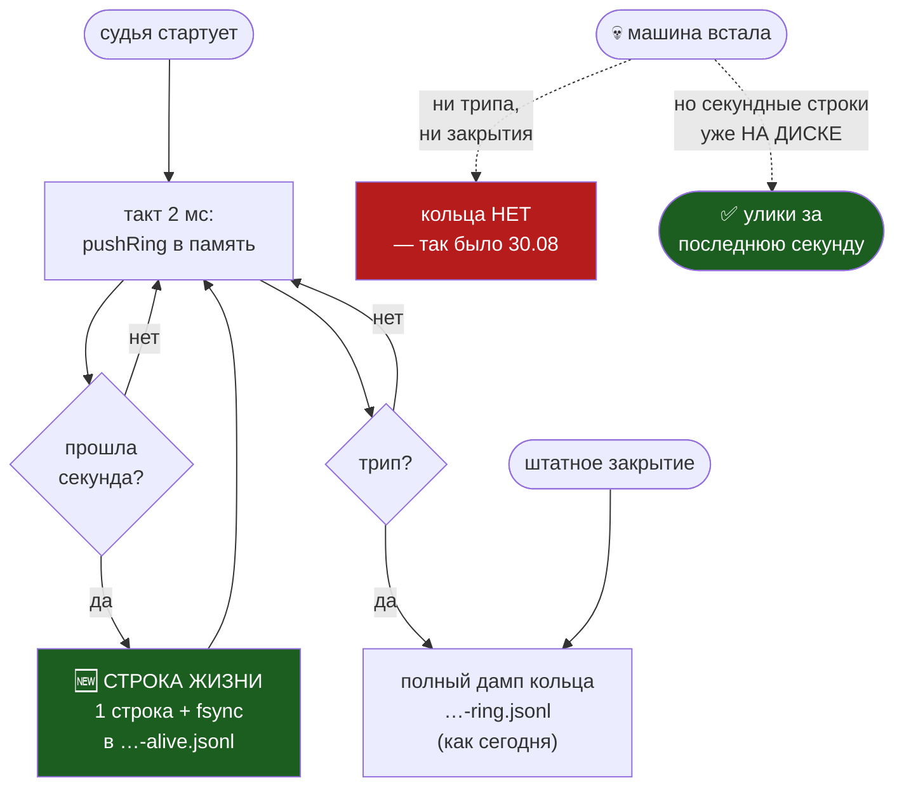

# План 74 — Эпик 73 / Фаза 1: чёрный ящик, который переживает смерть машины

> **Создан:** 2026-08-30, ночь · **Родитель-эпик:** `plans/73` — фаза 1
> **Тикет:** `bugs/78` · **Разведка:** `researches/26` §4.3 · **Инцидент:** `bugs/76`
> **Статус:** 🔲 ОТКРЫТ, ни строки кода. **Ворота входа: `npm run check` зелёный** (выполнено).
> **НОЛЬ ЗАПИСЕЙ В GPU за всю фазу** — карта не участвует ни на одном шаге, владелец не нужен.
> **Тестовая документация:** `testcases/TC_fuse_blackbox_survives_death.md`

---

## 0. Зачем эта фаза идёт ПЕРВОЙ, хотя не самая ценная

Самый большой рычаг эпика — голос драйверу (`bugs/79`, 110 секунд). Но он идёт третьим, и вот
почему: **фазы 2–4 нечем будет проверить.** Сегодняшний инцидент дал три независимых дефекта, и по
двум из них точного ответа из улик не существует — улики уничтожило само событие. Пока прибор
разбора слеп, любая следующая починка будет ЗАЯВЛЕНИЕМ, а не измерением
(`TESTING_FRAMEWORK.md`: наблюдение, а не вывод из чтения диффа).

Владелец сформулировал это точнее меня: *«Запустили тестовый полёт, разбили самолёт, и логов не
сняли, так как чёрный ящик не работает»*. Сперва самописец, потом всё остальное.

## 1. Вектор цели и критерии приёмки

**Вектор (Achieve):** после смерти машины на диске есть след судьи, покрывающий последние секунды
перед ней.

| # | Критерий | Шкала · Прибор · Порог |
|---|---|---|
| **P74-AC1** | След судьи переживает смерть без штатного закрытия | возраст последней записи относительно момента убийства · блок с убийством всего дерева процессов · **≤ 1,5 с** |
| **P74-AC2** | Проверка ДОКАЗАНА КРАСНЫМ на сегодняшнем коде | результат блока на коде до правки · **красный.** Зелёный блок здесь = блок ничего не проверяет |
| **P74-AC3** | Судья не замедлился | распределение `gapMs` до и после на одинаковом прогоне двойника · **сдвиг медианы ≤ 5 %** |
| **P74-AC4** | Строка жизни отвечает на вопрос разбора | содержит: метка времени · `t` · тактов за секунду · худшие `gapMs`, `beatSilenceMs`, `progressSilenceMs` · **все шесть полей непусты** |
| **P74-AC5** | Полный дамп кольца НЕ сломан | репетиция `--rehearse-death strangle` по-прежнему пишет кольцо · **≥ 1500 тактов, как сегодня** |
| **P74-AC6** | Ноль записей в GPU | `watchdog --status` до и после · **0** |

## 2. Механизм



**Ключ решения:** ничего не отнимается. Полный дамп кольца остаётся ровно таким, как есть, — он даёт
разрешение 2 мс там, где есть кому его записать. Добавляется дешёвый непрерывный слой, который
переживает то, чего дамп не переживает.

## 3. Шаги

- [x] **3.1 — Замер ДО правки (базовая линия).** `--rehearse-death strangle --no-window` на двойнике,
      2026-08-30 23:43, песочница `benches/runs/twin-2026-08-30T23-43-44-03-00`:

      | величина | значение |
      |---|---|
      | тактов кольца | **1800** |
      | `gapMs` медиана | **2,49 мс** |
      | `gapMs` p95 | **3,45 мс** |
      | `gapMs` p99 | **4,28 мс** |
      | `gapMs` максимум | **5,03 мс** |
      | проверок репетиции | **9 из 9 ✅** |

      Порог P74-AC3 отсюда: сдвиг медианы ≤ 5 % — значит после правки медиана ≤ **2,61 мс**.

- [x] **3.2 — Блок, который СЕЙЧАС КРАСНЫЙ (P74-AC2). ✅ ИСПОЛНЕНО, K1 УПАЛ.**
      Блок поднимает НАСТОЯЩИЙ процесс судьи (`--judge --out <песочница> --seconds 60`, НЕ взведён —
      трипа быть не должно), даёт ему 3,5 с, убивает дерево `taskkill /PID /T /F` и читает
      `…-alive.jsonl`. Прогон `node automation-engine/lib/fuse.mjs --selftest`, 2026-08-30 23:5x,
      **дословно:**

      ```
      ❌ C1 след судьи ПЕРЕЖИЛ смерть без штатного закрытия — строк 0, возраст последней файла нет (порог 1500 мс)
      ❌ C2 строка жизни несёт шесть полей разбора (метка времени · t · тактов · три худших молчания)
      ✅ C7 кольца после смерти без закрытия НЕТ — потеря признана, а не замаскирована
      ИТОГ: 55 зелёных, 2 красных.
      ```

      **Это и есть доказательство, что проверка что-то проверяет** (риск «б» плана снят: блок НЕ
      оказался зелёным). C7 зелёный с самого начала и это правильно: он фиксирует ЧЕСТНУЮ границу —
      кольцо после смерти без закрытия действительно теряется, и мы этого не маскируем, а признаём.

      ⚠️ **Граница честности записана в коде блока:** `taskkill /T /F` — смерть ПРОЦЕССА, а не
      заморозка ХОСТА. По отношению к чёрному ящику эффект тот же (ни трипа, ни закрытия), но класс
      «машина замёрзла» этим НЕ доказан, и утверждать обратное — ровно ошибка 30 августа.
- [x] **3.3 — Строка жизни. ✅** `@forensic fuse-alive`, `DURABLE-AT: every-second`. Накопитель
      (тактов, три худших молчания) едет В САМОМ ТАКТЕ, без второго таймера: второй таймер способен
      жить, когда такт уже встал, и написать «судья жив» про мёртвого судью. Сброс одной строкой с
      немедленным `fsync`. Окно двигается ОТ ПРЕДЫДУЩЕЙ ГРАНИЦЫ, иначе задержка такта копилась бы
      в дрейф; проспанные окна не порождают пустых строк.
- [x] **3.4 — Блок позеленел. ✅** `✅ C1 … строк 3, возраст последней 443 мс (порог 1500 мс)`.
      **57 зелёных, 0 красных.**
- [x] **3.5 — Мутации. ✅ ЧЕТЫРЕ, и одна из них — находка.**

      | мутация | ожидание | результат |
      |---|---|---|
      | **K2** запись только при трипе/закрытии | 🔴 | 🔴 C1+C2, **55/2 — ровно свои блоки** |
      | **K4** окно 60 с вместо секунды | 🔴 | 🔴 C1+C2, 55/2 |
      | **K5** выдуманный ноль вместо честного `null` | 🔴 | 🔴 **только C2**, 56/1 |
      | **K3** снять `fsync`, оставить `write` | 🔴 | ✅ **57/0 — СТЕНД НЕ ВИДИТ РАЗНИЦЫ** |

      🔴 **K3 — зазор, а не успех, и он объявлен полем `GAP` прямо в маркере.** `taskkill /T /F`
      убивает ПРОЦЕСС, а не ОС: байты уже отданы ядру, кэш страниц переживает смерть процесса.
      Потерю кэша даёт только настоящая смерть МАШИНЫ, недостижимая на двойнике. Значит доказано
      свойство «строка пишется раз в секунду и переживает отсутствие штатного закрытия», а НЕ
      «улика переживает зависание хоста». Второе стоит на отраслевой практике и на `bugs/37`
      (кэш страниц уже съел архив пульса на ЭТОЙ машине), но не на нашем замере.

      🆕 **Побочная находка о самом механизме М3:** поля `GAP` у `@forensic` не требует НИ ОДНО
      правило линтера — сторож формы не спрашивает самописца, чего его доказательство не
      покрывает. Поле поставлено вручную; дыра записана в §6.

- [x] **3.6 — Замер ПОСЛЕ (P74-AC3). ✅ ВЗЯТО, но метод пришлось исправить по ходу.**

      | код | медианы `gapMs`, три прогона | среднее | p95 |
      |---|---|---|---|
      | ДО правки | 2,10 · 2,14 · 2,21 | **2,15** | 3,04–3,21 |
      | ПОСЛЕ | 2,21 · 2,12 · 2,41 | **2,25** | 3,06–3,15 |

      Сдвиг средних **+4,7 %** при пороге 5 % — **взято**. Честная оговорка: распределения
      перекрываются, n = 3 с каждой стороны, и правильная формулировка не «стало на 4,7 % медленнее»,
      а **«замедления не обнаружено: эффект, если он есть, меньше собственного разброса прибора»**.
      p95 не сдвинулся вовсе.

      🔴 **ПРИБОР ПРИШЛОСЬ ЧИНИТЬ ПОСРЕДИ ШАГА.** Базовая линия шага 3.1 (медиана 2,49) — ОДИН
      прогон на холодной машине, и он оказался выбросом: три честных прогона того же кода дали
      2,10–2,21. По линии из одного прогона «после» выглядело бы на 11 % БЫСТРЕЕ, то есть замер
      показал бы улучшение там, где его нет. Переизмерение развернуло знак. Метод AC3 исправлен:
      **три прогона с каждой стороны, сравнение средних, разброс назван вслух** — сравнивать два
      одиночных прогона нельзя, когда собственный разброс прибора (~13 %) больше искомого эффекта
      (5 %). Это канон `GOAL.md` («утверждение о РАЗНИЦЕ позволено только после того, как измерен
      собственный разброс прибора»), применённый к самому себе.

- [x] **3.7 — Кольцо не сломано (P74-AC5). ✅** `--rehearse-death strangle`: **1823 такта** (≥ 1500),
      все 9 проверок репетиции зелёные. Строка жизни при этом пишется и НА РЕАЛЬНОМ ПУТИ двойника,
      не только в наборе: 5 строк, поля заполнены, `worstBeatSilenceMs` несёт настоящее число
      (17,89 мс), `worstProgressSilenceMs` — честный `null`.
- [x] **3.8 — Канал драйвера. ✅ РАЗОБРАН. Ответ: молчал ЗАКОННО — и именно поэтому он бесполезен.**

      `death-watch.mjs` → `runWatcher`: строка пишется **только когда `verdict.record`**, то есть
      когда промах такта превысил `RECORD_THRESHOLD_MS = 10`. Каждая такая строка честно
      `fsync`-ается (комментарий у места: *«a machine death takes the page cache with it; the line
      must not»*). Записи он НЕ терял — их просто не было: за те четыре минуты ни один такт не
      промахнулся на 10 мс.

      🔴 **И это ровно та же болезнь, что у кольца, только этажом выше: МОЛЧАНИЕ ДВУСМЫСЛЕННО.**
      Канал, пишущий только аномалии, не отличает «аномалий не было» от «проба умерла». В те
      110 секунд между первым криком драйвера и смертью машины его молчание могло означать оба, и
      разбор не может сказать, какое именно. Итоговая сводка (`ПРОБА ЗАКОНЧИЛА: тактов N/M`)
      печатается при ШТАТНОМ выходе — то есть ровно тогда, когда она не нужна. Это тот же капкан,
      что убил кольцо.

      **Лечение то же — периодическая строка жизни, и оно НЕ делается здесь:** «одна фаза — один
      предмет» (риск «в» этого плана). Заведено отдельным тикетом **`bugs/83`**.
- [x] **3.9 — Батарея и ворота. ✅** `npm run check` код 0 · `npm run selftest:all`: **42 набора,
      красных 0, зелёных блоков 2072** (набор `fuse` 54 → 57) · `watchdog --status`:
      **СТОРОЖ НЕ ВЗВЕДЁН** — записей в GPU за всю фазу ноль (P74-AC6 ✅).

## 4. Риски

- **(а) Строка в секунду всё-таки помешает такту.** Смягчение: замер 3.1/3.6 — ворота, а не
  формальность. Если помешает — писать раз в 2 с; вопрос «жил ли судья» это не портит.
- **(б) Блок 3.2 окажется зелёным на текущем коде.** Это означало бы, что он проверяет не то, что
  нужно. **Тогда останавливаться и переписывать блок, а не радоваться** (EXP-0181: ловушка обязана
  ловить).
- **(в) Соблазн заодно починить остальное из `bugs/76`.** Нельзя: одна фаза — один предмет.
  Шаг от стока — фаза 2, голос драйвера — фаза 3.

## 5. Выход фазы

Ворота фазы 2 открываются, когда: P74-AC1…AC6 взяты · блок доказан красным и зелёным · мутация
красит только свой блок · замер скорости судьи сошёлся · `/fable-judge` по фазе пройден с распиской
**в этом файле** (урок ревизии `bugs/25`: фаза без расписки судьи закрытой не считается).

## 6. Решения, принятые без владельца

1. **Молчание НЕПРОВЕДЁННОГО канала пишется честным `null`, а не нулём.** Ноль читался бы как
   «молчания не было» — утверждение о канале, которого никто не слушал. Выдуманное число в улике
   хуже отсутствующего (`PHILOSOPHY.md` → три двери). Решение защищено проверкой: мутация K5
   («заполнить нулями, чтобы было шесть из шести») краснеет.
2. **Проспанные окна не порождают пустых строк.** Догоняем до ближайшей будущей границы; факт
   проспанного времени виден в `worstGapMs` следующей строки. Пустые строки — шум, который в
   разборе читался бы как «секунда прошла, судья молчал».
3. **Окно двигается от предыдущей границы, а не от `now`** — иначе задержка такта копилась бы в
   дрейф, и «строка в секунду» незаметно стала бы строкой в полторы. Замерено: за 102 секунды
   накопилось 2,27 мс.
4. **`GAP` поставлен у `@forensic` вручную,** хотя ни одно правило линтера его там не требует
   (см. §8 — это дыра механизма М3, а не небрежность).
5. **Метод C5 (замер скорости) переписан посреди шага** на три прогона с каждой стороны, потому
   что собственный разброс прибора оказался больше искомого эффекта. Старый метод (два одиночных
   прогона) не был выполнен формально — он был НЕСПОСОБЕН дать ответ, и это выяснилось только
   после того, как первая базовая линия оказалась выбросом.
6. **Канал драйвера НЕ чинится в этой фазе,** хотя дефект найден и подтверждён (`bugs/83`):
   «одна фаза — один предмет», риск «в».

## 8. 🆕 Найдено по дороге — дыра в самом механизме М3

**У `@forensic` нет обязательного поля `GAP`.** `@guard` обязан объявить, чего его доказательство
НЕ покрывает; самописец — не обязан. Между тем именно у самописца зазор оказался самым важным
фактом фазы: `fsync` не доказан ничем, потому что стенд не умеет убить ОС (мутация K3 прошла
зелёной). Поле я поставил рукой; следующий автор его не поставит, и линтер промолчит.

**Это ровно чинимый эпиком класс, применённый к инструменту, который его чинит** — третий такой
случай за ночь после `bugs/81` и `bugs/82`. Кандидат в работу: сделать `GAP` обязательным для
`@forensic` (правило R9). Цена решения: существующий `@forensic fuse-ring` получит второе
нарушение и уедет в долг ещё одной строкой — а долг у него и так есть, и он осмысленный.
**Не сделано здесь по той же причине, что и `bugs/83`: одна фаза — один предмет.**

## 7. Связи

`plans/73` (эпик) · `bugs/78` (тикет) · `bugs/76` (инцидент) · `bugs/37` (та же болезнь, вылеченная
в другом месте) · `researches/26` · `testcases/TC_fuse_blackbox_survives_death.md` ·
`automation-engine/lib/fuse.mjs` → `dumpRing` · `automation-engine/lib/sweep-journal.mjs` (образец
`fsync` на каждом намерении)
