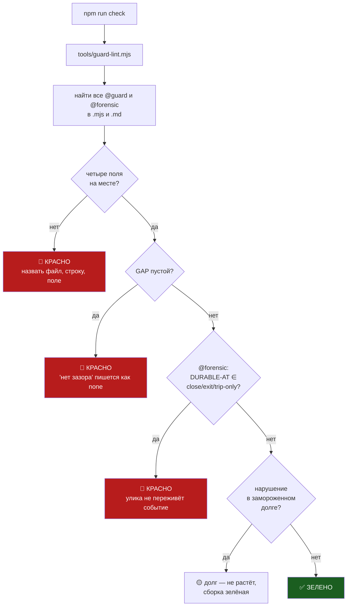

# План 75 — Сторож объявляет свою УГРОЗУ, иначе сборка краснеет

> **Создан:** 2026-08-30, ночь · **Слово владельца:** *«Чини этот ебанный класс, три разных
> механизма починки»* — все три предложенных механизма приняты.
> **Родитель:** `bugs/76` (инцидент) · `plans/73` (эпик) · **Статус:** 🔲 ОТКРЫТ, ни строки кода.
> **Карта не нужна.** Мораторий 017 Q1 снят словом владельца для этого предмета.

---

## 0. Класс, который чиним

**Сторож доказан против МОДЕЛИ угрозы, а не против угрозы.** Четыре сегодняшних провала — один
шаблон:

| сторож | доказан против | должен был |
|---|---|---|
| предохранитель | смерть ПРОЦЕССА на двойнике | зависание МАШИНЫ |
| чёрный ящик | чтение после ШТАТНОГО закрытия | смерть БЕЗ закрытия |
| оракул | ОДНО предупреждение | НАКОПЛЕНИЕ предупреждений |
| сторож шага S2 | ПЕРВЫЙ шаг | ЛЮБОЙ шаг |

**И канон это пропустил, хотя правило есть.** `TESTING_FRAMEWORK` требует доказывать сторожа
красным — мутации краснели честно. Но краснели **против нашей фикстуры, а фикстура моделировала
не ту угрозу.** Зелёная мутация дала уверенность вместо того, чтобы её отнять.

Владелец назвал это точнее: *«двигатель прошёл прожиг, все тесты зелёные — только его забыли
установить на ракету»*.

## 1. Вектор цели и критерии приёмки

**Вектор (Avoid):** невозможно завести сторожа, не назвав вслух угрозу, зазор доказательства и
факт наблюдения на реальном пути.

| # | Критерий | Шкала · Прибор · Порог |
|---|---|---|
| **P75-AC1** | Блок `@guard` без любого из четырёх полей валит сборку | нарушений, пропущенных линтером · фикстуры · **0** |
| **P75-AC2** | Пустой `GAP:` запрещён; «нет зазора» пишется словом `none` | **красный на пустом** |
| **P75-AC3** | `@forensic` с `DURABLE-AT: close` / `exit` / `trip-only` — красный | **красный**: улика, долговечная только при штатном конце, не улика |
| **P75-AC4** | Каждое правило доказано КРАСНЫМ на своей фикстуре | правил без красной фикстуры · **0** |
| **P75-AC5** | Известные нарушения не валят сборку, но не растут | долг заморожен файлом; новое нарушение · **красное** |
| **P75-AC6** | Первым размечен предохранитель — тот, что провалился | `@guard fuse-deadman` несёт честный `GAP` · **есть** |

## 2. Форма — четыре поля, и каждое отвечает на вопрос, который сегодня не был задан

```
@guard fuse-deadman
THREAT:         зависание машины при спуске (bugs/03, bugs/76)
PROVED-AGAINST: убийство процесса горна на двойнике (--rehearse-death strangle)
GAP:            двойник не может заморозить свой хост — класс «зависание машины» НЕ доказан
ON-REAL-PATH:   2026-08-30 — наблюдён на живом прогоне, трипов 0, машина зависла (bugs/76)
```

| поле | на какой вопрос отвечает | что было бы 28.08 |
|---|---|---|
| `THREAT` | ради какого РЕАЛЬНОГО события он существует | «зависание машины» |
| `PROVED-AGAINST` | что тест ДЕЙСТВИТЕЛЬНО делал | «убийство процесса» |
| `GAP` | чего доказательство НЕ покрывает | **«двойник не может заморозить хост»** ← эта строка сняла бы весь инцидент |
| `ON-REAL-PATH` | видели ли его работающим там, где ходит владелец | «NOT YET» |

Отдельный маркер для самописцев:

```
@forensic fuse-ring
EXPLAINS:    поведение судьи в момент смерти машины
DURABLE-AT:  every-second   ← close | exit | trip-only ЗАПРЕЩЕНЫ линтером
```

## 3. Механизм



**Почему долг, а не «починить всё сразу».** Разметить разом все сторожа проекта — это не вечер, а
неделя, и половина разметки будет написана вслепую. Приём проекта уже выбран и работает дважды
(ось G1, ось G12): **область и замороженный долг.** Долг не растёт, новое нарушение краснеет,
старое чинится по мере того, как трогаем.

## 4. Шаги

- [ ] **4.1 — Линтер `tools/guard-lint.mjs`** с четырьмя правилами и `--selftest`.
- [ ] **4.2 — Каждое правило ДОКАЗАНО КРАСНЫМ** на своей фикстуре (P75-AC4). Правило без красной
      фикстуры не считается написанным — это ровно тот урок, ради которого всё затеяно.
- [ ] **4.3 — Долг:** `runs/guard-lint-baseline.json`, заморозка текущего состояния.
- [ ] **4.4 — Врезать в `tools/check.mjs`** — в те же ворота, что ловят порчу кодировки.
- [ ] **4.5 — Разметить предохранитель** (`@guard fuse-deadman`) и кольцо (`@forensic fuse-ring`)
      — те двое, что провалились. Кольцо получит `DURABLE-AT: trip-only` → **линтер обязан
      покраснеть**, и это будет первым настоящим срабатыванием. Запись в долг с адресом `bugs/78`.
- [ ] **4.6 — Канон:** правило в `TESTING_FRAMEWORK.md` (обобщить ворота 6 со «после деплоя» на
      «после сборки сторожа») и в `BUG_FIXING_FRAMEWORK.md` (раздел Guards).
- [ ] **4.7 — Тикет в `bugs/KAIF/`** — класс не про KAGO, а про фреймворк.
- [ ] **4.8 — Батарея зелёная**, `npm run check` зелёный.

## 5. Риски

- **(а) Линтер станет бюрократией.** Смягчение: четыре поля, не десять; долг вместо «разметить всё»;
  срабатывает только на явном маркере `@guard`, а не на догадках о том, что такое сторож.
- **(б) `GAP: none` начнут писать не думая.** Не лечится машиной. Частично лечится тем, что поле
  обязательное и видно в ревью — это дешевле, чем ничего.
- **(в) Долг превратится в свалку.** Смягчение: каждая строка долга несёт адрес тикета, иначе
  запись в долг не принимается.

## 6. Связи

`bugs/76` · `bugs/78` · `plans/73` · `TESTING_FRAMEWORK.md` ворота 5 и 6 ·
`BUG_FIXING_FRAMEWORK.md` → Guards · `tools/questions-guard.mjs` (образец «область + долг») ·
EXP-0181 · EXP-0176
