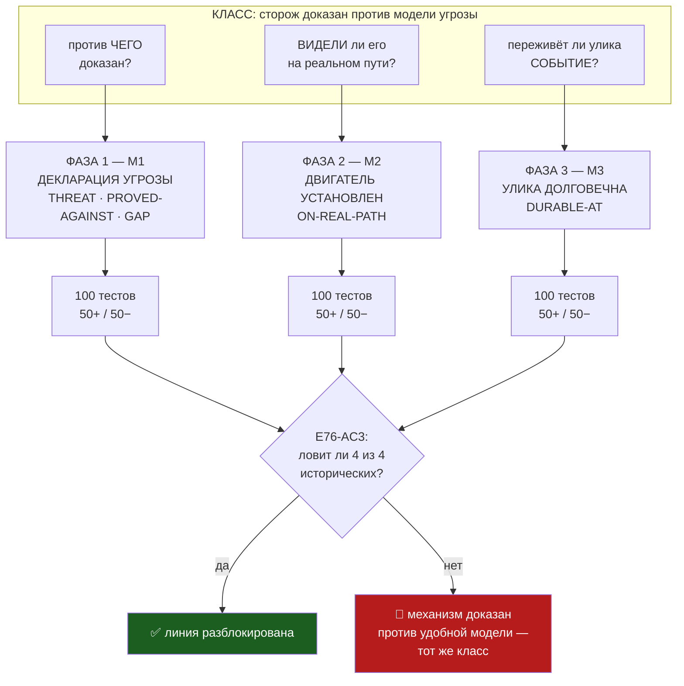

# Эпик 76 — Класс «сторож доказан против МОДЕЛИ угрозы»: остановка линии до его закрытия

> **Создан:** 2026-08-30, ночь, по прямому слову владельца после инцидента `bugs/76`.
> **Родитель:** `bugs/76` · `plans/73` · **Статус:** 🔴 **БЛОКИРУЮЩИЙ. Фазы 1 и 2 закрыты
> 2026-08-30; E76-AC1 взят всеми тремя механизмами; фазы 3–5 открыты. Следующая — фаза 3 (М3,
> долговечность улики), оперплан уже написан: `plans/74`.**
> **Карта не нужна ни на одной фазе. Владелец не нужен до приёмки** (развилка о линейке счёта
> закрыта его словом 2026-08-30: порог по A, B печатается рядом).
> **Вовне:** `bugs/KAIF/14` и `15` в origin (ждут `AUTH:`).
> **Дети:** `plans/75` (фаза 1) · `plans/77` (фаза 2) · `plans/74` (фаза 3, написан заранее).

---

## 0. Слово владельца — это решение об остановке линии

> *«Чини этот ебанный класс, три разных механизма починки»*
>
> *«100 тестов на каждый механизм» · «50 позитивных, 50 негативных»*
>
> *«мы не можем продолжать развивать проект, пока допускаются ошибки этого класса в принципе!»*

**Последняя фраза — не эмоция, а приоритет, и записана как таковой.** Пока эпик 76 не закрыт,
развитие продукта не идёт: ни новых фаз эпика 73, ни новых возможностей, ни живых прогонов ради
измерений. Разрешено ровно два вида работы: этот эпик и починка того, что ломает машину владельца.

**Аналогия владельца, которая называет класс точнее любого моего определения:**

> *«Ты словно строишь ракету, чтобы лететь в космос. Двигатель прошёл прожиг, все тесты зелёные —
> всё супер. Только потом выясняется маааааленькая проблемка — ты забыл его установить на ракету,
> которая уже на столе и пошёл обратный отсчёт.»*

## 1. Класс — определение и его четыре экземпляра за один вечер

**Сторож доказан против МОДЕЛИ угрозы, а не против самой угрозы; доказательство зелёное, и потому
никто не смотрит, что именно оно доказало.**

| сторож | доказан против | должен был | цена |
|---|---|---|---|
| предохранитель | смерть ПРОЦЕССА на двойнике | зависание МАШИНЫ | машина владельца, 30.08 |
| чёрный ящик | чтение после ШТАТНОГО закрытия | смерть БЕЗ закрытия | разбор инцидента невозможен |
| оракул | ОДНО предупреждение | НАКОПЛЕНИЕ предупреждений | 6 сигналов, 0 решений |
| сторож шага S2 | ПЕРВЫЙ шаг | ЛЮБОЙ шаг | шаг 10 мВ вместо 5 перед смертью |

### Почему канон не поймал — и это самое важное в тикете

`TESTING_FRAMEWORK.md`, ворота 5, требует: *«проверка, которая ни разу не падала, ничего не
доказывает»*. **Это правило выполнялось.** Мутации краснели, каждая на свой блок, всё честно.

Но они краснели **против нашей же фикстуры, а фикстура моделировала не ту угрозу.** Зелёная
мутация в такой конструкции не отнимает уверенность, а ВЫДАЁТ её — и выдаёт ложно. Существующий
канон проверяет, что сторож ловит то, что мы ему подложили. Он нигде не спрашивает, **является ли
подложенное той угрозой, ради которой сторож существует.**

Это и есть дыра, которую закрывает эпик.

## 2. Вектор цели и критерии приёмки

**Вектор (Avoid):** невозможно завести или закрыть сторожа, не назвав вслух три вещи — угрозу,
зазор доказательства и факт наблюдения на реальном пути.

| # | Критерий | Шкала · Прибор · Порог |
|---|---|---|
| **E76-AC1** | Каждый механизм несёт **100 тестов: 50 позитивных и 50 негативных** | тестов на механизм · `guard-lint --selftest`, строка «по механизмам» · **≥ 50 негативных И ≥ 50 позитивных у каждого** |
| **E76-AC2** | Каждое ПРАВИЛО каждого механизма доказано КРАСНЫМ | правил без красной фикстуры · **0** |
| **E76-AC3** | Механизм ловит все четыре исторических экземпляра класса | экземпляров из §1, распознанных линтером на их исторической форме · **4 из 4** |
| **E76-AC4** | Ложных срабатываний на здоровом коде нет | нарушений на текущем дереве вне долга · **0** |
| **E76-AC5** | Известные нарушения заморожены долгом и не растут | новое нарушение · **красное**; долг не увеличивается |
| **E76-AC6** | Ноль записей в GPU за весь эпик | `watchdog --status` · **0** |

⚠️ **E76-AC3 — главный критерий эпика.** Механизм, который не ловит те четыре случая, ради которых
написан, повторяет ровно ту ошибку, которую чинит: доказан против удобной модели, а не против
угрозы. Исторические формы берутся из git по состоянию на 28–30 августа.

🔴 **У E76-AC1 до 2026-08-30 23:2x НЕ БЫЛО ПРИБОРА, и это оказалось важнее самого числа.** Критерий
называл прибором «счётчик набора», а счётчик слова «механизм» не знал — печатал общий итог. Доля
механизма считалась арифметикой в голове сессии и попадала в эстафету числом, которое нечем
перепроверить: тот же непроверяемый доклад о проверке, против которого написано правило R7.
Прибор построен (`plans/77`) и печатает долю сам. **Линейка выбрана владельцем 2026-08-30:
порог по A (по ломаемому полю), B (по авторской оси) печатается рядом справочно.**

### ✅ E76-AC1 ВЗЯТ ВСЕМИ ТРЕМЯ МЕХАНИЗМАМИ (2026-08-30 23:3x)

| механизм | негативных | позитивных | порог 50/50 | B (справочно) |
|---|---|---|---|---|
| **М1** — против чего доказан | **50** | **50** | ✅ взят | 146 |
| **М2** — видели на реальном пути | **94** | **52** | ✅ взят | 140 |
| **М3** — улика переживёт событие | **57** | **50** | ✅ взят | 94 |

Набор **380 фикстур · 199 негативных · 181 позитивный · 62 оси · 7 правил**, все доказаны
мутациями. Путь сюда шёл через ТРИ найденных дефекта в самом инструменте, и это лучшее
доказательство работоспособности механизма, какое можно было получить:
`bugs/81` (форма даты вместо возможности даты) · `bugs/82` (форма записи вместо смысла: `close.`,
`on_close`, **`при закрытии`** проходили молча) · и опровергнутое собственное заявление о проверке
близнецов, выведенное чтением вместо прогона.

## 3. Три механизма — три фазы



### М1 — сторож объявляет свою угрозу (фаза 1)

Четыре поля рядом с каждым `@guard`, линтер в воротах сборки:

```
@guard fuse-deadman
THREAT:         зависание машины при спуске (bugs/03, bugs/76)
PROVED-AGAINST: убийство процесса горна на двойнике (--rehearse-death strangle)
GAP:            двойник не может заморозить свой хост — класс НЕ доказан
ON-REAL-PATH:   NOT YET
```

**Строка `GAP`, написанная 28 августа, сняла бы весь инцидент 30-го.** Владелец прочитал бы
«доказан» правильно, а не так, как я ему подал.

### М2 — двигатель установлен на ракету (фаза 2)

Поле `ON-REAL-PATH` перестаёт быть текстом и становится ВОРОТАМИ: сторож не может получить статус
DONE, пока не наблюдён работающим на том пути, которым ходит владелец, а не только в своём наборе.
Обобщение ворот 6 `TESTING_FRAMEWORK` («после деплоя ворота — сама продакшен-среда») с деплоев на
сторожей.

### М3 — улика переживает событие (фаза 3)

```
@forensic fuse-ring
EXPLAINS:   поведение судьи в момент смерти машины
DURABLE-AT: every-second        ← close | exit | trip-only ЗАПРЕЩЕНЫ
```

Самописец, чья плёнка становится долговечной только при штатном конце, — не самописец.

## 4. Ворота фаз

| Фаза | Механизм | Вход | Выход |
|---|---|---|---|
| **1** | М1 — декларация угрозы | `npm run check` зелёный | ✅ **ЗАКРЫТА 2026-08-30 23:0x** — 108 фикстур (58+/50−, 24 оси), 5 правил доказаны мутациями, **пойман настоящий дефект на живом дереве** (кольцо судьи), долг заморожен в `decisions/`, врезан пятыми воротами в `npm run check`, проводка доказана в обе стороны |
| **2** | М2 — на реальном пути | фаза 1 закрыта | ✅ **ЗАКРЫТА 2026-08-30 23:3x** — R7 + R8 (`bugs/81`), долю механизма печатает прогон в ДВУХ линейках (`plans/77`, линейка выбрана владельцем), **E76-AC1 взят всеми тремя механизмами** (50/50 · 94/52 · 57/50), набор 380 фикстур / 62 оси / 7 правил, попутно найден и закрыт `bugs/82`, дерево ЧИСТО |
| **3** | М3 — долговечность улики | фаза 2 закрыта | 100 тестов (50+/50−) · кольцо судьи размечено и **краснеет**, адрес — `bugs/78` |
| **4** | **М4 — разведка и рефлексия ДО решения** | фаза 3 закрыта | 100 тестов (50+/50−) · навык + хук · ни одна развилка не закрывается без разведдока |
| **5** | приёмка + отгрузка урока | фазы 1–4 закрыты | тикеты `bugs/KAIF/14` и `15` доставлены в origin · линия разблокирована словом владельца |

### 🆕 М4 — развилка не собственность агента (фаза 4, добавлена 2026-08-30 ночью)

Слово владельца: *«НЕЛЬЗЯ ДОВЕРЯТЬ принятие решений на развилках ИИ модели и ИИ агенту. Эти решения
должен принимать или владелец… или эти решения должны давать ИИ агенту авторитеты в области из сети
на основе разведки»*.

**Почему это отдельный механизм, а не пункт М1.** М1, М2 и М3 проверяют решение ПОСЛЕ того, как оно
принято. М4 действует РАНЬШЕ — в момент выбора. Инцидент 30 августа доказывает необходимость
буквально: чёрный ящик умер из-за одной развилки («писать каждый такт или в конце»), решённой
агентом из головы, при том что отрасль решила её десятилетия назад и единообразно — самописцы,
аварийные дампы, журналы упреждающей записи сбрасывают буфер НЕПРЕРЫВНО. Никакая проверка ниже по
течению этого не ловит: она честно подтвердила бы, что реализовано ровно задуманное.

**Форма:** навык `/recon-before-decision` (назвать развилку → разведка сети → разведдок в
`researches/` → рефлексия «почему эта практика лучшая» И «как она служит целям ЭТОГО проекта» →
решение со знанием) плюс хук агентской системы, потому что прозой правило не удержится (origin #22
это уже измерил). **Граница:** развилка — это два и более варианта ПЛЮС ненулевая цена ошибки;
имя переменной развилкой не является. Границу уточняет владелец.

**Наверх, во фреймворк, идут все четыре** — тикеты `bugs/KAIF/14` (М1–М3, сторона проверки) и
`bugs/KAIF/15` (М4, сторона принятия решения).

## 5. Как устроены 100 тестов на механизм — чтобы это не стало счётом ради счёта

50 негативных — не пятьдесят вариантов одной ошибки. Оси, по которым они разложены:

| ось | примеры |
|---|---|
| **отсутствие поля** | нет `THREAT` · нет `PROVED-AGAINST` · нет `GAP` · нет `ON-REAL-PATH` |
| **пустота и пробелы** | `GAP:` пусто · только пробелы · только табуляция · только точка |
| **самообман** | `GAP: -` · `GAP: n/a` · `GAP: см. выше` · `GAP: TBD` — стоп-словарь `REQUIREMENTS_FRAMEWORK` |
| **форма блока** | поля в разбитом блоке · дубль поля · поле чужого маркера · маркер без блока |
| **кодировка и переносы** | CRLF · LF · BOM · кириллица в поле · длинная строка с переносом |
| **`@forensic`** | `DURABLE-AT: close` · `exit` · `trip-only` · `on-close` · пусто · опечатка |
| **исторические формы** | четыре реальных экземпляра §1 в том виде, как они были в git 28–30.08 |

50 позитивных — законные формы, которые линтер обязан пропустить: `GAP: none` · многострочные
поля · блок в `.md` и в `.mjs` · комментарии разных стилей · сторож в чужом файле · и так далее.
**Позитивные важнее негативных:** ложная тревога здесь означает красную сборку на здоровом коде,
а это ровно то, за что уже заплачено (`bugs/75`, тревога «ЗАМЕРЛО»).

## 6. Риски

- **(а) Механизм доказан против удобной модели — то есть повторит класс.** Смягчение: **E76-AC3**
  — обязан поймать четыре исторических экземпляра в их РЕАЛЬНОЙ форме из git, а не в придуманной.
- **(б) 300 тестов станут счётом ради счёта.** Смягчение: оси §5 названы заранее; тест, не
  ложащийся ни на одну ось, в набор не принимается.
- **(в) Бюрократия задушит работу.** Смягчение: четыре поля, не десять; долг вместо «разметить
  всё»; срабатывание только на явном маркере, а не на догадках о том, что такое сторож.
- **(г) `GAP: none` начнут писать не думая.** Машиной не лечится; частично — стоп-словарём (ось
  «самообман») и тем, что поле видно в ревью. Честно записано как непокрытое.

## 7. Дети

| Фаза | Операционный план | Тестовая документация |
|---|---|---|
| 1 — М1 | `plans/75` | `testcases/TC_M1_guard_declares_its_threat.md` |
| 2 — М2 | пишется при закрытии фазы 1 | — |
| 3 — М3 | пишется при закрытии фазы 2 | — |
| 4 | пишется при закрытии фазы 3 | — |

## 8. Связи

`bugs/76` (инцидент, породивший класс) · `bugs/77` · `bugs/78` · `bugs/79` · `bugs/80` ·
`plans/73` (эпик зависания — **ждёт разблокировки этим эпиком**) · `TESTING_FRAMEWORK.md` ворота
5 и 6 · `BUG_FIXING_FRAMEWORK.md` → Guards · EXP-0181 · EXP-0176 · `tools/questions-guard.mjs`
(образец «область + долг»)
