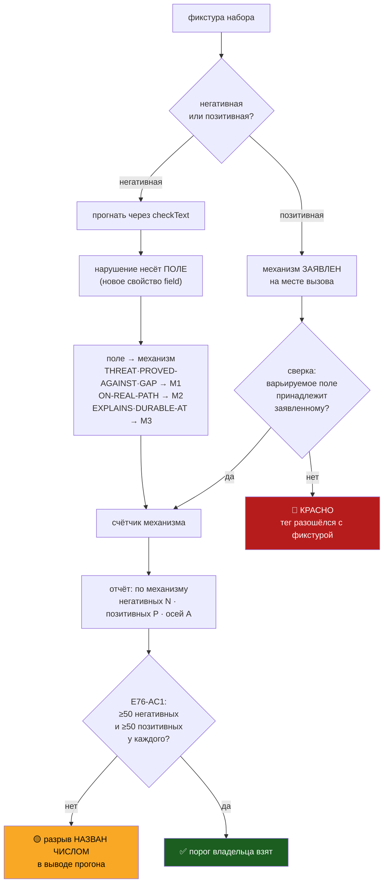

# План 77 — Набор считает себя САМ, по механизмам: прибор для E76-AC1

> **Создан:** 2026-08-30, ночь · **Родитель:** `plans/76` (эпик, фаза 2) · `plans/75` (фаза 1)
> **Статус:** 🔲 ОТКРЫТ, ни строки кода. Оперплан фазы 2 — в лестнице эпика его не было вовсе:
> код механизма М2 приехал коммитом `203a6ef` без своего плана, и этот документ закрывает пробел.
> **Вовне:** 🔴 РАЗВИЛКА ВЛАДЕЛЬЦУ — чем меряется «100 тестов на механизм» (§7). Решение не моё.
> **Карта не нужна. Записей в GPU — ноль.**

---

## 0. Что уже стоит на диске — проверено прогоном, не заявлено

| улика | значение | чем снято |
|---|---|---|
| набор фикстур | **202** — 124 негативных · 78 позитивных · 37 осей | `node tools/guard-lint.mjs --selftest` |
| правил | 6, все доказаны мутациями: R1 · R2 · R3 · R4 · R5 · R7 | там же |
| обход дерева | ЧИСТО · маркеров 9 в 5 файлах · в долге 1 | `node tools/guard-lint.mjs` |
| ворота сборки | код 0, линтер врезан пятыми воротами | `node tools/check.mjs` |

Механизм М1 (декларация угрозы) и механизм М2 (`ON-REAL-PATH` без даты неаудируем) написаны и
работают. **Предмет этого плана — не новое правило, а ПРИБОР, которым меряется E76-AC1.**

## 1. Находка, ради которой план и пишется: критерий меряется тем, чего нет в коде

**E76-AC1** требует: *«100 тестов на механизм · счётчик набора · ≥ 100, из них ≥ 50 негативных»*.
Прибор назван — «счётчик набора». **Счётчик такого не умеет:** он печатает 202 и 37 осей, и не
знает слова «механизм». Значит критерий эпика сегодня меряется арифметикой в голове сессии.

Эстафета сессии 68 несёт числа **М1 = 97 · М2 = 86 · М3 = 19**. Они не выведены прибором.
Разведочный замер по НАРУШЁННОМУ ПОЛЮ (какой механизм фикстура на самом деле трогает) даёт другое:

| механизм | поле, за которое он отвечает | негативных ИЗМЕРЕНО | порог владельца | разрыв |
|---|---|---|---|---|
| **М1** — против чего доказан | `THREAT` · `PROVED-AGAINST` · `GAP` | **30** | 50 | 🔴 −20 |
| **М2** — видели на реальном пути | `ON-REAL-PATH` | **73** | 50 | ✅ есть |
| **М3** — улика переживёт событие | `EXPLAINS` · `DURABLE-AT` | **23** | 50 | 🔴 −27 |

(30 + 73 + 23 = 126 при 124 фикстурах: две трогают М1 и М2 разом — блок, потерявший сразу и `GAP`,
и `ON-REAL-PATH`. Позитивные 78 не размечены НИКАК и в таблицу не попадают.)

🔴 **Замер переворачивает эстафету.** Она называет отстающим М2 и посылает добирать ему фикстуры;
по измеренному полю М2 — единственный, у кого порог ВЗЯТ, а недобраны М1 и М3. Расхождение не в
арифметике, а в том, **что считать тестом механизма**: эстафета считала по авторскому блоку (что
писалось в ту фазу), замер — по тому, какое поле фикстура ломает. Это две разные линейки, и они
дают разный ответ на вопрос «закрыта ли фаза».

**Это ровно чинимый эпиком класс, на один этаж выше.** Сторож доказывался против модели угрозы;
здесь КРИТЕРИЙ проверяется линейкой, которой нет в коде, — и потому нельзя увидеть, что она мерит
не то. Утверждение «у М2 86 из 100» неперепроверяемо ничем, кроме доверия к сессии, которая его
написала. Это тот же непроверяемый доклад о проверке, против которого написано правило R7.

## 2. Вектор цели и критерии приёмки

**Вектор (Achieve):** долю каждого механизма в наборе печатает ПРОГОН, а не сессия; расхождение
между заявленным механизмом фикстуры и тем, который она на самом деле трогает, — красное.

| # | Критерий | Шкала · Прибор · Порог |
|---|---|---|
| **P77-AC1** | `--selftest` печатает негативные И позитивные по каждому из трёх механизмов | механизмов в отчёте · глаз на выводе · **3 из 3, обе половины** |
| **P77-AC2** | Механизм НЕГАТИВНОЙ фикстуры выводится из нарушённого поля, а не объявляется | негативных с ручной разметкой механизма · **0** |
| **P77-AC3** | Заявленный механизм позитивной фикстуры сверяется с полем, которое она варьирует | расхождений «заявлено ≠ варьируется» · сверка в наборе · **0, иначе КРАСНО** |
| **P77-AC4** | Прибор доказан КРАСНЫМ: подмена тега у позитивной роняет самопроверку | мутация · **красная** |
| **P77-AC5** | Ни одно число покрытия не живёт в прозе — ни в шапке линтера, ни в плане | захардкоженных чисел набора в `tools/guard-lint.mjs` · grep · **0** |
| **P77-AC6** | Собственная декларация линтера не врёт: `ON-REAL-PATH` несёт дату врезки | `@guard guard-lint` · чтение · **дата, не `NOT YET`** |
| **P77-AC7** | Ноль записей в GPU за весь план | `watchdog --status` · **0** |

## 3. Механизм — как фикстура получает свой механизм



**Почему негативные выводятся, а позитивные объявляются.** У негативной фикстуры есть объективный
свидетель — правило, которое на ней краснеет, и поле, из-за которого оно краснеет; спрашивать
автора незачем, а спросив — открываешь дверь дрейфу. У позитивной свидетеля нет по определению:
она требует МОЛЧАНИЯ, а молчание не называет поля. Поэтому её механизм объявляется — и тут же
сверяется с тем, какое поле она варьирует относительно эталонного блока. Тег, разошедшийся с
фикстурой, роняет самопроверку (P77-AC3): заявление, которое никто не сверяет, — это то самое
«доказан», от которого начался эпик.

## 4. Шаги

- [x] **4.1 · Нарушение несёт своё поле.** `field` в объекте нарушения (`checkBlock`). Было: имя
      поля жило в тексте причины и выковыривалось регулярным выражением — прибор, читающий
      человеческую фразу, ломается от правки этой фразы.
- [x] **4.2 · Карта «поле → механизм»** — `MECH_OF_FIELD` рядом с `REQUIRED`, экспортируется.
- [x] **4.3 · Позитивные получают метку поля** на месте вызова (`p(axis, why, text, field)`);
      умолчание `'—'` — общая фикстура, не засчитывается никому.
- [x] **4.4 · Сверка метки** в `selftest`: объявленное поле обязано в фикстуре присутствовать;
      расхождение идёт в `fails` наравне с пропущенным нарушением.
- [x] **4.5 · Отчёт печатает три строки** по механизму: негативных · позитивных · осей · разрыв
      до порога. Чисел в прозе нет (P77-AC5).
- [x] **4.6 · Доказано красным** (ворота 5): мутация **A** — подмена метки на чужой механизм →
      6 провалов «МЕТКА РАЗОШЛАСЬ С ФИКСТУРОЙ», код 1; мутация **B** — снять поле у нарушения R7 →
      негативные М2 обвалились 73 → 7, 66 провалов, код 1. 🔴 Первая попытка мутации A прошла
      ЗЕЛЁНОЙ: подстановка не применилась. Зелёная мутация → первый подозреваемый сама мутация
      ([[EXP-0176]]); проверено grep'ом, подмена сделана заново по номеру строки.
- [x] **4.7 · Собственная декларация линтера починена.** Число фикстур из `PROVED-AGAINST` УБРАНО
      (не обновлено): ярлык с числом отстаёт в тот же вечер. `ON-REAL-PATH` получил дату врезки и
      описание наблюдения вместо `NOT YET` — долг был погашен и не записан.
- [x] **4.9 · 🆕 НАЙДЕНА И ЗАКРЫТА ДЫРА В САМОМ R7** (`bugs/81`, вне первоначального плана).
      Прощупывание набора показало: правило проверяло ФОРМУ даты и молчало на `2099-01-01`,
      `2026-12-31`, `2026-13-45`, `0000-00-00`. Поддельная дата выглядела в ревью честнее, чем
      `NOT YET`, — механизм делал ложь удобнее правды. Правило **R8** разбирает дату в календарный
      день и отвергает несуществующий и будущий. Доказано тремя мутациями, включая обе стороны
      границы запаса. Набор 202 → **248** по восьми НОВЫМ осям.
- [ ] **4.8 · Обновить эстафету и эпик** измеренными числами вместо арифметики сессии.

### Что прибор показал после шага 4.9

```
М1: негативных  30 · позитивных  12 · осей 13 — 🔴 недобрано 20 негативных и 38 позитивных
М2: негативных  94 · позитивных  52 · осей 29 — ✅ порог взят
М3: негативных  23 · позитивных  10 · осей 11 — 🔴 недобрано 27 негативных и 40 позитивных
общих (разбор блока, механизму не засчитаны): позитивных 29 · осей 7
```

**Порог владельца по механизму М2 взят по линейке A.** М1 и М3 — нет, и это следующая работа;
у М3 она совпадает с предметом фазы 3, у М1 — с добором осей декларации.

## 5. Проверка наблюдением

| что проверяем | чем | что ждём |
|---|---|---|
| прибор считает | `node tools/guard-lint.mjs --selftest` | три строки механизмов, числа сходятся с суммой |
| прибор не врёт | мутация тега (шаг 4.6) | самопроверка КРАСНАЯ, число провалов названо |
| дерево цело | `node tools/guard-lint.mjs` | ЧИСТО, в долге 1 |
| ворота целы | `node tools/check.mjs` | код 0 |
| батарея цела | `npm test` | красных 0 |

## 6. Риски

- **(а) Линейка выбрана мной, и она решает, закрыта ли фаза.** Это развилка с ненулевой ценой
  ошибки, а такие решает не агент (`GOAL.md` → «🎓 НА РАЗВИЛКЕ — НЕ РЕШАТЬ САМОМУ»). Смягчение:
  прибор строится под ОБЕ линейки (он печатает измеренное поле, а не приговор), а выбор
  вынесен владельцу в §7. **До ответа фаза 2 не объявляется закрытой.**
- **(б) Разметка позитивных станет формальностью.** Смягчение: сверка P77-AC3 и мутация P77-AC4 —
  тег, не сверенный ни с чем, это ровно `GAP: none`, написанный не думая (риск «г» эпика).
- **(в) Добор фикстур ради числа.** Смягчение: оси §5 эпика названы заранее; фикстура, не
  ложащаяся ни на одну ось, в набор не принимается.

## 7. ✅ РАЗВИЛКА ЗАКРЫТА ВЛАДЕЛЬЦЕМ 2026-08-30 — печатаются ОБЕ линейки, порог по A

> **Ответ владельца:** *«Обе: порог берётся по A, но B печатается рядом»*.

**Исполнено в тот же час.** Отчёт `--selftest` печатает по каждому механизму две строки: `A →`
(по ломаемому полю, несёт порог и разрыв) и `B →` (по авторской оси, справочно). Карта авторства
осей — `AXIS_AUTHOR`; **ось, которой в карте нет, роняет самопроверку**, иначе недосчёт линейки B
был бы молчаливым — доказано мутацией **E** (убрал одну ось: 8 провалов, и B молча просела 87 → 79,
ровно то, ради чего сторож заведён).

Измеренное обеими линейками:

| механизм | A: негативных / позитивных | порог по A | B: всего (справочно) |
|---|---|---|---|
| **М1** | 30 / 12 | 🔴 недобрано 20− и 38+ | 85 |
| **М2** | **94 / 52** | ✅ **взят** | 140 |
| **М3** | 23 / 10 | 🔴 недобрано 27− и 40+ | 23 |

**Почему обе рядом — а не одна.** Спор «а по какой мы считаем» уже стоил проекту одной эстафеты с
числами, которые нечем было перепроверить. Две линейки в одном отчёте закрывают его навсегда:
следующая сессия видит оба ответа сразу и не считает третий.

**Старые числа эстафеты (97 / 86 / 19) не воспроизводятся НИ ОДНОЙ из линеек** — B даёт 85 / 140 / 23.
Это само по себе улика: они были посчитаны в уме и разошлись бы с любым прибором.

<details>
<summary>Как развилка была поставлена (сохранено для истории)</summary>

## 7а. Развилка в исходной формулировке

Ваше слово: *«100 тестов на каждый механизм, 50 позитивных, 50 негативных»*. Две линейки дают
разный ответ, и от выбора зависит, что осталось доделать:

| линейка | как считает | М1 | М2 | М3 | что из этого следует |
|---|---|---|---|---|---|
| **A · по нарушенному полю** | фикстура принадлежит тому механизму, чьё поле она ломает | 30 | 73 | 23 | добирать М1 и М3, М2 готов |
| **B · по авторскому блоку** | фикстура принадлежит фазе, в которую написана | 97 | 86 | 19 | добирать М2 и М3, М1 готов |

**Моя рекомендация — A, и вот чем она оплачена:** линейка B считает тестом механизма всё, что
писалось рядом с ним по времени, включая фикстуры разбора блока и стилей комментариев, которые о
механизме ничего не доказывают. Линейка A спрашивает у прогона, что фикстура на самом деле
трогает, и потому не умеет соврать в свою пользу. Но выбор ваш: он решает, закрыта фаза 2 или нет.

**Пока ответа нет, работаю по A и разрыв называю числом, а не закрываю фазу.**

</details>

## 8. Связи

`plans/76` (эпик, E76-AC1 и §5 «как устроены 100 тестов») · `plans/75` (фаза 1) · `bugs/76`
(инцидент) · `bugs/78` (кольцо судьи — адрес долга) · `TESTING_FRAMEWORK.md` ворота 5 и 6a ·
[[EXP-0199]] · [[EXP-0176]] (фикстура обязана различать) · [[EXP-0181]] (ловушка обязана ловить).
