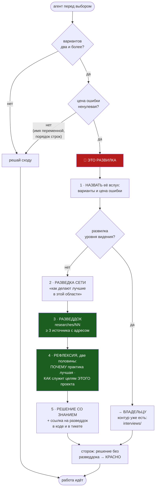

# План 78 — Эпик 76 / Фаза 4: разведка и рефлексия ДО решения (механизм М4)

> **Создан:** 2026-08-31, ночь, на закрытии фазы 3 · **Родитель:** `plans/76` — фаза 4
> **Тикет наверх:** `bugs/KAIF/15` → origin **#36** (доставлен) · **Инцидент:** `bugs/76`
> **Статус:** 🔲 ОТКРЫТ, ни строки кода. **Ворота входа: фаза 3 закрыта** (выполнено 2026-08-31).
> **Вовне:** 🔴 **ГРАНИЦА РАЗВИЛКИ — вопрос владельцу (§7).** Эпик прямо запрещает трактовать её
> самому. Работа до ответа возможна: границу можно взять заведомо УЗКУЮ и расширять по его слову.
> **Карта не нужна. Записей в GPU ноль.**

---

## 0. Почему М4 бьёт раньше всех прочих механизмов

М1, М2 и М3 проверяют решение ПОСЛЕ того, как оно принято: против чего сторож доказан · видели ли
его на реальном пути · переживёт ли улика событие. **М4 действует РАНЬШЕ — в момент выбора.**

Инцидент 30 августа доказывает необходимость буквально. Чёрный ящик умер из-за ОДНОЙ развилки:
«писать плёнку каждый такт или в конце». Я рассудил «каждый такт нельзя по цене → значит в конце»,
честно объяснил в комментарии ПОЧЕМУ не каждый такт — и не задал единственного вопроса, который
стоило задать: **есть ли третий вариант и как эту задачу решили те, кто решил её до нас.**

Секундный агрегат стоил копейки. Отрасль ответила бы за минуту: бортовые самописцы, аварийные
дампы ядра, журналы упреждающей записи баз данных сбрасывают буфер НЕПРЕРЫВНО — и это не
оптимизация, а определение улики.

**Ни один механизм ниже по течению этого не ловит.** М1, М2, М3 честно подтвердили бы, что
реализовано ровно задуманное. Слово владельца, ставшее каноном:

> *«НЕЛЬЗЯ ДОВЕРЯТЬ принятие решений на развилках ИИ модели и ИИ агенту. Эти решения должен
> принимать или владелец… или эти решения должны давать ИИ агенту авторитеты в области из сети на
> основе разведки»*

**И за одну эту ночь механизм понадобился ещё трижды** — все три развилки я решил сам, назвав их
вслух в тикетах, но НИ ПО ОДНОЙ разведки не было: запас в сутки на часовой пояс (`bugs/81`) ·
нормализация вместо перечисления форм (`bugs/82`) · честный `null` вместо нуля (`bugs/78`).
Четвёртую — линейку счёта — я вынес владельцу, и он её решил. Разница между четвёртой и первыми
тремя была случайной, а не системной. Это и есть предмет фазы.

## 1. Вектор цели и критерии приёмки

**Вектор (Avoid):** развилка с ненулевой ценой ошибки не может быть закрыта решением, принятым из
головы, — без разведдока с источниками и рефлексией.

| # | Критерий | Шкала · Прибор · Порог |
|---|---|---|
| **P78-AC1** | Навык `/recon-before-decision` существует и исполним | прогон навыка на настоящей развилке · **разведдок в `researches/` появился** |
| **P78-AC2** | Разведдок несёт ИСТОЧНИКИ, а не рассуждение | источников с адресом (ссылка · стандарт · практика с именем) · **≥ 3, иначе это не разведка** |
| **P78-AC3** | Рефлексия состоит из ДВУХ половин | «почему практика лучшая» И «как она служит целям ЭТОГО проекта» · **обе непусты** |
| **P78-AC4** | Механизм несёт 100 тестов: ≥ 50 негативных и ≥ 50 позитивных | `guard-lint --selftest`, строка «по механизмам» · **М4 ≥ 50/50** |
| **P78-AC5** | Каждое правило доказано КРАСНЫМ | правил без красной фикстуры · **0** |
| **P78-AC6** | Ложных тревог на здоровом дереве нет | нарушений вне долга · **0** |
| **P78-AC7** | Механизм ловит ЧЕТЫРЕ развилки этой ночи в их реальной форме | развилок из §0, распознанных · **4 из 4** |
| **P78-AC8** | Ноль записей в GPU | `watchdog --status` · **0** |

⚠️ **P78-AC7 — главный критерий фазы, по образцу E76-AC3.** Механизм, не узнающий те развилки,
ради которых написан, повторяет чинимый класс: доказан против удобной модели.

## 2. Механизм



## 3. Форма — как это выглядит у места решения

```
@fork ring-flush-cadence
OPTIONS:   каждый такт (2 мс) · только на трипе и закрытии · секундный агрегат
COST:      улика не переживает событие → разбор инцидента невозможен
RECON:     researches/27 — бортовые самописцы, аварийные дампы ядра, WAL баз данных
DECIDED:   секундный агрегат с fsync — непрерывный сброс это ОПРЕДЕЛЕНИЕ улики, а не оптимизация
```

**Почему поля именно эти.** `OPTIONS` заставляет выписать варианты — ложная развилка («A или B»)
разваливается ровно в момент, когда её пишут списком, и третий вариант становится виден. `COST`
отделяет развилку от выбора без цены. `RECON` — адрес знания, а не его пересказ. `DECIDED` —
решение и одна строка почему.

## 4. Шаги

- [x] **4.1 — Разведка про саму разведку. ✅ ИСПОЛНЕНА — `researches/27`.**
      Главная находка: **отрасль решила эту задачу СЕКЦИЕЙ В ШАБЛОНЕ, а не отдельным процессом.**
      У Squarespace раздел зовётся *«Alternatives Considered / Prior Art»* и прямо спрашивает, есть
      ли уже системы, которые почти решают задачу; у Google то же живёт в *Background*. Принуждение
      встроено в форму документа, который автор всё равно обязан заполнить, — а не в ритуал,
      который можно не позвать. **Пустая графа «Prior Art: как решают бортовые самописцы и журналы
      упреждающей записи» не дала бы закрыть развилку 28 августа: видно, что она пустая.**

      Разведка принесла ЧЕТЫРЕ режима смерти таких механизмов, которых в плане не было, — все
      четыре внесены в §5 рисками (д)…(з). Наше преимущество перед отраслью названо там же:
      у неё принуждение держит ревьюер-человек, у нас есть линтер в воротах сборки.
- [ ] **4.2 — Навык `/recon-before-decision`** по образцу существующих навыков проекта: назвать
      развилку → разведка → разведдок → рефлексия в две половины → решение со ссылкой.
- [x] **4.3 — Маркер `@fork` и правила линтера. ✅ СТОЯТ И ДОКАЗАНЫ.**
      Четыре поля (`OPTIONS · COST · RECON · DECIDED`), два новых правила:
      **`R9-single-option`** — `OPTIONS` с одним вариантом это не развилка, а уже принятое решение
      («Alternatives Considered» в машинной форме: список ломает ложную развилку);
      **`R10-dead-recon`** — `RECON` указывает на СУЩЕСТВУЮЩИЙ разведдок либо честно признаёт
      `NOT YET`; проверяется наличие ФАЙЛА, а не непустота поля (риск «е» из разведки).
      Отговорки и пустоты ловят уже стоящие R1/R2/R3.

      🔴 **Набор поймал два дефекта в самих правилах, оба в первый прогон:**
      (1) `R10` краснел на ЗАКОННОЙ ссылке — в проекте ссылаются номером (`researches/27`), а файл
      зовётся `27_длинный-слаг.md`; правило требовало точного имени и было бы ложной тревогой на
      каждой честной ссылке. Починено функцией, понимающей конвенцию проекта.
      (2) `R9` считал обычную запятую разделителем вариантов, и «один вариант, зато правильный»
      проходил как выписанная развилка. Запятая теперь разделитель только перед ЗАГЛАВНОЙ.
- [x] **4.4 — Сто тестов по осям. ✅ ВЗЯТО: М4 = 50 негативных / 51 позитивный, 19 осей.**
      Негативные оси: `AA` нет поля · `AB` пустота · `AC` ЛОЖНАЯ РАЗВИЛКА (один вариант) ·
      `AD` `RECON` без адреса · `AE` мёртвая ссылка · `AF` отговорка · `AG` **четыре развилки
      этой ночи** (P78-AC7) · `AH` дубль поля · `AI` `RECON` не в `researches/` · `AJ` форма блока ·
      `AK` почти-`NOT YET`. Позитивные: `P31`…`P37` — законные развилки, много вариантов, все
      формы ссылки, законные `COST`/`DECIDED`, стили комментария, переносы, слово словаря внутри
      законной фразы. Набор целиком: **481 фикстура · 81 ось · 9 правил**.
- [ ] **4.5 — Хук агентской системы.** Прозой правило не удержится — это уже измерено (origin #22).
      Место врезки и форма определяются шагом 4.1.
- [ ] **4.6 — Разметить ЧЕТЫРЕ развилки этой ночи задним числом** маркерами `@fork` с честным
      `RECON: NOT YET` там, где разведки не было. Долг видимый, а не стёртый.
- [ ] **4.7 — Ворота, батарея, судья.**

## 5. Риски

- **(а) Паралич: разведдок на каждый чих.** Смягчение — узкая граница по умолчанию (§7) и поле
  `COST`: развилка без названной цены ошибки развилкой не является.
- **(б) Разведка станет ритуалом: три ссылки ради трёх ссылок.** Машиной не лечится полностью;
  частично — требованием ДВУХ половин рефлексии, вторая из которых («как служит целям ЭТОГО
  проекта») не пишется копированием из сети. Записано как непокрытое, по образцу риска «г» эпика.
- **(в) Механизм построят решением из головы** — то есть фаза повторит собственный класс.
  Смягчение: шаг 4.1 обязателен и идёт ПЕРВЫМ.
- **(г) Хук не удержит, если агент не позовёт навык.** Это тот же класс, что `bugs/KAIF/16`
  (правило читается реже, чем то, которое его отменяет). Смягчение — врезка в место, которое
  читается всегда, а не в навык.

### 🆕 Риски, ДОБАВЛЕННЫЕ РАЗВЕДКОЙ `researches/27` — чужие грабли, за которые мы не платили

- **(д) Показуха: маркер приписан ПОСЛЕ отгрузки решения.** Отрасль называет это «архитектурный
  комплаенс-театр» и считает одним из главных режимов смерти ADR. Смягчение: `@fork` едет в ОДНОМ
  коммите с изменением, которое объясняет; разошедшиеся — находка ревизии. У нас здесь преимущество
  перед отраслью: маркер живёт в коде у места решения, а не отдельным документом, и приписать его
  задним числом видно по истории.
- **(е) «Пишут, но не читают»: через три месяца сорок разведдоков и ни одной живой ссылки.**
  Смягчение: линтер проверяет СУЩЕСТВОВАНИЕ файла, на который указывает `RECON`, а не только
  непустоту поля. Мёртвая ссылка — красное. Для нашего проекта риск ОСТРЕЕ среднего: читатель —
  сессия с пустым контекстом, и ссылка из места решения это и есть её единственный механизм чтения.
- **(ж) Разрастание области: маркер на каждое изменение вместо каждой развилки.** У отрасли граница
  ADR нечёткая и потому размывается — сотни записей, которые на самом деле сообщения коммитов.
  У нас граница названа владельцем, и её носитель — поле `COST`: выбор без названной цены ошибки
  развилкой не является.
- **(з) Корпус решений никто не пересматривает, и он тихо расходится с системой.** Машиной не
  лечится; частично — `/check-backlog` и ревизия по образцу `bugs/25`. **Записано как непокрытое**,
  а не спрятано.

**Чего мы НЕ копируем из чужих рисков:** «обслуживает тот, у кого меньше контекста» (у отрасли
автор решения уходит из команды; у нас автор всех решений — агент, а преемственность держат
`EXPERIENCE.md` и эстафета). Названо, чтобы список рисков не раздувался чужой болью.

## 6. Решения, принятые без владельца

*(заполняется при закрытии; на момент создания — ни одного)*

## 7. 🔴 ВОПРОС ВЛАДЕЛЬЦУ — где проходит граница развилки

Ваше слово задало признак: **два и более варианта ПЛЮС ненулевая цена ошибки**; имя переменной —
не развилка. Где ровно проходит черта, не сказано, и эпик запрещает мне трактовать её самому.

**Как я предлагаю работать до вашего ответа — заведомо УЗКО, чтобы механизм не мешал:** разведка
обязательна там, где решение **необратимо** ЛИБО касается **безопасности карты и вашей машины**
ЛИБО меняет **то, что вы видите и читаете**. Всё прочее — на моё усмотрение, с записью решения в
тикет, как сейчас.

Узкая граница выбрана намеренно: механизм, начавший с паралича, будет снят через день, и тогда его
не станет вовсе. Расширять по вашему слову дешевле, чем восстанавливать доверие к сторожу, который
всех задолбал (`bugs/75` — цена сторожа, кричащего впустую, уже измерена трижды).

## 8. Связи

`plans/76` (эпик, §М4) · `bugs/KAIF/15` → origin **#36** · `bugs/KAIF/16` → origin **#37** (тот же
класс: правило, которое читается реже отменяющего) · `bugs/76` (инцидент) · `GOAL.md` → «🎓 НА
РАЗВИЛКЕ — НЕ РЕШАТЬ САМОМУ» · [[EXP-0200]] (ложная развилка изнутри не выглядит ложной) ·
[[EXP-0201]] · [[EXP-0202]].
