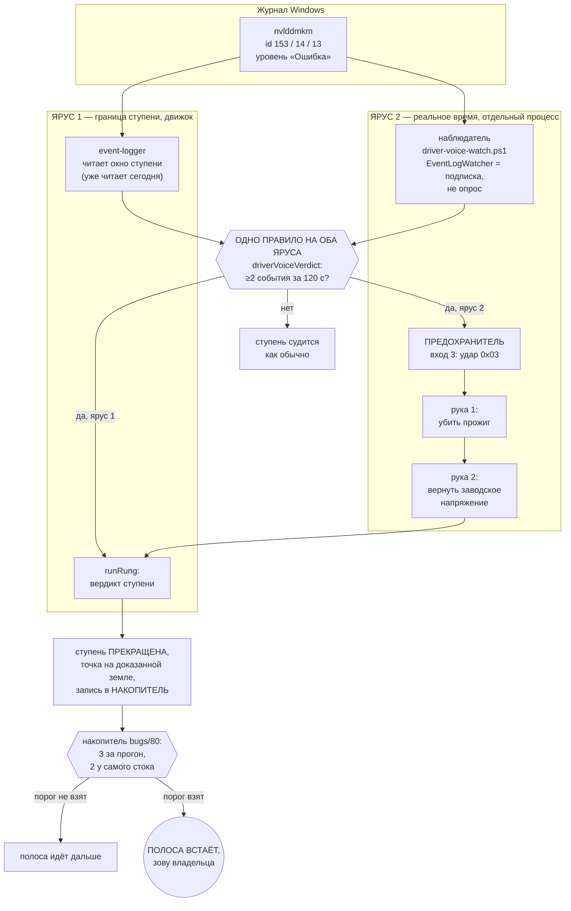

# План 79 — Эпик 73 / Фаза 3: голос драйвера

> **Создан:** 2026-08-31 01:4x +03:00 · **Родитель:** `plans/73` фаза 3 · `bugs/79` ·
> разведка `researches/30` · **Статус:** 🟢 написан, ни строки кода; фазы 1 и 4 эпика закрыты,
> фаза 2 (`bugs/77`) идёт следом за этой по прямому слову владельца · **Вовне:** 🔴 владельцу —
> опровергнутое число «110 секунд» и честная граница обещания фазы; в `PROJECT_ARCHITECTURE_INTERNAL_MAP.md` —
> перепись правила R4b-signal

---

## 0. Что разведка изменила в постановке задачи

Тикет `bugs/79` написан на числе «драйвер кричал 110 секунд, и у машинерии было время действовать».
**Разведка `researches/30` §0 это число опровергла замером:** 110 секунд — это время до перезагрузки,
которую делал владелец руками. Настоящее окно между первым криком драйвера и последней `fsync`-нутой
пробой нашего сэмплера — **0,134 секунды, и знак у него отрицательный**: наш процесс замолчал раньше,
чем драйвер закричал.

**Что это НЕ означает.** Что фаза бесполезна. Архив (`researches/30` §3) держит смерть, где окно было
настоящим и составило **28 секунд** — 2026-08-23 11:52: драйвер закричал дважды, а прогон через 28 с
записал следующее намерение и **шагнул ВГЛУБЬ**. Голос остановил бы этот шаг.

**Что это означает.** Обещание фазы формулируется честно: из четырёх смертей эпохи журнала развёртки
голос приходит вовремя в двух. Формулировка эпика «каждое зависание с предупреждением встречается
остановкой» на инциденте 30 августа недостижима ни при какой скорости реакции, и это надо сказать
владельцу до прогона, а не после.

**И третье, чисто инженерное, определяющее всю конструкцию:** прожиг зовётся через `spawnSync`
(`stress-tester.mjs:115`), то есть **цикл событий движка на время ступени ЗАБЛОКИРОВАН**. Реакция
быстрее длительности ступени возможна ТОЛЬКО из отдельного процесса. Отдельный процесс, чья работа —
останавливать и спасать, у проекта уже есть: предохранитель (`fuse.mjs`). Второго такого не строим.

---

## 1. Вектор цели и критерии приёмки

**Вектор (Achieve):** канал ошибок драйвера перестаёт быть наблюдением без последствий — серия его
событий во время прогона прекращает текущую ступень, возвращает точку на доказанную землю и идёт в
накопитель, который решает о полосе.

**Вектор (Avoid):** ложная остановка полосы на здоровом прогоне. Граница владельца: *«сторож должен
не ронять инструмент, а подсказывать»*.

| # | критерий | Шкала · Прибор · Порог |
|---|---|---|
| **P79-AC1** | Серия событий драйвера прекращает ступень | Шкала: секунд от второго события в журнале Windows до прекращения ступени · Прибор: подложенное событие на стенде · **Порог: ≤ 5 с. Сегодня — не прекращает никогда** |
| **P79-AC2** | Ложных ОСТАНОВОК ПОЛОСЫ на здоровом прогоне | Шкала: остановок · Прибор: пересчёт архива 21 вспышки (`researches/30` §2) через готовое правило · **Порог: 0** |
| **P79-AC3** | Одиночное событие ступень НЕ прекращает | Шкала: срабатываний на одиночках · Прибор: блок самопроверки + архив (9 одиночек) · **Порог: 0** |
| **P79-AC4** | Порог назван замером, а не головой | Шкала: чисел в коде без ссылки на замер · Прибор: блок `@fork` у места решения · **Порог: 0** |
| **P79-AC5** | Правило R4b-signal во внутренней карте переписано | Шкала: строк «проголосовать не может» без пометки «история» · Прибор: греп · **Порог: 0** |
| **P79-AC6** | Обе стороны доказаны мутациями | Шкала: правил без мутации, красящей ровно свой блок · **Порог: 0** |
| **P79-AC7** | Ноль записей в GPU за фазу | Шкала: записей · Прибор: `watchdog --status` до и после · **Порог: 0** |

**Чего фаза НЕ обещает, и это записано здесь, а не выяснится после:** предотвращения зависаний, у
которых окна не было (30.08 — 0,134 с; 28.08 — по нижней оценке −2 с). Для них голос опаздывает по
устройству отказа, а не по качеству реализации.

---

## 2. Механизм — два яруса, одно решающее правило

**Три свойства этой схемы, каждое — ответ на измеренный факт:**

1. **Одно правило, два потребителя.** Порог живёт в одной функции, которую зовут оба яруса. Иначе
   это два порога, которые разойдутся молча ([[EXP-0193]]: доказанный судья плюс недоказанная
   проводка — недоказанные ворота).
2. **Ярус 2 существует потому, что движок во время прожига мёртв** (`spawnSync`). Ярус 1 существует
   потому, что ярус 2 может не запуститься, а невзведённый вход у предохранителя не срабатывает
   никогда по построению — и тогда голос обязан остаться хотя бы медленным.
3. **Реакция — не остановка полосы.** Решение D разведки: серия прекращает СТУПЕНЬ, а о полосе
   решает накопитель. На архиве это даёт **ноль ложных остановок**, тогда как «серия останавливает
   полосу» дала бы две за семь дней прогонов (`researches/30` §2.1).

---

## 3. Шаги

- [ ] **3.1. Модуль решения `automation-engine/lib/driver-voice.mjs`.** Чистая функция
      `driverVoiceVerdict(events, { windowMs, minCount })` → `{ stop, count, why }`. Ни ввода-вывода,
      ни карты, ни часов внутри. Блок `@fork driver-voice-threshold` у места решения: варианты A–E из
      `researches/30` §4, цена, разведка, решение. Числа — `windowMs = 120000`, `minCount = 2` — со
      ссылкой на §2 разведки, а не из головы (P79-AC4).
- [ ] **3.2. Блоки самопроверки на АРХИВЕ, а не на выдуманных данных.** Двадцать одна вспышка
      `researches/30` §2 переезжает в фикстуру (`benches/fixtures/driver-voice/`), и правило гоняется
      по ней: шесть смертельных — срабатывает; девять одиночек — молчит (P79-AC3); шесть здоровых
      серий — срабатывает, и это ожидаемо, потому что реакция — ступень, а не полоса.
- [ ] **3.3. Сцепка с накопителем.** `stallLedgerVerdict` учится принимать запись с полем `kind`
      (`пульс` | `драйвер`), сохраняя прежнее поведение для записей без него — старые блоки обязаны
      остаться зелёными без правки. Причина остановки называет состав: «два подстоя пульса и один
      крик драйвера», а не «три подстоя». **Проверка на архиве (P79-AC2):** две ложные вспышки
      08-22 дают два счёта при пороге три — полоса не встаёт.
- [ ] **3.4. Ярус 1 — вердикт ступени.** `runRung` уже получает раздел сигналов от `event-logger`
      (класс `SIGNAL`, `means`); теперь он зовёт правило и при `stop` закрывает ступень исходом
      класса «прекращена» с причиной «крик драйвера», возвращая точку на доказанную землю тем же
      путём, которым это делает подстой пульса. **Класс `SIGNAL` в `classifyEvent` НЕ меняется:**
      `fault` остаётся `false`, чтобы два прежних потребителя (`stress-tester`, `graphics-load`) не
      увидели изменения даже случайно — это свойство защищено блоками `runClassInvariants`.
- [ ] **3.5. Наблюдатель `automation-engine/lib/driver-voice-watch.ps1`** — только ASCII в исходнике
      ([[EXP-0122]]: кириллица в `.ps1` — ошибка разбора). `EventLogWatcher` на `System` с запросом по
      провайдеру; на каждое событие — строка JSON в стандартный вывод. Плюс **секундная строка жизни**
      тем же приёмом, что закрыл `bugs/83`: молчание наблюдателя обязано отличаться от его смерти.
- [ ] **3.6. Ярус 2 — вход 3 предохранителя.** Байт `0x03` в протоколе судьи, счётчик в окне,
      порог из того же модуля 3.1, причина трипа `driver-cry`. Приоритет причин: `beat-silence` >
      `progress-stall` > `driver-cry` — крик драйвера самый косвенный из трёх. **Невзведённый вход
      не срабатывает никогда** (существующее правило судьи, менять его нельзя).
- [ ] **3.7. Мутации, каждая красит ровно свой блок** (P79-AC6): порог 2 → 1 · окно 120 с → 0 ·
      снять учёт `kind` в накопителе · снять приоритет причин · снять проверку «вход не взведён».
      Обратная мутация «краснеть всегда» обязана покрасить всё.
- [ ] **3.8. Перепись R4b-signal** во внутренней карте (P79-AC5): строка «проголосовать не может»
      становится историей с датой и причиной; действующее правило — новое, со ссылкой на
      `researches/30`.
- [ ] **3.9. Исправление числа «110 секунд»** в `bugs/76`, `bugs/79`, `plans/73` и `STATUS.md`.
      Число, которого никто не мерил как окно, не имеет права стоять в основании эпика.
- [ ] **3.10. Батарея и ворота:** `npm run check` · `node tools/guard-lint.mjs` · `npm run selftest:all`
      — все зелёные, число наборов и блоков берётся ИЗ ВЫВОДА батареи, а не из головы.

---

## 4. Риски, названные вслух

- **(а) Наблюдатель не запустится, и никто этого не заметит.** PowerShell стартует ~1 с, версия 5.1,
  журнал `System` читается непривилегированно (досье среды). **Смягчение:** секундная строка жизни
  (шаг 3.5) плюс структурное правило судьи «невзведённый вход не срабатывает»; ярус 1 остаётся и
  работает без наблюдателя вовсе.
- **(б) Новая причина трипа убьёт прожиг на здоровой машине.** Замерено: две ложные вспышки за семь
  дней прогонов. **Цена каждой — одна ступень**, и это выбрано решением D именно ради этого.
- **(в) Правка накопителя сломает то, что доказано вчера.** `bugs/80` закрыт десятью блоками.
  **Смягчение:** записи без `kind` ведут себя ровно как прежде, и старые блоки не правятся вовсе —
  если хоть один потребовал правки, это находка, а не работа.
- **(г) Соблазн отчитаться, что фаза «предотвращает зависания».** Прямо запрещено §1: обещание
  фазы — два случая из четырёх, и это число называется владельцу до прогона.

## 5. Выход фазы

P79-AC1…AC7 взяты · `bugs/79` получает тег `DONE` (и этим САМ снимает половину запрета живого
прогона) · владельцу названы: опровергнутое число 110 секунд и честная граница обещания.

## 6. Связи

`bugs/79` · `bugs/76` · `bugs/80` (накопитель — потребитель голоса) · `bugs/83` (секундная строка
жизни — образец) · `researches/30` (разведка и решение развилки) · `researches/26` §6 ·
`researches/15` §2 (прежний разбор) · `plans/73` фаза 3 · `plans/55` (скелет предохранителя) ·
`PROJECT_ARCHITECTURE_INTERNAL_MAP.md` → R4b-signal · `GOAL.md` → «🏗 ЗДАНИЕ ВАЖНЕЕ ЛЕСОВ».
