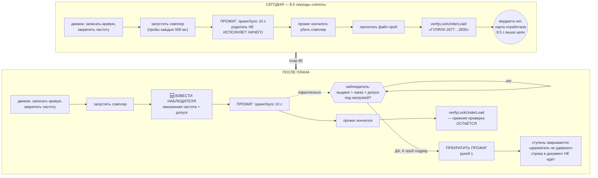

# План 80 — закрепление проверяется ВО ВРЕМЯ прожига, а не после него

> **Создан:** 2026-08-31 (сессия 71) · **Родитель:** `bugs/86` (пункт 3 эстафеты) · `plans/58`
> (предохранитель, фаза 5) · **Статус:** 📝 НАПИСАН, КОД НЕ НАЧАТ — **зависит от ответа владельца на
> `interviews/022` Q2** (см. §6: развилка) · **Карта:** не нужна до фазы приёмки
> · **Записей в GPU при разработке: 0**

---

## 1. Вектор цели

**Боль — измерена, а не предположена.** 2026-08-31 в 08:13 карта под нагрузкой ушла на 690 МГц выше
заказанной частоты и работала так **8,5 секунды**. Всё это время сэмплер писал правду в файл, и
файл был `fsync`-нут (`bugs/37` сделал его долговечным). **Никто его не читал.** Сторож
закрепления заговорил после того, как прожиг кончился.

**Куда хотим:** уход карты выше заказанной частоты прекращает прожиг В ТЕЧЕНИЕ СЕКУНДЫ, а не через
восемь с половиной. Тип цели — **Achieve**.

**Чем это НЕ является:** это не новый предохранитель и не смягчение существующего. Порог тишины
ударов, руки и их порядок не меняются.

## 2. Замер, ради которого план существует

Пробы сорвавшейся ступени (`runs/vmin/pin-2145-555.jsonl`, заказ 2145 МГц, допуск 8):

| проба | время | загрузка | выдано | превышение |
|---|---|---|---|---|
| 0 | 08:13:07.631 | 0 % | 2565 | — (покой) |
| 1 | 08:13:08.049 | 3 % | 2587 | — (покой) |
| **2** | **08:13:08.535** | **100 %** | **2677** | **+532 ← ПЕРВАЯ ЖЕ нагруженная проба** |
| 3 | 08:13:09.021 | 100 % | 2790 | +645 |
| 4 | 08:13:09.520 | 99 % | 2835 | **+690** |
| … | … | … | 2805…2835 | +660…+690 |
| 19 | 08:13:17.024 | 99 % | 2827 | +682 |

**18 нагруженных проб подряд, 8,5 секунды, ни одной ниже заказа.** Сигнал был не тонким и не
шумным: он стоял на порядок выше допуска с первой секунды.

**Почему разгон здесь не мешает** (в отличие от размаха — `bugs/86`, `EXP-0209`): разгон идёт
СНИЗУ, а превышение меряется СВЕРХУ. Пробы 0–1 — это подъём частоты в покое, и они отсеиваются
порогом загрузки, как отсеиваются везде.

## 3. Почему очевидный путь НЕ ГОДИТСЯ — проверено, а не отброшено

Первым кандидатом был колбэк `onBurst`: он уже вызывается внутри цикла прожига и уже бьёт пульс
сторожа. **Замер его убил.** У прожига развёртки `seconds = sustain = 10` (`config.SWEEP_PROBE_SECONDS`),
поэтому `burstSeconds = 10`, и цикл делает **ровно одну порцию на весь прожиг**:

```
stress-tester.mjs:384   while ((Date.now() - started) < seconds * 1000)
stress-tester.mjs:398     const b = runBurst({... sustainSeconds: 10 ...})   ← spawnSync, БЛОКИРУЕТ 10 с
stress-tester.mjs:399     if (onBurst) onBurst(b);                          ← срабатывает ОДИН раз, в конце
```

`runBurst` идёт через `spawnSync` и прервать его нельзя. **Значит родительский процесс во время
прожига не исполняет ничего, и наблюдатель обязан быть ОТДЕЛЬНЫМ процессом.**

## 4. Механизм



**Три свойства, каждое названо намеренно:**

1. **Наблюдатель НЕ заменяет `verifyLockUnderLoad`.** Прежняя проверка после прожига остаётся —
   она судит ступень целиком, а наблюдатель только прекращает уход раньше. Убрать её значило бы
   поменять прибор под видом ускорения.
2. **Порог — K проб ПОДРЯД, а не одна.** Одиночный выброс телеметрии не должен убивать прожиг.
   Значение K выводится из замера (см. AC2), а не назначается: у сорвавшейся ступени превышение
   держалось 18 проб подряд, у всех 381 здоровых прожигов потолка — 0 проб.
3. **Рука 1, а не рука 2.** Прекращение прожига — CPU-side, argv-массивом, без драйвера. Возврат
   стока остаётся делом отката ступени, который и так идёт в `finally`.

## 5. Шаги

- [ ] **Ш1. Чистая функция решения** — `holdBreach(samples, { orderedMhz, toleranceMhz, needConsecutive })`
      → `{ breached, atSampleIndex, worstOverMhz, consecutive }`. Никакого ввода-вывода, никаких
      процессов: чтобы решение проверялось на фикстурах, а не на карте.
- [ ] **Ш2. Блоки на функцию, включая фикстуру ИЗ АРХИВА** — пробы сорвавшейся ступени как есть
      (ожидание: сработала на пробе 2), плюс здоровая ступень `pin-2145-413` (ожидание: не сработала),
      плюс разгон `cap-3067-225` (ожидание: НЕ сработала — превышение меряется сверху).
- [ ] **Ш3. Наблюдатель как процесс** — читает хвост файла проб, зовёт Ш1, при `breached` бьёт рукой 1.
      Форма развилки §6 определяет, ЧЕЙ это процесс.
- [ ] **Ш4. Взведение и снятие в жизненном цикле ступени** — рядом с запуском и убийством сэмплера,
      в том же `finally`, чтобы наблюдатель не пережил ступень.
- [ ] **Ш5. Мутации** — каждая красит свои блоки: (а) убрать требование «подряд» → красит блок
      одиночного выброса; (б) сравнивать снизу вместо сверху → красит блок разгона; (в) не бить
      рукой при `breached` → красит блок проводки; (г) не снимать наблюдателя в `finally` → красит
      блок жизненного цикла.
- [ ] **Ш6. Репетиция на двойнике** — карта, которая уходит выше заказа (у полигона уже есть
      свойство `deliverStepsAboveEnvelope`, `bugs/69`), прогон полосы, наблюдение трипа.
- [ ] **Ш7. Приёмка на живой карте — ТОЛЬКО ПРИ ВЛАДЕЛЬЦЕ** (ворота 6a: сторож не готов, пока не
      увиден на реальном пути). До неё тег `DONE` не ставится.

## 6. 🔴 РАЗВИЛКА, КОТОРУЮ Я НЕ РЕШАЮ САМ — чей это процесс

**Почему это развилка, а не деталь:** оба варианта трогают предохранитель — механизм, который спасает
машину владельца. Цена ошибки ненулевая, вариантов два. По границе, действующей до ответа на
`interviews/022` Q3 («касается безопасности карты и машины владельца»), решение не моё.

- **Вариант П1 — наблюдатель внутри ПРЕДОХРАНИТЕЛЯ, третьим входом.** Он уже идёт параллельно
  прожигу, у него уже есть обе руки и своя лента. Платим: предохранитель начинает читать ДИСК в
  своём цикле, а слово владельца по T3 — *«НЕ ДИСК РАЗ В СЕКУНДУ!!!!»* (сказано про цикл ударов).
- **Вариант П2 — частота едет в датаграмме УДАРА от процесса-пробы.** Проба уже зовёт драйвер;
  добавить в её удар `clocks.gr` — это память и миллисекунды, диска в цикле нет вовсе, T3 соблюдён
  буквально. Платим: меняется протокол ударов, а он — то, на чём стоит спасение.

**Рекомендация агента: П2** — она соблюдает названное владельцем ограничение буквально, а не
толкованием, и не заводит второй источник правды о частоте.

⚠️ **И ГЛАВНАЯ ЗАВИСИМОСТЬ, ПО КОТОРОЙ КОД НЕ НАЧАТ: `interviews/022` Q2 (`ideas/17`).** Этот план
делает трипы ЧАЩЕ. Пока не решено, что трип ДЕЛАЕТ — кончает вечер или закрывает ступень и полоса
идёт дальше, — строить «больше трипов» значит строить вперёд неизвестного жизненного цикла. Порядок
обратный: сперва Q2, потом этот план.

## 7. Критерии приёмки

| # | критерий | Шкала · Прибор · Порог |
|---|---|---|
| **P80-AC1** | Уход выше заказа прекращает прожиг быстро | Шкала: секунд от первой нагруженной пробы выше заказа до прекращения · Прибор: пробы + лента наблюдателя на двойнике · **Порог: ≤ 2 с. Сегодня — 8,5 с** |
| **P80-AC2** | Порог K выведен ЗАМЕРОМ, а не назначен | Шкала: здоровых прожигов архива, на которых K проб подряд оказались выше заказа · Прибор: `npm run hold` по 391 прожигу · **Порог: 0 ложных срабатываний** |
| **P80-AC3** | Разгон НЕ вызывает срабатывания | Шкала: срабатываний на 184 прожигах архива, где первая нагруженная проба ловит разгон · **Порог: 0** |
| **P80-AC4** | Прежняя проверка не тронута | Шкала: блоков `verifyLockUnderLoad`, изменивших вердикт · **Порог: 0** |
| **P80-AC5** | Наблюдатель не переживает ступень | Шкала: живых наблюдателей после конца ступени · Прибор: список процессов после прогона на двойнике · **Порог: 0** |
| **P80-AC6** | Живой свидетель | Шкала: наблюдений на РЕАЛЬНОМ пути · Прибор: прогон при владельце · **Порог: ≥ 1, с датой** |
| **P80-AC7** | Ноль записей в GPU при разработке | Прибор: `watchdog --status` до и после · **Порог: 0** |

## 8. Риски, названные вслух

- **(а) Ложное прекращение здорового прожига.** Ярус: средний. Цена — потерянная ступень, не машина.
  Смягчение: K проб подряд + AC2 на 391 прожиге архива, где превышение встречалось **9 раз из 391**,
  и восемь из девяти на 15–23 МГц.
- **(б) Наблюдатель переживает ступень и убивает чужой процесс.** Ярус: ВЫСОКИЙ — это класс `bugs/21`
  (крючок убил живой прогон). Смягчение: снятие в том же `finally`, что и сэмплер, плюс AC5.
- **(в) Предохранитель, отвлечённый на диск, опаздывает со своим главным делом.** Ярус: высокий.
  Ровно поэтому §6 — развилка, а не моё решение.
- **(г) Свойство «карта уходит выше заказа» окажется симптомом края, а не дефектом держателя**
  (гипотеза 1 `bugs/86`). Тогда прекращать прожиг — правильно вдвойне: это найденный край.

## 9. Связи

`bugs/86` (случай и замер) · `bugs/87` (журнал теперь несёт минимум и максимум — без него AC1
нечем мерить) · `ideas/17` + `interviews/022` Q2 (что трип ДЕЛАЕТ — блокирующая зависимость) ·
`plans/55`/`plans/58` (предохранитель) · `bugs/21` (крючок, переживший прогон) · `bugs/69`
(`deliverStepsAboveEnvelope` — двойник умеет уходить выше) · `tools/hold-vs-raise.mjs` (прибор для
AC2/AC3) · [[EXP-0209]] (почему величина — превышение, а не размах).
